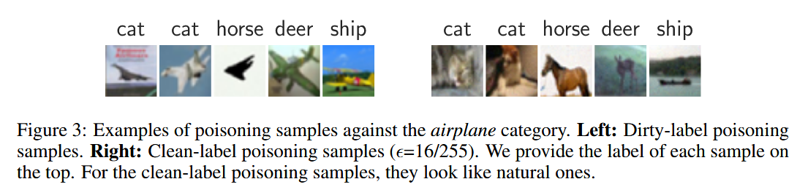
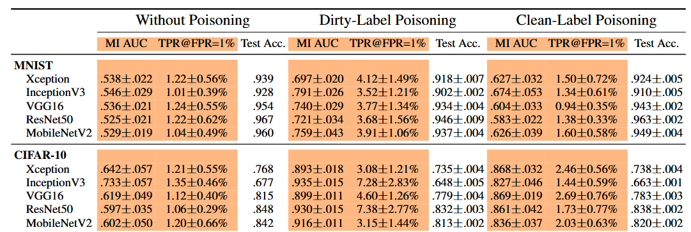
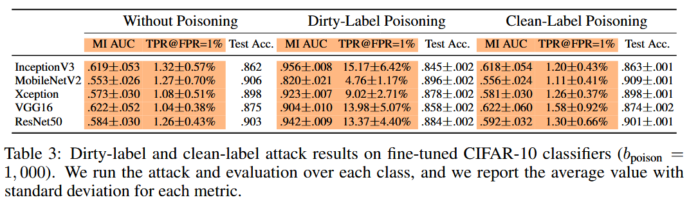

## (NeurIPS 2022) Amplifying Membership Exposure via Data Poisoning

Three objectives of poisoning attacks:

- Test-time accuracy degradation
- Controlled misprediction
- Increase privacy leakage (focus of this paper)

The attack requires:

- Leaking the membership of training samples within a targeted class.
- Poisoning samples that have limited impacts on the model performance for untargeted classes, and indistinguishable from natural images.

### Dirty-label Poisoning

Rationale: cause overfitting in the targeted class.

For the target group `t`:

- Select all samples in the shadow dataset (the adversary owns that shares the distribution, but no overlap, with the dataset that trains the model)
- Change the labels for these examples to another class.
- Preserve `b_poison` of them (the poison budget).

Results (InceptionV3-based):

Their dirty-label poisoning attack significantly increased MIA effectiveness, raising AUC scores from 0.6917 to 0.9255 for the CIFAR-10 "airplane" class (Inception V3).

The attacker must modify the labels of training samples, which is not feasible in many cases. Many datasets are labeled by trusted sources or human annotators, making it difficult for an attacker to introduce incorrect labels without detection.

### Clean-label Poisoning

Senario: a pretrained feature extractor and a classifier that is trasfer learned.

Rationale: a slight change in the input space may cause a significant change in the feature space.

Attack:

- For the target class `t`, select a sample from the shadow dataset (the *base sample* (`x_base, t`)), and a sample `(x, y)` that is *not* in class `t`.
- Find `x*` close to `x` in input space (e.g. `L_{infty}` distance) and close to `x_base` in the feature space (`L_2`). Insert `(x*, y)` into the poisoned dataset. Do this until reaching the poisoning budget.

They show that both techniques are helpful, while dirty-label poisoning, if feasible, is better:

Note that: for fine-tuning scenarios, the clean-lable poisoning doesn't work very well, but the dirty-label one still boosts the attack.

They investigate three defenses:

- Regularization.
- Early stopping.
- DP-SGD.

The first one achieves the best utility-privacy trade-off.

