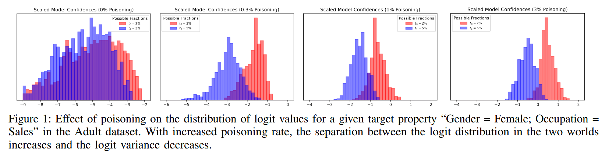

## (Oakland 2023) SNAP: Efficient Extraction of Private Properties with Poisoning

If this paper, they poison a subset of the training dataset and query the trained target model in order to do **property inference** of the *global properties* of a dataset.

- For example, the fraction of people belonging to a certain demographic group or with a rare disease.

The main limitation of existing works:

- Rely on the attacker learning a meta classifier over training examples generated from thousands of shadow models.

In this paper, they propose SNAP (**S**ubpopulation I**N**ference **A**ttack with **P**oisoning)

- Rationale: data poisoning mounted for properties of interest create a separation between the model confidences trained with different proportions of the property.
- They rely on only a small number of shadow models (e.g. 4) to learn the distribution of model confidences.
- They are able to extend to *label-only threat model*.
- Their attack works for different attack objectives:
  - Distinguishing between models trained on two different fractions of the target property
  - Checking a property’s existence in the training set
  - Inferring the exact size of the property used in training.

Assumption of the adversary:

- They would like to minimize the amount of poisoning so that the model performance remains similar after poisoning.
- The adversary can sample training examples with and without the property of interest from the *distribution* of training data.
- The adversary is aware of the training algorithm, model architecture, features, and the number of samples used for training, but has no knowledge of the trained model parameters and the training samples.

### Snap Attack

Rationale explained:

- If we poison with a rate close to the smaller fraction `t_0`, we can change the prediction of the classifier on most of the points in World `0`. The impact will be much smaller in World `1` given that `t_1` > `t_0`. The difference gets larger when the gap between `t_0` and `t_1` gets larger.

For example:

- The attacker wants to determine **what fraction of the dataset consists of female individuals**.

- They gather some real data points where `Gender = Female` and have a known class label (e.g., `Income = Below $50,000`).

- Instead of keeping the original labels, the attacker modifies them to a different class (e.g., changing the label to `Income = Above $50,000`).

- The attacker then queries the trained model by inputting samples that match the target property (e.g., other female individuals).

- The model’s confidence scores (probabilities for each class) on these queries will be slightly different depending on how many female samples were in the training data.

- The attacker queries two different trained models: one where `30%` of the dataset was female (`World 0`), and another where `50%` was female (`World 1`). They observe the logit values (pre-softmax scores) for `Income = Above $50K` for female individuals.

- The attacker trains a few shadow models (at most 4) with different proportions of female individuals to learn the distribution of logit values.

  They find that:

  - If the dataset had 30% female samples, the logit values for `Income = Above $50K` tend to be lower.
  - If the dataset had 50% female samples, the logit values for `Income = Above $50K` tend to be higher.

  Moreover, as the poisoning rate increases, the *variance of the logit distribution decreases* so the two distributions of the logit values are more separable. They fit Gaussian distributions to these logit values and compute a threshold that allows them to distinguish between the two cases.

Why does this work?

Consider a **binary classifier** that predicts whether a person earns `Above $50K` or `Below $50K` based on their features.

- The model learns a decision boundary that separates low-income and high-income individuals.

- Poisoning **pushes the boundary**, forcing the model to **associate certain features (e.g., being female) with high income**.

- However, the amount of shift depends on the initial dataset composition:

  - If **females are underrepresented (30%)**, the poisoned samples **introduce a stronger shift** in the model's learned distribution. But this shift does not generalize well to new female samples because the model is not well-calibrated on them.

    As a result, the model **becomes uncertain** when predicting income for new female samples, leading to **lower logit values** (i.e., lower confidence scores).

  - If **females are well-represented (50%)**, the poisoning has a **smaller marginal effect**, so confidence remains high for the correct label.

### Extensions

Property existence:

- Seen as a special case where `t_0 = 0` and `0 < t_1 < 1`.
- They found that it requires much fewer poisoning samples (at most 8 samples for several tested properties).

Label-only Property inference:

- If we poison just enough, we can make the model flip its predicted labels—but only in World 0 (low fraction of the property), not in World 1.
- For example, If the dataset had very few high-income females naturally (World 0), the poisoned samples strongly shift the model’s decision boundary. 
- The attacker chooses a poisoning rate `p∗` carefully, so that:
  - In World 0 (30% female), poisoning is strong enough to make the model misclassify some new female samples (flipping their label to “Above $50K”).
  - In World 1 (50% female), poisoning is not strong enough to flip labels.
- The attacker queries female samples and counts how many times the model predicts “Above $50K.”
  - If **many labels flipped**, the attacker guesses **World 0** (small fraction of females).
  - If **few or no labels flipped**, the attacker guesses **World 1** (larger fraction of females).

Estimating property size

- Because the distinguishing test only requires at most 4 shadow models to achieve high attack success, they train models on datasets with several different fractions and compare their logit distributions to the target model’s logit distribution
- Depending on the desired precision of our estimation, we are required to train a large number of shadow models (e.g., to estimate the fraction of the target subpopulation to the nearest hundredth, we require S = 100 shadow models to be trained and pick the one with the most similar logit distribution to the target model).
- They adopt *binary search* that reduces the number of shadow models to logarithm level.

### Evaluations

The authors evaluate SNAP on four real-world datasets used in property inference literature:

| Dataset       | Type    | Task                                             |
| ------------- | ------- | ------------------------------------------------ |
| **Adult**     | Tabular | Predict income (`Above/Below $50K`)              |
| **Census**    | Tabular | Predict income (`Above/Below $50K`)              |
| **Bank Mkt.** | Tabular | Predict if a client subscribes to a term deposit |
| **CelebA**    | Images  | Predict if a person is smiling                   |

Each dataset contains various demographic properties (e.g., gender, race, occupation), and SNAP is tested on small, medium, and large properties.

The key takeaway: SNAP achieves high accuracy with very low poisoning rates.

Large Properties (10-50% of dataset)

- 91-100% attack accuracy with just 5% poisoning.
- Example: "Gender = Male, Race = White" (15% vs 30%) → 90% accuracy at only 1% poisoning!

Medium Properties (1-10% of dataset)

- 90-96% attack accuracy at 0.4%-0.6% poisoning
- Example: "Gender = Female, Occupation = Sales" (1% vs 3.5%) → 96% accuracy at 0.4% poisoning.

Small Properties (Existence Inference, <1% of dataset)

- 95%+ attack accuracy using just  8 poisoned samples!
- Example: "Native Country = Germany" (0% vs 0.1%) → Detectable with minimal poisoning.

Impact of Model Complexity

- Shallow models (1-layer networks) have lower attack accuracy.
- 2-layer networks achieve the highest accuracy.
- Overly deep models (6 layers) show reduced attack accuracy due to overfitting.

Impact of Training Dataset Size

- Larger training sets improve attack accuracy because the model learns clearer decision boundaries.
- Smaller datasets make the attack harder because logits are more variable.

How Many Shadow Models Are Needed?

- SNAP only needs **4 shadow models** (2 per world).
- Previous attacks required thousands of models!

How Many Queries Are Needed?

- 100 queries are enough for high attack success.
- Previous methods needed thousands of queries.

They also found:

- Attacker has the potential to infer information on multiple sub-properties by poisoning a larger target property during training:
  - **Property**: “Race = White”
  - **Subproperty**: “Race = White; Gender = Male”
  - If the dataset has 30% White individuals, and half of them are Male, then the subproperty “White Male” occurs in 15% of the dataset.
  - Suppose **"Race = White"** occurs in 30% of the dataset.
  - If we poison 1% of the dataset with label-flipped White samples, it only slightly shifts the decision boundary. Now consider the subproperty "White Male", which occurs in 15% of the dataset. The same 1% poisoning affects a larger fraction of this smaller subgroup, shifting the decision boundary more dramatically.
  - The attack works better on subproperties because poisoning has a stronger effect when the target property is a smaller fraction of the dataset.
  - They leave more exploration of the subproperty inference as a future work.
- SNAP is able to achieve high success even when the target model has been trained with DP.
  - The attack also performs better as the number of queries increases, and therefore bounding the number of queries by user is a potential strategy to mitigate these attacks.
  - The success rate also improves as the amount of poisoning increases, suggesting that applying poisoning defenses may help.
- Property inference has the potential to be used as a tool for auditing the fairness of ML models. If a company shares their model with a third party, they would be able to determine the demographics of the dataset used to train the model using different SNAP attack variants.
  - This way, an auditor could efficiently determine whether the dataset used to train this company’s model contains fair representations of its constituent properties.