### (Usenix Security 2022) Poison Forensics: Traceback of Data Poisoning Attacks in Neural Networks

#### Introduction and Motivation

New defenses against adversarial maching learning attacks are broken from time to time, and it's important to have **forensic tools** to trace back the attack to its root cuase, and offer a path for mitigation in order to prevent future attacks.

In this paper, they propose a method by **iterative clustering** and **dataset pruning** to trim out *innocent* training samples from poisonous ones (who are *responsible* for the attack.

**Digital forensics and incident response (DFIR)**

- For packet routing on the wide-area Internet, forensic IP traceback tools can identify the true source of a Denial of Service (DoS) attack.
- It also provides a strong deterrent against future attackers with the post-attack identification.
- For data poisoning attacks, effective forensics help identify which training samples led to the misclassification behavior used in the attack. This is called **poison traceback problem**. 

Challenges:

- Today's deep learning models have complex architectures that aren't easy to explain.
- Effects of poisoning attacks generally require training on a group of poisoned data, and a subset of the poisoned training data is unlikely to produce the same behavior. This renders brute force searching impractical.
- False positives could lead to false accusations and negative consequences.

Data Poisoning attacks:

- Dirty-label attacks: attacker can modify both the data and their semantic labels (**backdoor attacks**)
- Clean-label attacks: attacker can only modify the data. Only work well for *white-box attack*.
  - Clean-label backdoor attacks
  - Clean-label triggerless attacks
    - Shafahi et al.: first such attack where an attacker injects poison data to disrupt the feature region of the targeted data.
    - Later works: positioning poison data on a convex polytope around the target data.

Assumption on the attacker:

- can modify any portion of their controlled training data
- can poison at most half of the entire training dataset
- has no access to other parts of the model training pipeline
- is aware of the existence of a potential traceback system and can adopt anti-forensics techniques to evade traceback
- at inference time, submits an attack input that utilizes the injected vulnerability to cause model misclassification.

Assumption on the traceback system:

- white-box access to the model (weights, architectures, training pipeline, dataset etc.)
- information of the misclassification event

Note that misclassification can also result from model inaccuracy or evasion attacks. This should be taken into consideration.

Metrics:

- Precision: measure the false positive probability
- Recall: the percentage of poison training data responsible for the misclassification event that are identified by the traceback system
- Generalizability

#### Detailed Design

- Set searching by iterative clustering and pruning.
  - Clustering is performed on *unmarked* training data.
  - Separate innoncent data from poison data to identify, mark and prune an innocent cluster (using the pruning component).
- A binary measure of event responsibility.
  - The attack confidence level should not degrade if some portion of the innocent data is not used for model training.
  - They determine only whether a cluster contains fully of only innocent data.

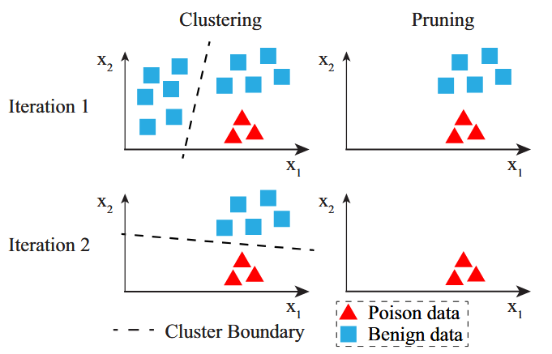

##### Clustering

1. Data mapping to “amplify” the distance between innocent and poison data.
   - Estimating how a training sample x affects the final model parameters.
   - Measured by the change of model parameters when x is absent from the training dataset.
   - Unlearning of poison samples shifts the model closer to an optimal location in parameter space.
   - Unlearning benign samples shifts the model towards its initial randomly initialized state.
   - Proposed data mapping: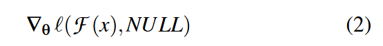
   - NULL is a new “no knowledge learned” label to represent the effect of not learning from x: implemented as an equal probability output.
   - For large models, we can sample 1%-10% of the weights without siginificant traceback accuracy performance.
2. High performance clustering method to generate the clusters, discussed below.
   - Mini-batch K-means
   - A scalable K-means variant by first clustering on multiple smaller batches that enables distributed computation.

##### Pruning

For a misclassification event `(x_a, y_a)`, estimate which cluster is responsible. 

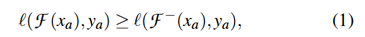

`F` is the DNN trained on one cluster (`D_1`), and `F-` is the one trained from the rest of the remaining dataset (`D - D_1`, i.e. the one unlearned the first cluster from the original model). `l` function (cross entropy) indirectly compares the confidence level of `(x_a, y_a)` on the two DNNs. The above inequality may suggest that the first cluster is less responsible.

To unlearn `D_1` from `F`, fine-tune `F` to minimize the cross-entropy loss between `D_1` and NULL label mentioned above.

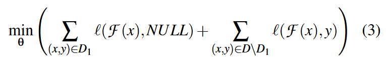

Then we compute the RHS of equation (1) and check (1).

#### Evaluation

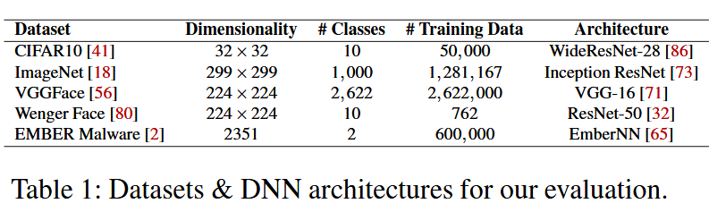

##### Dirty-label Attacks

Three SOTA attacks:

- BadNet, Trojan, Physical Backdoor
- The proposed traceback system can accurately identify the root cause of dirty-label attacks (≥ 98.9% precision and ≥ 97.1% recall).
- BadNet: adding a pre-selected backdoor trigger to benign inputs and labeling them with the target label. 10% injection rate (10% of the training data is poison data).
- Trojan (VGGFace): improves upon BadNet by using an optimized trigger to increase attack success. 10% injection rate , a 59 × 59 pixel trigger. Attack on face recognition model.
- Physical Backdoor (WengerFace): using everyday physical objects such as eyeglasses and headbands as the trigger. Bypassing many SOTA defenses, no known effective defense.

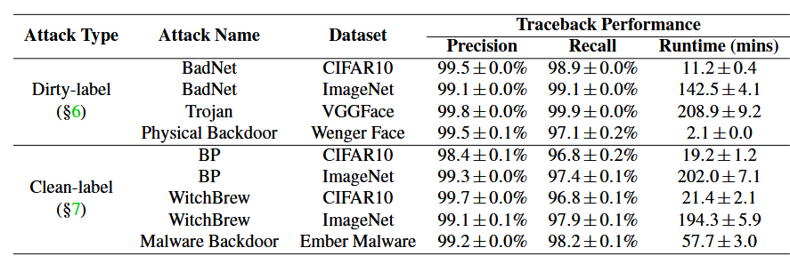

The authors generate 1000 successful attack instances as the misclassifiction events to test the proposed traceback system. They randomly choose 10 target labels to implement 10 versions of the attack method, and generate 100 successful attack instances.

Note that for physical backdoor, the recall is lower than other attacks. They hypothesize that maybe this is because those missed data samples contributed very little to the injected vulnerability, especially since real photos of physical objects often lead to less precise triggers than those injected digitally. They confirm this hypothesis by showing that removing these missed samples doesn't hurt attack success rate, but removing other samples does.

The computation time linearly increases with the dimension of the data projection and the number of training data samples. The bulk of the traceback computation comes from the clustering of training data.

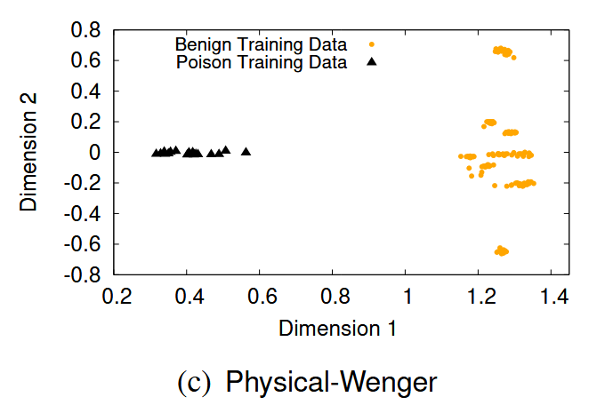

Figure 3 (2-D PCA) shows that the clustering method is effective. This is one of the figures.

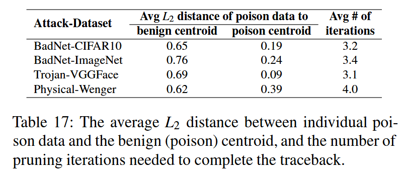

Table 17 corroborates that the poison and benign data are reasonably separated, aligning Figure 3.

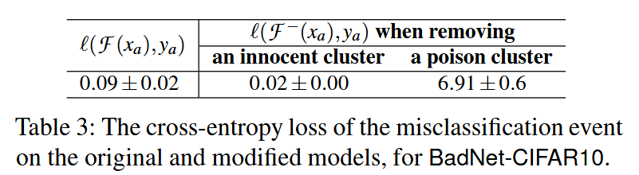

Table 3 displays distinct difference when compared to the LHS in equation (1), confirming that proposed binary condition offers a clear signal to identify innocent clusters.

##### Clean-label Attacks

This method usually requires fewer poison training samples, and these samples appear less separated from the benign data even after data projection. These make the clustering and pruning more challenging.

- Bullseye Polytope (BP) (CIFAR10 & ImageNet): aim to make the model classify a single attack sample to a target class at test time without modifying the sample (hence, triggerless). This is achieved by adding imperceptible perturbations to the poison training data so their representations in the feature space form a fixed-radius polytope around the chosen attack sample. BP only works well when the attacker has access to a pretrained feature extractor used by the victim model i.e. in transfer learning setting.
- Witches’ Brew (CIFAR10 & ImageNet): adding imperceptible perturbations to the poison data to align its gradient with that of the attack sample. This makes the model misclassify the attack sample to the target class of the poison data.
- Malware Backdoor (Ember Malware): backdoor attack on malware classifiers. The attacker finds 128 most important features defining ‘goodware’ and uses these as a trigger. These features are then modified for poison malware samples, with the target class being ‘goodware’.

The primary results are in the table above.

*Lower traceback* recall due to ineffective poison data: they hypothesize that it is because the attack failed to move the representations of some poison training data to the desired location in the feature space. These “ineffective” poison training data made very little contribution to the misclassification event, and are hard to detect during traceback.

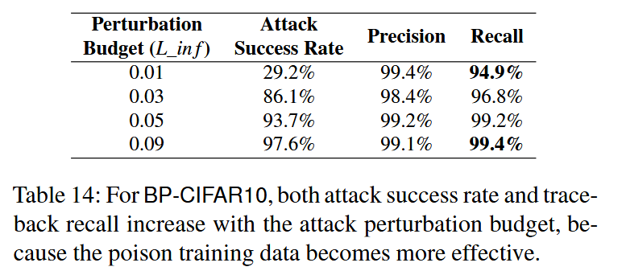

Adding more attack budget (the magnitude of perturbation added into poison data) increases attack success rate, the recall increases as well.

They perform experiments similar to the last section, and find that these methods incur less distinct clusters, which leads to more pruning iterations.

#### Anti-Forensic Countermeasures

They show that these methods don't work. For example, for attack represented by (c):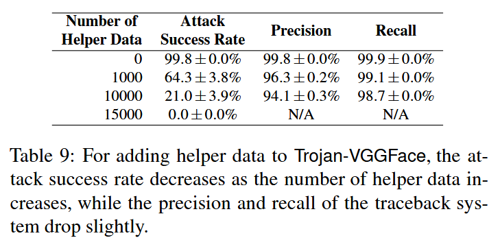

#### Discussion: Identifying Non-poison Events

In practice, a system administrator must first identify if a misclassification event was caused by a poisoning attack, or from an evasion attack or benign misclassification.

They argue that the proposed system can serve as a first step towards attack identification.

Both evasion by adversarial perturbation and benign misclassification rely on specifics of the model’s loss landscape. In either case, removal or “unlearning” of any significant portion of training data will change the loss landscape and should alter the misclassification behavior. So if the first iteration fails to prune away either cluster, then we consider the misclassification event as non-poison and end traceback.

They also point out that this system might be vulnerable to "false flag" attack. An attacker carefully crafts a misclassification event that triggers our traceback system to blame an innocent data provider. Human intervention should be in place in such cases.