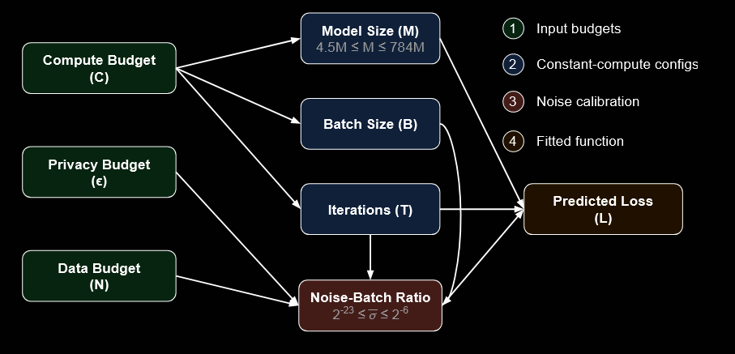
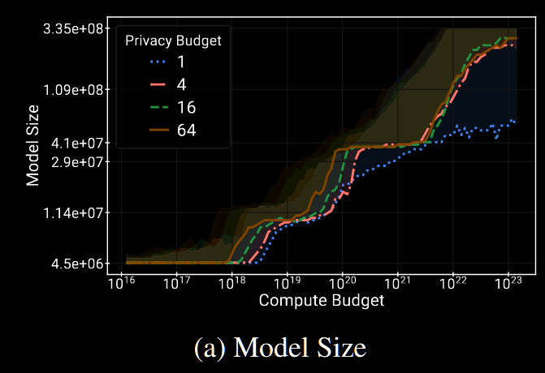
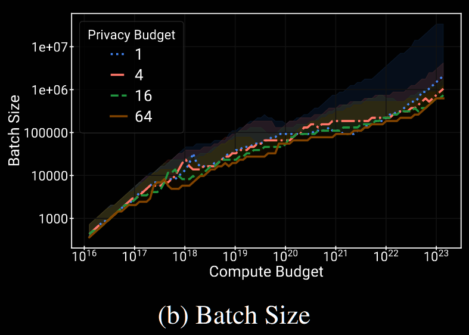
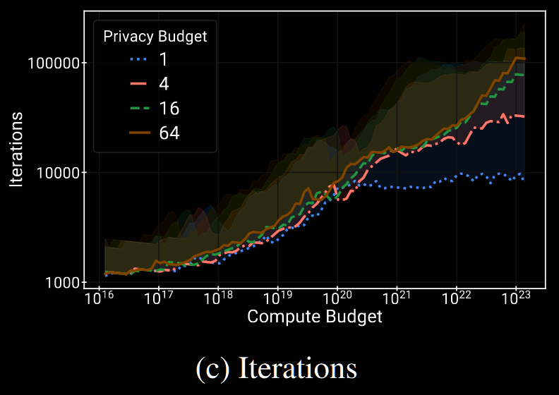
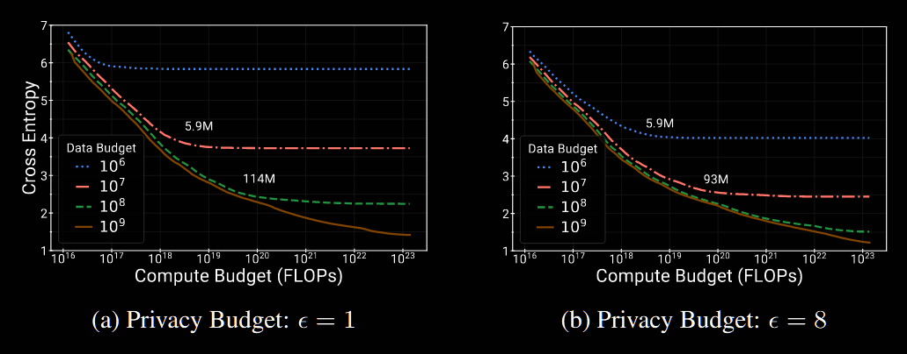
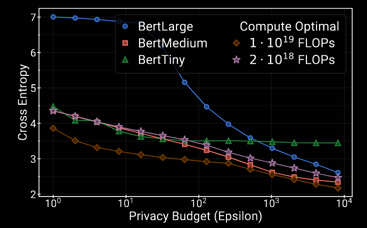
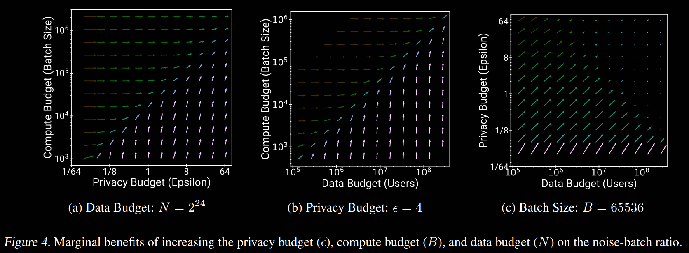

## (ArXiV 2025) Scaling Laws for Differentially Private Language Models

This paper aims at understanding the complete picture of the compute-privacy-utility tradeoffs and the optimal training configurations in many settings of training LLM using DP.

> They choose to focus on MLM models! Specifically:
>
> - BERT from Tiny (4M) to Mega (778M) [7 in total]
> - Default dataset: 3.3B words before tokenization

- In part due to the reliance on large batch sizes, the largest models trained with DP today have only hundreds of millions, rather than billions, of parameters.
- In this work, they would like to train the models with billion-parameter scale by exploring the *scaling laws of DP training*. For example, they want to predict the optimal breakdown of the compute budget into model size, batch size, and iterations for virtually any privacy budget and dataset size.
- They found that the optimal model size is typically at least an order of magnitude **smaller** with DP. In the DP setting, increasing the compute budget can sometimes yield little to no reduction in the loss unless accompanied by a corresponding increase in the privacy budget or dataset size.

In the conclusion section, they suggest that, to train a billion parameter model **optimally** with DP, one need:

- Data collected from one billion individuals
- ε ≈ 10 (generous)
- `1e23` FLOPS
- In non-private laws: 20B parameters, but only 2B examples.

> Details:
>
> - They use DP-Adam as the optimizer with:
>   - 1000 steps warm-up
>   - Exponential LR decay (10x after 128K iterations)
>   - Clipping with l2 norm 1.0; normalized variant proposed by De et al., 2022.
>   - LR: 2e-7, 2e-8, 2e-9
>   - Physical batch size: 1024
>   - Noise-batch ratio: `{2^{-k} | k=6,..,23}` with a 0 baseline (non-private learning)
>     - Note that the batch size here refers to *minibatch*, not the physical batch.
>   - Metrics: Avg *training* loss of every 100 iterations.
>   - Results: grid of 6 model sizes * 1280 # of iterations * 18 noise-batch ratios * 3 learning rates
>     - 1280 = 128k iterations / 1 sample every 100 iterations
> - They parameterize the training algorithm with the noise-batch ratio `\hat{σ}`, the std of the noises added to the gradient. The variance of the added noises dominate over the minibatch sampling variance as shown in previous study.

Apart from the concepts considered in non-DP training (like the compute budget C in terms of FLOPs), we also care about:

- Privacy budget ε
- Data budget N: training set size in terms of number of individuals, not the number of examples.

To estimate the validation cross-entropy loss from *model size (M)*, *noise-batch ratio*, and *training iterations (T)*:

- They test and create the grid of 6 model sizes * 1280 # of iterations * 18 noise-batch ratios * 3 learning rates
- They want to know what happens *between* the grid points by fitting a function
  - Some priors: loss should increase with increased noise-batch ratio and decrease with more iterations
  - They do some data cleaning and smoothing based on these assumptions, and extrapolate the smoothed data w.r.t. the number of iterations

They analyze the resulting fitted function between the loss and `(M, T, \hat{σ})`.

#### Optimal Compute Budget Allocation

Given a compute/privacy/data budget, how to **allocate compute budget** among the model size, batch size, and number of iterations when *data budget is fixed*?

- For small compute budgets, the optimal allocation doesn't depend heavily on ε. But with **larger privacy** budgets, one should train a **larger model** with a **smaller batch size** and for **more iterations** than with a smaller privacy budget.

  

  For example, for small compute budget, the optimal model size is constantly small, but when increasing compute budget, higher privacy budget accomodates larger model, and this trend seems to saturate at `1e23`.

  

  In (b), we can see that **larger compute budgets allow for larger batch sizes** to improve training efficiency without compromising performance.

  

  In (c), we can clearly see that the growth in the number of iterations slows down or plateaus, particularly at lower privacy budgets.

- There are many settings that achieve near-optimal loss, as indicated by the large shaded regions (within 1% of the optimal loss when compute budget is fixed). All else being equal, training smaller models on more tokens should generally be preferred due to their inference-time efficiency.

- They found that optimal model sizes are much smaller than predicted by non-private scaling laws.

#### Benefits of Increased Compute

Best cross-entropy loss achieved for varying compute budgets. As we can see:

- Generally increasing compute budget is beneficial before hitting the **inflection point**. This is a **qualitatively different behavior than non-private scaling laws**, where increasing the compute budget continues to provide benefits even at the extreme scales.

#### Token-to-Model Ratio

Token: `S*B*T` = sequence length (fixed to 512) * batch size * number of iterations

For non-DP models, the ratio is usually 20x.

- The slope decreases as the privacy budget increases, but it won't be near to non-DP without extremely large ε
- For moderate privacy budgets in the range of [1, 10], a good token-to-model ratio is typically between 1000 and 100000 (unless extremely large compute budget)

#### Better Training Schemes with the Scaling Laws

The first configuration is close to what non-private scaling law predicts (Hoffmann et al., 2022), and the last is selected by a DP expert:

1. Bert-Large, 7500 training steps and a batch size of 1295
2. Bert-Medium, 5000 steps with a batch size of 15879
3. Bert-Tiny, 2500 steps with a batch size of 283061

Fix data budget to `N=1e7` as before, and each of the three new schemes requires `1e19` FLOPs.

All models are trained with the same budget (compute & data).

- They found that configuration suggested by non-private scaling laws yields bad utility (BertLarge)
- The optimal training configuration changes with the privacy budget
- Compute-optimal training can either give better utility, or save compute/privacy budget under fixed utility

#### Synergy between Privacy/Data/Compute Budgets

The direction and magnitude of the vectors indicate how much doubling each of these budgets reduces the noise-batch ratio. Each budget is varied on a logarithmic scale at different powers of 2.

Simply increasing **one budget (privacy, data, or compute)** in isolation leads to **diminishing returns**. For example in (a):

- Doubling the privacy budget (ϵ) or compute budget **alone** will initially reduce the noise-batch ratio, but as these values grow larger, the reduction in noise **tapers off**.
- Increasing the privacy and compute budgets in tandem leads to consistent and predictable reductions in the noise-batch ratio.

**Optimal improvements occur when multiple budgets are increased together**, leading to a **consistent and predictable reduction in the noise-batch ratio** and better model performance.

