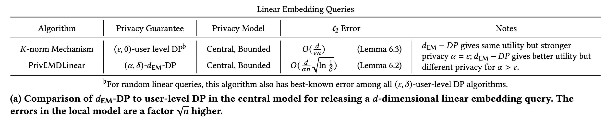
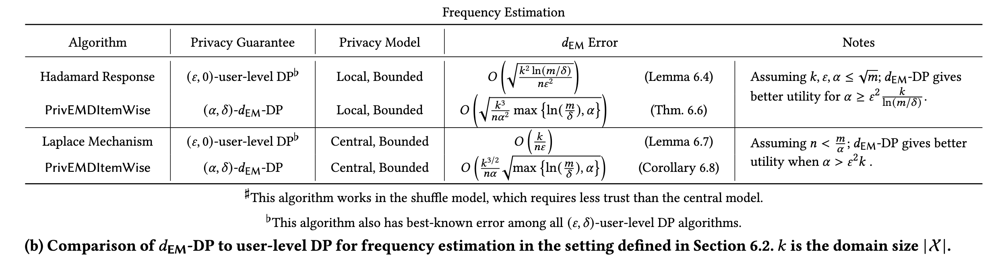

## (CCS 2024) Metric Differential Privacy at the User-Level via the Earth Mover’s Distance

This paper introduces a new framework for **User-Level Differential Privacy (DP)** that moves away from the "one-size-fits-all" privacy guarantee of standard DP. By utilizing the **Earth-Mover's Distance ($d_{EM}$)** as a metric, the authors define a privacy notion where the strength of the privacy guarantee **scales with the similarity of the user's data**. This approach addresses the utility limitations of standard user-level DP, particularly in high-dimensional settings like location traces or text, where distinguishing between small, routine changes and large, sensitive changes is crucial.

### The Core Problem: Limitations of Standard User-Level DP

Standard DP offers a uniform guarantee: it protects any pair of input datasets equally, regardless of how different they are. While robust, this creates significant utility issues at the **user level** (where a user **contributes multiple items**, not just one).

- Standard user-level DP must hide the **"worst-case" change**—e.g., a user changing their entire month's location history.
- In practice, not all data changes are equally sensitive. For example, changing a single day's location in a month-long dataset is less distinguishable than changing the entire month's data. Standard DP treats both scenarios as equally indistinguishable, forcing the addition of noise calibrated to the massive, worst-case change.

### Solution: Metric DP via Earth-Mover's Distance ($d_{EM}$)

The authors propose **$d_{EM}$-DP**, a relaxation of DP where the privacy parameter is scaled by the distance between datasets. They choose **Earth-Mover's Distance (EMD)** because it captures two dimensions of change simultaneously:

1. The distance between the individual data items.
2. The fraction of the data items in the set that are different.

**Informal Definition:** Two datasets $K$ and $K'$ are indistinguishable with a privacy budget that grows inversely with their distance. If $K$ and $K'$ are very similar (small $d_{EM}$), they are protected by a very strict privacy guarantee. If they are very different, the guarantee is relaxed.

- Earth-Mover's Distance: minimum cost of transporting one distribution to another, where the cost is determined by the **quantity of data items moved multiplied by the distance**
- Takes into account both the **structure** of the distributions as well as the **raw difference** in their values.
- **$\epsilon$ (Standard DP):** A fixed "privacy cost" paid for *any* difference between datasets, big or small.
- **$\alpha$ ($d_{EM}$-DP):** A scalable "privacy cost" rate. You pay $\alpha \times \text{distance}$.

#### Scenario 1: When $\alpha = \epsilon$

**"These utilities are identical, but $d_{EM}$-DP offers stronger privacy."**

In this scenario, you set your metric privacy parameter $\alpha$ to be exactly the same number as the standard parameter $\epsilon$ (e.g., $\alpha = 1$ and $\epsilon = 1$).

- **Why Utility is Identical:** The amount of noise added by the mechanisms (like `PrivEMDLinear`) is inversely proportional to the parameter ($\text{Noise} \propto \frac{1}{\alpha}$ vs $\text{Noise} \propto \frac{1}{\epsilon}$). If $\alpha = \epsilon$, the math dictates that the **noise added is exactly the same**, so the accuracy (utility) of the output is identical.

- **Why Privacy is Stronger:**

  Standard DP treats every pair of datasets as "worst-case" different. It guarantees the probability ratio between outputs is at most $e^\epsilon$.

  $d_{EM}$-DP guarantees the ratio is at most $e^{\alpha \cdot d_{EM}}$.

  - Since the distance is normalized ($d_{EM} \le 1$), and $\alpha = \epsilon$, the bound $e^{\alpha \cdot d_{EM}}$ is always less than or equal to $e^\epsilon$.
  - For any pair of datasets that aren't complete opposites (i.e., $d_{EM} < 1$), the bound is **tighter** (closer to 1). This means the adversary has a *harder* time distinguishing them than standard DP allows, hence "stronger privacy".

#### Scenario 2: When $\alpha > \epsilon$

**"The utility of $d_{EM}$-DP is higher than that of user-level DP."**

This is the primary motivation for using $d_{EM}$-DP. The framework allows you to set a **larger** parameter (e.g., $\alpha = 10$) compared to standard DP (e.g., $\epsilon = 1$) while still maintaining meaningful privacy for sensitive changes.

- **Why Utility is Higher:**

  A larger parameter means **less noise**.

  - Standard DP Noise: $\approx \frac{1}{\epsilon} = 1$
  - $d_{EM}$-DP Noise: $\approx \frac{1}{\alpha} = \frac{1}{10}$ By increasing $\alpha$, you significantly reduce the error, leading to higher utility.

- **The Trade-off (The Nuance):**

  If you use $\alpha=10$ and $\epsilon=1$, aren't you providing *worse* privacy?

  - **For Distant Pairs ($d_{EM} \approx 1$):** Yes. The privacy guarantee is $e^{10}$ (weak) vs $e^1$ (strong). The algorithm essentially admits: "I cannot hide the difference between two completely different users (e.g., one in New York, one in London)."
  - **For Close Pairs ($d_{EM} \approx 0.01$):** No. The privacy guarantee is $e^{10 \times 0.01} = e^{0.1}$. This is still **very strong privacy**.

**The Logic:** The authors argue that distant pairs (e.g., entirely different location histories) are inherently distinguishable and often not sensitive (publicly known info like "I live in the US vs. UK"). The *sensitive* information usually lies in small deviations (e.g., "Did I visit the clinic today?"). $d_{EM}$-DP focuses the privacy protection on these small, sensitive distances, allowing you to relax the global budget ($\alpha$) and gain utility.

------

### Key Technical Contributions

#### A. Mechanism for Linear Queries (Lipschitz Sensitivity)

Standard sensitivity analysis fails for metric DP because the sensitivity might be unbounded. The authors prove that if a query function $f$ is **Lipschitz continuous**, one can bound the sensitivity using $d_{EM}$.

- Why this is originally hard?

  - There are exponentially many possible datasets of a given size, making it impossible to check every pair to find the maximum change.
  - In a metric space, the "distance" between datasets ($d_{EM}$) can be very small while the change in the query output is large.

- To solve this, the authors restrict the class of allowed queries to those that are **Lipschitz continuous**.

  A function $f: \mathcal{X} \rightarrow \mathbb{R}^d$ is **$l$-Lipschitz** if for all $x, x'$, the distance between their outputs is bounded by the distance between their inputs, multiplied by a constant $l$:

  $$\|f(x) - f(x')\| \le l \cdot d_X(x, x')$$

  **Why this works:** This assumption ensures that if two datasets are close in terms of Earth-Mover's Distance (meaning the data points are close in the metric space), the answers to the linear queries on those datasets *must also be close.*

  - Average Queries (Identity Function)

    - **Why it is Lipschitz:** If you move one data point by 10 meters, the sum of the data moves by exactly 10 meters, and the average moves by $10/m$ meters (where $m$ is the dataset size).

  - Similarity Queries (Dot Product)

    - **The Query:** Calculate how similar the dataset is to a specific reference vector $c$ (e.g., "How similar is this user's text embedding to the concept of 'finance'?").
    - **Why it is Lipschitz:** This is typically calculated using a dot product: $f(x) = \langle x, c \rangle$. In vector spaces, the change in a dot product is bounded by the distance moved. If you move vector $x$ slightly, the dot product value changes smoothly, never "jumping."
    - **Math:** By the Cauchy-Schwarz inequality, $|\langle x, c \rangle - \langle y, c \rangle| = |\langle x-y, c \rangle| \le \|x-y\| \cdot \|c\|$. As long as the reference vector $c$ is bounded, the query is Lipschitz.

  - Smoothed Region Queries (Kernel Density)

    - **The Problem (Non-Lipschitz):** A standard region query asks, "Is the point inside Region A?" This is a step function (0 or 1). If a point moves 0.001mm across the boundary, the output jumps from 0 to 1. This is an infinite rate of change relative to the distance, so it is **not** Lipschitz.
    - **The Solution (Lipschitz):** Instead of a hard boundary, the paper uses **Kernel Smoothing**. The query becomes "How *close* is the point to the center of Region A?" using a bell curve (Gaussian kernel).
    - As a point moves towards the region, the value rises gradually (e.g., 0.1, 0.2... 0.9). There are no sudden jumps, so the rate of change is bounded.

  - If a query is **not** Lipschitz (e.g., a binary threshold like "is $x > 5$?"), a tiny change in input (e.g., moving $x$ from $5.0$ to $5.00001$) results in a massive jump in the sensitivity ratio (Output changes from 0 to 1, while Distance is near 0).

    - This causes the sensitivity to approach **infinity**.
    - Infinite sensitivity requires **infinite noise**, making the mechanism useless.

  - Alternatively, **use the Item-Wise Mechanism (`PrivEMDItemWise`)**

    The paper's second major mechanism (shuffling) does **not** rely on the query being Lipschitz.

    - It applies a standard mechanism $\mathcal{A}$ to each item and shuffles the result.
    - As long as $\mathcal{A}$ satisfies basic metric DP (even if the final aggregation isn't Lipschitz), the full mechanism satisfies $d_{EM}$-DP.

- The authors prove that if the query function $f$ is $l$-Lipschitz, the sensitivity of the linear query $q_f(K)$ (the average of $f$ over dataset $K$) with respect to $d_{EM}$ is exactly bounded by $l$:

  - **The Bound:** $\Delta_{EM}(q_f) \le l$
  - **Proof Logic:** Since $d_{EM}$ is the minimum cost to "transport" one dataset to another, and the cost of transport is distance, the Lipschitz property guarantees that the total change in the query value cannot exceed the total transport cost scaled by $l$.

- Based on this bound, the authors introduce **Algorithm 1: PrivEMDLinear**. It releases the query result by adding noise calibrated to the Lipschitz constant $l$ rather than the global dataset boundaries.

  **Steps:**

  1. **Calculate:** Compute the true answer $q_f(\tilde{K})$ (e.g., the average).
  2. **Sample Direction ($U$):** Pick a random direction vector $U$ uniformly from the unit sphere.
  3. **Sample Magnitude ($g$):** Pick a random magnitude $g$ from a **Gamma distribution** $\Gamma(d, \omega)$.
     - In the **Local Model**, scale $\omega = 1/\alpha$.
     - In the **Central Model**, scale $\omega = 1/(\alpha n)$ (since sensitivity drops with more users).
  4. **Output:** Release $\hat{q} = q_f(\tilde{K}) + l \cdot g \cdot U$.

  This is essentially a multidimensional noise addition mechanism (similar to the *Laplace mechanism* but for *vector outputs*) that scales noise with the "metric sensitivity" $l$.

#### B. Mechanism for Item-Wise Queries (Privacy Amplification)

For cases where the aggregator wants to release a full distribution (e.g., a histogram) rather than a single average, the authors propose `PrivEMDItemWise`.

- Apply a standard *item-level metric DP mechanism to every item* a user has, and then **shuffle** the results so the source of each item is hidden.
- **Theoretical Breakthrough:** The paper proves a generalized **Privacy Amplification by Shuffling** theorem. While previous shuffling theorems applied to changing *one* item, this theorem bounds privacy loss when *all* $m$ items of a user change simultaneously. It shows that shuffling improves the privacy dependence from $m$ (linear) to $\approx \sqrt{m}$.

- The mechanism `PrivEMDItemWise` **bypasses the Lipschitz requirement** entirely because of how it releases data. 
  - The Lipschitz constraint is necessary for `PrivEMDLinear` because that mechanism tries to release a single **aggregate number** (like a sum or average). When calculating a sum, you must guarantee that one outlier input doesn't cause the sum to explode (unbounded sensitivity).
  - `PrivEMDItemWise`, by contrast, does not calculate a sum or average. It applies a privacy mechanism to **every single item individually** and releases them all (shuffled). It does not "compress" the data into a single dangerous number that could blow up.
  - The actual "querying" (counting, averaging, etc.) happens **after** the privacy protection has already been applied (**Closure under post-processing**).

#### C. Extension to Unbounded Data

Most theoretical DP work assumes "bounded" data (fixed dataset size $m$ per user), but real-world data is "unbounded" (users have varying counts of items).

- **The Challenge:** In unbounded settings, a single user could theoretically contribute infinite data, breaking central privacy guarantees.
- **The Fix:** The authors provide a "black-box reduction" using **sampling with replacement**. They prove this sampling acts as a "smooth projection," projecting arbitrary datasets onto a fixed size without distorting the $d_{EM}$ distance significantly. This allows bounded mechanisms to be safely used in unbounded settings.

------

### Utility Comparisons

The paper demonstrates that $d_{EM}$-DP outperforms standard user-level DP in specific tasks:

| **Task**                 | **Standard User-Level DP Error** | **dEM-DP Error**           | **Improvement**                                              |
| ------------------------ | -------------------------------- | -------------------------- | ------------------------------------------------------------ |
| **Linear Embedding**     | $O(d / \epsilon n)$              | $O(d / \alpha n)$          | **Higher Utility** when $\alpha > \epsilon$. $d_{EM}$-DP allows higher privacy budgets ($\alpha$) for distant pairs, reducing noise. 9 |
| **Frequency Estimation** | $O(\sqrt{k^2/n \epsilon^2})$     | $O(\sqrt{k^3/n \alpha^2})$ | **Higher Utility** for large $n$, leveraging the generalized shuffling result. 10 |

### Application

This work bridges the gap between the theoretical promise of Metric DP and the practical reality of User-Level privacy. It is particularly relevant for:

- **Location Privacy:** Protecting small deviations in daily routes without destroying the utility of aggregate mobility data.
  - $d_{EM}$-DP makes it harder to distinguish between locations that are (1) close to each other, and (2) collected over a smaller time window.
- **NLP/Text:** Protecting fine-grained semantic differences in user text histories.
  - Two conversations are harder to distinguish if (1) there is only a fine-grained difference in their textual semantics, and (2) if it pertains to just a small fraction of the conversation (indicating a user rarely discussed the topic, which typically implies more sensitive information).
- **Graph Data:** Protecting changes in a small subset of a user's social connections.