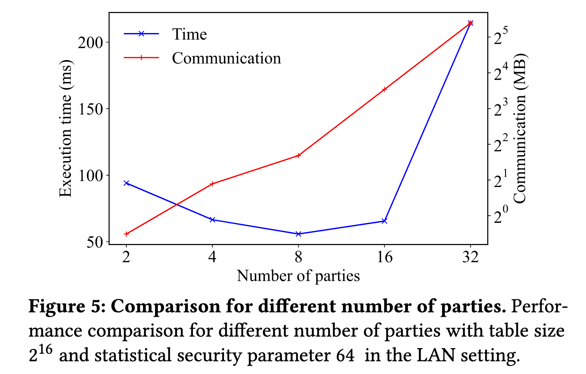
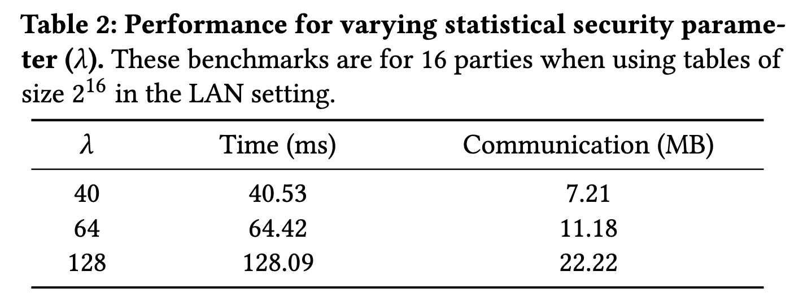
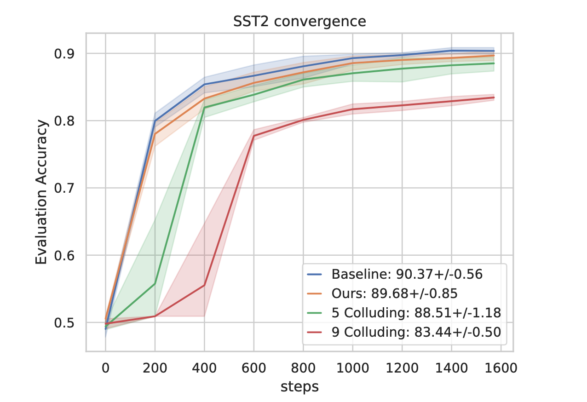
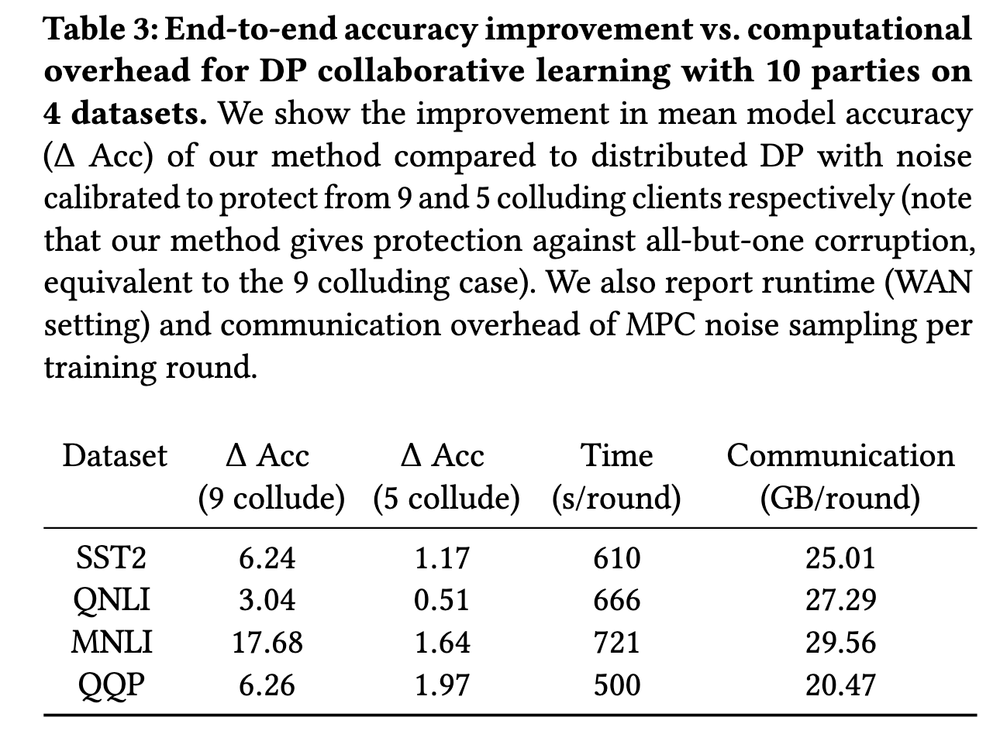

## (CCS 2025) Secure Noise Sampling for Differentially Private Collaborative Learning

In centralized DP-SGD, a trusted curator adds calibrated noise (e.g., Gaussian or discrete Gaussian) to gradients to ensure privacy. However, in **collaborative learning (CL)**—including federated learning and cross-silo settings—there is *no trusted noise generator*.

Two main approaches exist:

1. **Distributed DP (Local Noise Addition)**
   Each party locally adds noise before secure aggregation.
   - Vulnerable to **collusion**: adversarial parties can subtract their own noise.
   - Requires **inflated noise** to tolerate collusion → poor utility.
2. **MPC-based Central Noise Generation**
   Noise is sampled *inside* an MPC protocol and added during aggregation.
   - Preserves utility.
   - Existing MPC sampling methods are **extremely slow**, especially for:
     - Discrete Gaussian noise
     - Many parties
     - Thousands of samples per training round

> Prior state-of-the-art MPC samplers can take **tens to thousands of seconds per sample** for moderate numbers of parties, making them impractical for real training workloads.

The core insight of the paper is:

> **Do not MPC-evaluate a complex sampling algorithm directly. Instead, approximate the target distribution with an MPC-friendly representation that can be sampled using cheap primitives.**

### Central Idea: Dice Ensembles via Table Lookups

The authors propose to:

1. **Approximate any discrete distribution** with a statistically indistinguishable one.
2. Represent this approximation as a **sequence of uniform random table lookups** (called a *dice ensemble*).
3. Implement these table lookups efficiently inside MPC using:
   - One-hot vector generation
   - Homomorphic encryption
   - Minimal interaction

This replaces expensive non-linear sampling logic (e.g., rejection sampling, Bernoulli factories) with **simple dot products and table indexing**, which scale much better in MPC.

### Distribution Approximation via Dice Ensembles

The paper introduces a novel abstraction:

- **Die:** A table whose entries encode a discrete distribution via uniform indexing.
- **Dice Ensemble:** A chain (tree) of such dice, where “error mass” from one approximation level is refined at the next level.

The probability of outputting a value $x$ is:
$$
\Pr[\text{output}=x] = \frac{\#\{\text{entries equal to } x\}}{N}.
$$
So a die can represent **any distribution whose probabilities are integer multiples of $1/N$**.

#### Approximating an arbitrary PMF with one die

Let:

- $p(x)$ be a target PMF with **finite support**
- Choose a die size $N$

Construction:

For each value $x$ in the support:
$$
\text{allocate } \lfloor p(x)\cdot N \rfloor \text{ slots labeled } x
$$
If we sum all these allocations:
$$
\sum_x \lfloor p(x)N \rfloor \le N
$$
The remaining slots are labeled with a special symbol $\bot$ (“error mass”).

#### Why this approximates the PMF

For each value $x$:
$$
\frac{\lfloor p(x)N \rfloor}{N} \le p(x) < \frac{\lfloor p(x)N \rfloor + 1}{N}
$$
Hence:
$$
0 \le p(x) - p_{\text{die}}(x) < \frac{1}{N}
$$
Total error:
$$
\sum_x |p(x) - p_{\text{die}}(x)| = p_{\text{die}}(\bot)
$$
If the support size is at most $S$:
$$
p_{\text{die}}(\bot) < \frac{S}{N}
$$
**Key point:**
A single die gives a *coarse quantization* of the PMF. Increasing $N$ improves accuracy, but large $N$ is impractical in MPC.

- To achieve error $<2^{-64}$ directly, you’d need a die of size $2^{64}$.
- MPC cost scales (at least logarithmically) with table size.
- We need **high precision without huge tables**.

This motivates **dice ensembles**.

#### Refining the leftover error

After one die:

- Most probability mass is assigned correctly.
- The leftover error mass is concentrated in the $\bot$ entries.

Idea:

> Instead of discarding that error, **approximate the error distribution itself with another die**, and plug it in.

Repeat this process recursively.

A **dice ensemble** is a chain (tree) of dice:
$$
D_1 \rightarrow D_2 \rightarrow \cdots \rightarrow D_k
$$

- $D_1$: approximates the target PMF
- Entries labeled $\bot$ in $D_1$ point to $D_2$
- Entries labeled $\bot$ in $D_2$ point to $D_3$
- …
- Final die has no error symbol

To **Sample**:

1. Sample uniformly from $D_1$
2. If the result is a value $x$, return $x$
3. If the result is $\bot$, sample from $D_2$
4. Repeat until a real value is obtained

Suppose:

- Each die uses size $2S$ where $S = |\text{support}|$

Then:

- First die leaves error $< \frac{1}{2}$
- Second die approximates that error with another factor $< \frac{1}{2}$
- After $k$ dice:

$$
\text{total error} < 2^{-k}
$$

This is the paper’s key theorem:
$$
\sum_x |p(x) - p_{\text{ensemble}}(x)| < 2^{-k}
$$
So with:

- $k=64$, error is negligible in cryptographic terms
- Each die is **small**
- MPC cost scales with $k$, not with precision directly

------

### MPC Protocol for Sampling

- Let:

  - $T \in \mathbb{Z}^N$ be a *public* table
  - $i \in \{0,\dots,N-1\}$ be a *secret* index

  Define the one-hot vector:
  $$
  \mathbf{e}_i = (0,\dots,0,1,0,\dots,0)
  $$
  Then:
  $$
  T[i] = \langle T, \mathbf{e}_i \rangle
  $$
  So **private lookup = private one-hot vector + public dot product**.

**Why one-hot vectors are hard in MPC**

Naively:

- One-hot vector length $2^\lambda$
- Generating it bit-by-bit costs $O(2^\lambda)$ multiplications
- Totally impractical

The paper’s contribution is an **efficient encrypted one-hot construction**.

#### Sampling a secret index

The parties jointly:

- Sample secret Boolean shares of $\lambda$ random bits
- These bits define a random index $i \in [2^\lambda]$

No party knows $i$.

#### Boolean → encrypted bits (B2E)

Using a hybrid MPC functionality:

- Boolean shares of each bit are converted into **bitwise ciphertexts**
- Now each bit of $i$ exists as an encryption $[[i_j]]$

This is efficient and *non-interactive* after setup.

------

#### Constructing the one-hot vector (key optimization)

Instead of explicitly constructing all $2^\lambda$ entries:

- Each party computes **only a slice** of the one-hot vector

- Slices are disjoint across parties

- Product structure is exploited:
  $$
  e_i[j] = \prod_{k=1}^{\lambda}
  \begin{cases}
  i_k & \text{if } j_k = 1 \\
  (1 - i_k) & \text{if } j_k = 0
  \end{cases}
  $$

This:

- Avoids quadratic blowup
- Keeps ciphertext depth low
- Parallelizes naturally with number of parties

Result:

> Each party holds encrypted shares of a **random one-hot vector**, without knowing the hot position.

------

#### MPC table lookup

Given:

- Encrypted one-hot vector $[[ \mathbf{e}_i ]]$
- Public table $T$

Each party computes:
$$
[[y]] = \sum_j [[e_i[j]]] \cdot T[j]
$$
Then:

- Parties aggregate encrypted partial sums
- Convert the final ciphertext into **additive shares** using MPC

Now they hold shares of:
$$
y = T[i]
$$
No party knows:

- $i$
- Which table entry was selected
- The value $y$ itself

------

#### Chaining lookups: dice ensemble sampling

In a dice ensemble:

- Some table entries contain **values**
- Others contain **pointers to the next die**

So the output of one lookup determines **which table to consult next**.

At level $k$:

1. Parties hold encrypted output $[[x_k]]$
2. Publicly known table structure tells:
   - Which entries are terminal
   - Which entries correspond to “error / next die”
3. Using masked selection:
   - Terminal values contribute directly
   - Error entries trigger another lookup at level $k+1$

All of this is done via:

- Encrypted arithmetic
- No branching on secret values
- Fixed protocol flow (important for MPC security)

After the final die, parties obtain additive shares of the sampled value.

### Toy Example

Let the target PMF $p$ have support $\{a,b,c\}$:

- $p(a)=0.50$
- $p(b)=0.30$
- $p(c)=0.20$

Support size $S=3$.

The paper’s Algorithm 4 uses dice of size $2S$, so here each die will have length 6.

Compute allocations:

- $a:\ \lfloor 0.50\cdot 6\rfloor=\lfloor 3.0\rfloor=3$
- $b:\ \lfloor 0.30\cdot 6\rfloor=\lfloor 1.8\rfloor=1$
- $c:\ \lfloor 0.20\cdot 6\rfloor=\lfloor 1.2\rfloor=1$

Total used $=3+1+1=5$, so **1 leftover** becomes $\bot$.

One valid die table is:
$$
D_1=[a,a,a,b,c,\bot]
$$
The “gap” (per value) is:

- $a$: $0.50-0.50=0$
- $b$: $0.30-0.1667=0.1333$
- $c$: $0.20-0.1667=0.0333$

Total gap $=0.1666\approx 1/6$, which equals $p_1(\bot)$. That is exactly the paper’s point: **the $\bot$ mass equals the approximation error mass**.

Now we build a die that approximates the **residual distribution** over $\{a,b,c\}$ that represents “where the missing mass should go”.

Residual masses (how much each value is short by):

- $r(a)=0$
- $r(b)=0.1333$
- $r(c)=0.0333$

Total residual $R=0.1667$. Normalize to get a residual PMF:
$$
q(x)=r(x)/R
$$
So:

- $q(a)=0$
- $q(b)=0.1333/0.1667\approx 0.8$
- $q(c)=0.0333/0.1667\approx 0.2$

Construct $D_2$ (size 6 again) by flooring:

- $b:\lfloor 0.8\cdot 6\rfloor=\lfloor 4.8\rfloor=4$
- $c:\lfloor 0.2\cdot 6\rfloor=\lfloor 1.2\rfloor=1$
- leftover $=1$ becomes $\bot$

Example:
$$
D_2=[b,b,b,b,c,\bot]
$$
So:

- $p_2(b)=4/6=0.6667$
- $p_2(c)=1/6=0.1667$
- $p_2(\bot)=1/6=0.1667$

Sampling from the 2-die ensemble works like this:

1. Sample uniformly from $D_1$.
2. If you get $a,b,c$: output it.
3. If you get $\bot$: sample uniformly from $D_2$ and output that result (or if it’s $\bot$ again, continue to $D_3$, etc.).

With just two dice, the final output PMF $P$ becomes:
$$
P(x)=p_1(x) + p_1(\bot)\cdot p_2(x)
\quad\text{for }x\in\{a,b,c\}
$$
Compute:

- $P(a)=p_1(a)+p_1(\bot)\cdot p_2(a)=0.50 + 0.1667\cdot 0 = 0.50$
- $P(b)=0.1667 + 0.1667\cdot 0.6667 \approx 0.1667+0.1111=0.2778$
- $P(c)=0.1667 + 0.1667\cdot 0.1667 \approx 0.1667+0.0278=0.1945$

Leftover “still not allocated” mass:
$$
P(\bot)=p_1(\bot)\cdot p_2(\bot)=0.1667\cdot 0.1667\approx 0.0278
$$
Compare to the target $p$:

- Target $b=0.30$, we got $0.2778$ (closer than $0.1667$)
- Target $c=0.20$, we got $0.1945$ (closer than $0.1667$)
- Remaining error mass shrank from $1/6\approx 0.1667$ down to $1/36\approx 0.0278$

To use this ensemble in MPC, the parties must do **private uniform table lookups** (and chain them), without revealing indices or intermediate outcomes.

Assume 3 parties $P_1,P_2,P_3$. They know the public tables $D_1, D_2$, but must keep the sampled indices and outputs secret until the end (typically they keep even the final noise as shares).

Now sample the noise privately.

**Step 1: sample a secret random index for $D_1$**

Die size is 6, so the index is in $\{0,1,2,3,4,5\}$. In practice MPC likes powers of two, but for a toy view:

- The parties jointly sample secret bits that define an index.
- No single party learns the index.

Call this secret index $[i_1]$ (brackets = “secret-shared”).

**Step 2: make a secret one-hot vector for that index**

They construct (in encrypted/secret form) the one-hot vector:
$$
\mathbf{e}_{i_1}=(0,0,0,0,0,0)\text{ with a 1 at position }i_1
$$
but **without revealing** where the 1 is.

In the paper, this is done by converting secret-shared random bits into **bitwise encryptions**, then locally building the one-hot entries as products of those encrypted bits (so “index equality” is encoded as a product). Conceptually: each entry $j$ computes “is $j=i_1$?” in encrypted form.

**Step 3: do a private dot product to get the table entry**

They compute:
$$
[x_1] \leftarrow \langle D_1,\mathbf{e}_{i_1}\rangle
$$
Because $D_1$ is public, this is a linear combination of public constants with secret (encrypted) one-hot components.

Result: $[x_1]$ is a secret-shared value in $\{a,b,c,\bot\}$ (encoded appropriately as integers / small field elements).

**Step 4: chain to $D_2$ only “where needed” without branching leaks**

Naively, you would do:

- if $x_1\neq \bot$ return $x_1$
- else sample from $D_2$

But MPC cannot branch on secrets (this leaks). So they do it with arithmetic selection:

1. Compute a secret indicator bit:
   $$
   [z] = \mathbb{1}[x_1=\bot]
   $$

2. Independently sample $[x_2]$ from $D_2$ using another private lookup (same as Steps 1–3).

3. Output:
   $$
   [y] = (1-[z])\cdot [x_1] + [z]\cdot [x_2]
   $$

This is standard MPC “branchless selection”: always compute both paths, then mix with a secret selector.

If there were a third die, you repeat the same pattern using a new selector for $x_2=\bot$, etc.

**Step 5: output shares (or reconstruct)**

Typically for DP training:

- they keep $[y]$ as **additive shares** and add it to the aggregated gradient inside MPC,
- so no party ever learns the noise value separately.

At the end of a die lookup (or the last die in the ensemble):

1. Parties jointly run **threshold decryption**

2. Instead of revealing $y$, they obtain:

   - **additive secret** shares $\{y^{(1)},\dots,y^{(n)}\}$

     > Additive share: Concretely, if the sampled noise is $\tilde{x}_0$, then after E2A:
     >
     > - Party 1 gets $\tilde{x}_0^{(1)}$
     > - Party 2 gets $\tilde{x}_0^{(2)}$
     > - …
     > - Party $n$ gets $\tilde{x}_0^{(n)}$
     >
     > such that:
     > $$
     > \tilde{x}_0 \equiv \sum_{i=1}^n \tilde{x}_0^{(i)} \pmod{q}
     > $$

This step is called **E2A (Encryption-to-Arithmetic shares)**.

In collaborative DP-SGD, the parties already hold additive shares of the **aggregated (clipped, discretized) gradient**

Let:
$$
g = \sum_{i=1}^n g^{(i)}
$$
Now they also hold:
$$
\tilde{x} = \sum_{i=1}^n \tilde{x}^{(i)}
$$
Because both are additively shared, the parties can **locally** compute:
$$
(g + \tilde{x})^{(i)} = g^{(i)} + \tilde{x}^{(i)}
$$
No interaction needed.

> Note that the current threat model does not rule out poisoning.

------

### Generic Compatibility with DP Mechanisms

Unlike prior MPC samplers that are:

- Hard-coded for Gaussian / Laplace
- Highly specialized

This method:

- Works for **any discrete distribution** with a known PMF
- Supports:
  - Discrete Gaussian
  - Discrete Laplace
  - Other future DP noise mechanisms

This makes it a **compiler-style framework** for MPC noise sampling rather than a one-off protocol.

------

### Application to DP-CL

The paper integrates the sampler into **federated / collaborative DP-SGD**:

- Noise is sampled centrally *inside MPC*.
- No party observes the noise before aggregation.
- No need to assume bounds on collusion.
- Achieves **central-DP-level utility** in a decentralized setting.

They focus primarily on **data point-level DP**, relevant for:

- Hospital collaboration
- Cross-institutional learning
- Enterprise FL

Theoretical guarantees rely on known results for the **multivariate discrete Gaussian mechanism**, combined with standard privacy accounting.

------

### Empirical Results

Compared to prior MPC sampling work:

- Up to 450× speedup (32 parties)
- Up to 13× reduction in communication
- Example (16 parties, discrete Gaussian):
  - 0.06 seconds per sample
  - 11.59 MB total communication

This is the first MPC sampler shown to be practical for *real DP training loops*.

λ is a statistical security parameter. It controls **how close the protocol’s behavior is to an ideal one**, in the precise cryptographic sense of *statistical indistinguishability*.

The paper uses $\lambda$ as the **security parameter** that bounds the adversary’s distinguishing advantage. Concretely, when they say something is secure “with parameter $\lambda$,” they mean:

> Any (computationally unbounded) adversary’s advantage is at most $2^{-\lambda}$.

This is **information-theoretic / statistical** security, not computational security.

In symbols, for two distributions $D$ and $\tilde D$,
$$
\operatorname{TV}(D,\tilde D) \le 2^{-\lambda},
$$
so they are statistically indistinguishable.

------

#### Model Utility in DP-CL

Experiments on:

- RoBERTa-base
- Soft prompt tuning
- GLUE tasks (SST-2, QQP, MNLI, QNLI)

Findings:

- MPC-sampled central noise **outperforms distributed DP**
- Especially strong when distributed DP must assume many colluding clients
- Confirms the *utility cost of local-noise inflation*

> In addition, we show the performance of DP-FL with distributed noises but with 5 or 9 out of 10 clients colluding. In such cases, each client samples and adds noises as if only (10 num_colluding) client(s) will contribute to the additive noise. This leads to more total noise added during the training than for the centralized case, which degrades the model performance more.

