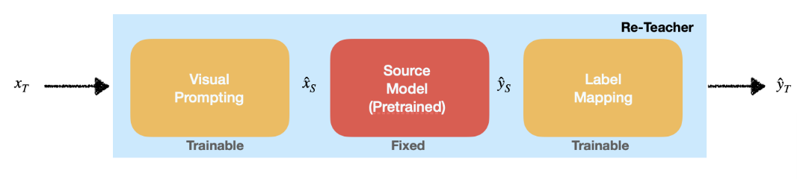
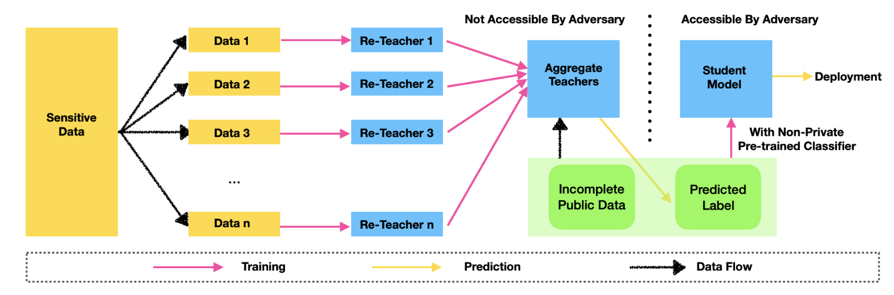
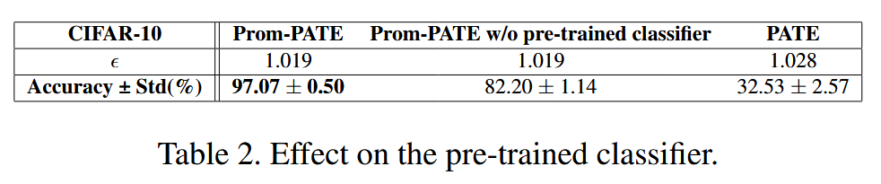
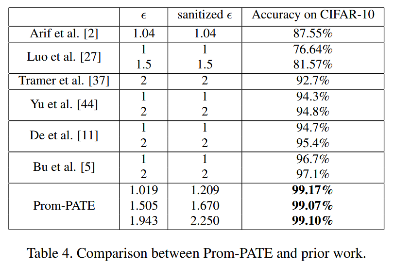
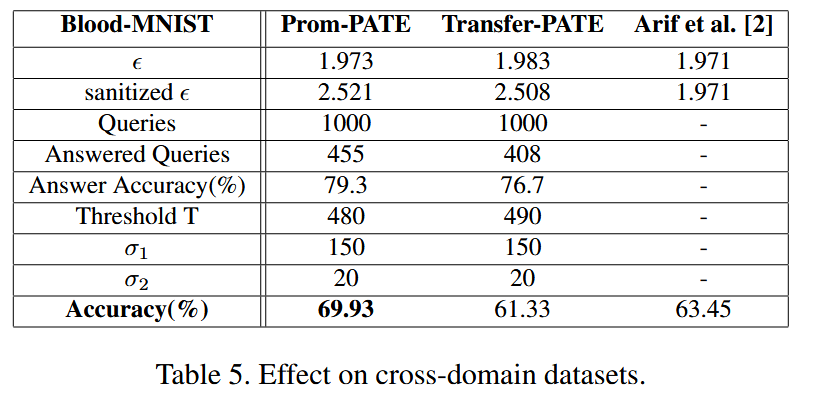

## (ICCV 2023) Exploring the Benefits of Visual Prompting in Differential Privacy

### Visual Prompting, Model Reprogramming (VP/MR), and Private Aggregation of Teacher Ensembles (PATE)

VP was first examined from an adversarial viewpoint, where an attacker can “steal” an ML model’s computation resource to perform another task without the model owner’s consent. It has been shown to outperform linear probing on downstream tasks, with the help of large vision models like CLIP.

In this paper, they combine VP with DP to promote the privacy-accuracy tradeoff in off-the-shelf DP-training mechanisms and propose *Prom-PATE*. The new framework relies on VP to resolve the demand for huge data from PATE, improving practicality and accuracy. In the design, the public pre-trained models are **utilized twice**, significantly growing the accuracy.

In PATE, each teacher model trained on a different slice of the data (through SGD). Then, the non-sensitive samples labeled by the DP noisy votes from teacher models are used to train a student model.

### Main Approach

Challenges:

- PATE is sensitive to data partitioning, and too few examples won't work very well and transfer learning is not efficient in performance:
- How to exploit public datasets and models more times in the design of DP classifiers to benefit accuracy.
  - In this framework, the public data are utilized twice; once in training re-teacher models and another one in training the student classifier.
- The distribution overlap of the training in current research (ImageNet and CIFAR-10) makes the results doubtful.

The steps of Prom-PATE:

1. Train the *re-teacher models* with non-private algorithm.

   

   The visual prompt is expressed as:
   $$
   \hat{x}_s = M \odot w_1 + (1-M)\odot ZeroPad(x_T)
   $$

   - M is a binary mask (same dimension as source images)
   - ω1 contains *trainable* noise parameters
   - ZeroPad(xT) is the target *image* (smaller in dimension) padded to *source* dimensions

   
   $$
   \hat{y}_s = f_s(\theta_S; \hat{x}_S) \\
   \hat{y}_T = softmax(f_\ell(w_2; \hat{y}_S))
   $$
   This step first gets the pre-trained model output, then renders it through the label mapping function that maps the source labels to target labels and obtain the final prediction.

   **Ex.** Imagine you have a small private image (like from CIFAR-10, which is 32×32 pixels) but the pre-trained model expects larger images (like ImageNet images, which are 224×224 pixels). Here's what happens:

   1. The small private image is resized (the paper found 192×192 works best)
   2. The resized image is placed in the middle of a larger blank canvas
   3. The rest of the canvas is filled with "trainable noise" - these are pixels whose values the model will learn to optimize. This is parameterized by `w_1`.

   The pre-trained model was originally trained to recognize things like "dog," "cat," or "car" (ImageNet classes), but our private data might have completely different labels. So we need to translate between them.

   The paper tries two approaches:

   1. **Simple Mapping**: Just decide ahead of time that ImageNet class #7 will mean CIFAR-10 class #2, for example
   2. **Trainable Mapping**: Use a small neural network (one or two layers) to learn the best way to convert between label sets. This is parameterized by `w_2`

   In this step, while private data is accessed, the teacher model is never accessible by the adversary, so **no privacy loss**.

2. Private aggregation with DP noisy top-1 outcome as the label.

   If:
   $$
   \underset{j}{max}\{n_j(x)\} + N(0, \sigma_1^2) \geq T
   $$
   The max label will be output, otherwise output nothing. **This is the only step where privacy loss is incurred**.

3. Train the student model. Certain unlabeled public samples with labels from the DP noisy votes are used to train the student model. **Note that sensitive data is not accessed again in this step**.

### Results

Cross-domain evaluation:

where Transfer-PATE is considered to use the same backbone source model of Prom-PATE and performs partial fine-tuning when training the teacher models.

