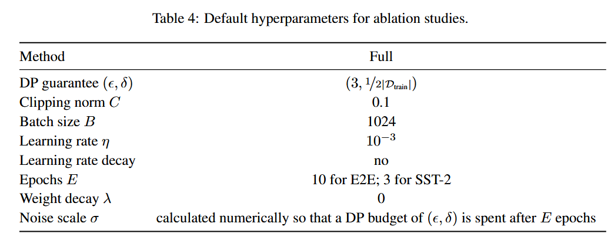
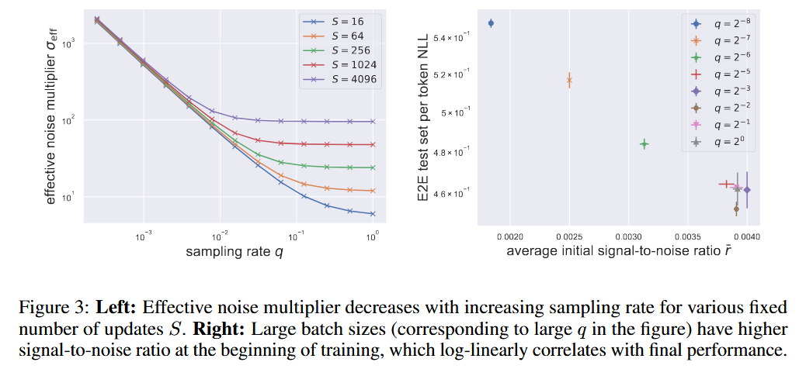
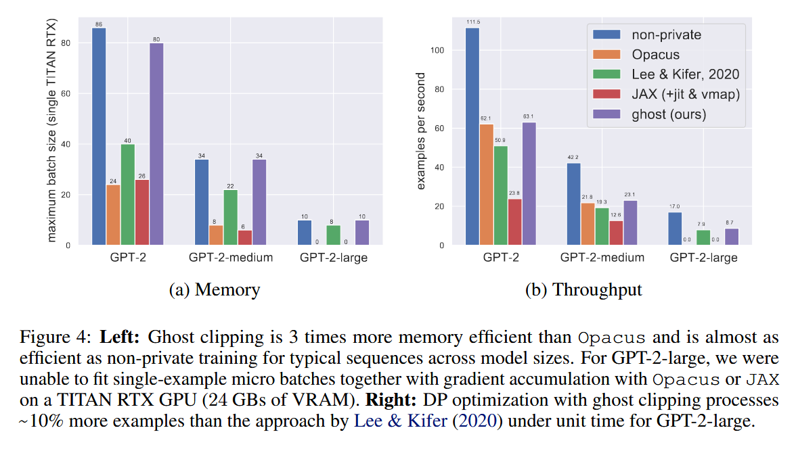
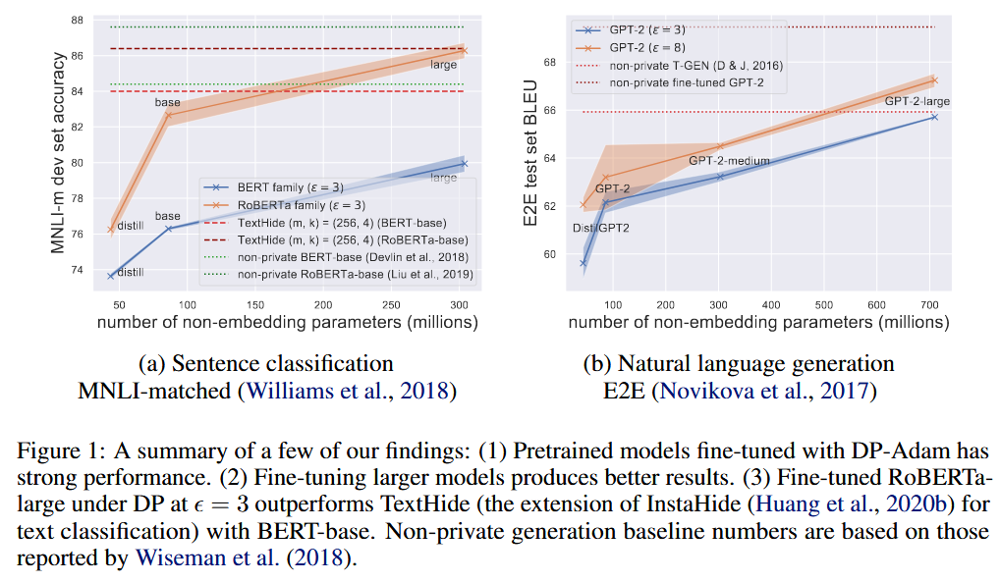

### (ICLR 2022) Large Language Models Can Be Strong Differentially Private Learners

In this paper, they propose three ways to mitigate performance drop introduced by DP-SGD:

- Using large pretrained LM.
- Non-standard hyperparameters that suit DP optimization.
- Fine-tuning objectives that aligned with pretraining procedure.

To address the computational challenge when running DP-SGD with large transformers:

- Memory saving technique that allows clipping in DP-SGD to run without instantiating per-example gradients for any linear layer in the model.

Code: https: //github.com/lxuechen/private-transformers

In particular:

- With appropriate hyperparameters and downstream task objectives, DP-SGD/Adam yields strong performance with  `Ɛ ∈ {3, 8}`.
- They present *ghost clippng* that enables privately fitting large Transformers with almost the same memory cost as non-private training—at the cost of one additional backward pass per processed batch.

For DP, they:

- Track privacy loss through Renyi DP
- Also report the converted Ɛ from a Gaussian DP central limit theorem and from accurately composing tradeoff functions via fast Fourier transform
- They consider  `Ɛ ∈ {3, 8}` and `δ=1 / (2 * |D_train|)`

They consider tasks:

- Sentence Classification with BERT and RoBERTa
- Language Generation: table-to-text generation like E2E, DART; dialogue generation like Persona-Chat. They fine-tune GPT-2 and variants of different sizes.

#### Hyperparameters



When fixing training epochs E:

1. That means we have contraints on compute budget:
   - Constraint on the number of examples processed for gradient updates
   - When E is fixed, larges batchs mean fewer gradient updates
2. They study the joint influence of batch size B and learning rate η by fine-tuning GPT-2 on E2E dataset (table-to-text) with DP-Adam at `Ɛ=3`. They show that large batch size and large learning rate gives higher performance.
3. This implies that naively fine-tuning pretrained language models privately using hyperparameters routinely used for non-private learning would degrade performance by more than necessary.

When fixing update steps S:

1. Large batches implies training for more epochs.

2. They find that larger batch sizes almost always results in better performance at a given privacy budget at the cost of processing more examples with more compute, when fixing other hyperparameters.

3. Note that in DP-SGD/Adam,
   $$
   \bar{g} = \tilde{g} + \bar{z}\\
   \quad \tilde{g} = \frac{1}{B} \sum_{i \in B} \text{Clip}(\nabla \mathcal{L}_i, C)\\
   \quad \bar{z} \sim \mathcal{N}\left(0, C^2 \frac{\sigma^2}{B^2} I_p\right) = \mathcal{N}\left(0, C^2 \frac{\sigma_{\text{eff}}^2}{N^2} I_p\right)\\
   \text{Clip}(v,C) = v \cdot \text{min}(1, C/||v||_2)
   $$
   where `B` is the Poisson-sampled batch of indices, and we define:
   $$
   \sigma_{eff} = \frac{\sigma}{q} = \frac{\sigma N}{B}
   $$
   the *effective noise multiplier* (where `σ` is the noise multiplier determined by privacy budget, number of update steps S, and the sampling rate q).

   With moderately large batches, the signal-to-noise ratio
   $$
   r = \frac{||\tilde{g}||_2}{||\hat{z}||_2}
   $$
   is controlled by the batch size `B`. The numerator concentrates quickly, being an average of bounded vectors, the denomenator decreases as batch size `B` increases.

   > [!NOTE]
   >
   > Why this seems at odds with traditional DP conclusion?
   >
   > Privacy Amplification by Subsampling:
   >
   > - Smaller batch sizes (relative to total dataset size) provide privacy amplification through subsampling
   > - This means that for a fixed noise scale σ, using smaller batches gives better privacy guarantees
   > - Note that, while smaller batches give better privacy amplification, they require more update steps to process the same amount of data
   >
   > In this paper:
   >
   > - Fix the target privacy level `(ε,δ)` first, then determines the required noise multiplier `σ`. When using larger batches, you need a larger `σ` to achieve the same privacy level
   > - But crucially, the effective noise per update (`σ_eff = σ/q` where `q` is sampling rate) actually decreases with larger batches
   >   - Small batch: σ = 1, q = 0.01 → σ_{eff} = 100
   >   - Large batch: σ = 2, q = 0.1 → σ_{eff} = 20
   > - With a fixed privacy budget and training time, larger batches allow:
   >   - Fewer but higher quality updates (better signal-to-noise ratio)
   >   - More epochs of training for the same privacy cost
   >   - Better empirical performance as shown in their experiments: figure below
   > - Crucial insights: when you fix your desired privacy level upfront, **larger batches can use the privacy budget more efficiently**
   >
   > A useful example:
   >
   > - Say you want to train for 10 epochs with batch size 1024
   > - This requires S = 10×N/1024 updates
   > - For the same privacy budget, you could alternatively:
   >   - Use batch size 2048
   >   - Train for 20 epochs
   >   - Still make S = 20×N/2048 = 10×N/1024 updates
   >   - Get the same privacy guarantee because S is unchanged
   >   - But process twice as much data (and more computation, of course)!



Clipping Norm:

- Picking the threshold C much larger than the actual gradient norm implies more noise is being applied than necessary.
- In practice, they find that a <u>small clipping norm</u> which enforces almost all gradients to be clipped throughout training leads to the best performing models.

#### Improving Task Alignment

The fine-tuned models on language generation tasks work well since the pretraining objective and downstream task are aligned, but not for classification tasks.

To eliminate this discrepancy, they propose <u>text infilling</u>:

- For example, for sentiment classification, they reframe the problem as filling in the [MASK] token in the sequence "[INPUT]. It is [MASK]." and compare the probabilities of words awesome and terrible.
- This improves private fine-tuning performance by 3 ∼ 5% across different settings on SST-2.

#### Ghost Clipping

The normal clipping acts like this:

1. Compute 
   $$
   c_i = \text{min}(1,\frac{C}{||\nabla L_i||_2})
   $$
   for the i-th example.

2. Perform normal backward pass with the reweighted scalar loss
   $$
   \sum_i c_i \mathcal{L}_i
   $$

The difficulty is to compute the *per-example gradient norm* in the denominator. The problem is that we may not want to instantiate the full gradient for this example. Lee & Kifer, 2020, proposes to compute this layer-by-layer, avoiding the big tensor.

The <u>embedding layer</u> is essentially a learned lookup table that converts tokens (words or subwords) into dense vectors of continuous values. Each token has a corresponding (learned) vector (typically 256-4096 dimensions). The process can be represented as a matrix of size (vocab_size × embedding_dimension). This can be problematic in terms of memory for Transformers with large embedding layers.

Suppose input `a` (dimension B * T * d)to a linear layer with weights `W` (p * d), and the output is `s` (B * T * d).

```py
# Instead of computing full gradient:
grad = g_i.T @ a_i  # O(Bpd) memory

# Ghost clipping computes norm directly:
norm = vec(a_i @ a_i.T).T @ vec(g_i @ g_i.T)  # O(BT²) memory, where T is sequential length (time steps)
```

For instance, for GPT-2, d ≈ 50, 000 and p = 768 for the embedding layer, and the context window T ≤ 1024, leading to 22x memory reduction.

The paper shows ghost clipping:

- Is 3x more memory efficient than Opacus (a popular DP library)
- Processes ~10% more examples than previous approaches for large models
- Enables training that's almost as memory-efficient as non-private training and is particularly effective for transformer architectures with large embedding layers

Trade-offs:

- Requires one additional backward pass per processed batch
- Specialized for transformers with sequential data
- Most beneficial for layers with large parameter matrices (like embeddings)



#### Results

Relationship Between Model Size and Performance:

- **Larger pretrained models lead to better private fine-tuned performance**, contrary to the common belief that DP learning works poorly with high-dimensional models
- This finding holds across multiple tasks including sentence classification and language generation. The authors tested this with different sizes of GPT-2 for language generation and BERT/RoBERTa models for classification

Full Fine-tuning vs Parameter-Efficient Methods:

- The authors compared full model fine-tuning against methods that update fewer parameters

- For sentence classification (SST-2, QNLI, MNLI, QQP):

  - Full fine-tuning with text infilling objective outperformed state-of-the-art methods like RGP

    > Computationally, while RGP is faster per-update, it requires more than 3 times as many epochs as full fine-tuning—overall, the two methods are comparable in terms of wall time.

  - Using larger pretrained models and text infilling generally improved classification accuracy

- For table-to-text generation (E2E and DART datasets):
  - Full fine-tuning performed comparably to or better than parameter-efficient methods
  - LoRA and full fine-tuning generally showed the best performance
  - Both methods outperformed other approaches like prefix-tuning and RGP

- For dialog generation:

  - Tested on Persona-Chat dataset. Fine-tuned models showed strong performance

  - DialoGPT-medium with ε=8 outperformed the non-private ConvAI2 challenge winner on perplexity

  - Human evaluation showed privately trained models achieved quality scores close to non-private models

#### Scope and Limitations

- They did not study how other factors in training, like weight decay, learning rate schedule, clipping norm schedule, or batch size schedule affect private learning.

- They find that larger pretrained models improves performance.

  

  > This argument, however, is dependent on the particular choice of pretrained models. How pretraining helps private learning and whether better pretrained models for private learning could be built are interesting future avenues.

- One future direction: Scaling Laws for Private Learning.

