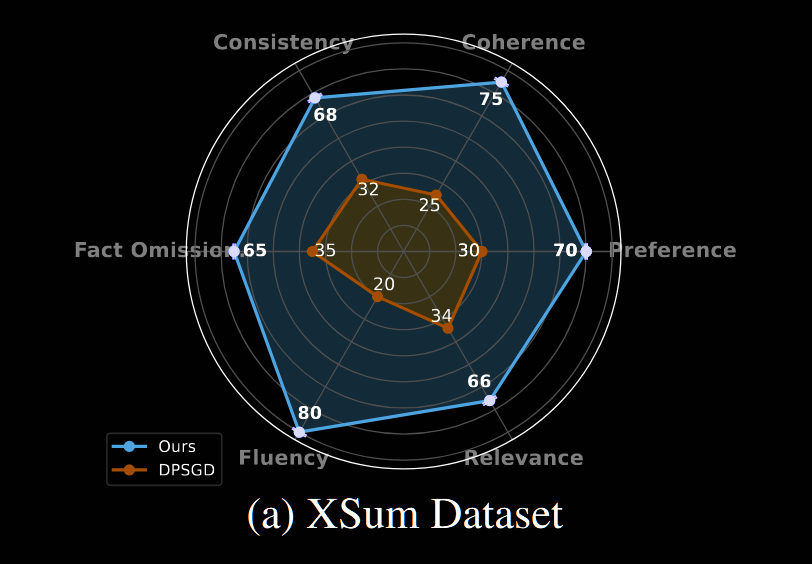
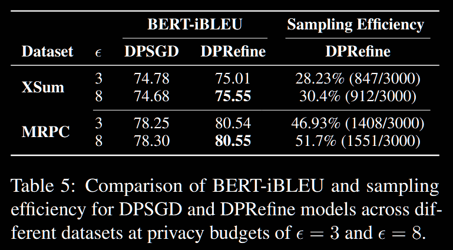

## (NAACL 2025) Differentially Private Learning Needs Better Model Initialization and Self-Distillation

This paper introduces a new DP training recipe for language models called DPRefine. It:

- Use rigorou filtering to get good initialization by eliciting high-quality synthetic data from GPT-2.
- Use DP-GSD to fine-tune.
- Use Self-distillation to refine the resulting model.

They find that DPRefine:

- Achieves significantly better results on domain-specific tasks compared with vanilla DP-SGD.
- Reduces linguistic errors and inconsistencies by a large margin.

### Data Synthesis and Model Initialization

They use a small model (like GPT-2 for general tasks or BioGPT for biomedical tasks) to balance between efficiency and quality. Then they use it to fine-tune a base T5-large.

They begin by generating a context `c` based on a domain-specific prefix ("NYC (Reuters) –" for the news domain), `c` could be `The mayor announced a new climate initiative.` Then multiple completions are generated based on `c`. Those completions are paired up as input and output in a training point.

They generate completions with meaningful logic and high quality using **filters**:

- NLI models to ensure `(x,y)` to have logic entailment `x->y` and `y->x`.
- Length filtering: for summarization, `|y| < |x|` and for paraphrasing, `|x| ≈ |y|`.
- Diversity filtering: remove *pairs* that are too similar to each other.
- Grammar Filtering: using `language-tool-python` library.
- Numerical Consistency: numbers appearing in `x` are consistent with those in `y`.
- Redundancy Filtering: Remove pairs where more than 30% of the tokens in `y` are repeated from `x`.

### DP Task-Specific Fine-Tuning

The post-processing property of DP ensures that any further use of the model fine-tuned using DP-SGD won't further exacerbate privacy loss.

### Self-Distillation Refinement

The model generates new outputs based on the same input contexts and self-corrects using its own predictions. The same filtering criteria are applied to ensure high-quality pairs.

### Evaluation

Dataset:

- Xsum (summarization): 204,045 training samples and 11,334 test samples from BBC articles.
- PubMed (summarization): 119,924 training samples and 6,658 test samples of biomedical research articles with structured abstracts.
- MRPC from GLUE (paraphrasing): 3,668 training samples and 1,725 test samples, human annotations

Non-private baselines:

- Copy-input: replicating the input
- GPT-4: upper bound for performance without privacy constraints
- Directly fine-tune T5-large without DP

Private baseline:

- DP-SGD on T5-large

Results:

- Overall:
  - Evaluated using AlpacaEval with GPT-4 as a judge.
  - DPRefine outperforms DP-SGD on key metrics like relevance, consistency, and coherence, with 78.38% of outputs preferred in human-like evaluations.
  - 
- **Reference-based Evaluation:**
  - Metrics such as ROUGE-L and BERT-F1 are used to measure token overlap and semantic similarity.
  - iBLEU: reward similarity to the reference output while penalize excessive overlap with the input, making it well-suited for paraphrasing tasks.
  - BERT-iBLEU: capture semantic preservation
  - DPRefine shows improvements in metrics like iBLEU and BERT-iBLEU, indicating enhanced semantic preservation over DP-SGD.
- **Diversity Evaluation:**
  - Lexical diversity metrics show that DPRefine achieves better output variation than DP-SGD, particularly on the MRPC dataset.
- **Qualitative Error Analysis:**
  - DPRefine reduces both linguistic errors (e.g., grammar mistakes, incomplete sentences) and inconsistencies (e.g., hallucinations, contradictions) compared to DPSGD.
  - DP-SGD models often struggle with input duplication and spelling errors, which DPRefine mitigates through filtering and self-distillation.
- Ablation:
  - Each phase of DPRefine (synthetic data initialization, DP fine-tuning, and self-distillation) contributes to performance improvements.
  - Removing any phase leads to reduced output quality, confirming the necessity of the full pipeline.
- Privacy-Utility Trade-off: for each ε, they measured the sampling efficiency—defined as the ratio of outputs that passed quality filters—as well as the semantic accuracy. A lower `ε` value introduces more noise, reducing the number of high-quality outputs. At ε = 8, DPRefine not only improves utility but also generates a higher proportion of usable outputs

### Limitations

- Rather high cost for the whole process.
- The effectiveness heavily relies on the quality and diversity of the initial synthetic dataset.
- The method has only been verified on summarization and paraphrasing, and the generalizability is questionable.