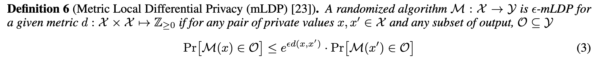
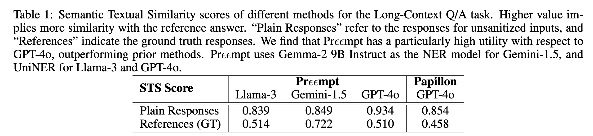

## (NSDI 2026) Preempt: Sanitizing Sensitive Prompts for LLMs

The authors introduce **Preempt**, a client-side system that "sanitizes" prompts before they leave the user's trusted device. Preempt uses a mix of **Format-Preserving Encryption (FPE)** and **Metric Differential Privacy (mDP)** to secure data while ensuring the LLM can still "understand" and process the prompt effectively.

While much research focuses on privacy during LLM *training* (preventing models from memorizing training data), this paper targets **inference-time privacy**.

- **The Risk:** Users often unwittingly send Personally Identifiable Information (PII) like SSNs, financial data, or health details to model owners (e.g., OpenAI, Google) via prompts.
- **The Gap:** Existing solutions are either too <u>destructive</u> to utility (e.g., redacting numbers makes math questions impossible) or too <u>slow</u> (e.g., homomorphic encryption is computationally expensive).

### The Solution: Preempt

Preempt operates as a "Prompt Sanitizer"—a middleware layer between the user and the LLM. It is designed to be **stateless**, meaning it does not need to store sensitive data mappings permanently, which helps with GDPR/CCPA compliance.

They only annotate **tokens with sensitive types**, i.e., all other non-annotated tokens have type ⊥ (which denotes non-sensitive token). Type annotation is **context-dependent**. For example, in ρ1= “My age is 53 years.” and ρ2= “I stay at 53 Broadway Street.” The same token 53 has two different types in the two prompts: type Age and type Street Number.

#### 1. Category I: Format-Dependent Tokens

These are tokens where the LLM only needs to know the *format*, not the actual value, to process the text correctly.

- **Examples:** Social Security Numbers (SSN), Credit Card Numbers, Phone Numbers, Names.
- Technique: Format-Preserving Encryption (FPE).
- **How it works:** An SSN like `055-46-6168` is encrypted into a ciphertext that *looks* like another valid SSN (e.g., `569-83-4469`). This ensures the LLM treats the token correctly (e.g., recognizing it as an ID) without revealing the real data.
  - **The Key:** Because FPE is a deterministic cryptographic scheme, the "sanitized" token is simply a ciphertext.
  - **The Process:** When the LLM returns a response containing the encrypted token, the local Preempt client applies the Decryption algorithm ($D_F$) using the user's local secret key. This mathematically recovers the original value from the ciphertext without ever needing to have stored the original plaintext during the sanitization step.
- Since the de-sanitizer must handle a raw string of text returned by an LLM, it needs to know *which* parts of the response are encrypted and *how*. Preempt handles this using a "Helper String" method:
  - **The Tagging:** During sanitization, it can include structural hints or maintain a specific sequence.
    - Ensure that the mathematical or logical relationships between tokens are preserved, so the LLM doesn't get confused, such as month/year salary, BMI.
      - Handling domain-specific dependencies is more complex. One possible approach is to use a local LLM to infer dependencies between sensitive attributes identified by NER. These dependencies can then be modeled as a directed acyclic graph (DAG), where each node corresponds to a sensitive attribute and edges represent dependencies. The root nodes represent the base sensitive values and are directly noised using mLDP. These values are then propagated along the DAG via the encoded dependencies.
    - Imagine a user prompt: *"My monthly salary is 5,000, so my yearly income is \$60,000."*
    - Pre-processing: The system scans the prompt and detects a relationship: `Token_B = Token_A * 12`.
    - **Tagging ($\Psi$):** The Helper String stores this rule: `Dependencies: {Token_B: (Token_A, "multiply", 12)}`.
    - **Result sent to LLM:** *"My monthly salary is \$5,200, so my yearly income is \$62,400."* They are no longer noised individually!
  - **Algorithm 2 (Desanitization):** The de-sanitizer scans the LLM's output for tokens that match the "sanitized" format. Because the client knows the secret key and the specific formats (e.g., "this 9-digit block is an SSN"), it can identify and attempt to decrypt these blocks on the fly.
    - Original: "My card is `4111-2222-3333-4444`."
    - Sanitization: The system encrypts it to `9876-5432-1098-7654`.
    - De-Sanitization: The system scans the LLM's response using Named Entity Recognition (NER). It "sees" a credit card number (`9876...`). Since it has the secret key, it attempts to decrypt it. If it decrypts successfully to a valid checksum, the original value `4111...` is restored.

#### 2. Category II: Value-Dependent Tokens

These are tokens where the LLM needs to perform operations on the *value* itself (e.g., "Is this salary higher than X?").

- Examples: Age, Salary, Weight, BMI.

- Technique: mLDP

  

- **How it works:** Instead of encrypting the value (which would break math operations), Preempt adds "noise" to the value using a distance metric. For example, a salary of `$60,000` might be perturbed to `$62,400`. The value remains "close" enough to be useful for approximate reasoning but is mathematically distinct enough to satisfy differential privacy guarantees.

Mechanism $M_\epsilon$, which satisfies $\epsilon$-mLDP for the $l_1$ distance, is formally defined in **Algorithm 3** within the Appendix (Section .2).

While it is discussed earlier in Section 4.1.2 to justify the system's privacy approach, the authors provide the exact mathematical construction in the supplemental materials to maintain the flow of the main text.

**Definition of Mechanism $M_\epsilon$ (Algorithm 3)**

The mechanism is a variant of the **exponential mechanism** designed for a given input $x$, a privacy parameter $\epsilon$, and an output domain $[k]$:

1. Probability Distribution: For each possible output $i$ in the domain $[k]$, the mechanism assigns a probability $p_{x,i}$ based on the distance from the original value $x$:

   $$p_{x,i} = \frac{e^{-|x-i|\epsilon/2}}{\sum_{j=1}^{k} e^{-|x-j|\epsilon/2}}$$

2. **Sampling:** The noisy encoding $o$ is then sampled according to this distribution ($o \sim p_x$).

   All tokens of the second category are sanitized individually to satisfy $\frac{ε}{t}$-mLDP using Mε, where ε is the privacy parameter for the standard DP guarantee and **$t$** represents the number of sensitive tokens (of Category II) found in the prompt.

> Imagine a user sets a total budget of **$\epsilon = 1.0$**. The prompt is: *"I am 30 years old and my salary is $\$60,000$."*
>
> 1. **Count $t$:** There are **2** Category II tokens (Age and Salary), so $t=2$.
>
> 2. **Split Budget:** Each token gets a budget of $\epsilon / t = 1.0 / 2 = \mathbf{0.5}$.
>
> 3. **Apply Distance $l$:**
>
>    - **For Age:** The user wants to protect a distance of **1 year** ($l=1$).
>      - $\epsilon'_{age} = 0.5 / 1 = \mathbf{0.5}$
>    - **For Salary:** The user wants to protect a distance of **$\$5,000$** ($l=5000$).
>      - $\epsilon'_{salary} = 0.5 / 5000 = \mathbf{0.0001}$
>
> 4. **Add Noise:** The system uses these $\epsilon'$ values in **Algorithm 3** to sample the noisy values
>
>    - The **Salary** gets much more noise than the **Age** because it has a much smaller $\epsilon'$.
>
>      - **Question:** Can the adversary distinguish it from **$60,001**?
>      - **Distance:** 1 dollar. Distinguishability Ratio: $e^{-(0.0001 \times 1)} \approx \mathbf{0.9999}$
>
>      **Result:** The probabilities are nearly identical (99.99%). The adversary (and the LLM) **cannot** tell the difference. This is good! You don't want the LLM to know your exact salary to the dollar.
>
>      - **Question:** Can the LLM distinguish it from a significantly different salary, like **$100,000**?
>      - **Distance:** 40,000 dollars. **Distinguishability Ratio:** $e^{-(0.0001 \times 40,000)} = e^{-4} \approx \mathbf{0.018}$
>      - **Result:** The probability of generating a noise value near $100,000$ when the input is $60,000$ is only **1.8%** of the probability of generating it near $60,000$.
>      - **Implication:** The mechanism will **rarely** output $100,000$ if the input is $60,000$. The LLM **can** clearly distinguish these two distinct tax brackets. This is tolerated in mLDP.

**Key Properties of $M_\epsilon$**

The paper establishes two properties that make this mechanism suitable for LLM prompts:

- The output is most likely to be the original value itself ($y=x$).

- The probability of mapping to a value $y$ decreases as the distance $|x-y|$ increases.

- Post-processing for better utility:

  > In the prompt *"My age is X, I was born in Y..."*, let's assume `Current Year = 2025`.
  >
  > **Step 1: The Privacy Cost (Touching the Data)**
  >
  > The system looks at the private value **Age ($X$)**. It applies the privacy mechanism (mLDP) to generate a sanitized age, $\hat{X}$ (e.g., 25).
  >
  > - This is the **only** step that incurs privacy loss ($\epsilon$).
  >
  > **Step 2: Post-Processing (Deriving Y)**
  >
  > The system needs a value for `Year-Y`. Instead of looking at the private `Y` (which would cost more budget), it looks at the sanitized `Age-X` (25) and uses a known formula (public knowledge). **Action:** `2025 - 25 = 2000`
  >
  > - This calculation uses **only** the output from Step 1 ($\hat{X}$) and a public constant (2025). It never touches the real private birth year. Therefore, **privacy loss = 0**.
  >
  > **Step 3: Post-Processing (Repetition)**
  >
  > The system needs to fill in the second mention of age. It simply copies $\hat{X}$ (25).
  >
  > - **Action:** `Copy(25)`
  > - Why is this Post-Processing? Copying a sanitized value costs nothing. **Privacy loss = 0**.
  >
  > **With Post-Processing:** You realize $Y$ and the second $X$ are just *functions* of the first $X$. You spend your **entire budget ($\epsilon$ instead of $\epsilon/3$)** on the first $X$.

------

### System Workflow

#### Formalizing Privacy: The Privacy Game

Preempt provides a formal privacy guarantee by defining a **privacy game** ($G_{PS, \mathcal{L}}^{PP}$) between a system and an adversary.

- The Leakage Function ($\mathcal{L}$): This function captures the specific information (like the length or format of a token) that is allowed to "leak" to the untrusted LLM.
- Game Rules: An adversary picks two prompts with the **same leakage**. The system randomly sanitizes one and challenges the adversary to distinguish which one was used.
- Adversarial Advantage: Privacy is formalized by bounding the adversary's "**advantage**," or their ability to guess correctly beyond random chance. Preempt is the first prompt sanitizer to provide such **provable guarantees**.

#### Workflow

The Preempt process follows four steps:

1. **Sanitization:** The user inputs a prompt. Preempt identifies sensitive tokens (using Named Entity Recognition) and transforms them using FPE or mLDP.
2. **Inference:** The sanitized prompt (containing encrypted IDs and noised numbers) is sent to the untrusted LLM.
3. **Response:** The LLM generates a response based on the sanitized data.
4. **Desanitization:** Preempt receives the response and reverses the FPE (decrypting the IDs) to present the final, readable answer to the user.
   - All sensitive tokens of category I can be desanitized using the decryption algorithm of the FPE scheme. However, tokens sanitized with Mε cannot be desanitized without retaining additional state information and are hence, left untouched by default.
   - Prεεmpt will exclusively desanitize tokens that appeared in the prompt. Note that the only thing required to desanitize is the secret key (no other sensitive info, thus stateless)

------

### Experimental Results

The authors evaluated Preempt on four realistic tasks: Translation, Retrieval Augmented Generation (RAG), Long-Context Q/A, and Financial Q/A.

- **Utility Preservation:**

  - **Translation:** BLEU scores for sanitized prompts were nearly identical to unsanitized prompts (e.g., preserving grammatical structure despite encrypted names).

    - *English $\rightarrow$ German:* Plain score **0.287** vs. Preempt score **0.278** (using GPT-4o).
    - *English $\rightarrow$ French:* Plain score **0.432** vs. Preempt score **0.419** (using GPT-4o)4.

    **Insight:** The slight variations were mostly due to the non-deterministic nature of LLMs rather than sanitization failure. The paper notes that even when scores differed slightly, the grammatical structure remained largely intact.

  - **RAG:** Achieved **100% accuracy** on factual retrieval tasks, proving that FPE allows the LLM to correctly match queries to documents even when both are encrypted.

  - **Long-Context Q/A:** Achieved a similarity score of **0.934** compared to unsanitized text, significantly outperforming prior methods.

    **Dataset:** NarrativeQA (summaries of books/movies).

    **Metric:** Semantic Textual Similarity (STS) between the model's answer and the ground truth.

    **Result:** Preempt significantly outperformed baselines where data was left encrypted or irrelevant.

    

- **Comparison to "Papillon":** Preempt outperformed the contemporary "Papillon" framework, which often failed to sanitize effectively or produced irrelevant text.

  - **Preempt:** Successfully identified and sanitized **97%** of unique PII values.
  - Papillon: Only sanitized **71%** of unique PII values due to NER failures or the local LLM "forgetting" to remove them. In the Long-Context task, Papillon leaked character identities in **80%** of prompts.

- **Latency:** The system is efficient and avoids the massive overhead of Secure Multi-Party Computation (MPC) approaches.

#### Impact of Design Choices (Q3)

The authors investigated why Preempt works well by ablating its components.

- **Encryption Format (FPE vs. Others):**
  - Tested on RAG tasks to see if the *format* of the ciphertext matters.
  - Format-Preserving Encryption (Preempt): 100% accuracy.
  - **AES Encryption (Random bytes):** Accuracy dropped to **70.97%**.
  - **Random Substitution (Wrong format):** Accuracy dropped to **77.42%**.
  - *Conclusion:* Preserving the format (e.g., keeping a zip code as 5 digits) is critical for the LLM to process the data correctly.
- **NER Performance:**
  - The authors fine-tuned a **Uni-NER** model which achieved perfect or near-perfect F1 scores (**1.00**) on categories like Age, Date, and Phone Numbers.
  - This fine-tuned model outperformed much larger proprietary models (like GPT-4 and Claude 3 Sonnet) on specific extraction tasks (e.g., GPT-4 only achieved 0.883 on Names vs Uni-NER's 1.00).