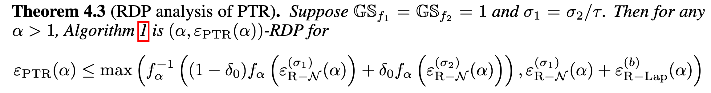
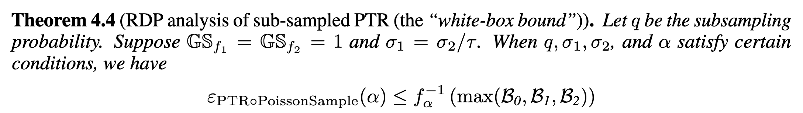
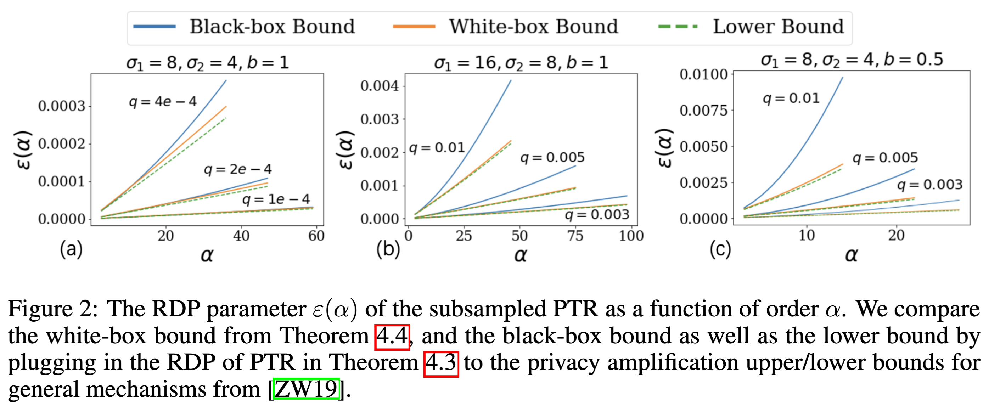
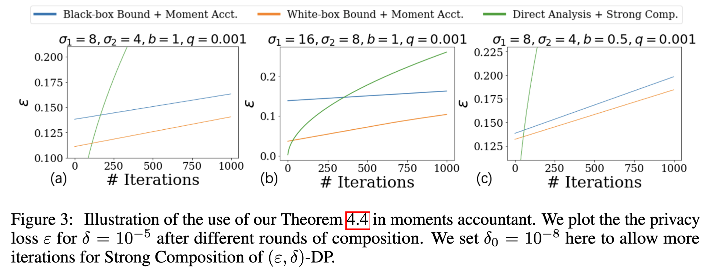
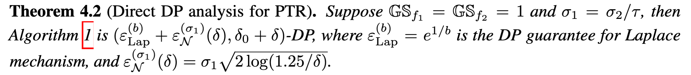
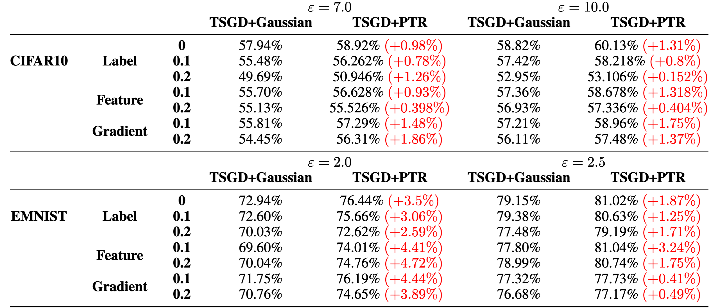

## (NeurIPS 2022) Rényi Differential Privacy of Propose-Test-Release and Applications to Private and Robust Machine Learning

## 1. Problem Setting and Motivation

**Propose-Test-Release (PTR)** is a classic differential privacy (DP) framework introduced to reduce unnecessary noise by exploiting **local sensitivity** rather than **global sensitivity**. It is particularly effective for **robust statistics** (e.g., median, trimmed mean), whose sensitivity is small on most “typical” datasets but large in worst-case scenarios.

Despite being well-known for over a decade, PTR has not been integrated into modern differentially private machine learning, especially **DP-SGD**, for two main reasons:

1. Modern DP training relies on **RDP** and the **moments accountant** to tightly track privacy loss over *many adaptive iterations*. PTR was only analyzed under $(\varepsilon,\delta)$-DP, which composes poorly.
2. DP-SGD critically relies on **subsampling** (mini-batching) to amplify privacy. No tight, PTR-specific subsampled RDP bound previously existed.

------

## 2. Core Contributions

The paper makes four major contributions:

### (1) First RDP Analysis of Propose-Test-Release

The authors derive the **first Rényi DP guarantee for PTR**, assuming bounded global sensitivity of the target function. Crucially, the RDP bound is **strictly tighter** than what one obtains via direct $(\varepsilon,\delta)$-DP analysis.

#### PTR Mechanism

Suppose you have two functions:

- **Target (non-robust) function** $f_1$ (e.g., mean / sum). They do not take into account the **robustness** to outliers (like median or trimmed mean), which might **require more noise** to maintain privacy.
- **Robust function** $f_2$ (e.g., median / trimmed mean / trimmed sum).
- Nose scale between the nosing mechanisms of the two:
  - **$\sigma_1$** is the noise scale used for the **non-robust statistic** $f_1(S)$ (which is released when the test fails). **$\sigma_2$** is the noise scale used for the **robust statistic** $f_2(S)$ (which is released when the test passes).
  - In practice:  **$\sigma_1 = \sigma_2 / \tau$**, $\tau$ is chosen to be a **very small value** (much less than 1) because robust statistics like the median are highly stable. Both scenarios result in the same privacy guarantee because $\sigma_1 / 1 = \sigma_2 / \tau$.

Key quantities:

- **Global sensitivity** (GS):
  $$
  \mathrm{GS}_f=\sup_{d(S,S')=1}\|f(S)-f(S')\|
  $$
  In practice, setting $\text{GS}_f = 1$ is a **normalization** that simplifies the analysis.
  
- **Local sensitivity** (LS) at dataset $S$:
  $$
  \mathrm{LS}_f(S)=\sup_{d(S,S')=1}\|f(S)-f(S')\|
  $$

The whole point is: robust statistics often have **small LS on “typical” datasets**, even if GS is large.

PTR introduces a *local sensitivity test* via a “distance to instability”:

- You choose a proposed local-sensitivity bound $\tau$.

- Define the **safety margin**:
  $$
  \Delta(S)=\min_{\tilde S:\ \mathrm{LS}_{f_2}(\tilde S)>\tau} d(S,\tilde S).
  $$

Interpretation: how many single-record edits you need before $S$ becomes a dataset where $f_2$ would have local sensitivity exceeding $\tau$.

Crucial fact: $\Delta(\cdot)$ has global sensitivity 1 (adjacent datasets change $\Delta$ by at most 1).

**Algorithm 1** is the PTR variant the paper analyzes and uses for ML:

1. Compute $\Delta(S)$ (non-private).

2. Privatize it via Laplace noise:
   $$
   \hat\Delta = \Delta(S) + \mathrm{Lap}(0,b).
   $$

3. Compare $\hat\Delta$ to a threshold $B\triangleq b\log(1/(2\delta_0))$.

   - This threshold is chosen so that $\Pr[\mathrm{Lap}(0,b)>B]=\delta_0$.
   - $\delta_0$ is a parameter specifying the probability of "failure" for the Laplace test.
   - Note that this step also incurs privacy loss.

4. If the test indicates “unsafe,”

   - Output $f_1(S)$ with a **larger** Gaussian noise $\sigma_1$.
   - Else output $f_2(S)$ with a **smaller** Gaussian noise $\sigma_2$.

#### RDP Analysis

RDP at order $\alpha>1$ is:
$$
D_\alpha(M(S)\|M(S'))=\frac{1}{\alpha-1}\log \mathbb E_{o\sim M(S')}\left[\left(\frac{p(o)}{p'(o)}\right)^{\alpha-1}\right]\le \varepsilon(\alpha).
$$
Equivalently, bounding the **Rényi moment**
$$
\mathbb E_\alpha(M(S)\|M(S')) \le \exp((\alpha-1)\varepsilon(\alpha)).
$$
The paper uses exactly this framing and notation $f_\alpha(\varepsilon)=\exp((\alpha-1)\varepsilon)$.

Key compositional advantage:

- RDP composes by **addition** of $\varepsilon(\alpha)$, making it ideal for many adaptive iterations (moments accountant).

As a result, one can compose PTR many times using the **moments accountant** and achieve substantially better privacy–utility trade-offs.

**PTR** can be viewed as:

1. **Mechanism $M_{\text{test}}$** outputs the noisy test statistic $\hat\Delta$.
2. Based on $\hat\Delta$, you choose one of two release mechanisms:
   - $M_{\text{big}}$ (large noise)
   - $M_{\text{small}}$ (small noise)

So PTR is a composed mechanism where the second stage is adaptively selected.

Motivating example: if you randomly pick $M_1$ with prob $1-\delta_0$ and $M_2$ with prob $\delta_0$, then:

- In $(\varepsilon,\delta)$-DP, you typically pay something like $\max(\varepsilon_1,\varepsilon_2)$ (worst-case), or you shove the bad branch into $\delta$.

- In RDP, you can upper bound the moment by a **mixture of moments**:
  $$
  \mathbb E_\alpha(M) \le (1-\delta_0)\,e^{(\alpha-1)\varepsilon_1}+\delta_0\,e^{(\alpha-1)\varepsilon_2}.
  $$

This exact “mixture of exponentiated epsilons” is the key tool the paper highlights for PTR.

Intuition: RDP naturally **discounts** the contribution of the high-loss branch by its probability.

In PTR:

- One branch releases $f_1(S)$ with Gaussian noise $\sigma_1$ (call its RDP $\varepsilon_{N,1}(\alpha)$).
- The other branch releases $f_2(S)$ with Gaussian noise $\sigma_2$ (RDP $\varepsilon_{N,2}(\alpha)$).
- The **test** itself is Laplace on $\Delta(S)$, with RDP $\varepsilon_{\text{Lap}}(\alpha)$.

Recall:

- Gaussian mechanism RDP: $\varepsilon_{R\text{-}N}(\alpha)=\frac{\alpha}{2\tilde\sigma^2}$ with $\tilde\sigma=\sigma/\mathrm{GS}_f$.
- Laplace mechanism RDP formula (1D) in closed form (they provide it).

$\mathrm{GS}_{f_1}=\mathrm{GS}_{f_2}=1$ and $\sigma_1=\sigma_2/\tau$ (a typical calibration when “small noise” is scaled to $\tau$).

Let $M_{\text{PTR}}$ denote the overall mechanism. For adjacent $S,S'$, we want:
$$
\mathbb E_{o\sim M_{\text{PTR}}(S')}\left[\left(\frac{p_S(o)}{p_{S'}(o)}\right)^{\alpha-1}\right]
$$
Because PTR branches, the output distribution is a mixture:

- Outputs from the big-noise Gaussian, plus
- Outputs from the small-noise Gaussian

…and the branch probability itself is affected by the Laplace test.

***A question I have: why doesn't the first term have a account of the Laplace test like the second term?***

At a high level, the bound decomposes into two possible ways to upper bound the RDP:

**Route 1 (Branch-mixture route):**

- Use the mixture inequality idea:
  $$
  \mathbb E_\alpha(M_{\text{PTR}}) \lesssim (1-\delta_0)e^{(\alpha-1)\varepsilon_{N,1}(\alpha)}
  +\delta_0 e^{(\alpha-1)\varepsilon_{N,2}(\alpha)}.
  $$

This corresponds to “averaging” the two release mechanisms’ privacy losses weighted by the probability of taking each branch (where $\delta_0$ is the designed failure probability of the test threshold).

**Route 2 (Naïve composition route):**

- Just compose:
  $$
  \varepsilon_{\text{Lap}}(\alpha)+\varepsilon_{N,1}(\alpha)
  $$

i.e., pay for the Laplace test plus the worst-case release mechanism (often the **big-noise branch**), ignoring the “average-case” advantage.

> Given a function $f$ with **global sensitivity** $GS_f$, the Laplace noise is drawn from a Laplace distribution with mean $0$ and scale parameter $b = GS_f / \varepsilon$. This ensures that the mechanism satisfies **$(\varepsilon, 0)$-DP**.
>
> In RDP:
>
> using the formula for the Laplace mechanism:
> $$
> \varepsilon_{\text{Lap}}(\alpha) = \frac{\alpha}{2\tilde{b}^2},
> $$
> where $\tilde{b} = b / GS_f$ is the **normalized scale** (the ratio of the Laplace scale $b$ to the global sensitivity of the function $GS_f$).

Theorem 4.3:

> The overall RDP is bounded by the **maximum** of these two routes (because different adjacent pairs may make different routes tighter), and then transformed back to $(\varepsilon,\delta)$-DP as needed.

For any $\alpha>1$, Algorithm 1 is $(\alpha,\varepsilon_{\text{PTR}}(\alpha))$-RDP with
$$
\varepsilon_{\text{PTR}}(\alpha)\ \le\ \max\left\{
\frac{1}{\alpha-1}\log\Big((1-\delta_0)e^{(\alpha-1)\varepsilon_{N,1}(\alpha)}+\delta_0 e^{(\alpha-1)\varepsilon_{N,2}(\alpha)}\Big),\ 
\varepsilon_{N,1}(\alpha)+\varepsilon_{\text{Lap}}(\alpha)
\right\}.
$$
A **log-sum-exp mixture term** versus an **additive composition term**, wrapped in a max.

Why the “max” appears:

- Different adjacent datasets can force different worst-case alignments between (i) branch probabilities and (ii) the divergence of the conditional output distributions.
- The bound takes the best of two safe upper bounds, then worst-cases over adjacency (hence max).

> Toy example:
>
> Imagine a scenario where:
>
> - $\delta_0 = 0.01$ (1% chance of triggering the **large-noise branch**).
> - For simplicity, assume the privacy losses of the two branches are:
>   - **Small noise branch** ($M_2$): $\varepsilon_2 = 1$
>   - **Large noise branch** ($M_1$): $\varepsilon_1 = 10$
>   - **Laplace test loss**: $\varepsilon_{\text{Lap}} = 0.5$
>
> Using Route 1 (Average):
>
> The expected privacy loss is:
> $$
> \varepsilon_{\text{average}} = (1 - 0.01) \cdot e^{(0.5)(1 - 1)} + 0.01 \cdot e^{(0.5)(10 - 1)} = 0.99 \cdot 1 + 0.01 \cdot e^{4.5} \approx 0.99 + 0.01 \cdot 90.7 = 0.99 + 0.907 \approx 1.897.
> $$
> Using Route 2 (Worst-Case):
>
> The worst-case privacy loss would simply be:
> $$
> \varepsilon_{\text{worst}} = \varepsilon_1 + \varepsilon_{\text{Lap}} = 10 + 0.5 = 10.5.
> $$

------

### (2) Algorithm-Specific RDP Amplification under Subsampling (White-Box Analysis)

The paper derives a **PTR-specific Poisson subsampling RDP bound**, rather than relying on generic “black-box” amplification theorems.

In SGD:

- **Poisson subsampling** means randomly picking each data point in a batch with probability $q$, i.e., each data point $x_i$ is included in the subsample with probability $q$.
- This randomness reduces the overall privacy loss per batch, as the mechanism is only exposed to a fraction of the data at each step.
- Better yet, when we apply subsampling, the **effective sensitivity** is reduced because we're working with a **smaller subset**.

#### 1. Black-Box Analysis

The black-box approach relies on the current tightest privacy amplification formula for general mechanisms. It takes the RDP of the original PTR mechanism as a given constant $\varepsilon_{\alpha}$ and applies a transformation:

$$D_{\alpha}(\text{PoissonSample}(\mathcal{M}, q, S) || \text{PoissonSample}(\mathcal{M}, q, S'))$$

This formulation is limited because it must assume the worst-case privacy loss occurs across the entire distribution, leading to the "blue curve" gaps seen in the paper's benchmarks (later).

#### 2. White-Box Formulation (Theorem 4.4)

The white-box formulation is defined by the maximum of three distinct "bottleneck" terms that represent the different internal paths of the PTR algorithm:

**Term $\mathcal{B}_0$: The Release Path**

This term handles the Gaussian noise added during the release of either $f_1$ or $f_2$:

$$\mathcal{B}_{0}=1+2q^{2}\alpha(\alpha-1)\left(\frac{1-\delta_{0}}{\sigma_{1}^{2}}+\frac{\delta_{0}}{\sigma_{2}^{2}}\right)$$

- It explicitly weights the noise variances by the probability of failing ($\delta_0$) or passing ($1-\delta_0$) the test.
- The $q^2$ scaling demonstrates the "amplification" effect on the Gaussian components.

**Terms $\mathcal{B}_1$ and $\mathcal{B}_2$: The Test Path**

These terms handle the Laplace mechanism used in the "Test" step:

- **$\mathcal{B}_1$** involves $R_{q}^{(\alpha)}$, the divergence between the baseline Laplace distribution and the subsampled mixture.
- **$\mathcal{B}_2$** involves $\tilde{R}_{q}^{(\alpha)}$, which is the divergence in the opposite direction.
- These are computed via numerical integration of the Laplace density functions $\mu_0$ and $\mu$.
- The distribution of PTR’s output may not be centrally symmetric, thus we need to bound both.

**Max, not sum**:

- **Black-box view (Sum):** Would assume you leak privacy from the test AND the release as if they were unrelated secrets.
- **White-box view (Max):** Recognizes that the "release" is conditional on the "test". The RDP analysis calculates the total divergence of the *entire* integrated process.
- If the release is very noisy ($\mathcal{B}_0$ is small), then the test ($\mathcal{B}_1$ or $\mathcal{B}_2$) becomes the primary source of leakage. If the test is very "safe" but the release uses small noise, the release ($\mathcal{B}_0$) becomes the bottleneck.
- **Crucially:** The mathematical derivation relies on the **quasi-convexity of Rényi divergence**. The authors show that the total privacy loss of the mechanism is bounded by the "most difficult" part of the distribution to privatize. You are not leaking these two things as independent secrets; they are two parts of one single response.

#### Why the White-Box Bound Wins

The "White-box" derivation is superior because it addresses two specific challenges that the black-box approach ignores:

1. **Asymmetry:** PTR output distributions are not always centrally symmetric, so the white-box bound explicitly checks both divergence directions ($\mathcal{B}_1$ and $\mathcal{B}_2$).
2. **Conditionality:** It recognizes that the output distribution $\mathcal{M}$ given the noisy safety margin $\hat{\Delta}$ cannot be decomposed into simple independent parts. By tackling these directly, the authors achieve the "orange curve" in Figure 2, which stays much lower than the "blue" black-box curve as the privacy order $\alpha$ increases.

> Toy Example:
>
> Let's assume the following values for the analysis:
>
> - **$\sigma_1 = 8$ (Fallback):** Results in a very small RDP of $\varepsilon_{\text{R-N}}^{(\sigma_1)}(2) = \frac{2}{2(8^2)} = \mathbf{0.0156}$.
> - **$\sigma_2 = 4$ (Robust):** Results in a higher RDP of $\varepsilon_{\text{R-N}}^{(\sigma_2)}(2) = \frac{2}{2(4^2)} = \mathbf{0.0625}$.
> - **$\delta_0 = 10^{-6}$:** The probability of failing the safety test is kept very small.
> - Subsampling $q = 0.01$: We use 1% of the data.
> - **Order $\alpha = 2$:** We'll look at the Rényi divergence of order 2.
>
> Now, let’s compute the **RDP** for both black-box and white-box approaches.
>
> ##### **Black-Box Bound**:
>
> Step A (Find Total $\varepsilon$): Before subsampling, the total cost is roughly the sum of the test and the worst-case release. Let's assume $\varepsilon_{\text{PTR}}(2) \approx \mathbf{0.1}$.
>
> Step B (Apply Generic Amplification): Using a standard black-box approximation for small $q$, $\varepsilon_{sub} \approx q^2 \cdot \varepsilon$.
>
> Result: $\varepsilon_{\text{RDP}}^{\text{black-box}}(2) \approx (0.01)^2 \times 0.1 = \mathbf{0.00001}$ (for a single aggregation step in, for example, FL).
>
> **White-Box Bound (Theorem 4.4)** The white-box bound is "tighter" because it applies the $q$ scaling to the individual noise components *inside* the mechanism rather than the final sum.
>
> - **Step A (Component Analysis):** We calculate $\mathcal{B}_0$ specifically for the Gaussian releases:
>
>   $$\mathcal{B}_0 \approx 1 + 2q^2\alpha(\alpha-1)\left(\frac{1-\delta_0}{\sigma_1^2} + \frac{\delta_0}{\sigma_2^2}\right)$$
>
>   $$\mathcal{B}_0 \approx 1 + 2(0.01)^2(2)(1)\left(\frac{1}{64} + \frac{10^{-6}}{16}\right) \approx 1 + 0.0004(0.0156) \approx \mathbf{1.00000624}$$
>
> - **Step B (Convert back to $\varepsilon$):** Using $f_\alpha^{-1}(B) = \frac{\ln(B)}{\alpha-1}$:
>
>   $$\varepsilon_{\text{PTR}}^{\text{white-box}}(2) \approx \ln(1.00000624) / 1 \approx \mathbf{0.00000624}$$ ) (37% tighter)

------

### (3) Application: Differentially Private & Byzantine-Robust SGD

The theoretical results are applied to **robust SGD under Byzantine attacks**, where a fraction of gradients may be arbitrarily corrupted.

Key design:

- Use **trimmed-sum / trimmed-mean** as the robust aggregator
- Wrap it with **PTR**:
  - If gradients are well-behaved → release robust aggregate with **small noise**
  - If gradients are suspicious → fall back to standard aggregation with **larger noise**

Figure 3 illustrates the growth of the privacy loss parameter $\epsilon$ (on the y-axis) as a function of the number of training iterations (on the x-axis).

- **Direct Analysis + Strong Composition (Green/Grey line):** This uses the standard $(\epsilon, \delta)$-DP analysis (Theorem 4.2) and adds up the privacy loss using the Strong Composition theorem. As you can see in the graphs, this line is very steep, meaning the privacy budget is exhausted very quickly.

  

- **Black-box Bound + Moment Accountant (Blue line):** This takes the "holistic" RDP bound for the PTR mechanism and applies the Moments Accountant. It grows much more slowly than the direct composition, but it is still "looser" (higher $\epsilon$) than the white-box approach.

- **White-box Bound + Moment Accountant (Orange line):** This uses the paper's specific subsampled RDP bound (Theorem 4.4). This line is the lowest across almost all iterations, proving that the white-box analysis allows for the most training iterations for the same privacy "cost".

------

*"We set $\delta_0 = 10^{-8}$ here to allow more iterations for Strong Composition of $(\epsilon, \delta)$-DP"*:

- In the PTR framework, $\delta_0$ is the failure probability of the safety test—the chance that the algorithm might accidentally release the robust statistic when the sensitivity is actually high.
- Under standard $(\epsilon, \delta)$-DP composition, the total "failure probability" (the $\delta$ term) of the entire training process is roughly the sum of the failure probabilities of every single step.
- If you have 1,000 iterations and $\delta_0$ is too large (e.g., $10^{-5}$), the total $\delta$ would quickly become $10^{-2}$, which is far too high for a meaningful privacy guarantee. With $10^{-8}$  the authors ensure that even after 1,000 iterations, the total accumulated $\delta$ is still small enough to meet the target $\delta$ (usually $10^{-5}$).

- **The Trade-off:** While a smaller $\delta_0$ makes the "Direct Analysis" line look better for more iterations, it actually makes the privacy loss ($\epsilon$) for a *single* iteration higher.
  - The threshold is defined as $\log(1/(2\delta_0))b$.
  - As you make $\delta_0$ smaller (more stringent), the value of $1/\delta_0$ grows, which in turn increases the **threshold** that the noisy safety margin $\hat{\Delta}$ must cross.
  - This means the algorithm becomes more "conservative" and is more likely to reject the robust statistic ($f_2$) and fall back to the target function ($f_1$) even if the actual data is relatively clean.
  - When you demand a smaller failure probability $\delta_0$, you are essentially requiring a more "certain" test, which increases the privacy cost of Laplace test. [**Direct DP Cost:** In the direct analysis, the privacy cost is $(\epsilon_{Lap}^{(b)}+\epsilon_{N}^{(\sigma_{1})}(\delta))$.]
- It allows the **Strong Composition** baseline (which sums up $\delta$ values) to "survive" for 1,000 iterations without hitting the total $\delta$ limit. Even with this favorable setup for the baseline, the White-box Moment Accountant approach still significantly outperforms it as training continues.

----

The evaluation focused on the utility-privacy tradeoff under three types of adversarial corruption:

- **Label Corruption:** Randomly flipping the labels of a specified percentage of data points.
- **Feature Corruption:** Adding high-magnitude Gaussian noise ($\mathcal{N}(0, 100)$) directly to input images.

- **Gradient Corruption:** Adding Gaussian noise ($\mathcal{N}(0, 100)$) to the true gradients during the communication phase.
- Datasets & Models: Experiments were conducted on MNIST, CIFAR10, and EMNIST datasets.
- Parameters: Every statistic was averaged over 5 runs with different random seeds.

Across all tested datasets and corruption models:

- PTR-based private robust SGD consistently outperforms Gaussian-baseline methods
- Gains are especially pronounced at moderate privacy budgets
- Improvements persist even when corruption ratio increases

This empirically validates the paper’s central thesis:

> Paying a small, fixed privacy cost for *testing* enables much lower noise during *release*, yielding better overall utility.

------

## 5. Limitations

The authors explicitly note a limitation:

- PTR is **not effective for coordinate-wise median in high dimensions**
- This is due to extremely large global sensitivity, which overwhelms the benefit of local sensitivity

Thus, PTR is best suited for:

- Norm-based robust aggregators
- Settings where “typical” sensitivity is much smaller than worst-case sensitivity