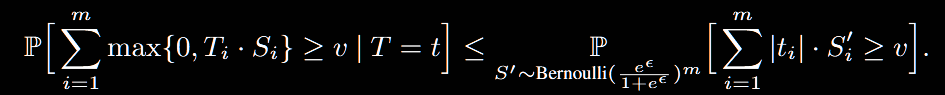
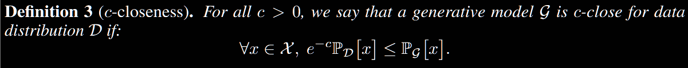
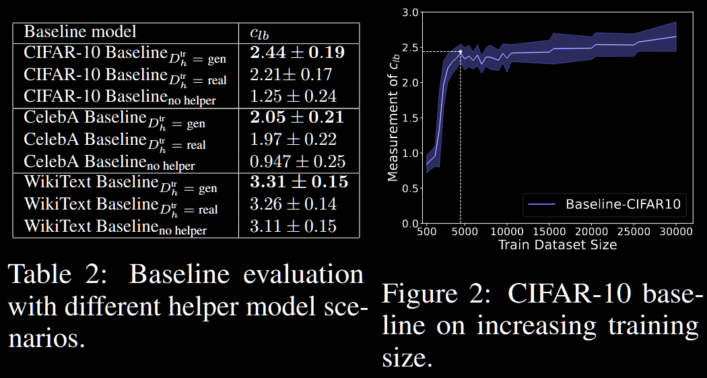
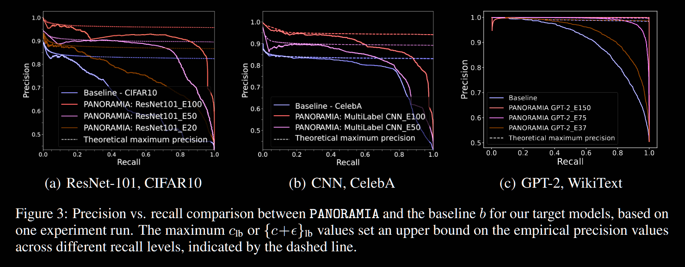
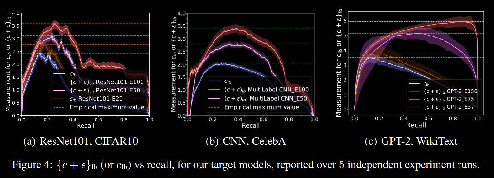
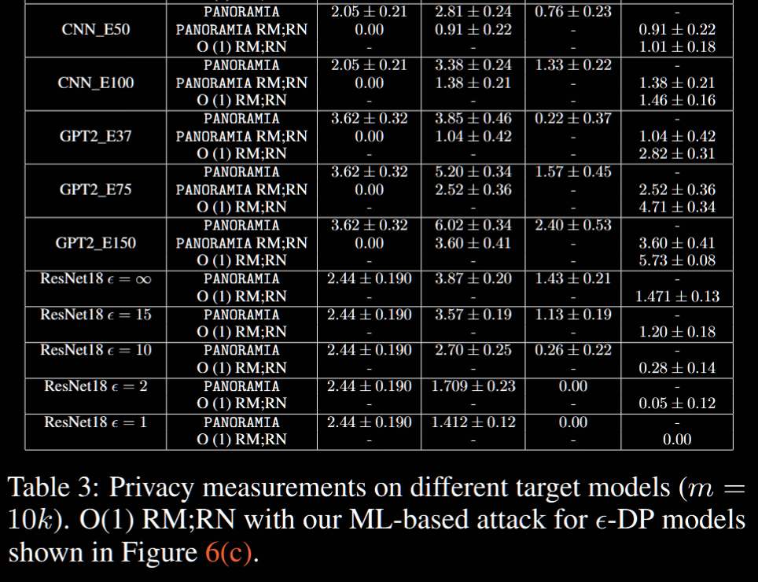
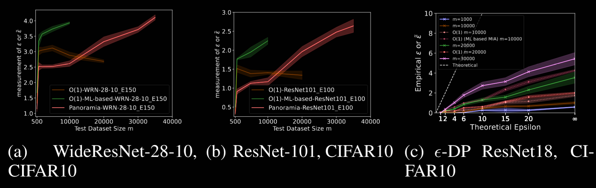

## (NeurIPS 2024) PANORAMIA: Privacy Auditing of Machine Learning Models without Retraining

They introduce PANORAMIA, which works by generating data as non-members and performs MIA. It only requires a subset of the training data, and works across image, tabular, and text models.

- Traditional DP auditing: computational prohibitive, retraining many times
- O(1) auditing by Steinke et al., 2023: several challenges though very fast
  - Craft easy-to-detect canaries
  - Cannot measure the leakage of actual examples by contributors
  - Not a worst-case data point
  - Relies on the withdrawal of real data to construct non-member in-distribution data
- Can we perform *post-hoc* estimation with regards to a *known member subset* of the training dataset of the given model?

PANORAMIA:

- Use generative model to synthesize in-distribution non-members.
- Estimate the privacy loss of the target model on the known member subset (**though not a lower bound**).
- Does not require retraining (not auditing the training *algorithm*, but the *end-model*) and only requires partial knowledge of the training set.

Theoretical basis:

- Previous works: one repeats the process of training model `f` with and without `x` in the training set, and uses a MIA to guess whether x was included. If the MIA has `TPR > e^ε FPR`, then the algorithm is not `ε`-DP.

- O(1): an audit (MIA) `T` that can guess membership of `m` data points better than a Bernoulli random variable with probability `\frac{e^ε}{1+e^ε}` refutes `ε`-DP. In other words, for ε-DP model, the performance of `T` is bounded by:

  

  The RHS denotes a random Bernoulli process where each point is independently labeled as a member with probability `\frac{e^ε}{1+e^ε}`. If the auditor `T` can do better than this process, then the privacy guarantee is broken.

  - In practice, `v` is set based on the desired level of significance, for example `β=0.05` for 95% confidence level, then
    $$
    \mathbb{P}_{S'}\left[ \sum_{i=1}^{m} t_i \cdot S'_i \geq v \right] \leq \beta.
    $$

### PANORAMIA Framework

Setting:

- Target model `f`. A subset of its training data `D_f` (e.g. one participant of FL) from distribution `D`.
- PANORAMIA requires a subset of `D_f`, say `D_G`, to train the generative model. `D_in = D_f - D_G` and `D_out` is sampled from the generative model. 
- To ensure that there is no information about membership in `x` itself, but in the behavior of `f` on the input `x`, they use a baseline classifier `b` to predict membership only on `x` and remove the effect of synthesized data detection.

Quantifying Privacy Leakage:

- **Privacy game**: Pair each known members with generated non-members. Flip a coin to decide which of them is shown to the auditor to decide.

- The quality of the generator is quantified by:

  

  The smaller `c`, the better the generator. The generator G is guaranteed not to assign a probability to real data that is too small compared with that they are in real distribution. Just like approximate DP, this can also be relaxed to hold for *high* probability.

  Note that this definition, contrary to DP, is asymetric and only dictates that `G` must produce high-quality samples that resemble distribution `D` to pair up with training samples `x`, but doesn't guarantee that all generated samples are high-quality.

- They then formulate such a hypothesis test on the previously mentioned privacy game:

  > H : generator G is c-close, and target model f is ε-DP.

  This hypothesis can be broken down into two parts:

  1. If `G` is c-close: then the probability of making correct membership guesses using the baseline classifier `b` is bounded by the performance of a Bernoulli random variable with probability `\frac{e^c}{1+e^c}`

  2. If `G` is c-close and `f` is `ε`-DP: the probability of making correct membership guesses using the MIA is bounded by the performance of a Bernoulli with probability: `\frac{e^{c+ε}}{1+e^{c+ε}}`.

     > Why this `(1+x)/x` form?
     >
     > What we are considering is: what is the probability of the sample being a member, given its likelihood under both distributions?
     >
     > According to Bayes' Rule:
     > $$
     > P(member|x) = \frac{P(x|member)\cdot P(member)}{P(x)}
     > $$
     > As we have half-half division of members and non-members in this framework:
     > $$
     > P(x) = 0.5 P_D[x] + 0.5 P_G[x]
     > $$
     > Since we have in c-closeness condition that
     > $$
     > \frac{P_D[x]}{P_G[x]}\leq e^c
     > $$
     > This quantifies how `x` itself leaks membership information. Similarly, the DP-trained `f` model also leaks membership info as:
     > $$
     > \frac{P[f(D)]}{P[f(D')]} \leq e^{\epsilon}
     > $$
     > Combine these two effects together, the total likelihood ratio of observing the sample `x`  when it's predicted member/non-member in MIA is given by (considering they are dependent):
     > $$
     > \frac{P_D[x]}{P_G[x]} \cdot \frac{P[f(D)]}{P[f(D')]} \leq e^{c+\epsilon}
     > $$
     > In a slight abuse of notation, we rewrite it as:
     > $$
     > \frac{P_D[x]}{P_G[x]}\leq e^{c+\epsilon}
     > $$
     > The final `e^{c+ϵ}` reflects within the scope of our definition, how likely can an example be in the distribution `D` compared with it being generated. We take the worst case, where both stage leaks the most information.
     >
     > Thus,
     > $$
     > P(x) = 0.5 [P_D[x] + P_G[x]]\\
     > = 0.5 \left( P_D[x] + \frac{P_D[x]}{e^{c+\epsilon}}  \right)\\
     > = 0.5 \cdot P_D[x] \cdot \left( 1+\frac{1}{e^{c+\epsilon}}\right)
     > $$
     > So, with Bayes' Rule:
     > $$
     > P(member|x) = \frac{P_D[x] \cdot 0.5}{0.5 \cdot P_D[x] \cdot \left( 1+\frac{1}{e^{c+\epsilon}}\right)}\\
     > = \frac{e^{c+\epsilon}}{1+e^{c+\epsilon}}
     > $$
     > And this performance is the worst-case bound (most exploitable for the attackers). In the context of MIA, `P(member|x) `is the probability that an attacker **guesses correctly** that `x` is a member of the training dataset. For example, if the generative model is not working well (large `c`) and a leaky model (large `ϵ`), the best attacker can achieve would be very close to 1 as `e^{c+ϵ}` increases. When it approximates `0.5`, this means the generative model is good and the target model doesn't leak much information.

  One key fact about this framework, and about why the auditing doesn't **necessarily provide a lower bound as typical auditing works:**

  - They first quantify `c_lb`, the quality of the generative model
  - Then `(c+ϵ)_lb`, the lower bound of the combined privacy loss from both generative model and the target model
  - The different is a *effective* privacy leakage of the target model, but it's neither an upper bound nor a lower bound.

  Back to the two parts of this proposition. Rejecting the hypothesis `H` requires either rejecting:

  - the claim about c, or 
  - the claim about c + ε

  Therefore, they:

  - need to, for a given confidence level 1 − β, compute the largest value for (c, ε) that it cannot reject

  - train a best-effort classifier `b` that only utilizes the features of `x` and reject all `c` that are too small:
    $$
    c \geq log(\frac{1+b_{success}}{b_{success}}) \\
    c_{lb} = log(\frac{1+b_{success}}{b_{success}})
    $$

  - similarly, train an MIA classifier `A` on both members/non-members with access to the target model `f`, and derive:
    $$
    (c+\epsilon)_{lb} = \log(\frac{1+A_{success}}{A_{success}})
    $$
    Where `A_success` denotes the times where `A` wins the privacy game.

  - the closest empirical `ϵ`:
    $$
    \epsiloñ = \max\{0, \{c + \epsilon\}_{\text{lb}} - c_{\text{lb}}\}
    $$

  They believe this is useful as a quantitative privacy measurement, and accurate (lower bound) when the baseline performs well (and hence `c_lb` is tight).

### Evaluation

They test on a wide array of models trained with Opacus:

- Image classification: CNN (ResNet, WideResNet), ViT-small
- Language models: small GPT-2 fine-tuned on a subset of WikiText-103
- Tabular data classification: PANORAMIA doesn't detect any meaningful leakage (inconclusive because of large variance)

MIA design:

- Loss-based MIA: Takes as input the datapoint `x`, the loss of `f` on `x`. They use MLP.

- Baseline: train a helper model `h` on synthetic (non-member) data to mimic the targe model `f`. The loss predicted by `h` on `x` is added to the classifier `b` as an additional feature. Now `b` can decide based on both raw `x` and the loss of `h` on `x`, which can be viewed as side information about the data distribution. The helper model has the same classification task and architecture as the target model.

  

- Then they run PANORAMIA on models trained with different degrees of overfitting.

If the MIA significantly outperforms the baseline in precision and recall, the difference is attributed to the target model’s leakage (ϵ).

Figure 3 shows the precision of b and PANORAMIA at different levels of recall, and Figure 4 the corresponding value of `{c + ε}_lb` (or `c_lb` for `b`).

In Table 3, each column is: Target model, Audit (RM;RN means access to both Real Members and Real Non-members), `c_lb`, `{c+ε}_lb`, `\hat{ε}` by PANORAMIA, and `ε` from `O(1)`.

Note that they also test a mixture of O(1) and PANORAMIA, which use real non-member data instead of generated data for training, this is expected to yield better results than vanilla PARNORAMIA.

As shown in the table, O(1) tends to perform better, due to its ability to rely on non-member detection, which improves the power of the statistical test at equal data sizes. The values of ε ̃ measured by PANORAMIA are close, and they believe that it's able to detect meaningful amounts of privacy loss, even comparable to that of state-of-the-art methods.

PANORAMIA can leverage much more data for its measurement (up to the whole training set size for training and testing the MIA), while O(1) is limited by the size of the test set (for non-members). Specifically:

- Improve the quality of synthetic non-member generator
- Reduces overfitting of the classifiers `b` and the MIA

As shown in the figure above, scaling works well for image classification, but they fail to replicate this effect in GPT-2.

### Conclusion

- Useful in settings in which individual data contributors (such as a hospital in a cross-site FL setting or a user of a text auto-complete service) measure the leakage of their own, known partial training data in the final trained model. No new attack capabilities.
- Major limitation: not a lower-bound privacy loss. To get there, a promising future work is devise a way to measure or enforce an upper-bound on `c`, such that we have a lower bound `{c+ε}_lb - c_ub`.