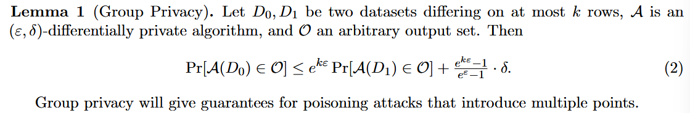
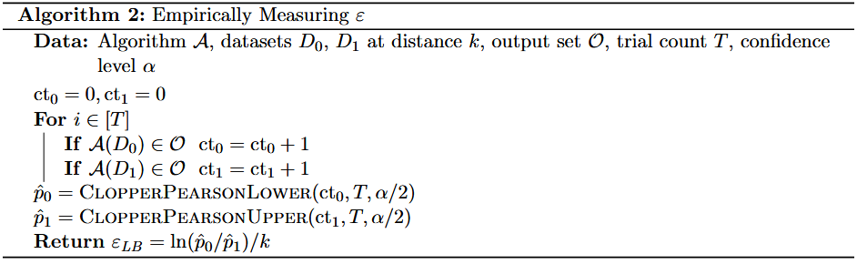
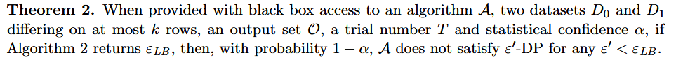
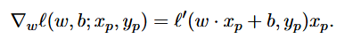
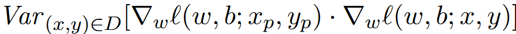
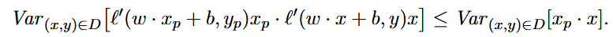
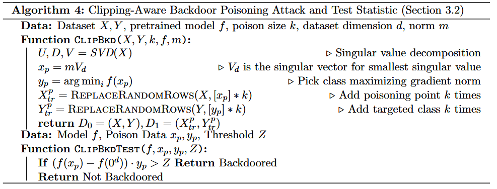
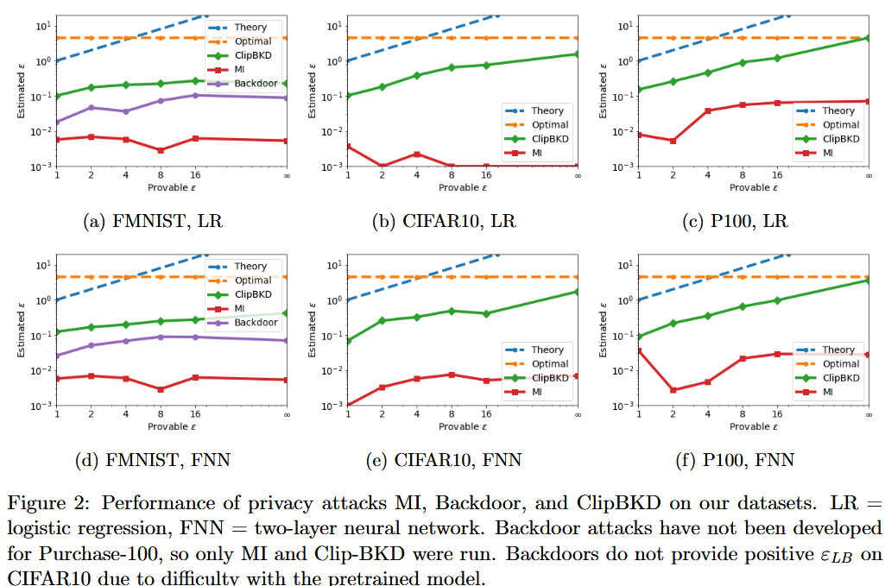

### (NeurlPS 2020) Auditing Differentially Private Machine Learning:  How Private is Private SGD?

A differentially private training algorithm ensures that, for any set of training sets, no attacker, no matter how powerful, can learn much more information about a single training example than they could have learned had that example been excluded from the training data.

As the amount of information is quantified by a <u>privacy parameter ε</u>, relatively large parameters like `ε=2` are not uncommon. However, there is often a gap between the strong formal protections promised by differential privacy and the specific quantitative implications of the choice of ε in practice.

- `ε` is a parameter that has to be determined by careful analysis, and often existing theoretical analysis is not tight. Works like Abadi et al., 2016 and follow-up papers were dedicated to giving more refined privacy analysis, especially DP-SGD.
- DP is a worst case notion, and in reality the privacy guarantees may be stronger depending on datasets and attackers. Although it is plausible that differentially private algorithms with large values of ε provide strong privacy in practice, it is far from certain.

This paper, therefore, tries to understand whether DP-SGD does give better privacy in practice than theoretical analysis. They achieve this by <u>data poisoning attacks</u>.

- They start with a dataset D of interest, and the training algorithm A (e.g. DP-SGD w/ a specific setting of hyperparameters)
- Create a poisoning set S of k points, a binary classifier T s.t. T distinguishes distribution A(D) from A(D ∪ S) with significant advantage.
- If A were ε-DP, then T could have accuracy at most `exp(εk)/(1 + exp(εk))`, so estimating the accuracy of T allows for inferring a lower bound on ε.
- During their evaluations, some setups give lower bounds on ε that are approximately 10x better than previous methods, and only 10x from the worst case (upper bound).
  - They argue that existing poisoning attacks and MIA have *poor or trivial* performance against no only DP-SGD, but even other SGD with gradient clipping. Note that while important, clipping itself doesn't provide any formal privacy guarantee.
  - They develop a more robust data poisoning attack against gradient clipping and, more generally, DP-SGD.

Intuitively, poisoning attacks will push the gradients and change the model to a certain direction. Existing works push towards random directions and thus requires large shifting to enable distinguishability. They also try to induce large gradients, which may be sensitive to gradient clipping.

However, this paper proposes to find the direction where the model parameters have the lowest variance, and select poisoning points that modify the model in that direction. Therefore, they achieve the same effects with poisoning points of smaller gradients, which are less sensitive to clipping.

In conclusion, this work contributes in terms of:

- By advancing attack techniques, we can either demontrate that an algorithm might not be sufficiently private, so gain certain confidence that it might be sufficiently private.
- Establish stronger lower bounds on ε.
- Explore the effects of certain algorithms, datasets, hyperparameters on the privacy.

#### Measuring DP

Group Privacy in DP:

They first give the discussion for the case where δ=0. Given training algorithm A, they construct `D_0` and `D_1` that differ on k rows. 

From (2), by estimating the quantities `p_0 = Pr[A(D_0) ∈ O]` and `p_1 = Pr[A(D_1) ∈ O]`, we can compute the largest `ε_{LB}` s.t. (2) holds. When `δ=0`, `ε_{LB}=ln(p_0/p_1)/k`.

To make the estimation more accurate, they use Monte Carlo estimation by training `T` times and correct statistical uncertainty with Clopper Pearson confidence intervals.

By taking larger T, we can gradually move out confidence towards 1. We'll see what deos it mean by `A(D) ∈ O`: it means the model trained on dataset D has a loss on poisoned points exceeding threshold Z, which means the model is backdoored.

The Clopper-Pearson interval provides confidence bounds for binomial probability:

- For ct₀/T successes, it gives a lower bound we can be (1-α/2) confident that the true probability exceeds
- For ct₁/T successes, it gives an upper bound we can be (1-α/2) confident that the true probability is below

Suppose `T=500, α=0.01`, the best performance means we get perfect inference accuracy and `k=1`, then `ct_0=500, ct_1=0`. The Clopper Pearson confidence interval produces `pˆ_0 = 0.989, pˆ_1 = 0.011`, which gives `ε_{LB} = 4.54/k = 4.54`. With 99% probability, the true `ε` is at least 4.54.

#### Poisoning Attacks

They focus on <u>backdoor attack</u>. The poisoning attack takes natural data (x, y), perturbs the image to `Pert(x)` (which might be a pattern in the corner of the image), and changes the class to some `y_p`.

With clipping in the DP-SGD, vanilla poisoning attacks can only achieve a weak lower bound `0.11` on Fashion-MNIST without even adding the noise.

The gradient of model parameters `w` w.r.t. to poisoning point `(x_p, y_p)` is

Vanilla attack might try to maximize `|l′(w·x_p+b, y_p)|` to minimize poisoning points, but clipping breaks this relationship. We should come up with ones that have *distinguishable* gradients. One way is to consider the variance of gradients at that poisoning point `(x_p,y_p)`:

The authors propose to minimize the LHS while upper-bounding it with RHS (to circumvent the dependence of model parameters of a specific DP-SGD iteration) of:

Then the test statistic is whether the backdoored points are distinguishable by a threshold on their loss (i.e., output set O is whether ClipBkdTest return “Backdoored”). The threshold is found by first running T trials. Another T trails are performed to estimate the `pˆ_0` and `pˆ_1` in Algorithm 2. Each model gives an output that can be evaluated by the test statistic.

For ClipBkdTEST:

The test checks if: `(f(xₚ) - f(0ᵈ)) · yₚ > Z`

- where f is the trained model
- xₚ is the poisoning point
- yₚ is the target class
- Z is the threshold we're trying to determine

For each trained model, compute the value `(f(xₚ) - f(0ᵈ)) · yₚ`. This gives 1000 values total (500 from D₀ models, 500 from D₁ models). Each of these values could potentially be used as the threshold Z.

For each potential threshold:

- Run Algorithm 2 using this threshold in the test statistic
  - O is defined as the set of models where `(f(xₚ) - f(0ᵈ)) · yₚ > Z`. The intuition is:
    - The attack tries to make the model behave differently on the poisoning point xₚ compared to the baseline point 0ᵈ
    - f(xₚ) is the model's output on the poisoning point. f(0ᵈ) is the model's output on the zero vector (0ᵈ refers to d-dimensional zero vector). The difference f(xₚ) - f(0ᵈ) measures this change in model behavior
    - Taking dot product with yₚ measures how much this change aligns with the desired target class
    - If this value exceeds threshold Z, it indicates the poisoning was successful
  - So `A(D) ∈ O` means: the model trained on dataset D produces an output that exceeds threshold Z. If we can reliably distinguish between models trained on D₀ vs D₁ (successful poisoning), the model output distributions must be meaningfully different. This violates the core principle of differential privacy
- Calculate the resulting ε empirically

In practice, they train 500 models on the unpoisoned dataset and 500 models on the poisoned dataset, and identify which of the resulting 1000 thresholds produces the best `ε_{LB}` , using Algorithm 2.

For every dataset and model, we find that ClipBKD significantly outperforms MI, by a factor of 2.5x–1500x.

Also:

- Only ClipBKD worked on CIFAR10 (standard backdoors failed)
- ClipBKD achieves privacy bounds (`ε_{LB}`) relatively close to theoretical upper bounds (εₘₕ), usually within 6.6x-12.3x
- As for hyperparameters:
  - Noise Level:
    - As `ε_{th}` (provable ε) increases (less noise), `ε_{LB}` increases
    - This matches intuition: less noise = less privacy
  - Initialization Randomness:
    - As initialization randomness decreases, `ε_{LB}` increases
    - Best results achieved with fixed initialization
    - Suggests initialization randomness might be important for privacy
  - Clipping Norm:
    - Generally, as clipping norm decreases, `ε_{LB} `decreases (except with fixed initialization)
    - `ε_{LB}`  is more sensitive to clipping norm than noise amount
    - This is significant because existing analyses focus on noise multiplier σ but not clipping norm
- For every choice of hyperparameters, the training accuracy is 96–98%, so the algorithm has comparable utility. This suggests that different hyperparameter choices can significantly affect privacy without hurting performance. This deserves more study in the future.