### (Oakland 2021) Adversary Instantiation: Lower Bounds for  Differentially Private Machine Learning

If **observing the training algorithm** does not meaningfully increase the adversary's odds of successfully guessing which dataset the model was trained on, then the algorithm is said to be differentially private.

In this paper, they *instantiate* a *hypothetical adversary* to <u>lower bound</u> the probability that the adversary can win the distinguishing game. Their lower bounds are *tight* and match the theoretical upper bound. Fortunately, it may be much weaker and leave more gap when realistic restrictions are placed on the adversary capabilities.

 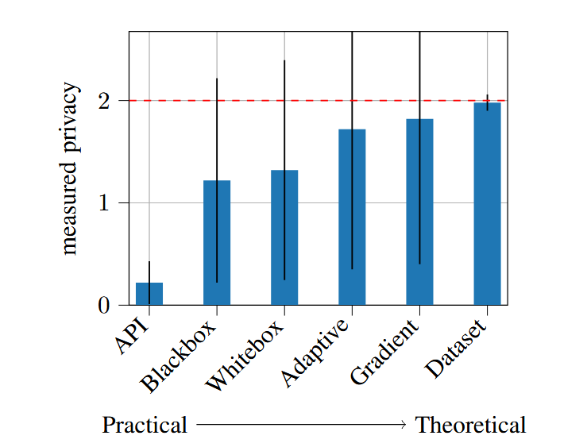

(Theory: ε = 2)

Implications:

- Provide best-effort empirical evidence that the privacy offered by DP-SGD is greater than *what is proven* when the adversary is more constrained.
  - In the worst case, DP-SGD analysis is tight!
  - Conversely, the bound may be loose under realistic settings.
  - Many capabilities don't seem to help the attack, like being able to access intermediate models.
- By studying various constraints that a real-world adversary would actually have, but that the analysis of DP-SGD does not assume are placed on the adversary, we can estimate the potential utility of introducing additional assumptions.

#### Adversarial Capabilities

DP makes **dataset agnostic** guarantees: (ε, δ)-DP must hold for all datasets D, even for pathologically constructed datasets D. This means that typical dataset will suffer from less privacy loss than what is guranteed in the worst case.

> There are also restrictions imposed by the analysis: DP-SGD assumes that the adversary is given **all intermediate models**, not only the the final one. This is because the only way we know how to analyze DP-SGD is through a composition over minibatch iterations, where the adversary learned all intermediate updates. It is unexplored as **will this assumption lead to stronger privacy attacks?**

> Similarly, the analysis in differential privacy assumes the adversary has **direct control of the gradient updates to the model**. Again however, this is often not true in practice: the inputs to a machine learning training pipeline are input examples, not gradients. The gradients are derived from the current model and the *worst-case inputs*. The proofs place the the trust boundary at the gradients simply because it is simpler to analyze the system this way.

Their work shows that **restricting the adversary to only control examples (rather than gradients) would not lead to better privacy guarantees** - so there's no point in trying to develop new theoretical analysis that makes this restriction.

#### Instantiating the DP Adversary

Carlini et al., 2019: training language models with ε = 10^5-DP might be safe in practice despite this offering no theoretical guarantees.

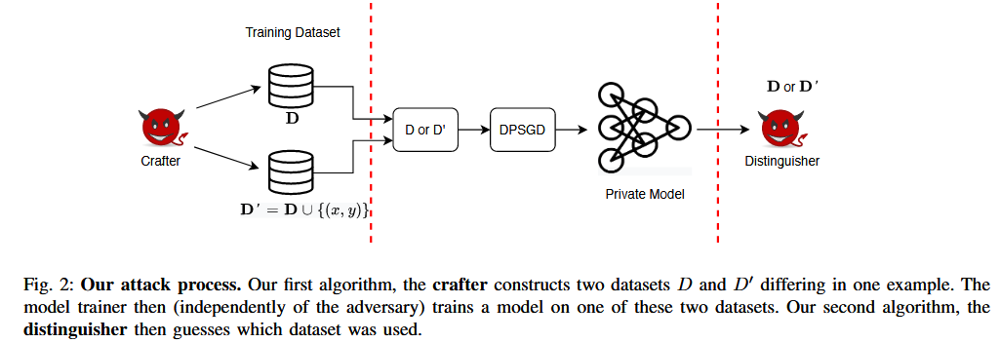

In the game, the distinguisher will receive both the two datasets crafted by the Crafter and the model training process (final model or all intermediate ones).

Kairouz et al., 2015: if M is (ε, δ)-differentially private:
$$
FP+e^{\epsilon} FN \leq 1 - \delta\\
FN+e^{\epsilon} FP \leq 1- \delta\\
\epsilon_{empirical} = max(\log \frac{1-\delta-FP}{FN}, \log \frac{1-\delta-FN}{FP}) \ (1)
$$
With Clopper-Pearson method:
$$
\epsilon_{empirical}^{lower} = max(\log \frac{1-\delta-FP^{high}}{FN^{high}}, \log \frac{1-\delta-FN^{high}}{FP^{high}}) \ (2)
$$
where `FP^high` is the high confidence bound for false positive and `FN^high` is the high confidence bound for false negative.

This is a conservative calculation. Even if the adversary were to succeed in all 1000 of the trials, the Clopper-Pearson bound would imply an epsilon lower bound of 5.60, because just observing 0 failures in 1000 trials doesn't mean the true error rate is exactly 0. The Clopper-Pearson method tells us that with 95% confidence, even with 1000 perfect trials:

- `FP_high` might be around 0.003
- `FN_high` might be around 0.003

> [!NOTE]
>
> How to understand the 95% confidence? It means if we were to repeat this experiment many times (each time running 1000 trials and calculating the bounds), about 95% of the time our calculated bound would **contain** the true privacy leakage value.
>
> Imagine running the 1000-trial experiment 100 different times. Each time we calculate a privacy bound using Clopper-Pearson.
>
> In about 95 of those 100 experiments, our calculated lower bound would be correct (the true privacy leakage would be above our lower bound); in about 5 of those 100 experiments, we might be "unlucky" with our sampling and get a bound that's too high.

> [!NOTE]
>
> Let's say after running 1000 trials:
>
> - False Positive Rate (FP) = 0.02 (20 false positives)
> - False Negative Rate (FN) = 0.03 (30 false negatives)
>
> Using these raw rates in equation (1): ε_empirical = max(log((1-0.00001-0.02)/0.03), log((1-0.00001-0.03)/0.02)) = **3.5**
>
> But with Clopper-Pearson 95% confidence intervals:
>
> - FP_high might be 0.031 (upper bound)
> - FN_high might be 0.043 (upper bound)
>
> Using these more conservative bounds in equation (2): ε_lower_empirical = max(log((1-0.00001-0.031)/0.043), log((1-0.00001-0.043)/0.031)) = **3.2**

#### Experiments

They develop six attacks based on the following variations:

- What level of **access** does the adversary have to the output of the training algorithm?
- How does the adversary perform the **manipulation**s of the training dataset?
- Does the adversary control the entire **dataset**? Or just one poisoned example? Or is the dataset assumed to be a typical dataset (e.g., CIFAR10)?

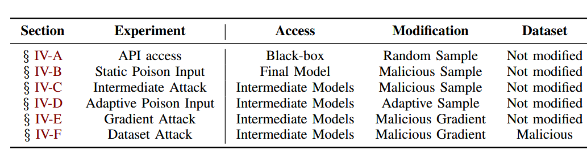

The difference between intermediate attack and adaptive poison input: in the latter, we can re-instantiate the worstcase inserted example after each epoch.

Gradient attack: prevalent in federated learning, also assumed by DP-SGD.

##### 1 - API access

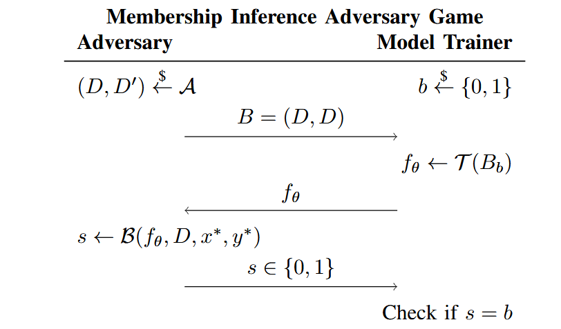

`$` means sampling from the underlying data distribution at random. The differing example of `D` and `D'` is called query input, which is drawn randomly. For MIA, the author simply adopts a threshold based one: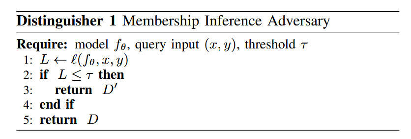

They experiment with MNIST, CIFAR10, and Purchase and using `ε` set by `{1,2,4,10}`.

> Due to computational constraints, we are limited to performing the attack 1, 000 times. These experiments took 3,000 GPU hours, parallelized over 24 GPUs.

For CIFAR10 and `ε = 4`. The TPR is 0.017 and FPR is 0.002, which shows that DP is doing its job by making the adversary hard to guess better than random. For 1000 trials, with 95% confidence, the attack false positive rate is lower than 0.01. The *empirical lower bound* is `(0.31, 10^{-5})`, <u>substantially</u> lower than the theoretical `ε = 4`.

> 1. From 1000 trials, we observed:
>
>    - True Positive Rate (TP) = 0.017
>
>    - False Positive Rate (FP) = 0.002 (when an example is NOT in the training set, the attack incorrectly claims it is in the training set 0.2% of the time)
>
> 2. Using Clopper-Pearson method with 95% confidence with equation (2) with δ = 10^-5: ε ≈ 0.31

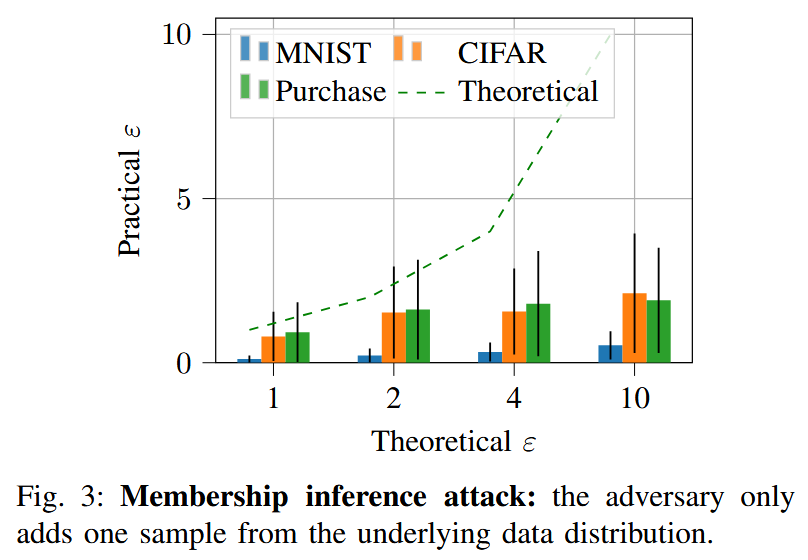

For MNIST, the adversary cannot fare better than random guess, and the author hypothesize that this is due to the similarity between samples. And the other two are more diverse in this sense. API access attack doens't use much assumption assumed by the DP-SGD analysis, and it's thus understandable that there's a large gap between theoretical upper bound and actual leakage.

Notice that as the tasks get more complex, the leakage increases. There are two possible interpretations:

- The upper bound is too pessimistic, and DP-SGD actually offers much stronger privacy!
- The attack is weak!

**They claim and will show that the second is correct**.

##### 2 - Static Input Poisoning

The first attack is not adversarial *per se* as the attacking sample is randomly selected from the pre-existing training dataset. Following Jagielski et al. (*How private is private SGD?*), they create an adversary that crafts a poisoned malicious that deviates the model parameters the most.

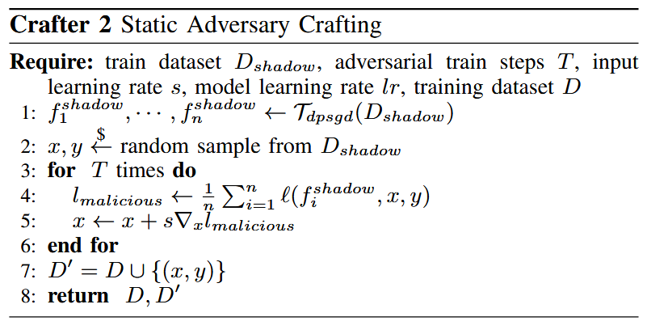

Given access to samples from the *underlying data distribution*, the adversary (crafter) trains a set of *shadow models* using the same hyperparameters, and generates an adversarial exmaple (w/ e.g. Deepfool) as demonstrated by the above algorithm.

Specifically, adversary starts with any random sample, and would like to create a new one that <u>maximizes</u> the loss over all those shadow models. Note that the shadow model is trained on a different set from `D` because we do not assume adversary accessing the `D`.

The *distinguisher* and *protocol* is exactly the same with attack 1.

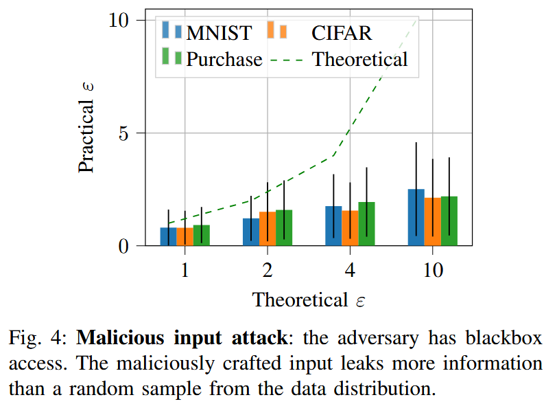

Now the adversary can leak more private information than attack 1. This is explained by the fact that the poisoned input is a worst-case input for MIA whereas previously the attack was conducted on *average-case inputs* drawn from the training distribution.

##### 3 - Intermediate Poison Attack

In this attack, we now consider where the *distinguisher* is able to access the intermediate models.

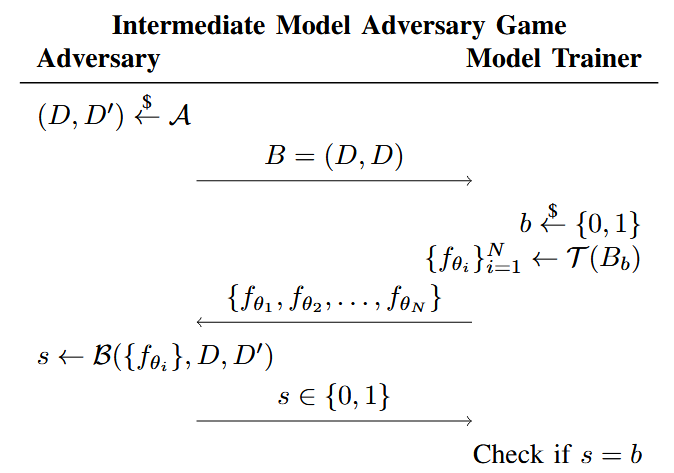

They also introduce a new distinguisher:

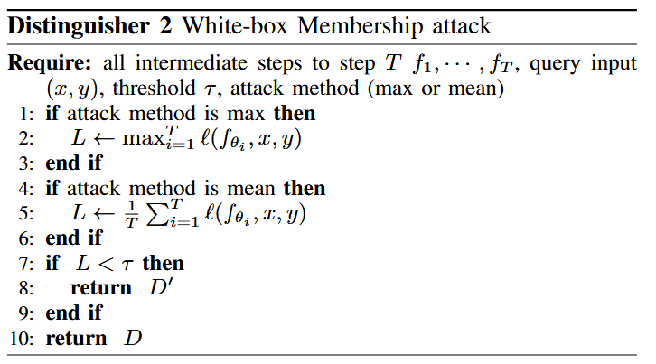

There are two methods: average or maximum loss for the poisoned examples over all the intermediate steps. Pick the best attacker between the two. Empirically, for smaller epsilons (ε ≤ 2) the maximum worked better. For epsilons larger than 2, it was instead the average.

The results (not shown) indicates that this capability is not very helpful. This property is proved in convex models, and in DNN, this can be only empirically demonstrated like this.

##### 4 - Adaptive Poisoning Attack

This paper introduces a new capability to the adversaries. They now can insert a *series* of poison inputs during training as opposed to directly place the query input in the training data.

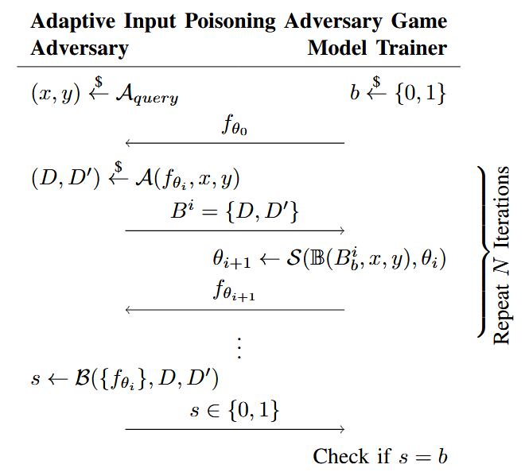

In this process, the two engage in more interactions. Initially the query input is generated by calling Crafter 2, which will also be used by the Distinguisher to make its guess. However in this attack, we can generate `(x,y)` freshly in each iteration such that if model is trained on `D\{(x,y)}`, the loss of the query input will be significantly larger:
$$
\ell(f^{D\backslash{(x,y)}}, x_q, y_q) << \ell(f^D, x_q, y_q)
$$
To achieve this, they propose to backpropagate twice (line 5-8):

- Compute the loss on current example
- Simulate how model would update with this example
  - Here I suppose the `f(x)` is actually feeding the current example to the current model `f_{θ_T}`.
- Compute the loss on query input with the updated model
- Update the malicious input to maximize the loss 

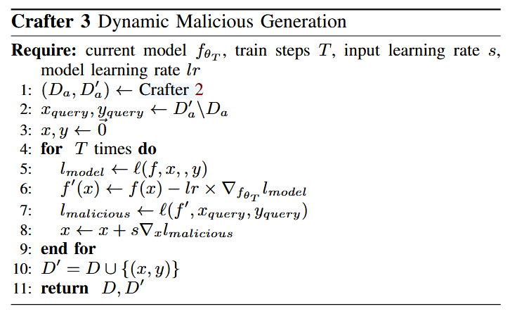

> [!NOTE]
>
> Note that if the trainer actually trains on `D`, the crafter 3 need not be actually run in the experiments.

The *distinguisher* is identical to the prior attack, Distinguisher 2. Note that the loss in all computed on the query input instead of poison ones generated in Crafter 3, although in training the poison data might be inserted.

The results show that this capability can help the adversary by giving a tigher bound. For example, on the Purchase dataset with ε = 2, this adaptive poisoning attack can achieve a lower-bound εlower = 0.37 compared to 0.25 in the prior section.

> [!NOTE]
>
> Note that this is already not very realistic:
>
> - The adversary needs to know exact hyperparameters (learning rate, batch size, etc.)
>
> - They need to know the exact training algorithm implementation
> - They need access to intermediate model states

##### 5 - Gradient attack

The DP-SGD formulation will assume that the adversary controls not only the input examples x (in attack 4), but also the gradient updates themselves.

> The reason this is allowed is because the clipping and noising is applied at the level of gradient updates, regardless of how they were obtained. Thus, even though we intuitively know that the update vector was generated by taking the gradient of *some sample*, the analysis does not make this assumption anywhere.

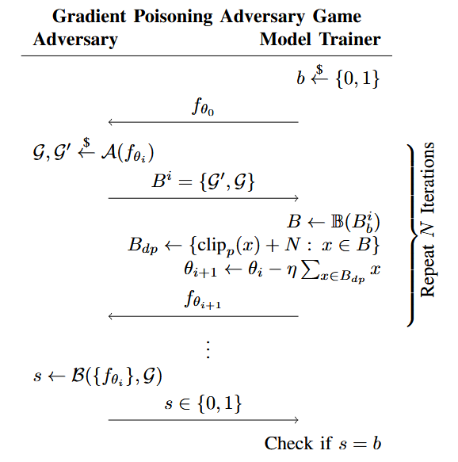

The crafter:

- (Line 1) Find parameters that change least during training
  - They are good candidates for watermarking since modifying them won't impact model performance significantly

- (Line 2) Select the 2n parameters that changed the least
- (Line 3-8) Create malicious gradient
  - Creates an alternating pattern (+C/√2n, -C/√2n, +C/√2n, etc.)
  - Uses the clipping norm C to ensure the watermark stays within DP-SGD bounds. This ensures the attack isn't filtered out by DP-SGD's protections
  - Spreads the watermark across 2n parameters
- (Line 10-14) Create collection of gradients
  - The alternating pattern makes the watermark more detectable.
  - Using stable parameters minimizes impact on model performance

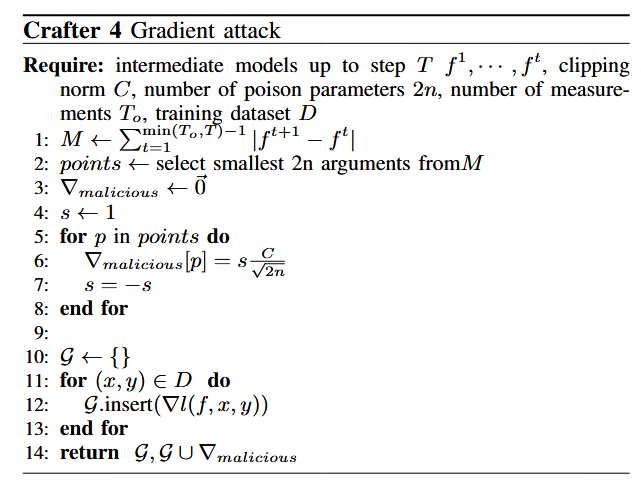

When training, if `D'` is chosen, call Crafter 4 to obtain a malicious gradient. It also selects a batch from the training dataset and computes the corresponding private gradient update, then with probability q it adds the malicious gradient from Crafter 4. The model trainer reveals the model parameters for all of the intermediate steps to the attacker.

The Distinguisher directly inspect the model weights to make its guess. The Crafter actually increases the distance between these model parameters, so the Distinguisher will just computes the distance between the parameters, and then performs hypothesis testing to detect the presence of a watermark.

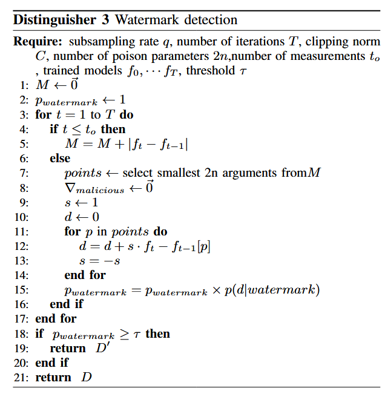
$$
H_{null}: Z + N(0,\sigma^2)\\
H_{watermark}: Z + N(\frac{C}{\sqrt{2n}}, \sigma^2)\\
p(Distance=d | watermark) = \frac{1}{2\sqrt{\pi n \sigma^2}}exp^{-(\frac{(x-C)^2}{2\sigma^2})}
$$
where 2n is the number of selected parameters, C and σ are the clipping norm and the scale used to clip and noise gradients in DP-SGD, and d is the distance computed by Distinguisher 3.

Results: improved lower bound. For ε = 1, the attack can achieve empirical lower bound ε = 0.3, which is almost tight; however, the gap increases as the value of epsilon increases.

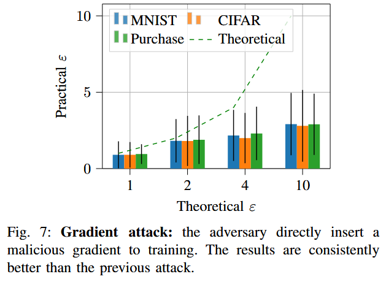

##### 6 - Malicious Datasets

Instead of choosing standard dataset `D`, they at last craft a malicious dataset. The distinguisher is identical to piror (Distinguisher 3).

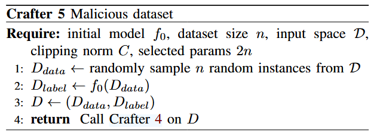

Crafter 5 constructs the dataset `D` with:

- Takes random inputs from the input space

- Gets the label predicted by the initial model.

- This creates a dataset that the initial model already classifies perfectly (gradient will be zero)
  $$
  \nabla_{f_{\theta}} (\ell(f_{\theta_0}, D)) \equiv  0, \forall D
  $$

  - When training on this dataset, any minibatch without malicious examples will produce no updates
  - Only the Gaussian noise from DP-SGD and the malicious gradients will affect the model

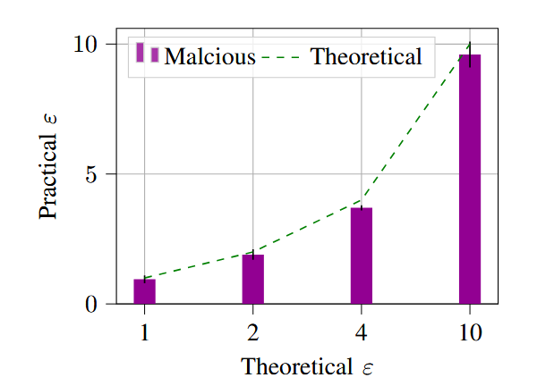

Now when the theoretical bound for DP-SGD is ε = 4, this last adversary achieves a lower bound of 3.6.

Notably, though it's not realistic, this suggests that **the era of “free privacy” through better DPSGD analysis has come to an end using existing assumptions.**

#### Theoretical Justification

For 1D case:

- The DP-SGD update is: `θ_t+1 ← θ_t - η(∇L(f_θt; D) + Z_t)` where `Z_t` is Gaussian noise
- For an adversary observing `v_t =  ∇L(f_θt; D) + Z_t`(the noisy gradient), the privacy leakage is tight both analytically and empirically. This tightness comes from the known tightness of the Gaussian mechanism in RDP (Rényi Differential Privacy)

Higher Dimensions:

- The key question becomes: how does changing one sample `d ∈ D` affect the gradient `∇L(f_θt; D)` across different dimensions?
- The authors observe that it's possible to affect just one coordinate of the gradient. Since independent noise of equal scale is added to each coordinate, the high-dimensional problem can be reduced to the one-dimensional case, which is more convenient.

Why tightness holds through each step:

- Subsampling for minibatches has tight RDP guarantees (proven by Wang et al.)
- RDP composition over iterations is tight
- The conversion from RDP to differential privacy is tight within constant factors

The theoretical justification explains why their gradient perturbation attacks achieve results close to the theoretical bounds - because each component of the privacy analysis (Gaussian mechanism, subsampling, composition) is individually tight, and they can be combined in a way that preserves this tightness.

#### Conclusion

- They verify that the Moments Accountant on DP-SGD as currently implemented is tight.
  - In order to provide better guarantees, either the DP-SGD algorithm will need to be changed, or additional restrictions must be placed on the adversary.
- Additional assumptions might be most fruitful to work with to obtain a better privacy guarantee
  - Attack that allows constructing a pathological dataset D is only marginally more effective than one that operates on actual datasets like CIFAR10.
  - Restricting the adversary to only being allowed to modify an example from the training dataset, instead of modifying a gradient update, is promising and could lead to more advantageous upper bounds.
- Practically, chosing "values of ε that offer no meaningful theoretical guarantees" and hoping that despite this "the measured exposure [will be] negligible" by Carlini et al. is refuted by this paper.