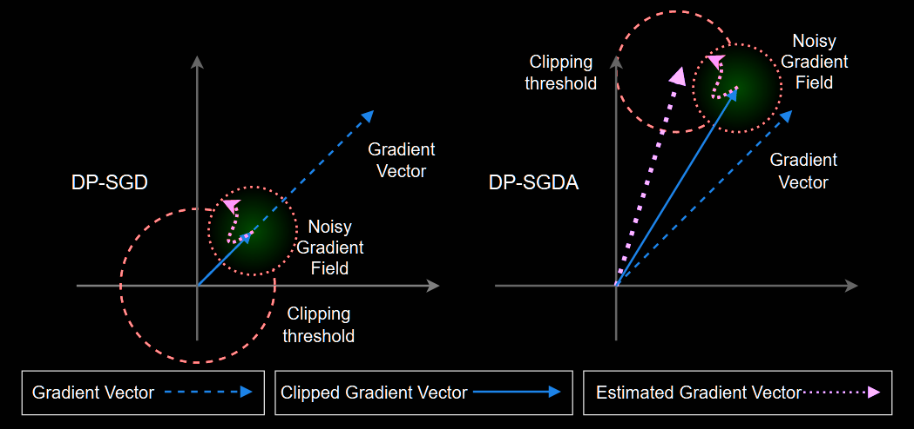
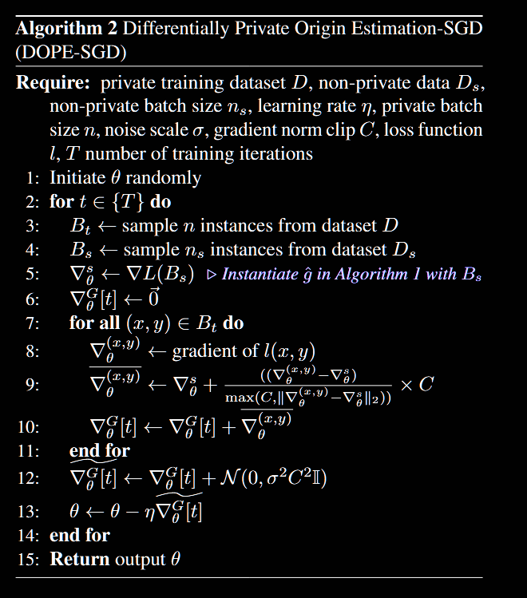
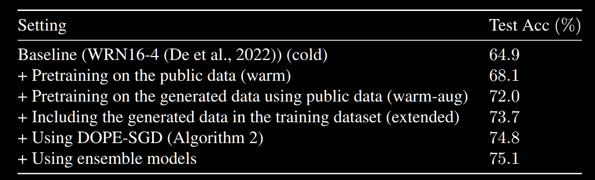
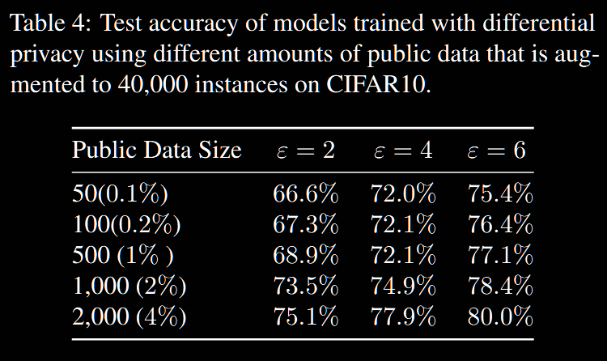
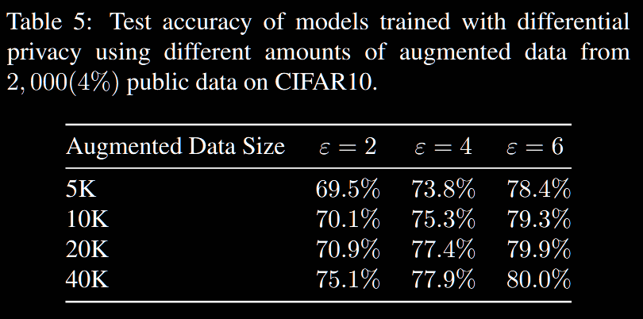
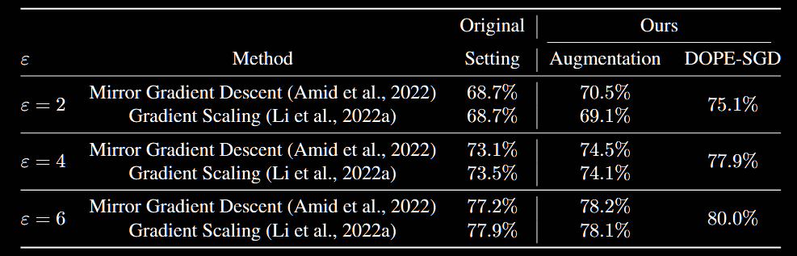
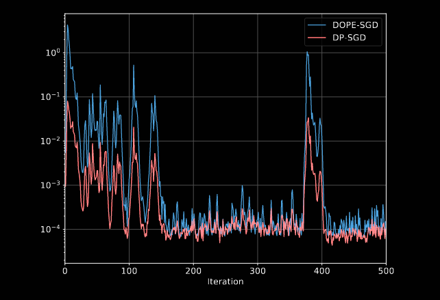

## (PMLR 2023) Effectively Using Public Data in Privacy Preserving Machine Learning

They introduce DOPE-SGD, which:

- Effectively use public data and augmentation techniques to generate *synthetic data* for multiple steps in the pipeline.
- Modify gradient clipping in DP-SGD to boost utility.
- Ensemble intermediate DP models with post-processing propert to further improve the prediction by averaging model parameters and majority voting for prediction.

One previous work that makes use of public data: **mirror gradient descent by Amid et al., 2022**, which uses a weighted mean between the privatized gradients on the private dataset and the public gradient to update the model parameters.

Another work: uses public data to re-scale individual gradients of private data before clipping.

### DOPE-SGD

Three phases:

- Pretraining to get a good initial point for private training.
- Enhance the DP algorithms.
- Post processing.

#### Adaptive Origin

Tension: Clipping introduces bias in the optimization and hurts convergence; but a larger clipping will lead to a larger noise in order to achieve due privacy.

Idea: clip the gradients around an estimate of the gradient instead of around the origin.

As a result, clipping agressively (smaller threshold) and enjoying less bias might be possible without hurting privacy. The algorithm proposed obtains the same DP and RDP guarantees as DP-SGD.

> For justification of this change, they introduce two terms:
>
> - A <u>loss function</u> l defined on a model space Θ and input space X is **L-lipschitz** if for all x ∈ X and θ ∈ Θ
>   $$
>   ||\frac{\partial \ell}{\partial \theta} (\theta, x)||_2 \leq L
>   $$
>
> - A <u>loss function</u> is r-concentrated if for all θ ∈ Θ, there exists a point `c_θ` in the gradient space such that we have
>   $$
>   \forall x \in X; ||\frac{\partial \ell}{\partial \theta} (\theta, x) - c_\theta||_2 \leq r
>   $$
>   The key insight is that while gradients might be able to change dramatically across the whole parameter space (captured by L), at any specific point during training, the gradients from different training examples tend to be much more concentrated (captured by r).
>
>   Imagine you're looking at a mountain range (representing the loss landscape):
>
>   - L would be like the maximum possible slope you could find anywhere in the range
>   - r would be like the variation in slope in a small local area where you're currently standing
>
> What they do is by introducing this adaptive clipping, the privacy cost is reducing from being proportional to L to being proportional to r (equivalently speaking, reduce the sensitivity of the gradient update at each iteration from L to r).
>
> For reference, the DOPE-SGD:
>
> 

#### Ensemble of Private Models

In the analysis of DP-SGD, all steps during the iterative training is assumed to be public (though for the sake of easier analysis), people might ask if this assumption is too strong and might overestimate privacy cost (since we often only use the last one). In this paper, they ask the dual question: since this assumption is already made, can we make use of all intermediate models to enhance utility?

Previous works use “Exponential Momentum Averages (EMA)” approach to take advantage of them, and in this work, they propose:

- Use last `n` models for majority voting. For example, for LLMs, take the average of the logits from the last `n` models.
- Take the average of the last n models, and evaluating the inputs on the average instead of the final model.

### Evaluation

> CIFAR10: WideResNet works better according to previous works. Use CIFAR100 as the out-of-distribution public data.
>
> WikiText-2: They use 4% of the training set as in-distribution public data and WikiText-3 (overlap part removed) as imperfect out-of-distribution public data.

Setting:

- Cold: No pretraining

- Warm: Pretraining

- Warm-Aug: Pretraining with Augmentation

- Extended: Pretraining & Using non-private dataset in the later training to use a smaller sub-sampling rate with a fixed batch size.

  > Lower selection probability means less privacy "cost" per training step.
  >
  > This allows us to run more training steps or add less noise while maintaining the same privacy guarantee.

In-distribution Results:

First, they ablate on various techniques in the setting with (2, 1e-5) DP. They use 2000 images in Cifar-10 as the public data and augment it to 40000 (takes pretty long!).

Train a generative model on the public dataset as an ideal augmentation technique. At each iteration, we can generate fresh samples from the generative model and calculate the average gradient over those samples.

Larger public data and more privacy budget is more helpful.

Note that the last row of Table 4 and 5 matches. They demonstrate that both original public dataset and the augmented size matters.

Their approaches can be applied to previous training approaches and improve them.

They also discuss why DOPE-SGD works well: they take both DOPE-SGD and DP-SGD, and calculate the dot products of their gradients with non-private algorithm. This figure demonstrates that DOPE-SGD will reduce the effect of the noise added by the Gaussian mechanism which can lead to a better performance.