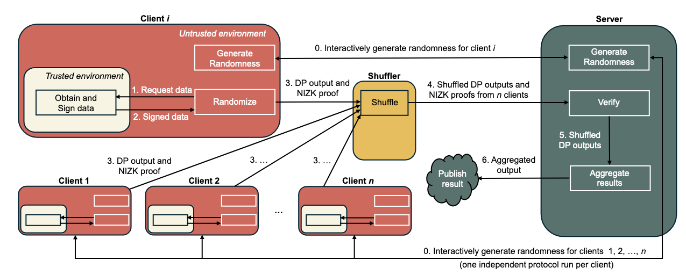

## (PoPETs 2025) Efficient Verifiable Differential Privacy with Input Authenticity in the Local and Shuffle Model

#### Preliminary Zero-knowledge Proof

- Non-interactive zero-knowledge proofs (NIZKs). NIZKs are used to prove the existence of a secret witness w for a given, public statement x, such that the pair  satisfies some NP-relation R, i.e., (x, w) ∈ R.
- Properties:
  - Completeness: given a true statement, an honest prover should be able to convince an honest verifier.
  - Soundness: if the statement is false, no prover should be able to convince the verifier that it is true.
  - Zero-knowledge: a proof π should reveal no information other than the truth of the public statement x, specifically it should leak no information about the witness w.

**Soundness (Standard):** This property ensures that if a statement  is false, no prover can convince the verifier that it is true.  Essentially, it guarantees that "false claims cannot be proven".

**Knowledge Soundness:** This is a stronger version of soundness. It not only guarantees that a witness *exists* for a true statement but also confirms that the prover actually **knows** that specific witness.

To prevent a prover from proving something they don't know, the paper uses **NIZK-PKs**.

- **The Extractor Test:** This is a mathematical "thought experiment." If a proof has knowledge  soundness, it means that if we had a special "extractor" program that  could see the prover's internal state, it could pull the witness  directly out of the prover's "brain" (code).**The Logic:** If it’s  mathematically impossible for an extractor to pull the witness out of  the prover, then the prover couldn't have "known" it in the first place, and the proof should be rejected.
- The paper's **Shuffle Scheme** (Section 6.3) relies heavily on this. Because a shuffler hides *who* sent *which* message, the server can't use traditional methods (like checking an IP  address or a persistent login) to prevent one person from sending the  same "true" proof 100 times. By including **knowledge soundness** in the NIZK-PK, the system ensures:
  - **Unlinkability:** The server still doesn't know who you are.
  - **Individual Accountability:** The server is certain that *every single proof* in the shuffled batch was generated by someone who actually held a unique, signed piece of raw data at that exact moment.

#### Differential Privacy

They work on several local DP algorithms here.

##### LDP Algorithm for Real-Valued Data

This algorithm is used for continuous data, such as the **Smart Meter** energy readings in the paper's experiments. It follows a two-step process:

- **Step 1: Stochastic Discretization:** The input $x \in [0, 1]$ is converted into an integer $\bar{x} \in \{0, 1, \dots, k\}$ using a precision parameter $k$.

  - $\bar{x}$ is sampled such that $\mathbb{E}[\bar{x}/k] = x$, meaning it remains an unbiased estimate of the original value.

    > 1. Scale the input: Multiply the input $x$ by the precision parameter $k$.
    >
    >    $$v = x \cdot k$$
    >
    >    Now, $v$ is a real number between $0$ and $k$.
    >
    > 2. **Identify the Neighbors:** Find the two integers that $v$ falls between.
    >
    >    - Lower bound: $i = \lfloor v \rfloor$
    >    - Upper bound: $i + 1$
    >
    > 3. **Probabilistic Rounding:** The algorithm "tosses a coin" to decide whether to round up or down. The probability is based on how close $v$ is to each neighbor:
    >
    >    - Set $\bar{x} = i + 1$ with probability $p = v - i$
    >    - Set $\bar{x} = i$ with probability $1 - p$
    >
    > being mapped to nearby grid points i/k and (i+1)/k]
    >
    > ----
    >
    > Suppose the precision parameter is **$k = 10$** and your raw data is **$x = 0.73$**.
    >
    > 1. **Scale:** $v = 0.73 \cdot 10 = 7.3$.
    > 2. **Neighbors:** The value $7.3$ is between the integers **7** and **8**.
    > 3. **Probabilities:**
    >    - The distance to 8 is $0.3$, so there is a **30% chance** to output $\bar{x} = 8$.
    >    - The distance to 7 is $0.7$, so there is a **70% chance** to output $\bar{x} = 7$.
    >
    > **Utility (Unbiasedness):** Since $\mathbb{E}[\bar{x}] = v = x \cdot k$, the server can simply divide the received value by $k$ to get an accurate estimate of the original $x$. This prevents the "systematic error" that would occur if you always rounded to the nearest integer.
    >
    > **Verification Efficiency:** This step is very "ZKP-friendly." In a Zero-Knowledge circuit, it is much easier to prove that a value was rounded to one of two neighbors than to perform complex floating-point math (as in Laplace).

- **Step 2: Randomized Response:** The discrete value $\bar{x}$ is then randomized into an output $\tilde{x}$:

  - With probability $1 - \gamma$, the user sends the true $\bar{x}$.
  - With probability $\gamma$, the user sends a value sampled uniformly at random from the set $\{0, 1, \dots, k\}$.

**Why it meets privacy:** It achieves $\epsilon$-DP because the probability of any output $\tilde{x}$ is bounded. Specifically, it meets the requirement as long as the ratio between the "true" response probability and the "random" response probability is $\le e^\epsilon$. The authors set the parameter $\gamma = \frac{k+1}{e^\epsilon + k}$ to precisely hit the target privacy budget.

##### LDP Algorithm for Histograms (k-ary RR)

This is used for categorical data, such as the **GPS postcodes** in the Geolife dataset.

- **Input:** An integer $x \in \{1, \dots, k\}$, representing a category.
- **Mechanism:**
  - With probability $1 - \gamma$, output $\tilde{x} = x$ (the truth).
  - With probability $\gamma$, output $\tilde{x}$ sampled uniformly from all categories $\{1, \dots, k\}$.

Why it meets privacy:

This is the classic k-ary Randomized Response. It provides "plausible deniability". If the server sees postcode "A", it cannot be certain if the user actually lives in "A" or if they flipped a "noisy" coin. The privacy level is controlled by $\gamma$, which dictates how much "noise" is mixed into the true distribution.

##### Privacy Amplification via Shuffling

When these LDP algorithms are used in the **Shuffle Model**, the privacy guarantee becomes much stronger.

- In the local model, the server knows *who* sent the noisy message. In the shuffle model, a shuffler permutes the messages so the server doesn't know which message belongs to which user.
- **The Result:** Because the server is now uncertain about both the *content* (due to LDP noise) and the *source* (due to shuffling), the overall privacy budget $\epsilon$ is "amplified".
- **Practical Impact:** For $n=100$ clients, the authors show that a local privacy budget of $\epsilon_0 \approx 1.0$ can result in an effective central privacy of $\epsilon = 0.1$. This allows the server to collect much more accurate data while maintaining the same level of protection.

#### The Core Problem: Input & Output Manipulation

Traditional LDP schemes are susceptible to two main types of attacks:

- **Input Manipulation:** A client provides a "fake" raw input (e.g., reporting a false location) before the LDP noise is even added.
- **Output Manipulation:** A client applies the LDP algorithm but chooses a specific "noisy" output that isn't actually the result of the random process, aiming to bias the server's final average or histogram.

The authors argue that in many real-world cases—like smart meters or GPS sensors—the raw data is actually produced by a **trusted component** (like a secure enclave or OS kernel) and then passed to an **untrusted application** for reporting.

#### Core Contribution

The authors developed three distinct VLDP constructions, each building on the last to improve efficiency and privacy:

| **Scheme**  | **Model** | **Key Innovation**                                           | **Performance Note**                                         |
| ----------- | --------- | ------------------------------------------------------------ | ------------------------------------------------------------ |
| **Base**    | Local     | Interactive preprocessing (GenRand) for every time step.     | High server load due to repeated interaction.                |
| **Expand**  | Local     | Uses **Merkle Trees** to commit to a large batch of future random values at once. | Significantly reduces server communication and computation.  |
| **Shuffle** | Shuffle   | Moves identity verification into the NIZK proof to ensure **unlinkability**. | First VLDP for the shuffle model; offers the lowest server load. |

To achieve "Verifiability" without sacrificing "Privacy," the paper utilizes several cryptographic primitives:

- **Input Authenticity:** The trusted hardware component signs the raw data ($x$) and a timestamp ($t_x$), ensuring the client cannot invent fake inputs
- **Joint Randomness:** To prevent output manipulation, the client and server interactively generate a random seed ($\rho$). The client is forced to use this specific seed for the LDP noise.
- **NIZK Proofs of Knowledge:** The client provides a zero-knowledge proof ($\pi$) to the server.
- This proves that:
  1. The input was signed by a valid trusted component.
  2. The randomness used matches the agreed-upon seed.
  3. The LDP algorithm was applied correctly to that specific input.

#### Threat Model

| **Entity**     | **Trust Level** | **Motivation**                    |
| -------------- | --------------- | --------------------------------- |
| **Client App** | **Malicious**   | Wants to cheat/bias stats.        |
| **Sensor/HW**  | **Trusted**     | Blindly signs physical reality.   |
| **Server**     | **Semi-Honest** | Wants accurate data, might snoop. |
| **Shuffler**   | **Semi-Honest** | Just mixes data.                  |

1. Note that in some papers (e.g. V$\epsilon$rity, USENIX Security 2026) the trust level on the sensor/HW (in their paper, the "authorizer") can collude with the server, but they ensure the unlinkability.
2. Note that sensor *blindly signs* the data. That means it performs its function mechanically without context, judgment, or awareness of the downstream application. Think of the trusted sensor like a **Notary Public**:
   - A notary checks your ID and watches you sign a document. They stamp it to say, "This signature is authentic."
   - However, the notary does **not** read the document to see if it's a lie, a bad deal, or illegal. They "blindly" validate the *identity/action*, not the *content/intent*.
   - **What is prevented:** The malicious *software* (the app) cannot take a valid reading of "New York" and change it to "London" because the signature would break.
   - **What is NOT prevented:** Physical attacks. If an attacker puts their smart meter in a freezer, the trusted sensor will "blindly" sign that the temperature is -10°C. The cryptography guarantees the data came from the sensor, but it cannot guarantee the sensor wasn't fooled by the physical environment.

#### Deep Dive

##### 1. The Base Scheme (Verifiable LDP)

The **Base Scheme** establishes the core pipeline but requires interaction for every single data submission.

**The Mechanism**

1. **Randomness Generation (`GenRand`):** The client commits to their own randomness $\rho_c$ and the server provides a seed $k_s$. The final randomness used is $\rho = \rho_c \oplus \rho_s$, where $\rho_s = PRF(k_s, 0)$.
2. **Verification:** The server checks a digital signature $\sigma_s$ to ensure the client used the correct $k_s$ and then verifies the NIZK proof $\pi$.

**Formal Relation $\mathcal{R}_{base}$**

The NIZK proof must satisfy the following relation to be accepted:

$$(t_{j-1}, t_j, pk_i, cm_{\rho_c}, \rho_s, \tilde{x}) \in \mathcal{R}_{base} \iff \exists (t_x, x, \sigma_x, \rho_c, r_{\rho_c}) \text{ s.t.}:$$

- Timestamp Validity: $t_x \in (t_{j-1}, t_j]$
- Input Authenticity: $Sig.Verify_{pk_i}(\sigma_x, x || t_x) = 1$
- Randomness Commitment: $cm_{\rho_c} = Comm(\rho_c; r_{\rho_c})$
- Correct Randomization: $\tilde{x} = LDP.Apply(x; \rho_c \oplus \rho_s)$

**Step 1: Input Authentication**

The **Trusted Environment** (e.g., an iPhone Secure Enclave) generates raw data $x$ (like a GPS coordinate) and signs it.

- **Action:** It creates a signature $\sigma_x = Sig.Sign_{sk_i}(x || t_x)$, where $t_x$ is a timestamp.
- **What is proved:** At this stage, nothing is proved to the Server yet. This step simply "locks" the raw data so the untrusted Client Program cannot change it without breaking the signature.

**Step 2: Randomness Generation (`GenRand`)**

This is an interactive "coin-flipping" protocol between the **Client Program** and the **Server**.

- **Client Action:** The client generates a random value $\rho_c$ and sends a **commitment** $cm_{\rho_c}$ to the server. A commitment is like a sealed envelope; the server can't see $\rho_c$ yet, but the client can't change it later.
- **Server Action:** The server sends back its own random seed $k_s$.
- **Result:** Both parties now "agree" on a final randomness $\rho$ that is a combination of both their inputs ($\rho = \rho_c \oplus \rho_s$).
- **What is proved:** This ensures the Client cannot "cherry-pick" randomness to bias the result.

**Step 3: Randomization and Proof Generation (`Randomize`)**

The **Client Program** performs the math and creates the ZK proof.

- The client runs the LDP algorithm on the authentic data $x$ using the agreed-upon randomness $\rho$ to get the output $\tilde{x}$.

- The client generates a NIZK proof $\pi$.

- **What is proved to the Server:** The client is proving the following statement without revealing $x$ or $\rho_c$:

  > "I possess a piece of data ($x$) signed by my secure hardware at time ($t_x$). I also possess the secret part of the randomness ($\rho_c$) that matches the 'envelope' I sent you earlier. Using these, I correctly ran the noise algorithm to produce the result ($\tilde{x}$) I am sending you now".

**Step 4: Verification (`Verify`)**

The **Server** runs a verification algorithm.

- **Action:** The server takes the public information (the proof $\pi$, the output $\tilde{x}$, its own seed $k_s$, and the client's public key $pk_i$) and runs the `Verify` function.
- **What is proved:** If the math checks out, the server is mathematically certain the data is authentic and the noise was added honestly, even though it never saw the original "raw" data.

In summary:

| **Item**                       | **Trusted Env** | **Client Program** | **Server**                |
| ------------------------------ | --------------- | ------------------ | ------------------------- |
| **Raw Data ($x$)**             | Yes             | Yes                | **No** (Privacy!)         |
| **Randomness ($\rho$)**        | No              | Yes                | **No** (only knows $k_s$) |
| **Signature ($\sigma_x$)**     | Yes             | Yes                | **No** (hidden in proof)  |
| **Final Result ($\tilde{x}$)** | No              | Yes                | Yes                       |

------

##### 2. The Expand Scheme (Randomness Expansion)

The **Expand Scheme** improves efficiency by allowing a client to run the interactive `GenRand` protocol **only once** to cover $T$ future time steps.

**The Mechanism**

- **Merkle Tree Commitment:** Instead of committing to one $\rho_c$, the client generates $T$ random values, $(\rho_c^1, \dots, \rho_c^T)$, and commits to them using a Merkle Tree.
- **Server Seed:** The server provides a single seed $k_s$. At each time step $j$, the specific server-side randomness is derived as $\rho_s^j = PRF(k_s || s_j)$, where $s_j$ is a public salt.
- **Proof:** The client must now additionally prove that the $\rho_c^j$ used in step $j$ is indeed the $j$-th leaf of the Merkle Tree with root $rt_i$.

**Formal Relation $\mathcal{R}_{expand}$**

The relation expands statement 4 of the Base scheme:

$$\dots \text{and } cm_{\rho_c}^j \text{ is leaf } j \text{ in MerkleTree with root } rt_i$$

------

##### 3. The Shuffle Scheme (Unlinkable VLDP)

The **Shuffle Scheme** is the paper's primary contribution. It ensures that the server can verify the data without being able to link the message to a specific client identity.

**The Mechanism**

1. **Unlinkability:** In Base and Expand, the client sends their public key $pk_i$ and the server's signature $\sigma_s$ directly to the server, which identifies them.
2. **Witness Transformation:** The Shuffle scheme moves $pk_i$ and $\sigma_s$ into the **private witness** of the NIZK proof. The server only sees the randomized value $\tilde{x}$ and the proof $\pi$.
3. **Unified Randomness:** To simplify the circuit, the Merkle tree is removed. Instead, the randomness seed $k_i = k_c^i \oplus k_s^i$ is verified inside the NIZK directly using a PRF.

**Formal Relation $\mathcal{R}_{shuffle}$**

The server verifies the proof using only public parameters $pp$ and its own $pk_s$:

$$(t_{j-1}, t_j, pk_s, s_j, \tilde{x}) \in \mathcal{R}_{shuffle} \iff \exists (t_x, x, pk_i, \sigma_x, k_c, r_{k_c}, cm_{k_c}, k_s, \sigma_s) \text{ s.t.}:$$

- **Identity & Input:** $Sig.Verify_{pk_i}(\sigma_x, x || t_x) = 1$ 
- **Server Approval:** $Sig.Verify_{pk_s}(\sigma_s, pk_i || cm_{k_c} || k_s) = 1$
- **Shuffle Randomness:** $\rho = PRF(k_c \oplus k_s, s_j)$ 
- **Result:** $\tilde{x} = LDP.Apply(x; \rho)$

By hiding the client’s public key ($pk_i$) and the server-signed authorization ($\sigma_s$) inside the proof, the server knows the message is authentic but has no way to tell which of the $n$ clients sent it.

#### Results

The authors implemented these schemes in **Rust** using the **arkworks** library and the **Groth16 zk-SNARK**. They tested the system on two real-world datasets:

- **Geolife GPS Trajectory:** Creating location histograms ($k=8$).
- **Smart Meter Energy Readings:** Estimating average household power consumption ($k=10$).

**Key Results:**

- **Efficiency:** Client runtimes are under **2 seconds**, and server verification takes only **5–7 milliseconds** per client.
- **Communication:** The extra overhead is minimal, adding only **200–485 bytes** per client message.
- **Generality:** Unlike previous works that only supported specific algorithms, this framework supports any LDP mechanism that can be approximated with uniform random bits, including Laplace and Staircase noise.