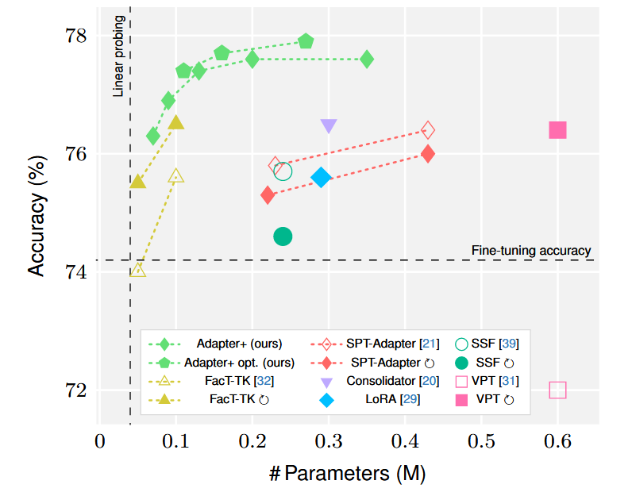
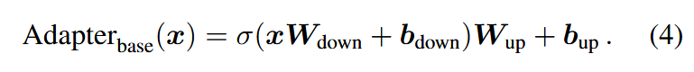
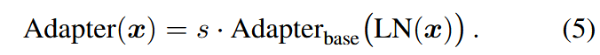
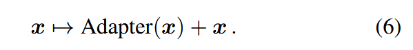
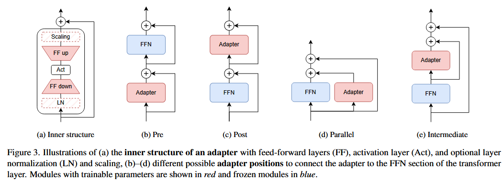
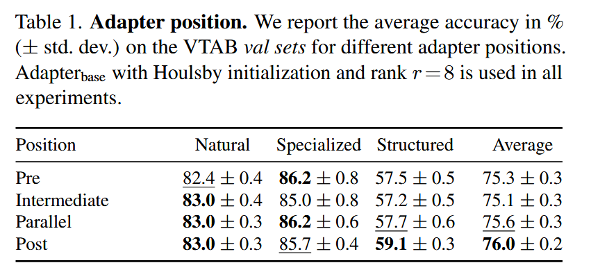
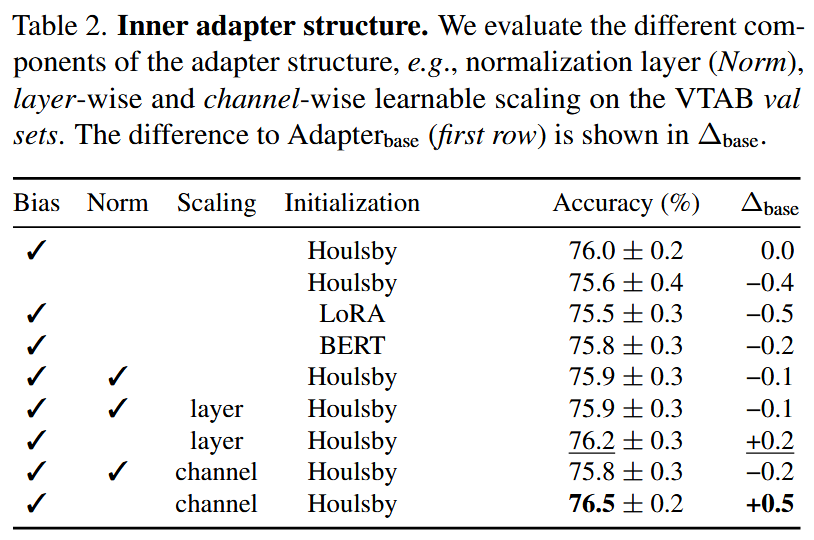
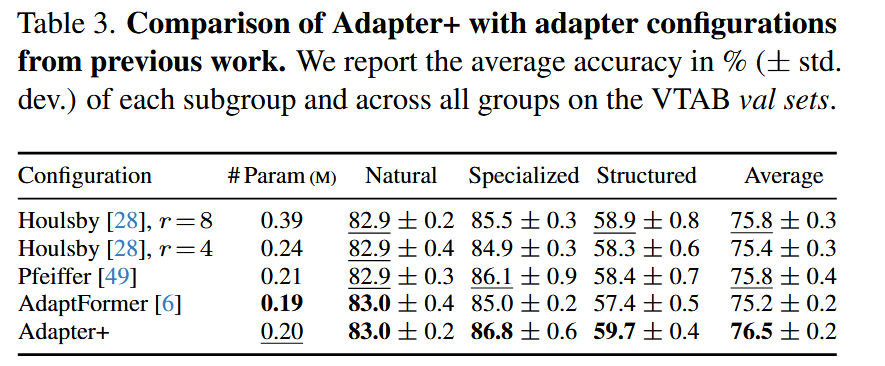

### (CVPR 2024) Adapters Strike Back

Problem in previous researches:

- They work on PEFT and present adapters as a baseline for adaptation in CV. The authors claim that they have implementation issues, which negatively affect the benchmark performance of adapters.
- While adapters have been well studied in NLP, there is no study that broadly examines the different adapter configurations for **vision transformers**.

Thus, there contributions:

- First in-depth and systematic study on the effects of the adapter **position** in the transformer and of the adapter’s **inner structure** with ViTs, as well as evaluate different variants of parameter **initialization**.
- Propose a learnable, channel-wise scaling as extension to plain adapters.
- Adapter+: an adapter configuration with an excellent parameter-accuracy trade-off compared to other work

#### Basic Approach

The base adapter module looks like:

After enhancement with layer norm and a simple scaling:

Note that the scaler `s` can be fixed as a hyper parameter, or a learnable parameter. The authors of this paper, however, propose to turn this `s` into a channel-wise, learned scaling where `s ∈ R^d`. And usually, it's combined with a skip connection:

As for position of the adapters, they believe that **the adapter should follow a frozen module** to be more flexible, intuitively.

Here's the structure of them and different possible positions:

They also research three initialization methods:

- Houlsby init: zero-centered Gaussian distribution with a standard deviation of σ = 0.01, truncated at 2σ, and use zero for their biases.
- BERT: similar, but σ = 0.02 and not truncated.
- LoRA init: based on Kaiming init.

They mention that data normalization in pre-processing is very important, like ImageNet normalization. That's because the aim is to adapt to a target domain on a very low parameter budget, and otherwise, the shifting of data statistics will waste some of the adapter's capacity.

#### Experiments

They use datasets including:

- VTAB (Visual Task Adaptation Benchmark), which consists of three groups: natural, specialized, and structured.
  - Each task of VTAB consists of 800 training and 200 validation images. The test sets have the same number of images as the test sets in the original datasets.
- FGVC: low-data regime, including CUB-200-2011, NABirds, Oxford flowers, Stanford Dogs/Cars

They adopt ViT-B/16 pre-trained on ImageNet-21k. Data normalization as mentioned above, resize to 224*224 for VTAB, randomly resize crop to 224×224 px and horizontal flipping for FGVC. More setup see 4.2.

Position: Post-Adapter yields the best result with 76.0% average performance.

Inner structure: a learned scaling is in general beneficial for image-classification tasks. Adding layer-wise scaling leads to a gain of 0.2 pp. The inclusion of a learned, channel-wise scaling gives the strongest improvement of 0.5 pp.

Combining these findings, the configuration is called **Adapter+**.

They evaluate and show that Adapter+ sets a new state of the art with an average accuracy of up to 77.6% over all VTAB subgroups even *without any per-task hyperparameter optimization* and 77.9% if determining `r` per task on the validation set.