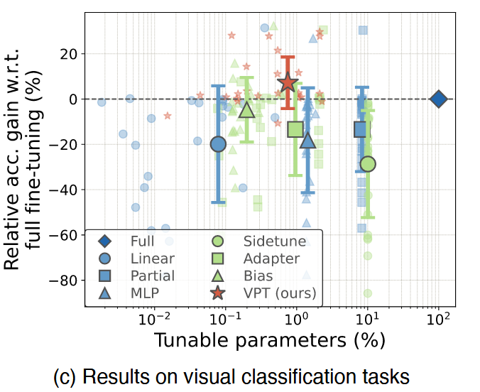
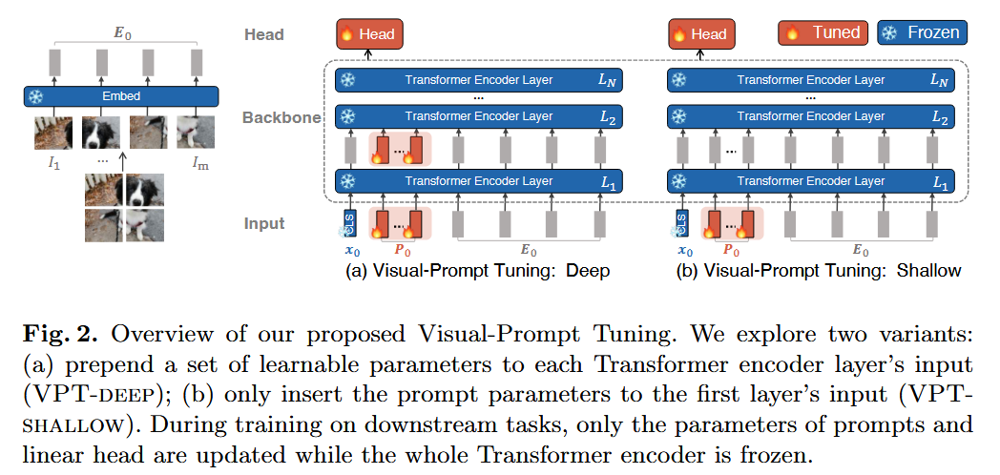
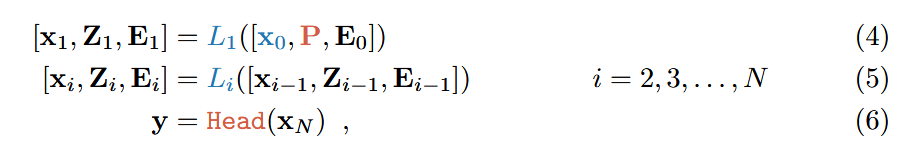
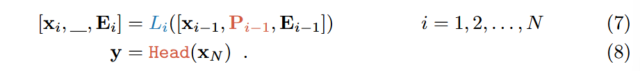
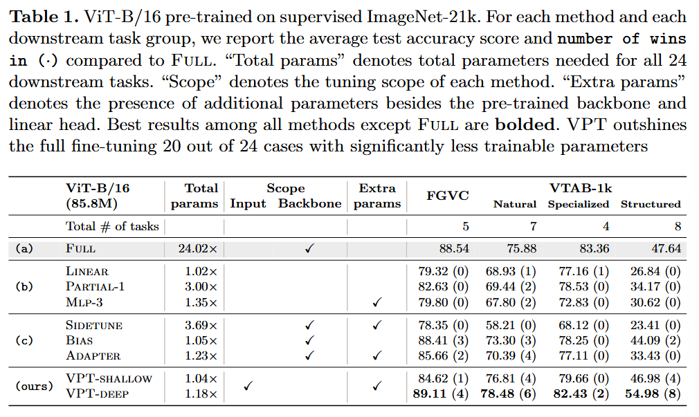
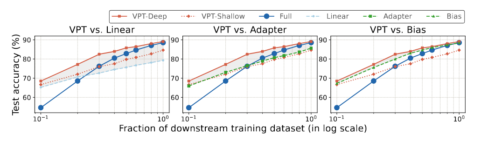
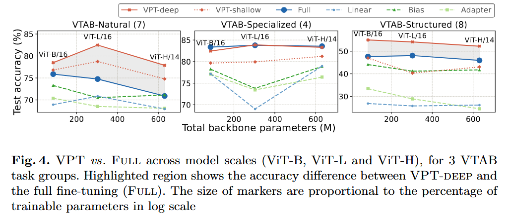
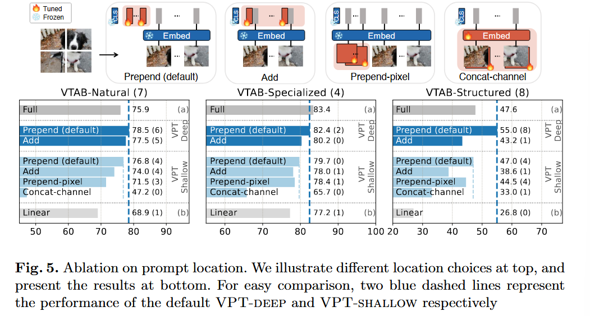
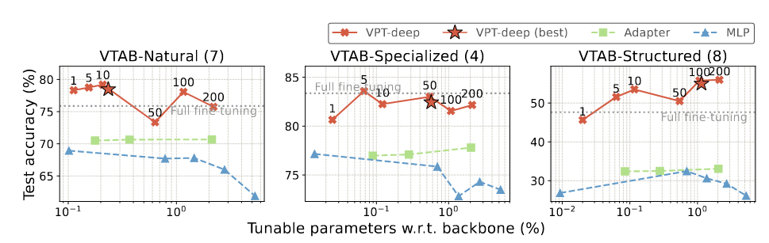
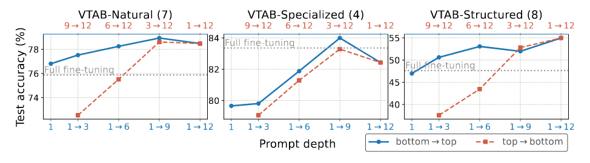

### (ECCV 2022) Visual Prompt Tuning

VPT, introduced by this paper, fine-tunes a small amount (less than 1%) of parameters, and achieves significant performance gains compared to other parameter efficient tuning and even surpasses full fine-tuning in many cases.

Novelty:

- Instead of altering or fine-tuning the pre-trained Transformer itself, *modify the input* to the Transformer.
  - Additional parameters are simply prepended into the input sequence of each Transformer layer and learned together with a linear head during fine-tuning.
- VPT is especially effective in the *low-data regime*, and maintains its advantage across data scales. It's also suitable for a range of Transformer scales and designs (ViTBase/Large/Huge, Swin).

#### Approach

The formulation of VPT-Shallow is:

The red ones are learnable and blue ones are frozen. Note that prompts are inserted after the positional encoding, so [x0, P, E0] and [x0, E0, P] are mathematically equivalent.

Also note that adding prompts don't actually change the architecture of the transformer layer, but only change the size of attention matrix (which is quadratic to the length of the sequence).

Similar, for VPT-Deep:

For a ViT-Base with 86M params:

- d = 768 (dimension of each embedding block)
- 50 Shallow prompts: p * d = 50*768 = 0.038M (0.04%)
- Deep ones: 0.038*N = 0.46M (0.53%)

#### Evaluations

Baselines:

- Full
- Methods that focus on the classification head: treat the pre-trained backbone as a feature extractor, whose weights are fixed during tuning
  - Linear: only use a linear layer as the classification head.
  - Partial-k: fine-tune the last k layers of backbone.
  - Mlp-k: utilize a multilayer perceptron (MLP) with k layers, instead of a linear layer, as classification head.
- SIDETUNE: train a “side” network and linear interpolate between pretrained features and side-tuned features before being fed into the head.
- BitFit
- ADAPTER

Dataset:

- FGVC (5 benchmarked Fine-Grained Visual Classification tasks)
- VTAB-1k: 19 diverse visual classification tasks
  - Each task contains 1000 training examples, divided by 800-200 split

VPT outshines the full fine-tuning 20 out of 24 cases with significantly less trainable parameters. Thus, even if storage is not a concern, VPT is a promising approach for adapting larger Transformers in vision.

This figure shows that VPT-deep outperforms all the other baselines across data scales. Other PEFT methods perform significantly better than Full only when data is limited, while VPT-Deep consistently outperforms Full across training data sizes.

The advantages of VPT-deep over Full still hold as the model scale increases.

Ablation study:

Prompt location:

- Instead of prepending prompts to the sequence of the image patches, another option could be add prompts element-wise to those embeddings.

- Latent or pixel? Instead of inserting the prompts as latent vectors for the first Transformer layer, one could introduce prompts in the pixel level before the Embed layer. See the Prepend-pixel (prepending shallow prompts before the projection layer) and Concat-channel  (concatenate a new channel to the input image) in that figure.

- Prompt length: Varies across tasks. But one suffices to surpass other methods.

  

- How many layers to insert prompts (Prompt Depth)? Fare better to insert in earlier layers.

  

- Final output: by default we only use final `[CLS]` i.e. `x_N`. Average pooling on output embeddings works just fine, but cannot pool prompts (which incurs accuracy loss).

It also applies to *various visual tasks* (including semantic segmentation etc.) and *pre-trained objectives* (MAE, MoCo v3). For the latter, they found that VPT is not as good as other methods, though remains competitive.

They try VPT to ConvNet. VPT works well in a larger ConvNet backbone, ConvNeXt-B, offering accuracy gains over other sparse tuning protocols. The advantages of VPT, however, diminish with smaller ConvNet (ResNet50).
