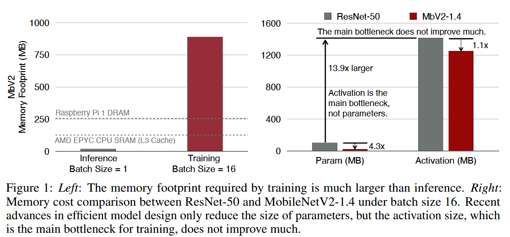
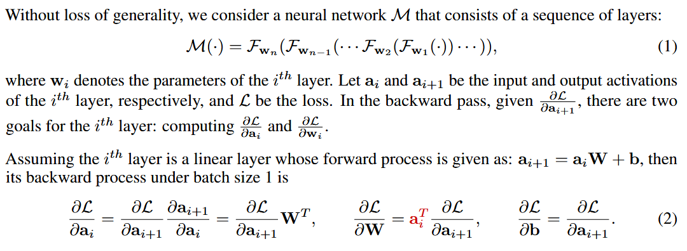
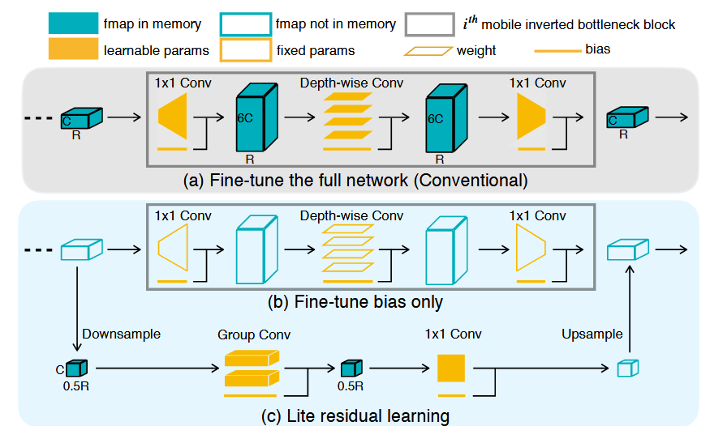
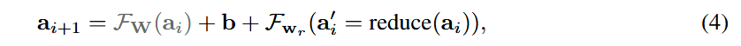
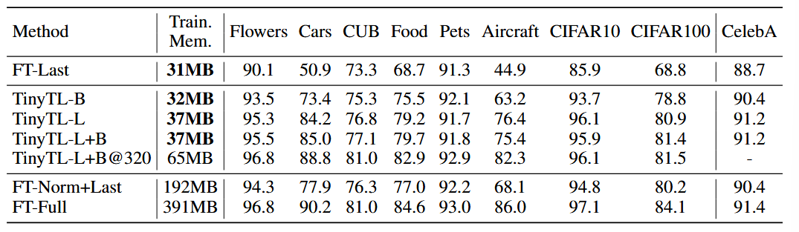
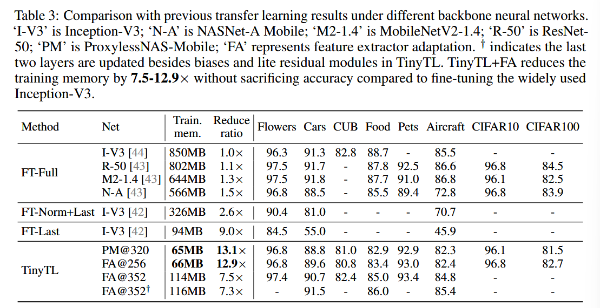
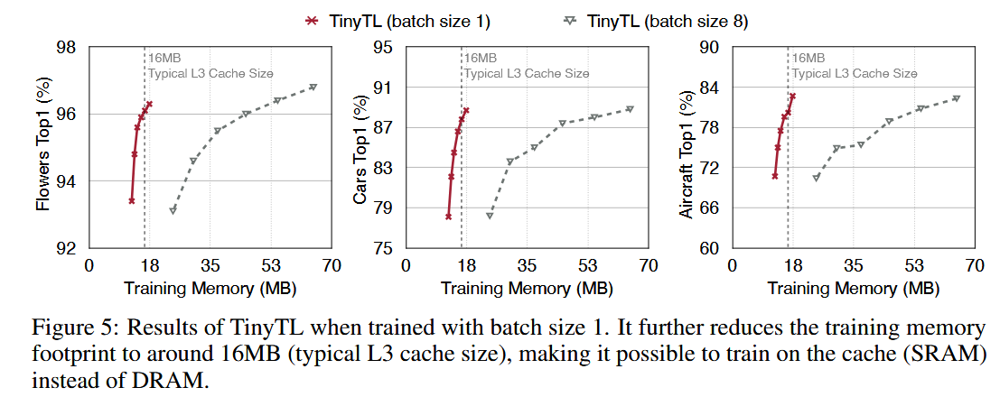

### (NeurlPS 2020) TinyTL: Reduce Memory, Not Parameters for Efficient On-Device Learning

#### Introduction

This paper researches the efficiency of on-device learning on edge devices. It first reveals that reducing the number of trainable devices doesn't translate to memory saving because the major bottleneck is activations, not parameters. The edge devices are not only *memory-constrained*, but also *energy-constrained*. While sufficient to inferences, the memory by far not sufficient for training; making use of the DRAM would bring huge energy consumption.

They propose Tiny-Transfer-Learning (TinyTL) for memory-efficient on-device learning. TinyTL freezes the weights and only learns the bias, thus doesn't store the intermediate activations. Meanwhile, it introduces a *lite residual module* for adaptation capacity.

FLOPs-efficient techniques don't directly save training memory. It is essential to reduce the size of intermediate activations required by back-propagation, which is the key memory bottleneck for efficient on-device training.

Previous endeavors on memory footprint reduction (orthogonal to this research):

- Re-compute discarded activations during backward
  - Not ideal for large computation overhead.
- Layer-wise training
  - Cannot achieve same level of accuracy.
- Activation pruning
- Reduce bitwidth of training activations using new reduced-precision FP formats

#### Problem Formulation

The activations `a` that dominates the memory footprint are required only to compute the gradient of weights, not bias. This property is also applicable to convolution layers and (batch/group) normalization layers.

For non-linearity, ReLU and other ReLU-styled activation layers (e.g., LeakyReLU) only requires to store a binary mask representing whether the value is smaller than 0, which is 32× smaller than storing activations like other non-linear functions.

#### Lite Residual Learning

Lite residual learning: using group convolution and avoiding inverted bottleneck. The skip connection remains unchanged (omitted for simplicity).

The weights are forzen, and learning the lite residual modeuls only requires storing the reduced activations.

Instead of inverted bottleneck to compensate for the limited capacity of depth-wise conv (which is very memory inefficient for the low arithmetic intensity), they employ group convolution that has higher arithmetic and remove the 1*1 projection layer.

The activation size grows quadratically with the resolution. Therefore, they shrink the resolution in the lite residual module by employing a 2 × 2 average pooling. An bilinear upsampling layer at the end will match the size of the main branch's output feature map.

#### Discussion

##### Normalization

Batch normalization (BN) requires a large batch size to have accurate running statistics estimation during training, which is not suitable for on-device learning. In constrast, Group normalization (GN) with a small training batch size (e.g., 8) performs only slightly worse than BN with a large training batch size (e.g., 256) because the running statistics are computed independently for different inputs.

##### Feature Extractor Adaptation

Since weights are frozen, using the same backbone neural network for all transfer tasks is sub-optimal. Instead, we can choose the backbone using a pretrained once-for-all network.

#### Experiments

‘B’ represents Bias while ‘L’ represents LiteResidual. FT-Last represents only the last layer is fine-tuned. FT-Norm+Last represents normalization layers and the last layer are fine-tuned. FT-Full represents the full network is fine-tuned.

FT-Last: fine-tuning the last linear layer

FT-Norm+Last: fine-tuning the normalization layers (e.g., BN, GN) and the last linear layer

The backbone neural network is ProxylessNAS-Mobile, and the resolution is 224 except for ‘TinyTL-L+B@320’ whose resolution is 320.

By increasing the resolution to 320, TinyTL can reach the same level of accuracy as FT-Full while being 6× memory efficient.

Combined with Feature Extractor Adaptation:

Additionally, they try updating the last two layers besides biases and lite residual modules (indicated by †). With only 2MB overhead, it achieves better accuracy.

In Figure 5: with Group normalization rather than Batch normalization, little to no accuracy loss is induced. This makes it much easier to train on the cache (SRAM).