## Efficient Machine Learning

### Pruning, Lottery Tickets, Sparsity

#### EBERT: Efficient BERT Inference with Dynamic Structured Pruning (ACL 2021)

EBERT dynamically determines and prunes the unimportant heads in multi-head self-attention layers and the unimportant structured computations in feed-forward network for each input sample at run-time.

During inference, the predictors dynamically determine which heads of self-attention layers and channels of feed-forward network can be pruned according to current input.

The output t of the second feed-forward layer will be transformed to a 0-1 mask by a function f (·):

where x is Z_i shown at the top of the first figure.

**Join training** the pre-trained BERT branch and randomly initialized predictor branch. To meet the specified remaining FLOPs threshold C:

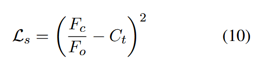

add a loss to minimize the difference between real computational cost of the whole network and C_t. F_c means current model average FLOPs and F_o means the original model.

To control the sparisity of each MHA and FFN and avoid too high sparsity of some layers:

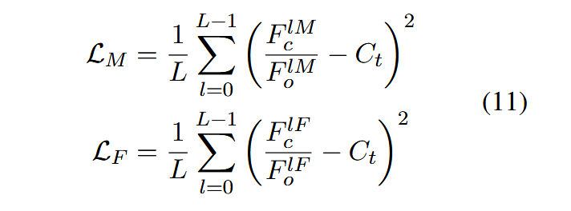

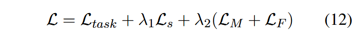

After joint training, further train the BERT branch while freezing the predictors. That's because dynamic pruned models don't exercise each head as sufficient as normal training b/c of sparsity.

**Evaluations**

On four *classification* tasks (which is larger for less variance) from GLUE benchmark, SQuAD 1.1/2.0 (largescale reading comprehension datasets) with BERT-base and RoBERTa-base (HuggingFace Transformer Library).

The figures show that the predictor only introduces limited overhead, and the evaluation shows that it can achieve high sparsity with low loss of performance.

**Further Analysis**

- Ablation study notes the importance of re-training the heads and channels, especially for small datasets. For larger datasets, it may be omitted for trade-off.

- Although EBERT can dynamically generate masks for each head and channel for different samples, some masks may be constant of all time, which means that these masks are *input-independent*.

  - (1) always one (on), (2) always zero (off) (3) input-dependent.
  - 

- The author also evaluate the layer distribution to emphasize the importance of the two extra loss L_M and L_F. But I fail to see the point.

  

- It's pointed out that this method doesn't work well when fine-tuning for small datasets (those in GLUE that are smaller than 9k), and the reason and improvement method is left for future work.

#### EarlyBERT: Efficient BERT Training via Early-bird Lottery Tickets (ACL 2021)

This work focuses on

- Efficient **training** (both pretraining and fine-tuning) by identifying **structured** winning tickets.
- Reducing BERT training time by 35-45% when achieving comparable performance.
- Compared with training with large batches (which requires significant compute), it's **resource-efficient**.
- Improve **LTH** in terms of the time for finding the tickets. The Frankle and Carbin work finds the tickets by an iterative process. However, some researches show that **structured lottery tickets** can emerge in early stage of training (**pre-training**, in this work). Thus, for pre-training, a winning ticket can be found with significantly less time. compared with IMP.

The proposed EarlyBERT training framework is decomposed into three stages:

1. Search stage: jointly train BERT and the sparsity-inducing coefficients to be used to draw the winning ticket
2. Ticket drawing Stage: draw the winning ticket using the learned coefficients
3. Efficient-training Stage: train EarlyBERT for pre-training or downstream fine-tuning.

**Search stage**: 

Origianl MHA:

Note that after removing heads, the corresponding rows of W^O can also be removed.

After modification:

The joint training: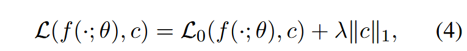

Where c is the concatenation of all coefficients in (2) (3).

**Ticket-drawing stage**

Prune attention heads and intermediate neurons separately (they play different rows) with magnitude-based metric. Attention heads in different layers exhibit different behaviors, so different layers are also pruned individually.

For intermediate neurons, between global and layer-wise pruning, empirical analysis shows that global pruning works better. Meanwhile, it's observed that this algorithm naturally prunes more neurons for the later layers than earlier ones, which coincides with many pruning works on vision tasks.

**Efficient-training stage**

Nothing interesting. The authors note:

- The winning tickets can be trained more effectively than the full model.
- Additionally in practice, the learning rate can also be increased to speed up training, in addition to reducing training steps.
- The benifits of structured pruning: direct reduction in computation and memory costs.

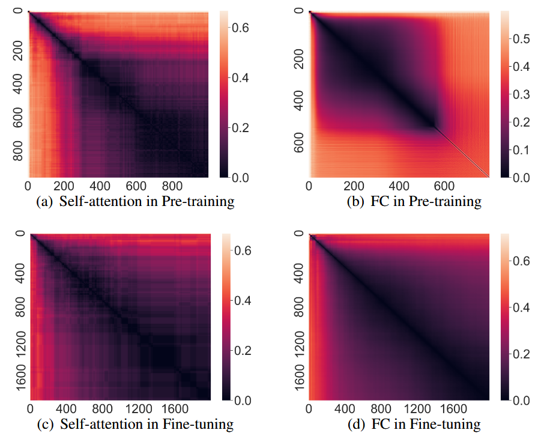

The mask converges quickly (by observing the hamming distance), which indicates the early emergence of the tickets.

Though in (b) the mask of FC diverges later, we can adopt an early exit policy and use the hamming distance as a metric.

To argue that the framework finds the **non-trivial sub-network** (with the same sparsity ratio, randomly pruned model suffers from significant performance drop), the author further prunes heads further and fine-tunes, discovering EarlyBERT fares better than random-pruned ones.

#### The Lottery Ticket Hypothesis: Finding Sparse, Trainable Neural Networks (ICLR 2019)

Observation:

- Contemporary experience is that the sparse architectures produced by pruning are difficult to train from the start
- The sparser the network, the slower the learning and the lower the eventual test accuracy.

**The Lottery Ticket Hypothesis.** A randomly-initialized, dense neural network contains a subnetwork that is initialized such that—when trained in isolation—it can match the test accuracy of the original network after training for at most the same number of iterations.

The pruning approach is **one-shot**. In this work, the author tries **iterative pruning**, with each round pruning p^(1/n)% weights that survive the previous round. The results show that winning tickets that match the accuracy of the original network at smaller sizes than does one-shot pruning.

The critical points:

- Smaller size
- Commensurate accuracy
- Commensurate training time

When randomly reinitialized, winning tickets perform far worse, meaning structure alone cannot explain a winning ticket’s success.

The gap between test and training accuracy is smaller for winning tickets, indicating they generalize better.

**Global training:** prune these deeper networks globally, removing the lowest-magnitude weights collectively across all convolutional layers. Global pruning identifies smaller winning tickets for Resnet-18 and VGG-19. For these deeper networks, some layers have far more parameters than others. When all layers are pruned at the same rate, these smaller layers become bottlenecks, preventing us from identifying the smallest possible winning tickets. Global pruning makes it possible to avoid this pitfall.

Empirical finding: 

- Up to a certain level of sparsity (e.g. 80% for VGG-19) —highly overparameterized networks can be pruned, reinitialized, and retrained successfully; however, beyond this point, extremely pruned, less severely overparamterized networks only maintain accuracy with fortuitous initialization.
- Since we uncover winning tickets through heavy use of training data, we hypothesize that the structure of our winning tickets encodes an inductive bias customized to the learning task at hand.

This finding may help people:

- Improve training performance: design training schemes that search for winning tickets and prune as early as possible
- Design better networks: even be able to transfer winning tickets discovered for one task to many others.
- Improve our theoretical understanding of neural networks.

Limitations:

- Iterative pruning is computationally intensive, requiring training a network 15 or more times consecutively for multiple trials.
- Only investigate unstructured pruning and magnitude pruning. Resulting architectures are not optimized for modern libraries or hardware.
- The winning tickets have initializations that allow them to match the performance of the unpruned networks at sizes too small for randomly-initialized networks to do the same.
- On deeper networks (Resnet-18 and VGG-19), iterative pruning is unable to find winning tickets unless we train the networks with learning rate warmup (why?).

#### The Lottery Ticket Hypothesis for Pre-trained BERT Networks (NIPS 2020)

Two themes: initialization via pre-training and transfer learning

In BERT: the extraordinary cost of pre-training is amortized by transferring to a range of downstream tasks.

Motivation:

- Replace a **pre-trained** BERT with a smaller subnetwork while retaining the capabilities.
- Find universal subnetworks that could replace the full BERT model **without inhibiting transfer**: find these subnetworks at (pre-trained) initialization rather after some amount of training.
- Compared with Prasanna et al:  this work focuses on **unstructured pruning** and **transferability**.

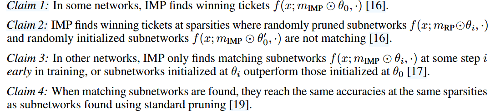

**IMP**: in each iteration, pruning a certain percentage (typically 10%) of the lowest-magnitude weights after training to step t. Then, the remaining weights are rewound to their values from an earlier training point (e.g. from initialization or step i).

**Standard Pruning**: pruning after training the model to completion and does not involve rewinding weights to an earlier point. Instead, the pruned network is fine-tuned further to recover any lost performance due to pruning.

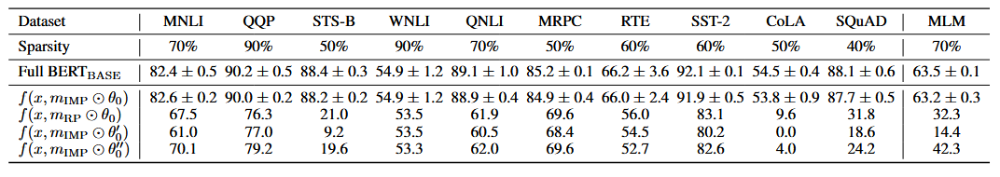

(IMP = iterative magnitude pruning; RP = randomly pruning; θ\_0 = the pre-trained weights; θ′\_0 = random weights; θ′\_0′ = randomly shuffled pre-trained weights.)

**Claim 1: Are there winning tickets?** The evaluation runs IMP on a downstream task to obtain a sparsity pattern and initialize the resulting subnetwork to the beginning. This is identical to the procedure in the initial LTH paper.

Yes to all tasks with different sparsity. There is no discernible relationship between the sparsities for each task and properties of the task itself (e.g., training set size).

**Claim 2: Are IMP winning tickets sparser than randomly pruned or initialized subnetworks?** Yes. Both specific pruned weights and initialization matter. Notice that the weight distributions from BERT pre-training are a somewhat informative starting point according to the experiments. The structure of the pruning mask is crucial for the performance of the IMP subnetworks at high sparsities.

**Claim 3: Does rewinding improve performance?** Not really. Note that they find winning tickets at non-trivial sparsities (i.e., sparsities where random pruning cannot find winning tickets). Rewinding (subnetwork found by IMP is rewound to the weights at iteration i rather than reset to initialization $θ_0$) does **not** notably improve performance for any downstream task. In fact, in some cases (STS-B and RTE), performance drops so much that the subnetworks are no longer matching. This is a notable departure from prior work. A possible explanation for the particularly poor results on STS-B and RTE is that their small training sets result in overfitting. This suggests that the *pre-trained initialization is generally sufficient and effective for training pruned subnetworks.*

**Claim 4: Do IMP subnetworks match the performance of standard pruning?** Standard way: train the network to completion, prune, and train further to recover performance *without rewinding*.

Renda et al. show that, in other settings, IMP subnetworks rewound early in training reach the same accuracies at the same sparsities as subnetworks found by this standard pruning procedure.

For some tasks (QQP, QNLI, MRPC, MLM), standard pruning improves upon winning ticket performance by up to two percentage points. For others (STS-B, WNLI, RTE, SST-2), performance drops by up to three percentage points. The largest drops again occur for tasks with small training sets where standard pruning may overfit.

**Transfer Learning**

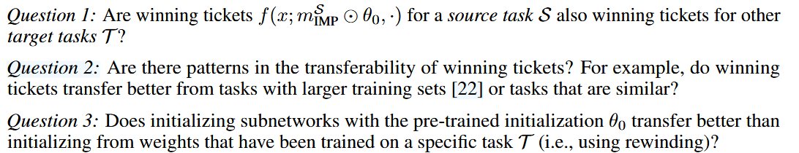

**Question 1: Do winning tickets transfer?** Not really. When performing transfer, sample a new, randomly initialized classification layer for the specific target task. Larger winning tickets (e.g., 40% sparsity for CoLA) may perform disproportionately well when transferring to tasks with smaller winning tickets (e.g., 90% sparsity for QQP). Therefore the evaluations prune IMP subnetworks to fixed sparsity 70%;

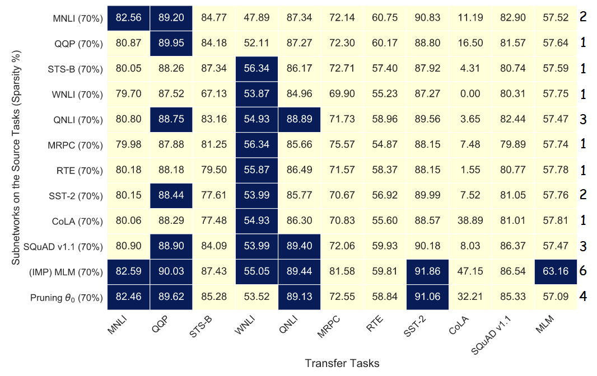

(The transfer performance TRANSFER(S, T) and marked as Dark when it surpasses the performance of training the unpruned BERT on task T)

Since 70% may be too sparse to be winning tickets on the task for which they were found. So the authors also evaluate (TRANSFER(S, T) − TRANSFER(T , T)). Dark cells mean transfer performance matches or exceeds same-task performance:

Although there are cases where transfer performance matches same-task performance, they are the exception. However, if we permit a drop in transfer performance by 2.5 percentage points, then seven source tasks transfer to at least half of the other tasks.

The results show that subnetworks (winning tickets) pruned and fine-tuned on the **Masked Language Modeling (MLM) task**—the pre-training task for BERT—are more **universal**. These subnetworks transfer well to a wide range of downstream tasks, meaning they perform as well on new tasks as they did on the original task for which they were pruned.

Note that we obtain this subnetwork by running IMP on the MLM task: we iteratively train from θ\_0 on the MLM task, prune, rewind to θ\_0, and repeat. If we directly prune the pre-trained weights without this iterative process (last row in the table), performance is worse. With that said, these results are still better than any source task except MLM. So the iterative pruning is proved useful.

**Question 2: Are there patterns in subnetwork transferability?** The authors find that **training dataset size** influences transferability. Tasks with larger datasets (like MLM, SQuAD, MNLI) tend to produce subnetworks that transfer better to other tasks. This is likely because larger datasets help identify more generalizable subnetworks. There is no clear evidence that transferability is directly related to the task type (e.g., sentence pair classification vs. single sentence classification).

**Question 3: Does initializing to θ_0 lead to better transfer?**

For the MLM task, subnetworks rewound to points further into fine-tuning do **not** show better transferability than those rewound to the initial pre-trained weights (θ_0). This suggests that the original pre-training initialization is general enough for effective transfer across tasks.

For some other tasks (like SQuAD), rewinding to specific points in the fine-tuning process results in subnetworks with *slightly* better transfer performance than the pre-trained initialization, suggesting that in certain cases, weights fine-tuned on a source task might generalize better.

**Implications of the paper**: 

- Using the pre-trained initialization, BERT contains sparse subnetworks at non-trivial sparsities that can train in isolation to full performance on a range of downstream tasks
- There are universal subnetworks that transfer to all of these downstream tasks. This transfer means we can replace the full BERT model with a smaller subnetwork while maintaining its signature ability to transfer to other tasks.
- The possible workflow: after the initial pre-training, **perform IMP using MLM** to arrive at an equally-capable subnetwork with far fewer parameters.

#### MetaPruning: Meta Learning for Automatic Neural Network Channel Pruning (ICCV 2019)

Liu et al, 2018: the essence of channel pruning is finding good pruning structure - layer-wise channel numbers, instead of selecting important weights.

Main Idea: learning a meta network (named PruningNet) which generates weights for various pruned structures

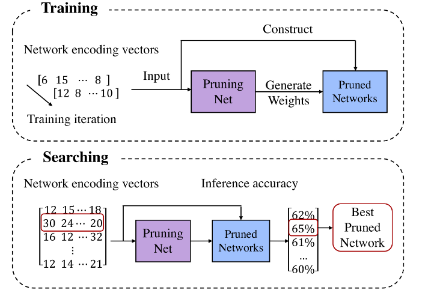

1. Training a PruninigNet: At each iteration, a network encoding vector (i.e., the number of channels in each layer) is randomly generated. The network is trained to generate the weights for Pruned Network.
2. Searching for the best Pruned Network. We construct many Pruned Networks by varying network encoding vector and evaluate their goodness on the validation data with the weights predicted by the PruningNet. No finetuning or re-training is needed at search time.

Note: Different from neural architecture search, in channel pruning task, the channel width choices in each layer is consecutive, which makes enumerating every channel width choice as an independent operation infeasible. Proposed MetaPruning targeting at channel pruning is able to solve this consecutive channel pruning challenge by training the PruningNet with weight prediction. It mainly enables quickly obtaining the "goodness" of all potential pruned network structure by only evaluating on validation data.

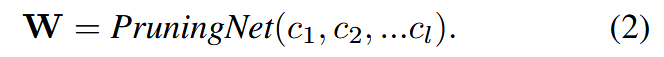

The generated weight matrix is cropped to match the number of input and output channel in the Pruned Network. In the backward pass, instead of updating the weights in the Pruned Networks, we calculate the gradients w.r.t the weights in the PruningNet. 

To find out the pruned network with high accuracy under the constraint, we use an evolutionary search.

#### Coarsening the Granularity: Towards Structurally Sparse Lottery Tickets (ICML 2022)

Motivations:

- Previous LTH investigates only *unstructured sparsity*, which doesn't bring hardware efficiency.
- Traditional channel-wise structural pruning approaches quickly degrade performance.
- Goal: structurally sparse winning tickets at non-trivial sparsity levels (i.e., > 30%), achieve speedup without specialized accelerators while maintaining trainability and expressiveness of dense networks.

Steps of the proposed *refilling* to reorganize the unstructured sparse patterns and make them more hardware friendly:

1. select important channels from the unstructured subnetwork
2. refill the pruned elements to be trainable (change the map element to 1) and are reset to the same random initialization or early rewound weights
3. the rest parameters in the insignificant channels will be removed.

For example:

1. Use l1-norm of the channel weights as the picking criterion.
2. Select top-k scored kernels:
3. For *refilling+*, pick and re-active some extra proportion of channels.

However, the granularity is not fine enough yet. The smallest manageable unit is a kernel. Thus, a *regrouping* strategy is proposed:

- Aim to find dense blocks in sparse matrices.
- To find similar rows and columns before bringing them together, use Jaccard similarity. Those with large similarity can form a denser block. Specifically, each column is seen as a hyperedge and connects corresponding nodes (row), forming pair-wise similarity, which is used to locate an optimal partitioning.
- After forming groups, refill the pruned elements inside. Other elements outside those groups are discarded.

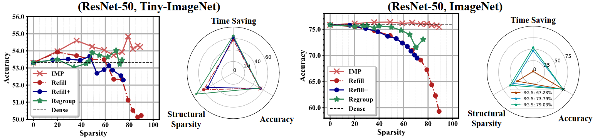

Note that for ImageNet, both Refill and Refill+ don't find the winning ticket.

#### When BERT Plays the Lottery, All Tickets Are Winning (EMNLP 2020)

Main Conclusion: 

1. With **structured pruning** even the worst possible subnetworks remain highly trainable, indicating that **most** pre-trained BERT weights are *potentially* useful.
2. The good subnetworks are **unstable** across random initializations at fine-tuning. This suggests that the self-attention heads do not necessarily encode meaningful linguistic patterns, b/c its success could have more to do with optimization surfaces rather than specific bits of linguistic knowledge.

Main Methods:

1. Magnitude Pruning (10% lowest)

2. Structured Pruning (estimate the importance by the expected sensitivity)

   

   Similarly, generalize to MLP weights. Normalize the importance scores of the attention heads layer-wise (with l2-norm). Alternatively prune MLP and heads while the performance is above 90%.

Empirical Results of different pruning techniques:

- M-pruning: can prune half of the weights, earlier layers slightly more
- S-pruning: important heads tend to be in early and middle stages. Important MLPs are more in the middle.
- S-pruning: Pruning both heads and MLPs together gives better overall results. This suggests that there's **interaction** between heads and MLPs: with fewer MLPs available, the model is forced to rely more on the heads, raising their importance.
- Overall, M-pruning gives higher compression than S-pruning while better reaching the full network performance.
- Randomly sample subnetworks: for M-pruning it resides between the good and bad subnetworks, but for S-pruning, **it performs as well as the good ones**. This suggests that the subset of “good” heads/MLPs in the random sample suffices to reach the full “good” subnetwork performance. It's not clear which of the initialization and the architecture plays a bigger role.
- Self-survivors (contains only heads and MLPs that consistently survived across all seeds for a given task): around 10%-26% in size, lost only 10 performance points on average.
- Bad subnetworks: the elements sampled from those are less likely to survive the pruning. Even the worst is also trainable in principle, losing 15 points. Though more epochs training (fine-tuning) doesn't give better results, on 6 out of 9 tasks, the bad and random networks behave nearly as good as the good ones.
- Degenerate runs (performance much lower than expected) on smaller datasets: the poor match between the model and final layer initialization (the “good” subnetworks are specifically selected to be the best possible match to the specific random seed).
- Good subnetworks are unstable: According to the distribution, at pruning time, most heads and MLPs have a low importance score, and could all be pruned with about equal success. Random initializations in the task-specific classifier interact with the pre-trained weights, affecting the performance of fine-tuned BERT.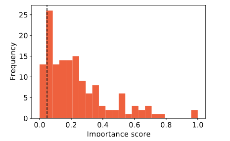
- How Linguistic are the “good” subnetworks: use the fraction of heterogeneous attention as an upper bound estimate on non-trivial linguistic information. The results show that the super-survivors heads do **not** *individually* encode non-trivial linguistic relations (heterogeneous pattern) i.e. the success of good subnetworks is not attributable exclusively to non-trivial linguistic patterns in individual self-attention heads.
- Overlaps of good ones across tasks: motivate future works. The overlaps in the “good” subnetworks are **not** explainable by two tasks’ relying on the same linguistic patterns in individual self-attention heads. They also do not seem to depend on the type of the task. 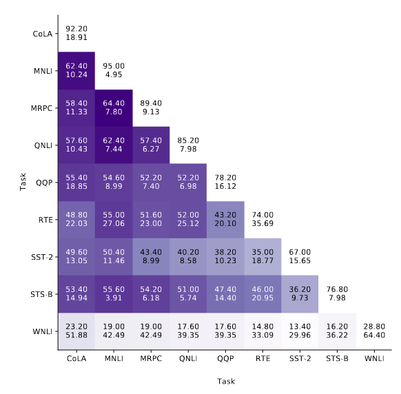

Discussion:

- Whether the bad networks perform well because:
  - Even they contain some linguistic knowledge
  - GLUE tasks are overall easy and could be learned even by random BERT, or even any sufficiently large model
  - The second seems more likely, because the study shows:
    - The good subnetworks are not stable
    - They also do not appear to have interpretable linguistic functions
- There is a trend to automatically credit any new state-of-the-art model with with better knowledge of language. However, what if that is not the case, and the success of pretraining is rather due to the flatter and wider optima in the optimization surface? Can similar loss landscapes be obtained from other, non-linguistic pre-training tasks?

#### Sparse Cocktail: Every Sparse Pattern Every Sparse Ratio All At Once (ICML 2024)

Sparse cocktail is a framework that co-trains a suite of sparsity patterns simultaneously, loaded with multiple sparsity ratios which facilitate harmonious switch across various sparsity patterns and ratios at inference depending on the hardware availability.

Problem: current sparse co-training methodologies are fragmented. Most are confined to one sparsity pattern per run, and only a handful can yield multiple sparsity ratios alongside the dense version.

Motivation:

- Real-world hardware resources can fluctuate immensely based on the specifics of an application
- Sparse accelerators differ in design, each optimized for distinct sparsity patterns
  - Unstructured sparsity (promising acceleration on CPUs, but not on GPUs)
  - Group-wise
  - Channel-wise
  - N:M sparsity
- The resource needs and provisions of an ML system evolve over time, necessitating the ability for “insitu” adaptive toggling between different sparsity ratios to meet dynamic system demands.
- This work focuses on finding a series of networks with different sparsity patterns and ratios, so the time of this process is not the major focus.

Idea:

- Sparse co-training: alternates between various sparsity pattern training phases, meanwhile incrementally raising the sparsity ratio across these phases.
- Consider three patterns: unstructured pruning, channel-wise sparsity, and N:M sparsity

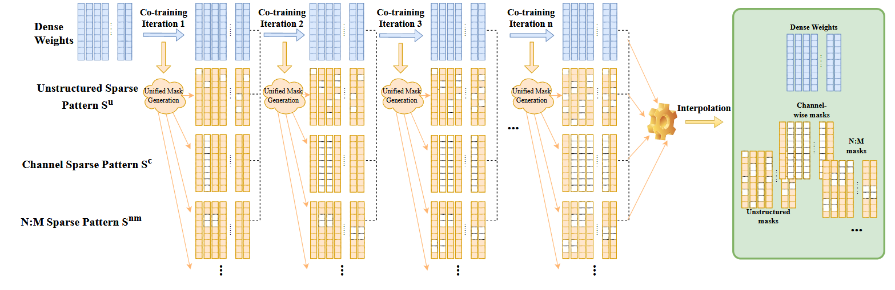

1. Initialize three subnetworks with three sparsity patterns via IMP.
2. Within each iterative co-training phase, rewind the weights to around 5-th epoch and alternatively train subnetworks of diverse patterns.
3. Employ an interpolation-driven network merging technique.

**Unified Mask Generation**

To avoid the sparse pattern influencing each other adversely, the paper introduces UMG to *design and jointly produce* three masks grounded on the criterion of individual weight magnitudes.

For unstructured and N:M patterns, the masks are selected based on weight magnitude. The difference is the former selects weights globally and the latter ranks weights every M contiguous M weights.

For the channel-wise mask, the non-pruned weights of both unstructured and N :M patterns guide the decision on which channels to eliminate.

This effectively addresses the problem that when a single parameter exists in multiple subnetworks simultaneously, it can induce conflicting gradient directions.

**Dense Pivot Co-training**

Naively applying Alternate Sparse Training (AST) doesn't give good results because of the strong divergence between sparsity patterns when alternatively training various subnetworks.

Thus, the paper responds with the introduction of a **dense training phase** as a buffer between two sparse subnetwork updates.

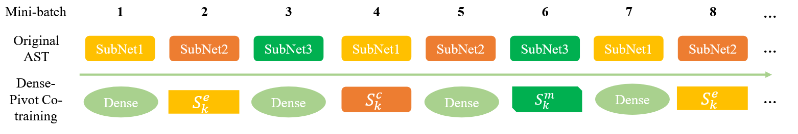

Orthogonol to weight rewinding:

- Weight rewinding is an epoch-level operation.
- Dense Pivot Co-training inserts a dense network training step before each mini-batch of the sparse co-training, where parameters are shared and continuously updated without rewinding and it is operated on a mini-batch level.

### Distillation

#### Zero-shot Knowledge Transfer via Adversarial Belief Matching (NIPS 2019)

This paper introduces a novel technique that trains a student to match the predictions of its teacher **without using any data or metadata**. It trains an **adversarial generator** to search for images on which the student poorly matches the teacher, and then using them to train the student.

Problems:

- The adversarial generator G is not contrained to produce real or bounded images and may explore where the teacher hasn't been trained, which is useless to learn. In practice this is not a concern because the density of decision boundaries is smaller outside of the real image manifold, and so G(z; φ) may struggle to fool the student in that space due to the teacher being too predictable.
- G may iterate over adversarial examples. By Ilyas et al, 2019, who isolate adversarial features and show that they are enough to learn classifiers that generalize well to real data, non-robust features, in a human sense, still contain most of the task-relevant knowledge. Therefore, the generator can still feed useful signals to the students.

In practice, evaluation reveals that this method is quite robust again hyper-parameters and dataset changes. The zero-shot learning is only suboptimal compared with KD+AT full data with little gap, and is much more performant than KD, KD+AT, VID (Ahn et al. 2019), and no teacher training.

During training, the average probability of the class predicted by the teacher is about 0.8. On the other hand, the most likely class according to student has an average probability of around 0.3. This suggests that the generator focuses on pseudo data close to the decision boundaries of the student. The classes of pseudo samples are close to uniform distribution. That's because the generator seeks to make the teacher less predictable in order to "fool" the student.

#### Self-Distillation: Towards Efficient  and Compact Neural Networks (TPAMI 2022)

Self-distillation attaches several attention modules and shallow classifiers at different depths of neural networks and distills knowledge from the deepest classifier to the shallower classifiers. 

- Better performance: 3.49 and 2.32 percent accuracy boost are observed on CIFAR100 and ImageNet; it reduces the training overhead compared with conventional knowledge distillation.
- Applicability: it can be combined with other model compression methods, like KD, pruning and lightweight model design.

Motivation:

- The choice of teacher models: the choice of teacher models has a great impact on the accuracy of student models and the teacher with the highest accuracy is not always the best teacher for distillation
- The efficiency of knowledge transferring: student models can not always achieve as high accuracy as teacher models do
- In conclusion, it’s still hard to get an accurate, efficient and compact student model at the same time!

Note that in this process, self-distillation is a **one-stage** training method where the teacher model and student models can be trained together, instead of two-stage conventional distillation. The one-stage property of self-distillation further reduces training overhead. Moreover, the self-distillation and conventional knowledge distillation methods can be utilized together to achieve better results.

Self-distillation allows neural networks to perform **dynamic inference** according to the input image: the deep classifiers can produce more accurate classification results while the shallow classifiers can give quick results with slightly lower accuracy. For example, more than 95 percent images in CIFAR100 dataset can be classified by the shallowest classifier of ResNet18 with 3 percent higher accuracy and 3 times acceleration than the baseline model.

Suppose the g is the (shallow/final) classifiers and f is the intermediate feature extractor operators, we have a series of classifiers:

where each is a series of extractors followed by the shallow classifiers (g_i), among which g_k is the final classifier. Each shallow classfier contains a feature alignment layer (guarantee that the feature dimension in the shallow layer is equal to the feature dimension of last layer) and softmax layer.

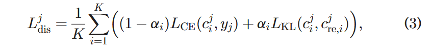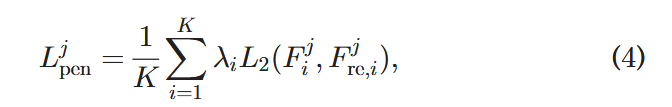

Apart from the loss in (3), they also add a penalty as (4) called hint loss (motivated by FitNet). F\_{re, i} stands for reference feature (just like c\_{re,i} stands for reference label).

The final classifier g_K is only trained by the CE loss (with the ground truth, like the normal training), so the corresponding \alpha and \lambda are set to 0. Other shallow classifiers are trained based on reference labels (CE loss, comparing with the ground truth), distillation knowledge (KL divergence with the reference output, the final classifier by default), as well as the feature hints (L2 norm divergence with the final classifier by default):

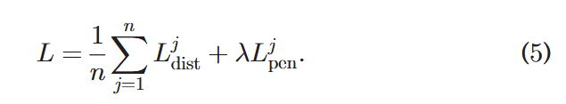

As for the choices for reference labels c\_{re} and reference features F\_{re}:

- The four below achieve similar results and the scheme is not sensitive.
- Deepest teacher distillation. The deepest classifier is used as the reference labels and the reference features for all shallow classifiers. *Chosen as the default choice.*
- Ensemble Teacher Distillation. An ensemble of labels and features produced by all classifiers are used as the reference labels and the reference features.
- Transitive Teacher Distillation. This distillation chooses the reference label and the reference feature transitively (similar to the idea of *teacher assistant*s.
- Dense Teacher Distillation. The dense distillation connects all the label and feature information among all classifiers.

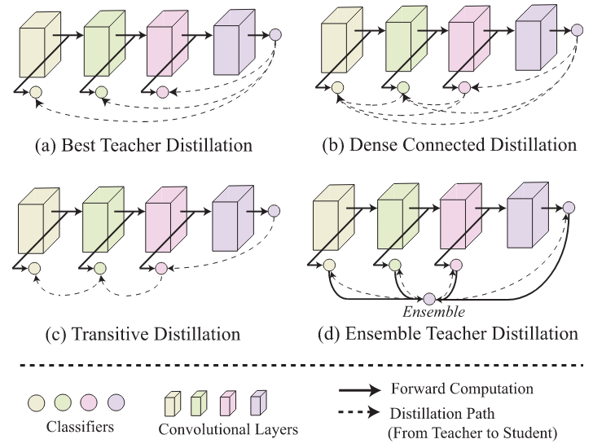

Compared with the conventional distillation methods where the teacher and student are two or several individual neural networks, the proposed self-distillation method simultaneously trains all k classifiers.

**Shallow Classifiers**: as mentioned before, it's composed of a softmax layer and the feature alignment layer.

The feature alignment layer first extracts the useful intermediate features by the *attention module*, followed by the *alignment net* to adjust the feature size so that the squared l2-norm loss between shallow features and reference feature makes sense.

The *attention module* is composed of a depthwise-pointwise layer and bilinear interpolation (served as the attention value) and a dot product of attention values and the original value, as shown in (a); the architecture of align nets is shown in (b).

**Dynamic Inference**

Set different thresholds for shallow classifiers. If the maximal output of softmax is larger than the corresponding threshold, its results will be adopted as the final prediction so much computation can be reduced. Otherwise, the neural networks will employ a deeper classifier to predict.

If there is no shallow classifier which can provide confident prediction, the ensemble of all the classifiers is regarded as the final result.

Since all the classifiers in selfdistillation share the same backbone layers, there is not much extra computation introduced. Moreover, experiments show that most of images can be classified by the shallowest classifier correctly.

Moreover, the threshold-based dynamic inference provides more flexibility in the real-world application. It permits models to dynamically adjust its trade-offs between response time and accuracy on the fly by adjusting the thresholds of shallow classifiers.

In the proposed self-distillation, genetic algorithm is applied to find the best thresholds. The value of thresholds in different shallow classifiers are encoded into binary codes as the genes. The accuracy and acceleration results are utilized to measure the fitness of the threshold.

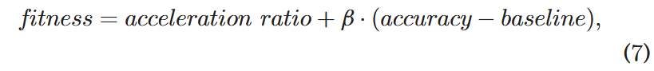

**Evaluations on CIFAR-100**

- Self-distillation leads to accuracy boost; in some networks, shallow classifiers achieve better accuracy; in all networks, the second shallowest classifier achieves higher accuracy than their baseline models.

- To achieve the same accuracy, self-distilled models can be 1.8-11x faster (less parameters).

- Evaluations on ImageNet reveal similar results, and meanwhile find that more benefits can be found in neural networks with more layers.

- Self-distillation and the other knowledge distillation methods (evaluations on KD, AT, and DML) can be utilized together to attain more improvements on accuracy.

- The proposed self-distillation is orthogonal to other neural network compression methods such as pruning (evaluations on L1-norm and fisher pruning).

  - In all kinds of situations, the accuracy improvements from self-distillation can be kept after pruning.
  - With the same parameters, the self distilled models have higher accuracy. With the same accuracy, the self distilled models have fewer parameters.

- The proposed dynamic inference leads to benefits on both model accuracy and acceleration, while providing good trade-offs.

  - For the most shallow classifier: 
  - The higher the threshold is, the more classification accuracy is achieved, and the fewer images can be classified. 
  - Even with a very high threshold (0.99), there are more than 30 percent images can be classified.
  - Even with a very low threshold (0.5), the shallowest classifier can achieve higher classification accuracy than the baseline model (79.01 percent).

- Number of classifiers (evaluations on ResNet 50/101, ResNeXt50, WideResNet50): 3-5 works the best. Too many shallow classifiers may harm the performance of self-distillation.

- Places of classifiers: only compare the accuracy of the deepest classifier. On average, the uniform scheme achieves the highest accuracy boost (2.79 percent) while the shallow layer scheme leads to the lowest accuracy increment (2.26 percent). Even in the worst situation, self-distillation still outperforms all the other knowledge distillation methods. Conclusion: not very sensitive.

  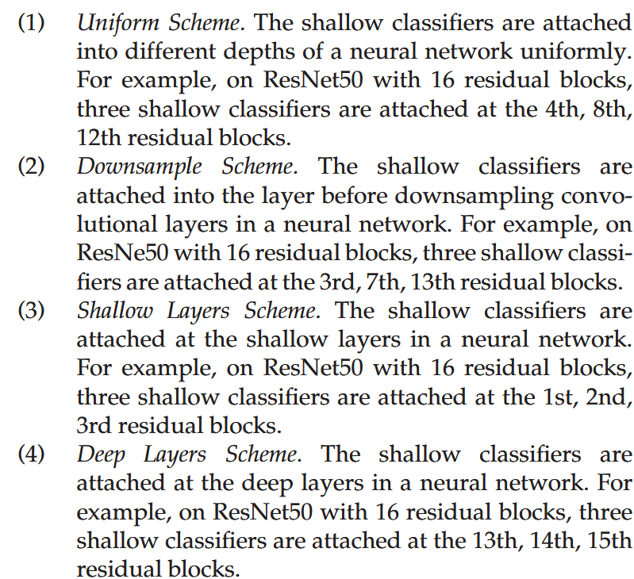

#### Undistillable: Making A Nasty Teacher That CANNOT teach students (ICLR 2021)

Idea: build a specially trained teacher network that yields nearly the same performance as a normal one, but would significantly degrade the performance of student models learned by imitating it --> self-undermining knowledge distillation.

Concerns of KD (especially data-free KD)：

- Clone the model without accessing original training data
- Even worse, reverse-engineering private training data is possible, threatening data privacy and security

Formulation of KD:

Self-Undermining Knowledge Distillation

- Idea: maintain its correct class assignments, maximally *disturbing its in-correct class assignments* so that no beneficial information could be distilled from it.
- Formulation of the nasty teacher learning: maximize the KL divergence between the adversarial network and the nasty teacher (similarly with a temperature; use *w* to balance the behavior between normal training and adversarial learning)
- Implementation: same network architecture for T (nasty teacher) and A (adversarial learning counterpart, uses as a normally trained model that's in contrast with the nasty teacher)

Evaluations:

1. The nasty teacher has only around 2% accuracy drop compared with normal counterparts.
2. No student network can benefit from distilling from nasty teachers, which indicates that the nasty teacher successfully provide a false sense of generalization to student networks.

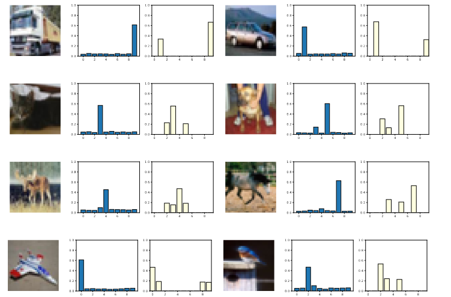

The 2nd and the 5th columns summarize the scaled output from the normal teacher. The 3rd and the 6th columns represent the scaled output from the nasty teacher: the multi-peak logits misleads the learning from the knowledge distillation and degrades the performance of students.

The visualizations of t-Distributed Stochastic Neighbor Embedding (t-SNE) also show that feature-space inter-class distance of nasty ResNet-18 and the normal ResNet-18 behaves similarly, while the logit response of nasty ResNet-18 has been heavily shifted:

Ablation study:

- Weaker **adversarial networks** lead to less effective nasty teachers; stronger adversarial networks don't always provide stronger effects (saturate easily).
- Stronger **student networks** may benefit from distilling a weaker teacher (e.g. ResNet-50 as a student and ResNet-18 as the teacher), but will degrade by distilling from a nasty teacher.
- Nasty teachers can degrade the performance of student networks no matter what ω (when training the nasty teacher), α (when student distills) or temperature is selected.
  - By adjusting ω, we could also control the trade-off between performance suffering and nasty behavior.
  - Performance of student networks would be degraded more given higher temperature, since a larger temperature usually lead to more noisy logit outputs.
  - We also observe that a small α (less dark information) can help student networks perform relatively better (intuitively). However, a small α also makes the student depend less on the teacher’s knowledge and therefore benefit less from KD itself. This shows the effectiveness of the defense proposed.
- In practice, stealers (student networks) may not have full access to all training examples, but the nasty teachers still consistently detriment student networks.

#### Training data-efficient image transformers  & distillation through attention （PMLR 2021)

- Competitive convolution-free transformers by training on Imagenet only.
- Trained on a single computer in less than 3 days.
- Introduce a teacher-student strategy specific to transformers: the student learns from the teacher through attention by **distillation token**.
- Interestingly, with this method of distillation, image transformers learn more from a convnet than from another transformer with comparable performance.

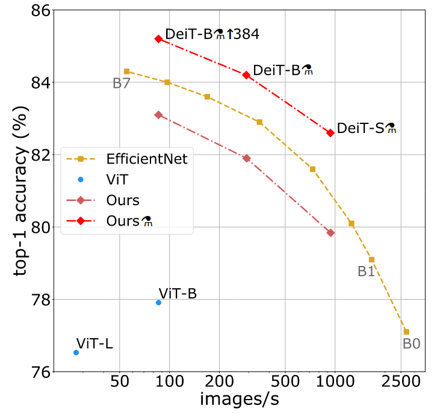

Soft Distillation (e.g. in Hinton et al, 2015):

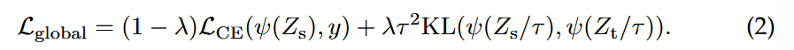

where $Z_t$ is the logits of the teacher model and $Z_s$ is the logits of the student.

**Hard-label Distillation** (Introduced in this work):

Let $y_t = argmax_c Z_t(c)$ be the hard decision of the teacher. For a given image, the hard label associated with the teacher may change depending on the specific data augmentation (like cropping).

The hard labels can be converted into soft ones with *label smoothing* by assigning the true label $1-\epsilon$ and the rest shared across other classes. This paper consider $\epsilon$ to be 0.1.

**Distillation token**

Like class token, the distillation token is added to the patch tokens.

The additional distillation token interacts with other embeddings through self-attention, and is output by the network after the last layer. Its target objective is given by the distillation component of the loss. The distillation embedding allows the model to learn from the output of the teacher, as in a regular distillation, while remaining complementary to the class embedding.

As the class and distillation embeddings are computed at each layer, they gradually become more similar through the network, all the way through the last layer at which their similarity is high (cos=0.93), but still lower than 1. This is expected since as they aim at producing targets that are similar but not identical.

They use both the true label and teacher prediction during the *fine-tuning* stage at higher resolution.

Observations:

1. Using a convnet teacher gives better performance than using a transformer. The experiments use RegNetY-16GF trained with the same data and same data-augmentation as DeiT.
2. Hard distillation significantly outperforms soft distillation for transformers, even when using only a class token.
3. Increasing the number of epochs significantly improves the performance of training with distillation. It achieves comparable accuracy after 300 epochs and can improve without fast saturation (400 epochs without distillation).
4. As for transfer learning, DeiT is on par with competitive convnet models.
5. Transformers require a strong data augmentation: almost all the data-augmentation methods prove to be useful.

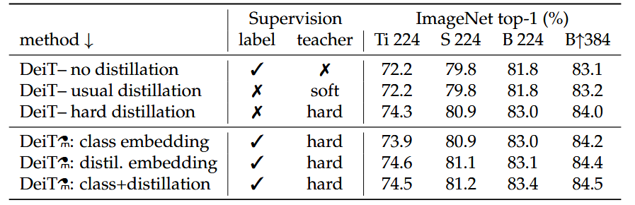

The last three rows use the proposed distillation method (token-based). The last column means fine-tuning with higher resolution.

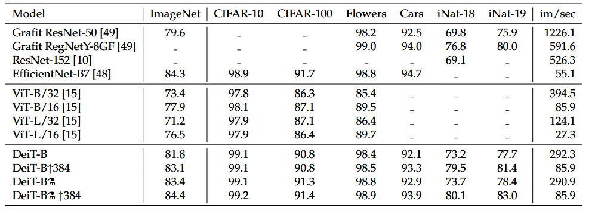

Here, the experiments include the performance when training from scratch on a small dataset, without Imagenet pre-training. They tried to get as close as possible to the Imagenet pre-training counterpart with long schedules.

#### Analyzing the Confidentiality of Undistillable Teachers in Knowledge Distillation (NIPS 2021)

Problem: many forms of distillation may unintentionally leak the IP of a teacher model.

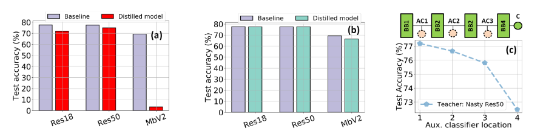

(a) shows the effect of the nasty teacher proposed by Ma et al. and (b) shows the effect of skeptical students proposed in this paper. (c) shows the impact of transferring knowledge at various depth of a ResNet18 from a nasty teacher. BB means basic blocks. The authors discover that the impact of the nasty teacher drastically reduces as we transfer knowledge to a shallow subsection of the student.

A **skeptical student** uses an intermediate shallow auxiliary classifier to transfer the information derived through the soft probabilities of the teacher’s output classes. They propose a **hybrid distillation** to improve learnability of the student by **distilling from a teacher and the student itself**, which is similar to *self-distillation (SD)*. Apart from difference in the propose, the hybrid distillation here can steal IP without data (**data-free**), while SD is used for scenarios where students have access to training data.

The evaluation shows that:

- This method can improve performance when distilling from a nasty teacher, and
- Perform similar to scenarios when distilling from normal teachers.

Similar to the undistillable paper, this paper assumes **no** access to the intermediate features of the teacher.

Def: The model is a *secondary student* if it's trained via KD from a *primary student*, who was earlier trained via KD from a teacher. *Transferability impact (TI)* of a *teacher* is the performance improvement of a secondary student w.r.t. the baseline. A negative impact signifies the success of a teacher's privacy or confidentiality preserving effort.

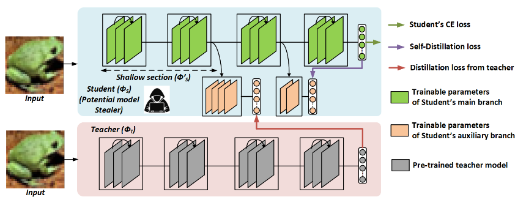

Skeptical students transfer the teacher's KL-div driven knowledge at a *shallow section*; additionally, a third loss is added from the final classifier to shallow ACs (auxilliary classifiers, removed during inference). Thus, we transfer from (1) to (2)(3):

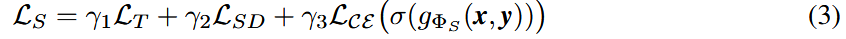

Note that (2) is a summation over all ACs, and the last term corresponds to the CE loss of the complete student

Here, γ1, γ2, and γ3 are hyperparameters to balance the KD loss of the auxiliary classifier, self-distillation loss, and the CE loss of the student.

For **data-free KD**, there's no CE loss to train the whole network. The authors propose an **auxiliary self distillation** loss to distill knowledge to the final classifier from the intermediate auxiliary classifier. The same auxiliary classifier works as a student to learn from a teacher under the data-free scenario.

The first term takes care of knowledge transfer from the teacher, while the second term helps train the final classifier.

The training of a nasty teacher:

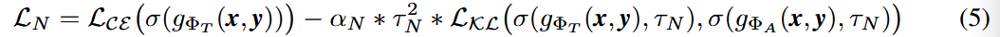

**Evaluations**

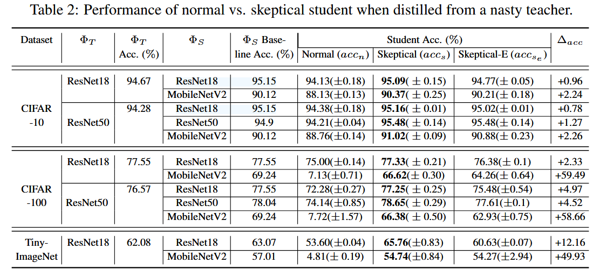

Here, Skeptical-E means classification performance by ensembling the ACs and final classifier outputs, which is inferior to Skeptical due to inferior performance of the AC that distills knowledge from the nasty teacher. ∆acc = {max(acc_s, acc_{s_e} ) - acc_n} Table 2 shows the effectiveness of the proposed method.

For *normal teachers*, Skeptical-E performs better!

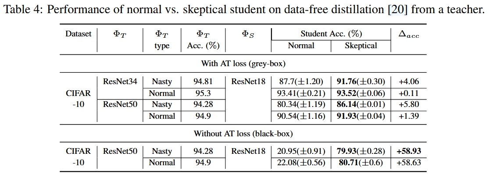

Even useful for data-limited or data-free scenarios.

Finally, a skeptical student not only reduces the nastiness of a teacher on its own performance, but also *breaks the chain of transferability of nastiness to a secondary student*. For this experiment, they use a skeptical student trained from a nasty teacher (ResNet50) as a teacher for a secondary student on CIFAR-100.

I personally think the last few evaluations are not extensive and solid enough...

#### TinyBERT: Distilling BERT for Natural Language Understanding (EMNLP 2020)

The authors adopt a new **two-stage** learning framework and performs Transformer distillation at both the pre-training and task-specific learning stages. This framework ensures that TinyBERT can capture the general-domain as well as the task-specific knowledge in BERT.

TinyBERT, 4 layers, achieves 96.8% performance of its teacher and is 7.5x smaller and 9.4x faster. Moreover, TinyBERT6 with 6 layers performs on-par with its teacher BERT_{BASE}.

Three types of loss when transformer distillation:

- The output of the embedding layer
- The hidden states and attention matrices derived from the Transformer layer
- The logits output by the prediction layer

The M-layer student network needs to absorb the knowledge in the N-layer teacher. Define a function `n=g(m)` to map the indices. The m-th layer of student model learns the information from the g(m)-th layer of teacher model, and `0=g(0)` and `N+1=g(M+1)` (index of prediction layer). 

The hidden state is calculated by:

The W_h is a learnable project matrix because the hidden states don't have the same dimension (student's smaller).

similar for embedding-layer distillation. The prediction-layer distillation is the original one introduced by Hinton et al.

Eventually:

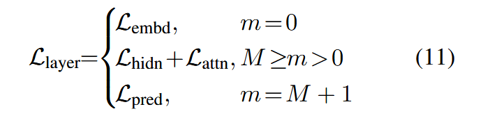

**General distillation**

In this stage, the prediction layer distillation is not performed by empirical results, because we only want the student to learn the intermediate language representation. In this stage, TinyBERT performs generally worse than BERT because of the limited hidden/embedding size and the layer number. However, it provides a good initialization for task-specific distillation.

**Task-specific distillation**

Previous studies show that the complex models, such as finetuned BERTs, suffer from over-parametrization for domain-specific tasks. A data augmentation method is proposed to improve the generalization ability of the student model.

To achieve **data augmentation**, the authors use the language model to predict *word replacement* for single-piece words using word embeddings (e.g. GloVe) to retrieve word replacements for multiple-pieces words (A word is tokenized into multiple word-pieces by the tokenizer of BERT).

**Evaluation setup**

Original BERT_base: N=12, d=768 (hidden size), d_i=3072 (feedforward/filter size), h=12 (head number), 109M parameters

TinyBERT_4: M=4, d'=312, d_i'=1200, h=12, 14.5M parameters.

TinyBERT_4 learns from every 3 layers of BERT_base.

The results show that the proposed method achieves SOTA with comparable or less parameters. For example, with the same speedup, TinyBERT_4 achieves constantly better results than BERT_tiny; and it provides better results and higher speed than BERT_small.

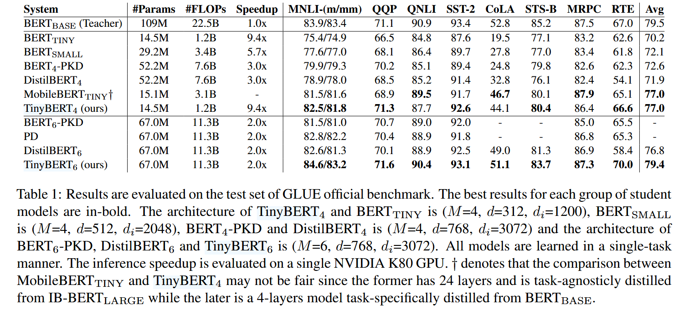

Note that BERT-PKD and DistilBERT initialize their student models with pretrained BERT, which makes the student models have to keep the same size settings of Transformer layer (or embedding layer) as their teacher. TinyBERT is more flexible in this sense.

### Attentions

#### FLASHATTENTION: Fast and  Memory-Efficient Exact Attention with IO-Awareness (NIPS 2022)

Motivations:

- Self-attention module at their heart has time and memory complexity quadratic in sequence length.
- Approximate attention methods have attempted to address this problem by trading off model quality to reduce the compute complexity, but often do not achieve wall-clock speedup. One main reason is that they focus on FLOP reduction (which may not correlate with wall-clock speed) and tend to ignore overheads from memory access (IO).
- Common Python interfaces to deep learning such as PyTorch and Tensorflow do not allow fine-grained control of memory access.

This work:

- Make attention algorithms IO-aware, accounting for reads and writes between levels of GPU memory.
  - Propose FLASHATTENTION, an IO-aware exact attention algorithm that uses tiling to reduce the number of memory reads/writes between GPU high bandwidth memory (HBM) and GPU on-chip SRAM.
- Implement FLASHATTENTION in CUDA. Even with the increased FLOPs due to recomputation, our algorithm both runs faster (up to 7.6x on GPT-2) and uses less memory—linear in sequence length.
- Show that FLASHATTENTION can serve as a useful primitive for realizing the potential of approximate attention algorithms by overcoming their issues with memory access overhead.
- Implement block-sparse FLASHATTENTION, a sparse attention algorithm that is 2-4 faster than even FLASHATTENTION, scaling up to sequence length of 64k.
- This leads to
  - Faster model training
  - Higher quality models: enables the first Transformer that can achieve better-than-chance performance on the Path-X challenge, solely from using a longer sequence length (16K)

To avoid reading and writing the attention matrix to and from HBM: (i) computing the softmax reduction without access to the whole input (ii) not storing the large intermediate attention matrix for the backward pass.

The paper proposes two techniques to address this: **tiling** and **recomputation**.

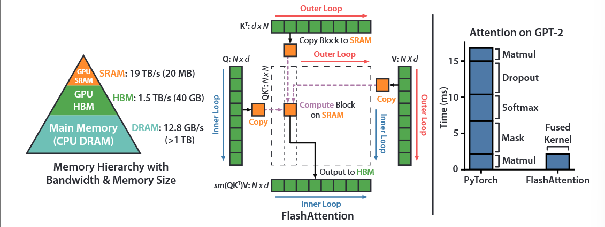

Note that softmax is applied row-wise.

The main idea is that we split the inputs Q, K, V into blocks, load them from slow HBM to fast SRAM, then compute the attention output with respect to those blocks. By scaling the output of each block by the right normalization factor before adding them up, we get the correct result at the end.

**Tiling**

**Recomputation**

The backward pass requires S and P matrix to compute gradients. By storing O and the softmax normalization statistics (m, l), we can recompute S and P from Q, K, V in SRAM.

**Implementation**

Tiling enables us to implement our algorithm in one CUDA kernel, loading input from HBM, performing all the computation steps (matrix multiply, softmax, optionally masking and dropout, matrix multiply), then write the result back to HBM. This avoids repeatedly reading and writing of inputs and outputs from and to HBM.

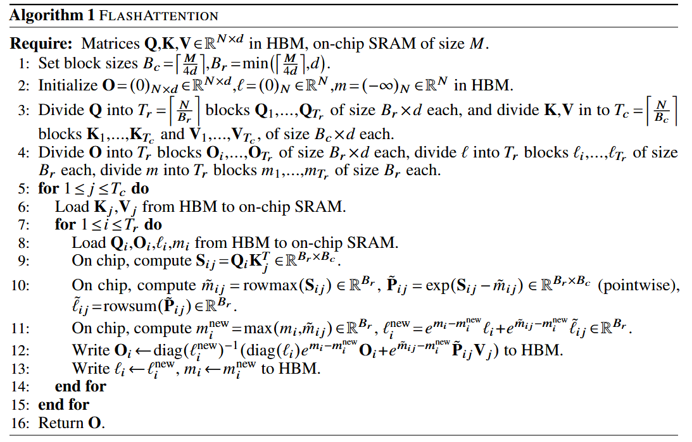

A clear explanation in Chinese: 【Flash Attention 为什么那么快？原理讲解】 https://www.bilibili.com/video/BV1UT421k7rA/?share_source=copy_web&vd_source=c2d939e107fc1b103d5e10197e62daa7

### Mixture-of-Experts

#### Switch Transformers: Scaling to Trillion Parameter Models  with Simple and Efficient Sparsity (JMLR 2022)

Problem:

- MoE models have had notable successes in machine translation. However, widespread adoption is hindered by complexity, communication costs, and training instabilities.

Contribution:

- Scaling properties and a benchmark against the strongly tuned T5 model. 7x+ pre-training speedups while still using the same FLOPS per token.
- Successful distillation of sparse pre-trained and specialized fine-tuned models into small dense models. We reduce the model size by up to 99% while preserving 30% of the quality gains of the large sparse teacher.
- Improved pre-training and fine-tuning techniques.
- An increase in the scale (up to a trillion params) achieved by efficiently combining data, model, and expert-parallelism. These models improve the pre-training speed of a strongly tuned T5-XXL baseline by 4x.

Idea:

- The parameter count, independent of total computation performed, is a separately important axis on which to scale.
- In distributed training setup, sparsely activated layers split unique weights on different devices. Therefore, the weights of the model increase with the number of devices, all while maintaining a manageable memory and computational footprint on each device.

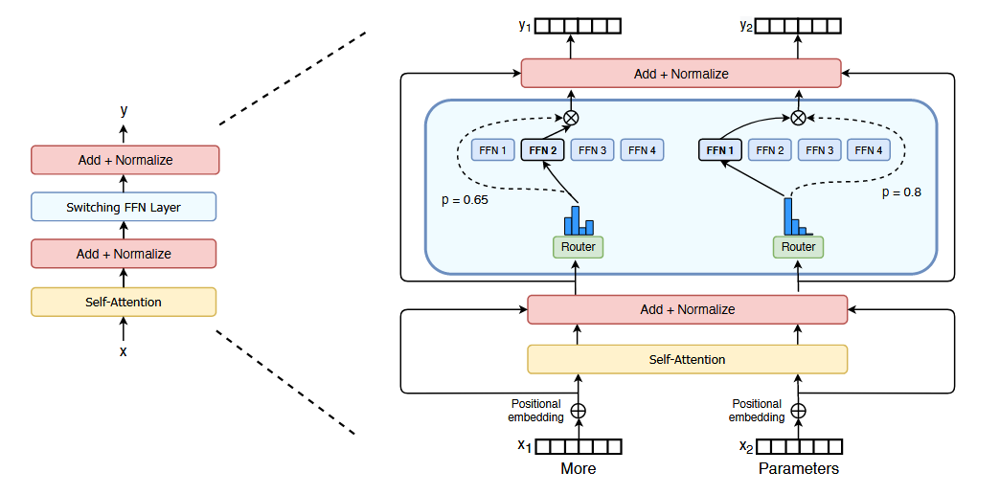

The original FFN is replaced with a sparse Switch FNN layer, which routes each token independently. The switch FFN layer returns the output of the selected FFN multiplied by the router gate value (dotted-line).

**Switch Routing**

Shazeer et al. (2017) conjectured that routing to k > 1 experts was necessary in order to have non-trivial gradients to the routing functions. For example, in that paper, they select the top-k experts from N of them. The router variable W_r produces the logits `h(x) = w_x * x` and the logits are normalized via softmax. The top-k experts are linearly combined using the normalized scores.

This paper, however, proposes `k=1`, which preserves model quality, reduces routing computation and performs better. This has three-fold advantages:

- Route computation reduction.
- The batch size (expert capacity) can be at least halved since each token is only being routed to a single expert.
- The routing implementation is simplified and communication costs are reduced.

(A larger **capacity factor** alleviates the overflow issue, but also increases computation and communication costs)

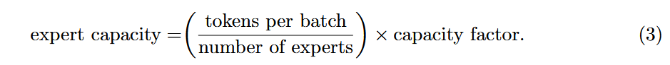

If too many tokens are routed to an expert (dropped tokens), computation is skipped and the token representation is passed directly to the next layer through the residual connection. In this paper, the author adds a **load balancing loss**.

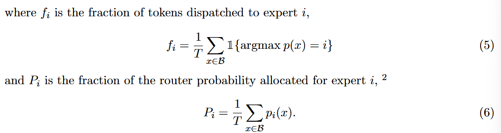

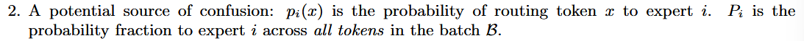

The desired value for both f and P is 1/N. The loss is minimized upon uniform routing. Multiplying by N in (4) is for keeping the loss constant as the number of experts varies (The expected value of (4) is \alpha).

Pretrained on “Colossal Clean Crawled Corpus” (C4) using masked language modeling task (15% masked):

- Switch Transformers outperform both carefully tuned dense models and MoE Transformers (top-2 experts) on a speed-quality basis.
- The Switch Transformer has a smaller computational footprint than the MoE counterpart. If we increase its size to match the training speed of the MoE Transformer, we find this outperforms all MoE and Dense models on a per step basis as well.
- Switch Transformers perform better at lower capacity factors (1.0, 1.25).

**Training difficulties**

For the hard-switching (routing) and low precision bfloat16 (may be harmful to softmax computation). Instead of using float32, it's shown that **selectively casting** to float32 precision within a localized part of the model introduces stability to the training. It permits equal speed to bfloat16 training while conferring float32 stability.

Importantly, the float32 precision is only used within the body of the router function—on computations **local** to that device. When communicating between devices, they are recast into bfloat16.

The authors also show that by giving lower deviation when initializing can improve stability (better avg quality and standard deviation of qualities).

Since this paper focuses on NLP tasks and adopts the pretraining+fine-tuning scheme, preventing overfitting with regularizations is very important especially for this outrageously big model. The authors introduce **expert dropout**. During fine-tuning, increae the dropout rate dramatically at the interim feed-forward computation at each expert layer, and give a lower dropout rate for other layers. Evaluation shows it works the best.

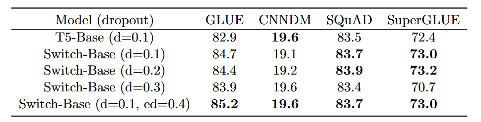

**Scaling properties (pre-training)**

The number of experts is the most efficient dimension for scaling the model. It doesn't introduce larger computational cost.

It's observed from the figure below that:

- When keeping the FLOPS per token fixed, having more parameters (experts) speeds up training.
- Increasing the number of experts leads to more sample-efficient models (achieves the same performance with far fewer training steps). Larger models are also more sample-efficient, consistent with Kaplan et al, 2020.

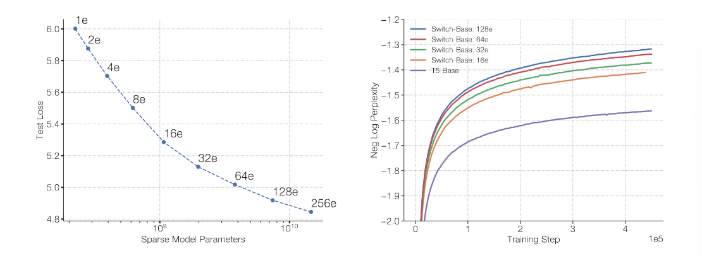

(Note that for the left figure, the upper-left point denotes T5-Base model with 223M params. They double the number of experts at a time)

The right figure above shows the perplexity of model in terms of training step, which doens't translate into wall-clock time because more experts means more communication overhead. The question raised next is that *for a fixed training duration and computational budget, should one train a dense or a sparse model?*

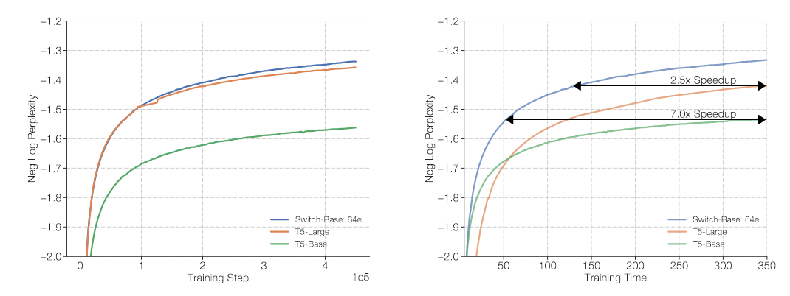

The authors show (by the two figures above) that we should choose the switch transformer even if with the same real-world compute resources. For the second figure, left: Switch-Base is more sample efficient than both the T5-Base, and T5-Large variant, which applies 3.5x more FLOPS per token; right: on a wall-clock basis, Switch-Base is still faster, and yields a 2.5x speedup over T5-Large.

**Downstream results: fine-tuning** 

Compare FLOP-matched Switch models to the T5-Base and T5-Large baselines: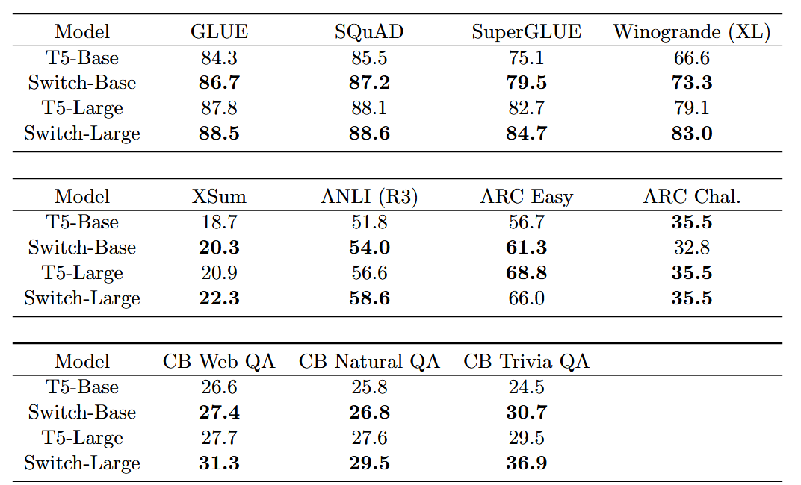

**Distillation**

Here only distillation into small dense models is considered. Initializing the dense model with the non-expert weights yields a modest improvement. Use a mixture of 0.25 for the teacher probabilities and 0.75 for the ground truth label. This combination preserve 30% quality gains (quality difference between Switch-Base (Teacher) and T5-Base (Student), preserving 100% indicates the student performs as good as the teacher) from the larger sparse models with 1/20 params.

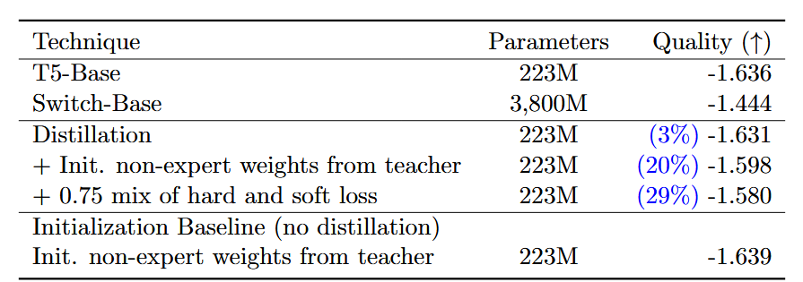

Distilling a fine-tuned SuperGLUE model (for downstream tasks):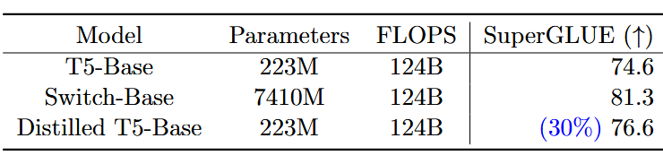

On smaller data sets, the large sparse model can be an effective teacher for distillation.

**Designing Models with Data, Model, and Expert-Parallelism**

Omitted for now.

## Privacy-Preserved Learning

#### AutoReP: Automatic ReLU Replacement for Fast Private Network Inference (ICCV 2023)

Goal: protect clients' data privacy and security.

**Private inference (PI)** techniques using cryptographic primitives offer a solution but often have high computation and communication costs, particularly with non-linear operators like ReLU.

**AutoReP**: a gradient-based approach to lessen non-linear operators and alleviate these issues.

Previous Ideas:

- Replace ReLUs with linear functions / low degree polynomials
- Design neural architectures with fewer ReLUs
- Ultralow bit representations

Weaknesses of these:

- require a heuristic threshold selection on ReLU counts, therefore can not effectively perform design space exploration on ReLU reduction, resulting in sub-optimal solutions
- result in a significant accuracy drop on large networks and datasets

Research questions:

- Which non-linear operators should be replaced
- What to be replaced with to maintain a high model accuracy and expressivity, especially for large DNNs and datasets

Consider a two party setting `[x] <- (x_{s_0}, x_{s_1})`:

- Share generation: sample a random value `r`, the shares are generated by `[x] <- (r, x-r)` 
- Share recovering: `x <- x_{s_0}+x_{s_1}`

Suppose we have two secret shared matrices `[x]` and `[y]`. Most operators can be implemented with scaling, addition, multiplication, and comparison.

For multiplication:

- First generate a beaver triple `(A, B, Z)`, where A and B are random and Z is `A \oplus B`.
- `E_{S_i} = X_{S_i} - A_{S_i}` Each party `S_i` computes `E_{S_i}` by subtracting their share of A from their share of X. Similarly, compute `F_{S_i} = Y_{S_i} - B_{S_i}` 
- Recover E and F by the results of each party.
- 

Comparison `[X < 0]`: by right shifting to extract the sign bit.

Square `[R] <- [X] \oplus [X]`:

- Generate a Beaver pair `[Z] = [A] \oplus [A]` where `[A]` is randomly initialized.
- Parties: `[E] = [X] - [A]`.
- Recover E.
- 

**Threat model**

- an admissible adversary who can compromise one server at a time.
- semi-honest behavior, where the adversary follows the protocol but may perform side calculations to breach security.

**AutoReP Formulation**

Replace a ReLU activation (`g_r`) with a polynomial function (`g_p`), with the aim of achieving only N remaining ReLUs in the network with minimal accuracy drop. They use the indicator parameter `m_{ik}` to denote whether `g_r` at k-th element of the i-th layer is replaced by `g_p` (0) or not (1).

The added second term of the loss function penalizes additional number of ReLUs. It's non-differentiable because of the L-0 norm.

To address this problem, a new *trainable auxiliary parameter* `m_W` is introduced to first make the `m` continuous as apposed to binary.

Then, the gradient of the new auxiliary parameters are decomposed into (7) and (8):

Ablation study reveals that the μ (ReLU count penalty parameter) in this formulation is not very important for the result while in a normal range.

The **parameterized discrete indicator function**, co-trained with model weights, allows for fine-grained selection of ReLU functions for replacement.

**Update Rule of Indicator Parameter**

To estimate the non-differentiable part in (8), use softplus function-based STE `f(x) = log(1+exp(x))` (Figure 4a).

To prevent instability close to 0, the hysteresis indicator parameter is used to update the binary m, shown in Figure 4(b).

The less difference between `g_r(Z)` and `g_p(Z)` on a feature map location, the more likely `g_r(Z)` will be replaced by `g_p(Z)`. However, important `g_r(Z)` could be replaced because of the ReLU count penalty, reducing the recoverability, and therefore leading to unwanted trapping into local optimal.

The width of the rectangle in Figure 4(b) (2 * `t_h`) will trade-off training stability and recoverability. A higher threshold results in decreased recoverability but increased stability. This is a trade-off made when tuning the hyperparameters.

**Polynomial Approximations of ReLU**

To provide non-linearality, **second-order polynomial** functions are better than linear ones. Minimizing the discrepancy between the output before and after ReLU replacement would lead to a smaller decrease in accuracy. Previous works don't provide effective ways to determine the coefficients of the second-order function. Using the same functions in replacement of all ReLUs is not ideal. This is modeled by an MSE in (11). This paper propopes **distribution-aware polynomial approximation (DaPa)** to dynamically adjust the parameters of the polynomial function.

For a polynomial function of degree `s` `g_{p,s}(Z,c)` where `Z` is the input and `c` the coefficients. We can solve (11) by getting the input probability distribution `p(Z)` and reformulate it as 

solved with Monte Carlo integration and sampling.

Suppose the input Z follows a normal distribution:

It can be observed that the proposed second-order approximation results in the lowest error to approximate ReLU function.

For CNNs, where the distribution of intermediate feature map follows a **channelwise** manner due to the batch normalization module, a more fine-grained ReLU replacement method by adopting channel-wise polynomial approximation may be more desirable, as opposed to previous works that use identical ones across entire CNNs.

**Recap**

AutoReP outperforms previous works in two key aspects:

- Fine-grained replacement policy using discrete indicator parameter and
- DaPa activation function.

