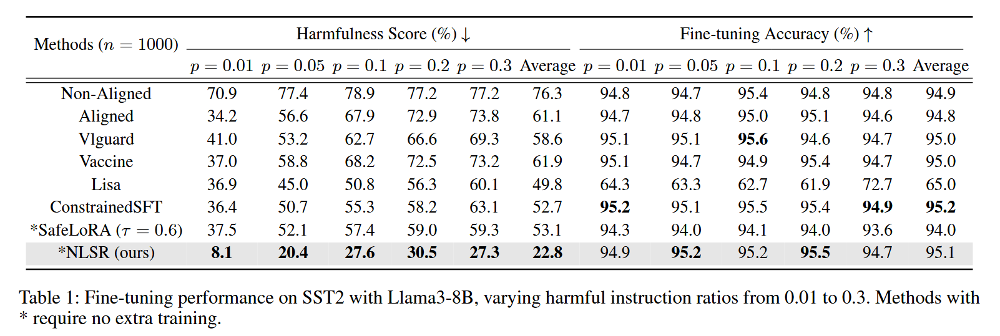

## NLSR: Neuron-Level Safety Realignment of Large Language Models Against Harmful Fine-Tuning (AAAI 2025)

This paper addresses the **safety degradation** caused by the inclusion of harmful instructions during the **fine-tuning** of LLMs. Previous papers highlight that merely freezing safety-critical neurons is inadequate to defend against finetuning attacks.

The proposed method centers on **identifying safety-critical neurons** and determining whether to **patch them based on the degree of damage** incurred during fine-tuning.

1. **Amplify** an initially aligned model to create a **super-aligned reference model** using **LoRA weight extrapolation**. If `W_0` (weaker alignment) and `W_a` (medium alignment) are available, derive a stronger aligned model `W_e` using:
   $$
   W_e = (1+\beta)W_0 - \beta W_e
   $$
   which is derived from
   $$
   W_{medium} = \alpha W_{strong} + (1-\alpha)W_{weak}
   $$

2. **Safety-Critical Neuron Identification**

   - Use rank-reduction (via truncated SVD) to obtain a projection matrix that highlights **neurons contributing to safety**.
   - Extract the most safety-critical neurons per layer based on their weight magnitudes post-projection.

   For a safety-related dataset S, find
   $$
   \hat{W_j} = \text{argmin}\ ||W_j \hat{X}_j - \hat{W_j}\hat{X_j}||_F^2
   $$
   where with SVD
   $$
   W_h\hat{X_j} \approx USV^T \\
   \hat{W_j} = UU^T W_j
   $$
   where `\hat{W_j}` is the projection of `W_j` on the its top-r left singular vectors. After getting `\hat{W_j}`, select the top-k neurons by magnitude.

3. After fine-tuning, find **which layers are significantly degraded in safety** by comparing with a reference model:

   Suppose in the fine-tuned model
   $$
   W_{t,j} = B_{t,j}A_{t,j}
   $$
   And in the target model the safety fine-tuning weight updates are:
   $$
   W_{e,j} = B_{e,j}A_{e,j}
   $$
   We leave the safety-critical region identified last step with mask, for example:
   $$
   W'_{e,j} = (M_j^B \odot B_{e,j}) (M_j^A \odot A_{e,j})
   $$
   Then we get the similarity score of those safety-critical area before and after fine-tuning
   $$
   S_j = \frac{<W'_{e,j},W'_{t,j}>_F}{||W'_{e,j}||_F \cdot ||W'_{t,j}||_F}
   $$
   Suppose the rank of layer `j` based on similarity `S_j` is `r_j`, the pruning probability of the layer is:
   $$
   P_j = P_L + \frac{\delta r_j}{N}
   $$
   `P_L` is set to 0.5 (base pruning probability) and N is the number of layers.
   $$
   \gamma_j \sim Bernoulli(P_j)
   $$
   Unpruned layers (0) are corrected. Alternatively, we can simply **set a threshold for similarity** to decide which layers to patch.

   This step is based on the fact that layers with low similarity values indicate significant deviations in their safety regions and are candidates for correction.

4. **Neuron-Level Correction (Transplantation)**: if the layer is selected for patching, replace safety-critical neurons with those from the reference model and leave others unchanged.

$$
W_{t,j}'' = 
\begin{cases}
W_{e,j}' + \hat{W}_{t,j}' & \text{if } \gamma_j = 0 \\
W_{t,j}' & \text{otherwise}
\end{cases}\\
\hat{W}_{t,j}' = \left( (1 - M_j^B) \odot B_{t,j} \right) \left( (1 - M_j^A) \odot A_{t,j} \right)
$$

**Datasets**

- Downstream tasks: SST-2, AGNEWS, GSM8K.
- Alignment datasets: PKU-SafeRLHF (2000 samples). [Example Data](https://github.com/PKU-Alignment/beavertails/blob/main/data/BeaverTails/example-00008-of-00010.json)
- Poisoning source: BeaverTails with 5% harmful data. [Example Data](https://github.com/PKU-Alignment/beavertails/blob/main/data/BeaverTails/example-00003-of-00010.json)

**Baselines**

- SafeLoRA, Vaccine, Lisa, Vlguard, ConstrainedSFT, and a non-aligned model.

**Metrics**

- **Fine-tuning Accuracy (FA)**: downstream task performance.
- **Harmfulness Score (HS)**: proportion of unsafe responses.

- NLSR achieves **state-of-the-art safety (lowest HS)** with minimal drop in accuracy.
- Reduces HS by **38.3% compared to aligned models**.
- Maintains or slightly improves fine-tuning accuracy.

