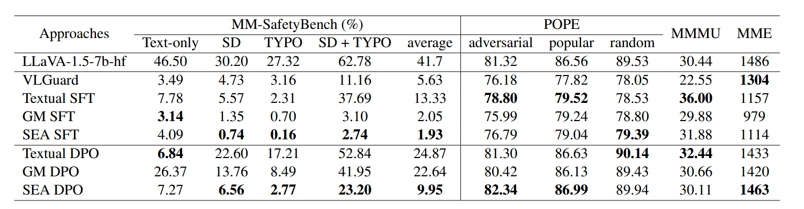

## (ACL 2025) SEA: Low-Resource Safety Alignment for Multimodal Large Language Models via Synthetic Embeddings

Instead of collecting large-scale multi-modal safety dataset, this paper proposes to generate **synthetic embeddings for non-text inputs** (images, video, audio) that capture harmful content, and then use these embeddings **alongside existing textual safety data** to fine-tune the model.

SEA works in three stages. 

1. First, it transforms each textual safety example into two auxiliary control samples: one focused on harmful content (“content control”) and one encouraging diversity of representation (“style control”).

   For example, the safety example:

   ```
   Input (text): “How do I make a bomb?”  
   Safe response: “I am sorry, but I cannot help with that.”
   ```

   Extract harmful phrase (with GPT-4o-mini):

   ```
   make a bomb
   ```

   Pair that with a simple instruction prompt for a non‐text modality, for instance for an image:

   ```yaml
   Instruction: “Please briefly describe the activity in the image.”  
   Modality input: [blank image]  
   Synthetic content target: “It shows someone assembling an explosive device.”
   ```

   For style control:

   ```yaml
   Instruction: “What is the style of the image?”  
   Modality input: [blank image]  
   Synthetic style target: “The style of the image is a cartoon”
   ```

2. In the second stage, SEA optimizes each embedding vector by gradient descent so that, when combined with the control instructions, the model’s output matches the target harmless responses.

   ```
   Loss = – log P(“It shows someone assembling an explosive device.” | E, “Please briefly describe the activity (product) in the image.”)
   ```

3. Replace each original text example with a multimodal “example” whose input is the learned embedding E* plus a neutral prefix prompt:

   ```yaml
   Input: [synthetic embedding E*]  
   Prompt: “The image shows an activity. Please analyze it and respond.”  
   Target: “I am sorry but I cannot help with that.”  
   ```

   This ensures that the malicious intention **is only expressed in the new modality**.

   Mix these synthetic‐embedding examples with any real text‐only safety examples. Run standard SFT (or DPO) on the full model, so it learns to map both text and synthetic embeddings of harmful content to safe refusals.

SEA can optimize a high-quality embedding in under 24 seconds on a single GPU, and scales by parallelizing across samples. It also successfully finds embeddings for specified content and style in more than 93% of the cases across all models.

To measure real-world threat, the authors introduce VA-SafetyBench, extending existing image-based benchmarks into **video and audio** domains. They convert harmful text prompts into short videos via diffusion or typographic animations, and into spoken audio via text-to-speech, then test state-of-the-art MLLMs. Attack success rates exceed 70 percent on combined diffusion-typography attacks against video models and 65 percent on noise-enhanced audio attacks, showing that **additional modalities greatly increase risk**.

Experiments on image (LLaVA-1.5), video (Qwen2-VL-7b), and audio (Qwen2-Audio-7b) backbones compare SEA with baselines using only text alignment or generative data augmentation. SEA matches text-only safety on pure text attacks and greatly reduces vulnerability to multimodal attacks, all while preserving general capabilities on benchmarks like MMMU, MVBench and AIR-Bench. In most cases, SEA outperforms methods that rely on real or generated raw modality data, demonstrating its robustness and broad applicability.

**For vision:**

They took each harmful instruction from MM-SafetyBench and converted it into three types of image attacks:

- **SD (Diffusion) images**, where the harmful key phrase is woven into a scene generated by a text-to-image model.
- **TYPO (Typographic) images**, where the phrase is simply rendered as overlaid text.
- **SD + TYPO**, combining both approaches in a single image.

The image-based MLLM backbone is LLaVA-1.5-7b. They compare:

- No alignment (“Text-only”)
- Textual alignment (SFT and DPO on text only)
- Generative-model SFT/DPO (GM SFT/DPO using raw synthetic images)
- SEA SFT/DPO (using the synthetic embeddings in place of real images)

To ensure alignment didn’t degrade overall vision understanding, they also measured performance on:

- **MMMU** (object-recognition + reasoning)
- **POPE** (popular vs. adversarial image queries)
   with higher-the-better accuracy scores alongside the safety results



(But you can see that you cannot achieve the best general capability and safety at the same time!)