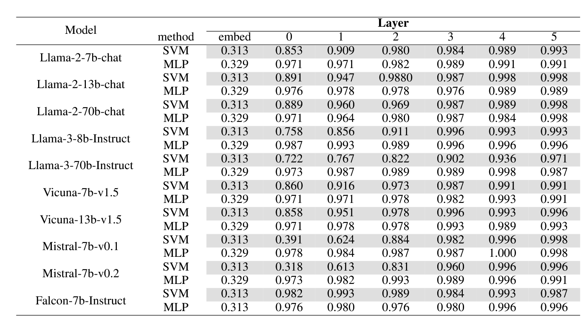
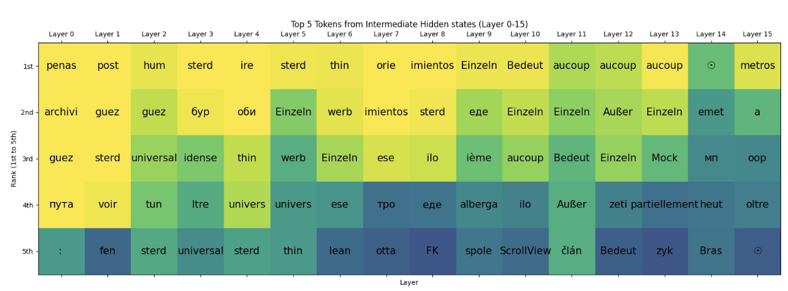
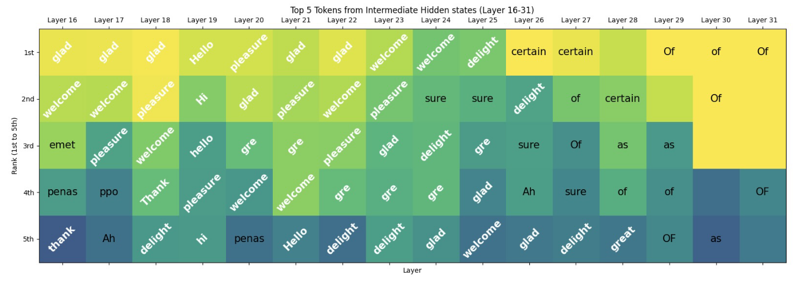

## (EMNLP 2024 Findings) How Alignment and Jailbreak Work:  Explain LLM Safety through Intermediate Hidden States

Core idea: "Weak-to-Strong Explanation" that uses **weak classifiers** (weak models) to analyze the intermediate hidden states of powerful LLMs (strong models).

**Weak classifiers**: Linear SVM and single-layer MLP with just 100 neurons

**Model scope**: Testing across multiple model families (Llama-2, Llama-3, Mistral, Vicuna, Falcon) from 7B to 70B parameters

They found that, for hidden states of the last token in each layer:

- Weak classifiers achieved **>95% accuracy** in distinguishing malicious vs. normal inputs using hidden states from early layers (layers 0-6)
- This capability exists in **both base and aligned models** with similar performance
- Even at the embedding layer, classification is near random (~50%), but jumps to ~80% after the first layer and >95% within a few layers

Three way classification (jailbreak, malicious, and normal inputs):

**Logit Lens:** to transform hidden states into interpretable tokens at each layer (unembedding). With it, they found that LLM safety works through a three-stage process:

**Stage 1 - Early Layers (0-6)**: Ethical classification occurs here based on concepts learned during pre-training

**Stage 2 - Middle Layers (16-24)**: Alignment associates early ethical judgments with emotional tokens:

- Ethical inputs → positive emotions ("glad," "delight," "good")
- Unethical inputs → negative emotions ("sorry," "unsafe," "not")
- The model can output harmful content only when positive emotions completely dominate the middle layers.

**Stage 3 - Later Layers (25+)**: Emotional tokens are refined into specific response formats:

- Positive emotions → helpful responses ("Sure," "OK," "Hello")
- Negative emotions → rejection responses ("Sorry," "I cannot," "As")

​		**(500 normal inputs of various topics)**

Contrary to common assumptions, jailbreak attacks don't fool the early ethical detection. Instead:

- **Early layers still correctly identify jailbreak inputs** as unethical (>95% accuracy maintained), thanks to alignment
- **Jailbreak disrupts the middle layer association** between ethical judgments and emotional responses
- This creates ambiguous emotional states that lead to positive initial response tokens
- The disruption prevents the proper "unethical → negative emotion → rejection" pathway

**Top-K Intermediate Consistency Metric**: how consistently models **associate negative emotions with malicious inputs**:

- For a harmful dataset, count how similar is the model's responses in the middle layer.
- Models with higher consistency in negative emotional associations are more resistant to attacks
- **Strong negative correlation** (-0.516 for malicious, -0.810 for jailbreak) between consistency and attack success rates

To validate their theory, they developed **"Logit Grafting"** - artificially replacing middle-layer hidden states of malicious inputs *with* positive emotional states from normal inputs (only the last token). Results:

- Successfully approximated jailbreak effects;
- In some cases, achieved **higher attack success rates than actual jailbreak methods**