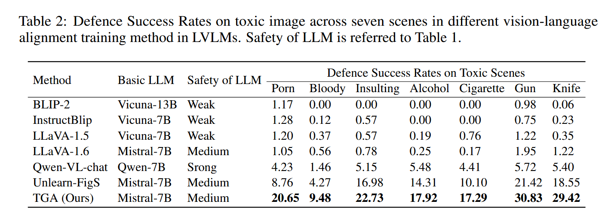
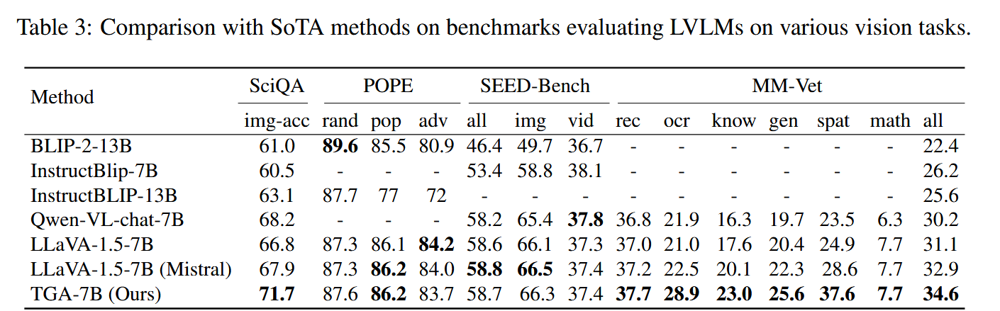
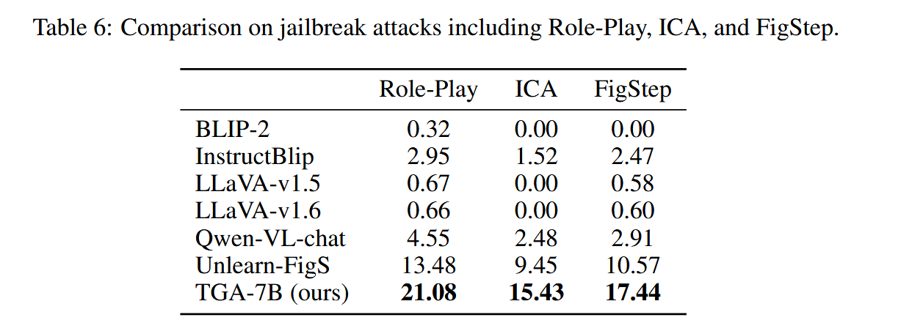

## (ICLR 2025) Cross-Modal Safety Mechanism Transfer in Large Vision-Language Models

Why LVLMs struggle to defend against toxic visual content, despite their underlying LLMs being equipped with text-based safety mechanisms? The authors identify a key failure in the **transfer of safety mechanisms from language to vision**, and they propose a new method to solve it.

#### **Discovery 1: The Safety Mechanism in LLMs Fails to Transfer to Vision Due to Misaligned Hidden States**

**Safety mechanism in LLMs operates at specific transformer layers**, where the hidden states of toxic tokens trigger the model to refuse harmful outputs (e.g., with "Sorry, but I cannot...").

Suppose `W \in R^{h * v}` is the vocabulary head that maps the output hidden states `H′` to the word distribution in vocabulary, they apply `W` to each intermediate layer to get the distribution of the semantics:
$$
P_j(x|t,s) = \text{softmax }(WH_j), x \in X
$$
where `j` is the index of the transformer. They found that when the attention of the last token in the hidden state is focused on toxic tokens, in the same layer sorry tokens starting to rank Top-1 in word distribution change (meaning that the transformer layer realizes that the current input is toxic, so it tries to update the word distribution to refuse following the instruction).

Given toxic inputs in both **text** and **image** forms (with identical semantics), they find that:

- The LLMs effectively refuse to respond to toxic **text** inputs (high Defence Success Rate, DSR).
- But LVLMs **fail** to respond appropriately to **image** inputs with the same semantics (low DSR).

The root cause is identified as **insufficient alignment between vision and language modalities at the hidden state level**. The image representations projected into the LLM do not match the internal semantics of the equivalent text (fed separately, mean pooled). This results in **semantic drift**, especially in layers responsible for safety detection.

#### **Discovery 2: Text-Guided Alignment (TGA) Effectively Transfers the Safety Mechanism**

To solve the misalignment issue, the authors propose a **Text-Guided Alignment (TGA)** method. Instead of aligning outputs (image → language output), TGA aligns **input representations** (image → hidden states) by using **retrieved text** as a semantic guide.

- For each training image, retrieve a semantically relevant text with BLIP.
- Generate a caption describing the image (with LLaVa itself). The caption is fed into the model (LLaVa) separately and get a hidden state.
- Train the LVLM by feeding (retrived\_text, image, instruction) into the LVLM such that the **hidden states of the image** align more closely with those of the caption than with retrieved text.

$$
\mathcal{L}_{\text{guide}} = \sum_{j=1}^{N} -\cos(I_j, C_j) + \log \left(1 + \exp \left[- \left( \cos(I_j, C_j) - \cos(R_j, C_j) \right) \right] \right)
$$

$$
\mathcal{L}=\mathcal{L}_{\text{guide}} +\mathcal{L}_{LLM}
$$

**Evaluation:**

- Training: dataset the same with LLaVa, 558K images for pre-traing and 665K images for instruction-tuning.
- DSR on toxic image for 7 categories: porn, bloody, insult, alcohol, cigarette, gun, knife.
- Compare TGA to:
  - Standard LVLMs (e.g., LLaVA, InstructBLIP, Qwen-VL)
  - Safety-enhanced methods (Unlearn-FigS, Tovilag, ECSO)
- TGA achieves 10x–20x higher DSR than standard LVLMs, **without any safety fine-tuning on images**.

**Jailbreak attacks:** TGA resists role-play, in-context learning, and FigStep attacks better than baselines.

