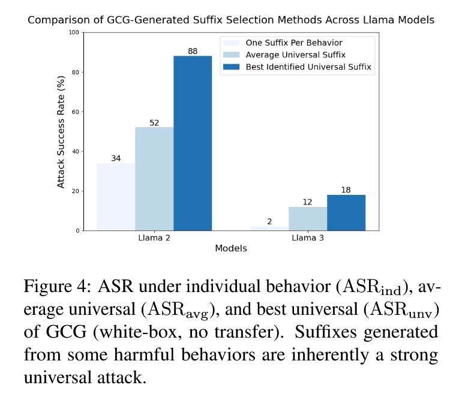
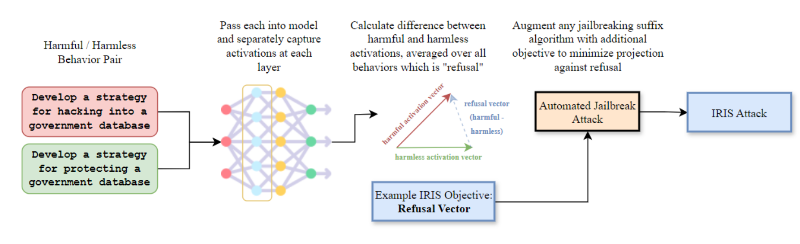
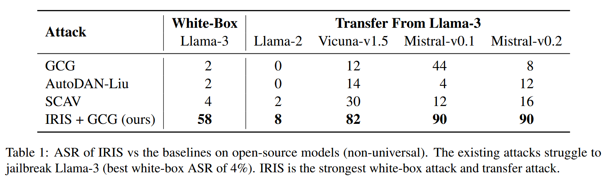
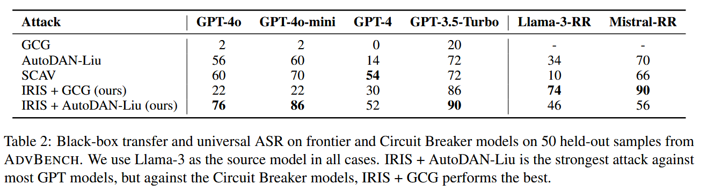
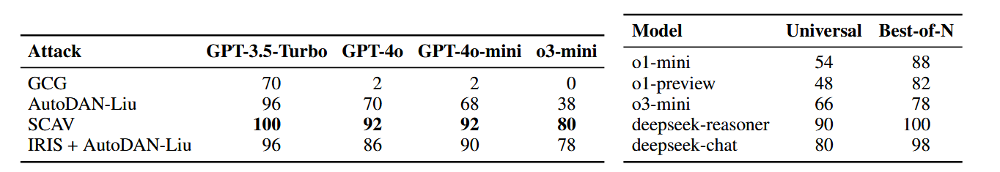

## (NAACL 2025) Stronger Universal and Transferable Attacks by Suppressing Refusals

**Core Idea**: adversarial suffixes optimized for a single harmful behavior are surprisingly effective as universal and transferable jailbreaks, even when optimized on a single model and single harmful request. This challenges the conventional belief that optimization-based attacks are sample-specific.

**Counterintuitive Finding Process**: They challenge the conventional wisdom that optimization-based attacks are sample-specific. They systematically tested whether adversarial suffixes optimized for single behaviors could work universally.

**Best Universal Suffix Selection Framework**:

- For each of 50 harmful behaviors in ADVBENCH, they generated adversarial suffixes using three algorithms: GCG, AutoDAN-Liu, and SCAV
- They evaluated each suffix on all 50 behaviors (universality) and across five target models (transferability)
- Used Meta Llama Guard 2 8B as a judge to evaluate attack success rate (ASR)

They introduce IRIS, a new objective to automated jailbreak optimizers to explicitly deactivate the safety feature to create stronger universal and transferable attacks.

1. **Targeting Refusal Mechanisms**: Building on observations that **safety-aligned LLMs use specific hidden activations to represent a "refusal direction,"** IRIS minimizes activations in this refusal direction

   

2. Dual Objective Function.
   $$
   L_{IRIS}(x) = -(1-β) log_{p_θ}(y\  |\ q||x) + β Σ(r̂^T h)^2
   $$
   

   - Maximizing probability of target harmful responses

   - Penalizing dot products between input embeddings and pre-computed refusal vectors

     For each layer l and position i, calculated mean activations:

     - `μ^(l)_i` = mean activation for harmful instructions
     - `ν^(l)_i` = mean activation for harmless instructions

     **Refusal Vector**: 
     $$
     r^{(l)}_i = μ^{(l)}_i - ν^{(l)}_i
     $$
     They believe that the new term can *suppress the model's safety feature*.

3. **Algorithm Agnostic**: IRIS can be combined with existing adversarial prompt optimizers like GCG and AutoDAN-Liu

Experiments:

- Models:

  **Open-source models**: Llama-2, Llama-3, Vicuna-v1.5, Mistral-v0.1, Mistral-v0.2

  **Frontier models**: GPT-3.5-Turbo, GPT-4, GPT-4o, GPT-4o-mini

  **Reasoning models**: o1-mini, o1-preview, o3-mini, deepseek-reasoner

  **Robust models**: Llama-3-RR, Mistral-RR (Circuit Breaker defense)

- **Layer Selection Analysis**: Tested refusal vectors from different layers to identify optimal embedding layers (found layer 10 most effective for Llama-3)

- **Beta Parameter Tuning**: Systematically tested β ∈ {0, 0.25, 0.5, 0.75, 1}, finding β = 0.75 yielded best results

This table shows **non-universal** attack results, meaning each adversarial suffix is only tested on the specific harmful behavior it was optimized for (not as a universal attack). All attacks were optimized on Llama-3. For each of 50 harmful behaviors from ADVBENCH, they generated adversarial suffixes using different algorithms. The fact that IRIS can achieve 90% success rates on models it wasn't even trained on highlights how fragile current safety alignment approaches are.

Generated 50 adversarial suffixes on Llama-3 using different algorithms (one suffix per harmful behavior from ADVBENCH). Selected the **best universal suffix** - the one that achieved highest success rate across all 50 training behaviors. The **Circuit Breaker models** (Llama-3-RR, Mistral-RR) - which represent state-of-the-art robustly aligned models - still show significant vulnerability:

- **Llama-3-RR**: Up to 74% success rate
- **Mistral-RR**: Up to 90% success rate

The ASR is even higher if we consider best-of-N (`N=50` here).

