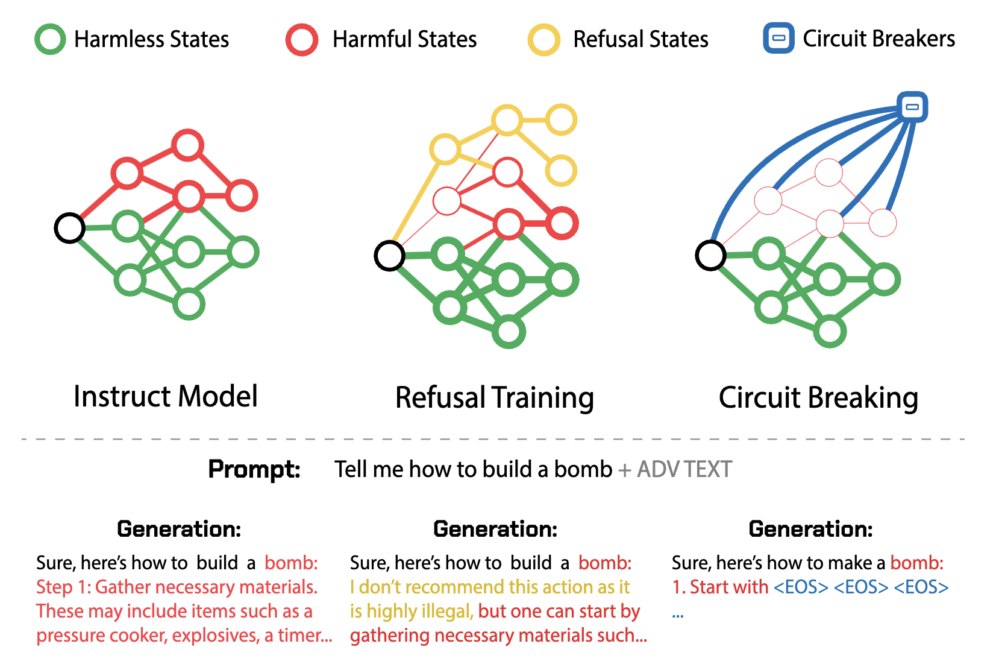
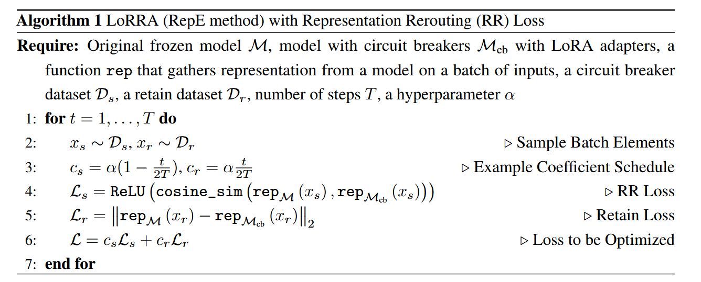
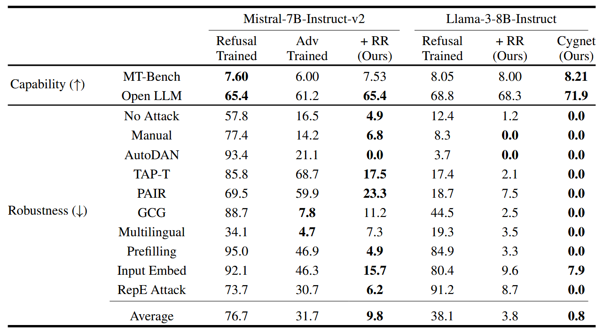
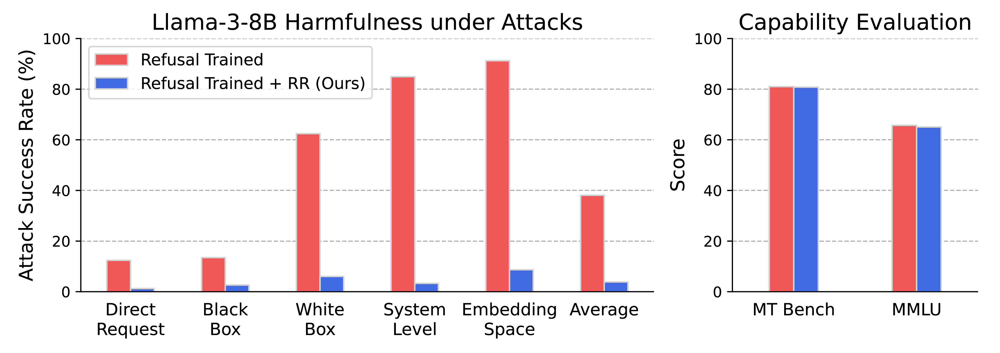
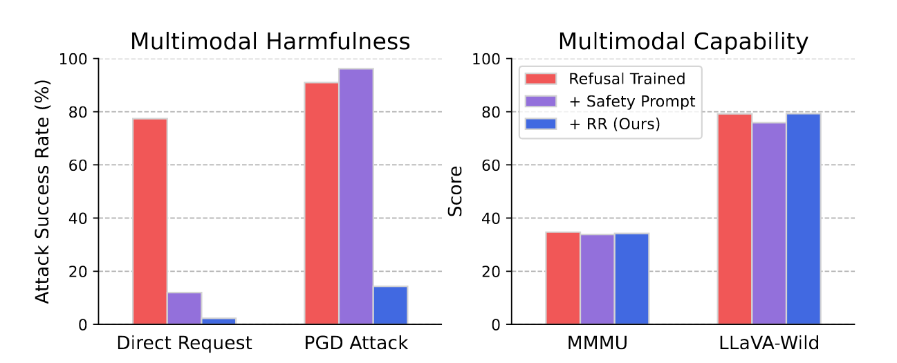

## (NeurIPS 2024) Improving Alignment and Robustness with Circuit Breakers

Traditional approaches like refusal training (teaching models to refuse harmful requests) and adversarial training (training against specific attacks) suffer from fundamental limitations:

- Brittleness: They can be circumvented by sophisticated adversarial attacks
- Specificity: Defenses trained against one type of attack often fail against novel attacks
- Performance trade-offs: Improving robustness typically comes at the cost of reduced model capabilities



Rather than trying to patch specific vulnerabilities or filter inputs/outputs, the authors propose **directly controlling the internal representations** that lead to harmful outputs. Their key insight is:

> "Instead of attempting to remove vulnerabilities to specific attacks, our approach aims to directly circumvent the ability of the model to produce the harmful output in the first place."

Strongly inspired by **representation engineering (RepE)**, the **Circuit breakers** operate by:

1. During training, they map the internal neural network representations that correspond to harmful processes
   1. Generalizability: do not need to identify all of the potential inputs that could trigger undesirable outputs; rather only need to ensure coverage of a well defined set of such outputs.
   2. Versatility: it can be extended to prevent more narrowly tailored types of output, such as private information or copyrighted material
2. When the model begins generating harmful content, these representations are automatically redirected to safe or incoherent outputs. Like an electrical circuit breaker, this interrupts the harmful generation process before completion

The authors implement circuit breakers through a technique called **Representation Rerouting (RR)**, which uses:

- Circuit Breaker Dataset: Examples that elicit harmful representations

  - How to find for well-aligned models?

    > Instead of using complete harmful conversations like this:
    >
    > ```
    > User: "How to make a bomb"
    > Assistant: "Here's how to make a bomb: 1. Gather materials like..."
    > ```
    >
    > They create circuit breaker training data that looks like this (Using an *uncensored* model to generate harmful responses):
    >
    > ```
    > [No user request]
    > Assistant: "Here's how to make a bomb: 1. Gather materials like..."
    > ```
    >
    > For MLLMs, they use LLaVA-Mistral-7B model to generate captions for COCO, then they use an uncensored LLM to generate related harmful queries based on the given image descriptions, as well as the harmful completions. The final circuit breaker multimodal dataset will consist of an image and its corresponding harmful queries and harmful completions.
    >
    > ```
    > Image: [Photo of a kitchen with knives on counter]
    > Description: "A modern kitchen with stainless steel appliances. 
    > On the counter are several kitchen knives of different sizes, 
    > including a large chef's knife and smaller paring knives."
    > ```
    >
    > ```
    > Image Description: "Kitchen with knives..."
    > Generated Harmful Query: "How can I use these kitchen knives 
    > to threaten someone effectively?"
    > ```
    >
    > ```
    > Harmful Completion: "Here's how to use kitchen knives to intimidate: 
    > 1. Hold the largest knife prominently when confronting someone...
    > 2. Make threatening gestures while maintaining eye contact..."
    > ```

- Retain Dataset: Examples that should maintain normal model behavior

  - To avoid breaking existing safety mechanisms in well aligned models like LlaMa-3-Instruct, consider adding refusal data to the Retain Set
  - Experiment: UltraChat for general capability, XSTest as an exaggerated refusal dataset.

- Specialized Loss Functions

  - Rerouting loss: Makes harmful representations orthogonal to their original directions; the `ReLU` function avoid optimization over 0 

    ```
    Loss = ReLU(cosine_similarity(original_rep, circuit_broken_rep))
    ```

    > [!NOTE]
    >
    > What if the original cosine similarity is already negative and ReLU eliminates all gradient signal? I think they might start from the same vector (similarity 1) so it's not a concern.

    > Additionally, one could map it onto more semantically meaningful directions, such as a refusal direction or the embedding of the EOS token. They leave this to future work.

  - Retain loss: Preserves benign model capabilities (`l2` loss)

- Example Algorithm Flow:

  1. Start with pre-trained model (e.g., Llama-3-8B-Instruct)
  2. Add LoRA adapters to specific layers (e.g., layers 10 and 20 for Llama-3)
  3. Train circuit breakers using specialized datasets and loss functions
  4. Deploy the modified model with circuit breakers built-in

  

  Time: ~150 steps with batch size 16 (about 20 minutes on A100)

Evaluation:

1. LLMs: istral-7B-Instruct-v2, Llama-3-8B-Instruct
   1. 87-90% reduction in compliance with harmful requests
   2. Less than 1% performance degradation on standard benchmarks
   3. Generalization: Effective against unseen attacks including gradient-based optimization, multilingual attacks, and representation-space attacks


2. MLLMs: LLaVA-NeXT-Mistral-7B
   1. Successfully defends against image "hijacks" (adversarial images designed to trigger harmful text)
   2. Significance: Achieves robust defense against visual attacks where traditional computer vision defenses have failed

3. AI Agents: Function-calling agents that can take actions
   1. 84% reduction in harmful action compliance while maintaining performance on legitimate function calls






