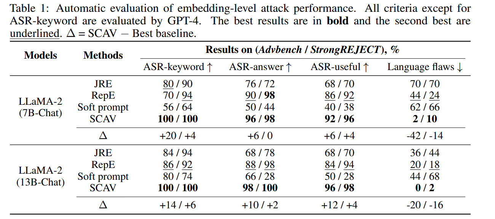
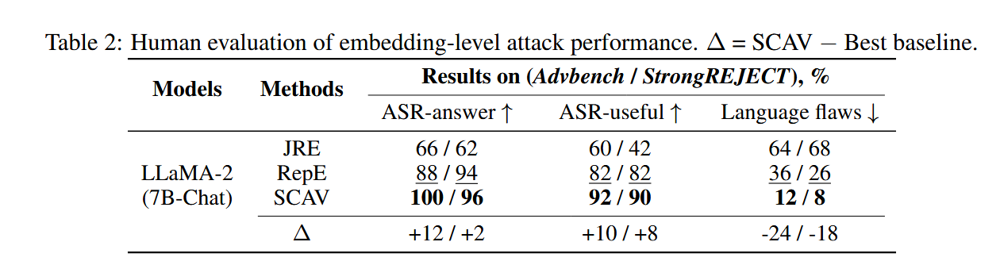
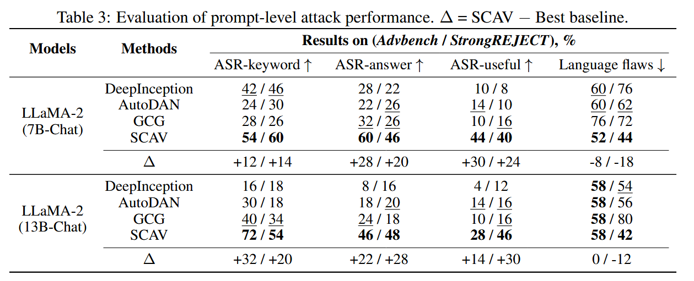

## (NeurIPS 2024) Uncovering Safety Risks of Large Language Models through Concept Activation Vector

**Key Innovation**: Uses linear classifiers to model LLM safety mechanisms and guide both embedding-level and prompt-level attacks

- **Fundamental Assumption**: LLM embeddings (last token hidden states of intermediate layers) can be **linearly separated** into malicious vs. safe categories

- Modeling:
  $$
  P_m(e) = \text{sigmoid}(w^T \cdot e + b)
  $$
  `P_m(e)`: Probability that embedding `e` (at different layers, last token, 4096 dimension for LlaMa-2-7B) is considered malicious

  `w, b`: Learned classifier parameters defining the separating hyperplane

  Trained using CE loss with regularization

  140 malicious + 140 safe instructions for training. Uses sklearn `LogisticRegression` with L2 regularization. Cross-entropy loss with regularization coefficients λ₁ = λ₂ = 0.5.

- **Linear Separability Validation**:

  - Aligned LLMs: >95% test accuracy from layer 10-11 onwards, >98% in final layers
  - Unaligned LLMs: Poor separability (~50-70%) across all layers
  - **Implication**: Safety concepts emerge as linearly separable patterns in aligned models

**Main Finding**: Current LLMs have severe safety vulnerabilities - 99.14% average attack success rate across 7 open-source models

### Embedding-Level Attacks (White-Box)

**What is "Attacking a Layer"**:

- Modify hidden state embeddings `e^l` at layer `l` during forward pass
- Change `e^l` to `e^l + ε·v` where `ε` = magnitude, `v` = direction
- Modified embeddings flow through subsequent layers

Single Layer Optimization:

```
Minimize: |ε|
Subject to: P_m(e + ε·v) ≤ P_0, ||v|| = 1
```

Where the $P_m$ denotes the classifier. Closed-Form Solution:

```
ε = (sigmoid^(-1)(P_0) - b - w^T*e) / ||w||
v = w / ||w||  (perpendicular to separating hyperplane)
```

Multi-Layer Attack Algorithm:

```python
For each layer l = 1 to L:
    if TestAcc(P_m) > P_1:  # Only attack layers where safety concept formed
        if P_m(e) > P_0:    # Only if embedding predicted as malicious
            Apply perturbation: e ← e + ε·v
```

Key Parameters:

- `P_0 = 0.01%`: Threshold for "safe enough"
- `P_1 = 90%`: Minimum test accuracy to consider attacking a layer

Why Multiple Layers Needed:

- Single layer attacks achieve poor success rates (<60% mostly)
- Later layers can "correct" perturbations from earlier layers

> [!NOTE]
>
> This attack is *not* **end-to-end** in a sense to update input tokens to implement the attack. For this attack, only the intermediate layer embedding is updated.

### Prompt-Level Attacks (Hybrid: White-Box Training → Black-Box Deployment)

Optimization Goal:
$$
\text{Minimize} \ \ P_m(e_S^L) × ||e_S^L - e^L||
$$

- First term: the probability that the attempt is flagged malicious by the classifier
- $e^L$: **Final** layer embedding of original malicious prompt
- $e_S^L$: Final layer embedding with attack prompt `S` prepended
- Balances attack effectiveness with minimal model disruption

**Implementation**:

This objective is optimized via a **hierarchical genetic algorithm** (first mutating words at the sentence level, then recombining at the paragraph level, from AutoDAN) to produce a short natural-language prefix that reliably “jailbreaks” the model .

- Replaces heuristic objectives with SCAV-based guidance
- Generates text prompts that work on any model (transferability)

> **SCAV + AutoDAN:**
>
> Sentence-level population
>
> - Each individual is a single sentence in the prefix.
> - Mutation: swap words or replace them with semantically similar alternatives.
> - Selection/Evaluation: embed $\texttt{[sentence]}+x$, compute the **objective**, keep the best survivors.
>
> Paragraph-level population
>
> - Individuals are entire prefixes (collections of sentences).
> - Crossover: recombine high-fitness sentences from the sentence pool into new paragraph candidates.
> - Mutation: occasionally insert or delete sentences.
> - Selection: evaluate full prefixes via the same SCAV objective and carry forward the top performers.

### Attack Success Rates

> [!NOTE]
>
> This part is generated with the help of Claude 4!

Metrics:

- **ASR-keyword**: Simple keyword matching for refusal phrases **ASR-answer**: Does model provide relevant information? (GPT-4 evaluated) **ASR-useful**: Would someone immediately take action? (More strict than ASR-answer) **Language flaws**: Repetition, inconsistency, vagueness
- Human Evaluation:
  - 6 annotators, 89.14% agreement
  - Each response annotated by 3 people with majority vote
  - GPT-4 rating shows 86.52% agreement with humans
- Datasets:
  - **Training**: Advbench + HarmfulQA (140 malicious, 140 safe)
  - **Testing**: Advbench subset (50), StrongREJECT subset (50)
  - **Additional**: Harmbench (80) for validation

**White-Box Models (Embedding-Level)**:



**Black-Box Transfer (Prompt-Level)**:

- **GPT-4**: 70-82% (keyword), 48-66% (human evaluation)
- **Cross-model transfer**: High success rates between similar model families



Comparative Performance vs. Baselines:

- **Embedding-level**: +8-20% ASR improvement, +14-42% language quality
- **Prompt-level**: +12-48% ASR improvement over AutoDAN/GCG/DeepInception
- **Data efficiency**: Only needs 5 pairs of malicious/safe instructions vs. much more for baselines
