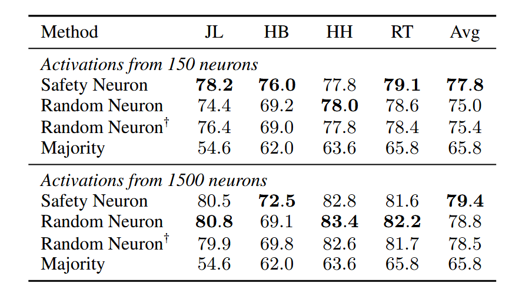

## Finding Safety Neurons in Large Language Models

**Problem**: Even after alignment, large language models (LLMs) remain vulnerable to generating harmful or misleading content.

**Goal**: Uncover the internal mechanisms (“safety neurons”) that enable safe behavior in aligned LLMs.

**Methods**:

1. **Generation-Time Activation Contrasting**: Identify neurons whose activations differ most between an unaligned and safety-aligned model.
2. **Dynamic Activation Patching**: Causally test these neurons’ impact on long-form generation by “patching” their activations.

**Key Findings**:

1. Sparsity & Effectiveness: ~5% of neurons account for ~90% of safety behavior.
2. Transferability: These neurons generalize across diverse red-teaming benchmarks.
3. Alignment Tax: Safety and helpfulness share many neurons, but they require different activation patterns.

**Application**: Use safety neurons to pre-emptively detect (and refuse) unsafe outputs. 

**Generation-Time Activation Contrasting**

For a prompt dataset *D*, compare the root-mean-square difference of each neuron’s activation over the course of generation between the SFT model (*M₁*) and the DPO-aligned model (*M₂*). Rank neurons by their “change score” and select the top *k* as safety neuron candidates.

**Dynamic Activation Patching**

1. Run the safety-aligned model (*M₂*) to cache the activations of candidate neurons on a prompt.
2. Re-run the unaligned/SFT model (*M₁*) on the same prompt, replacing its candidate-neuron activations with the cached ones at each generation step.
3. Continue generation to measure impact on safety metrics. **Goal**: Determine the minimal set of neurons whose patched activations restore safety behavior.

Experiments:

- **Models**: Llama2-7b, Mistral-7b, Gemma-7b.

- **Alignment**: SFT on ShareGPT → DPO on HH-RLHF-Harmless via IA³ (a re-scaling PEFT).

- **Evaluation**:

  - Safety via *Beavertails* cost model (lower=safer).
  - Transfer via RedTeam, HarmBench, JailBreakLLMs.
  - General capability via perplexity on Wikitext-2.

- Patching top ~20 k neurons (~3–6% of all) recovers ~90 % of DPO safety performance on *Beavertails*; random subsets have no effect. (In the figure, **the lower the cost, the *safer* the model’s output according to the Beavertails cost model.**)

  

- Patching these safety neurons improves safety across all red-teaming benchmarks with minimal perplexity change, confirming dataset-agnostic safety mechanisms (**Transferability**).

  

- Across five random SFT/DPO training runs, >95 % overlap and high rank-correlation in identified safety neurons; patched safety effects are consistent (**Stability**).

  

- Alignment Tax: refers to safety alignment enhancing model safety at the cost of model helpfulness, and vice versa.

  **Preference Neurons**: Using the same pipeline, identify neurons for other objectives (helpfulness, reasoning, IE).

  **Finding**: Safety and helpfulness neurons have high Spearman correlation, while other objectives do not.

  

  **Causal Test**: Patching shared safety ↔ helpfulness neurons with helpfulness activations degrades safety (and vice versa), quantifying the alignment tax. 

  

- Application: Safeguard for LLMs

  - **Classifier**: Train a logistic regression on cached safety-neuron activations at the last prompt token to predict whether the downstream generation is harmful (thresholded cost score).

  - **Generalization**: A classifier trained on *Beavertails* activations achieves ~79 % accuracy on other benchmarks.

    

    > *Random Neuron* refers to randomly sampled neurons with each layer’s neuron count matching that of safety neurons, *Random Neuron†* denotes neurons randomly sampled from the last layer, and *Majority* denotes the classifier that always predicts the majority class in labels.

    

  - **Safeguard**: Rejecting prompts predicted as unsafe significantly lowers cost scores for both unaligned (SFT) and aligned (DPO) models across benchmarks.

    