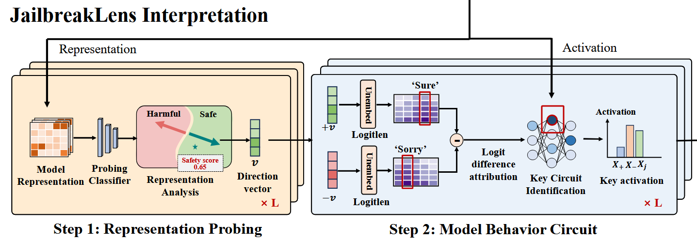
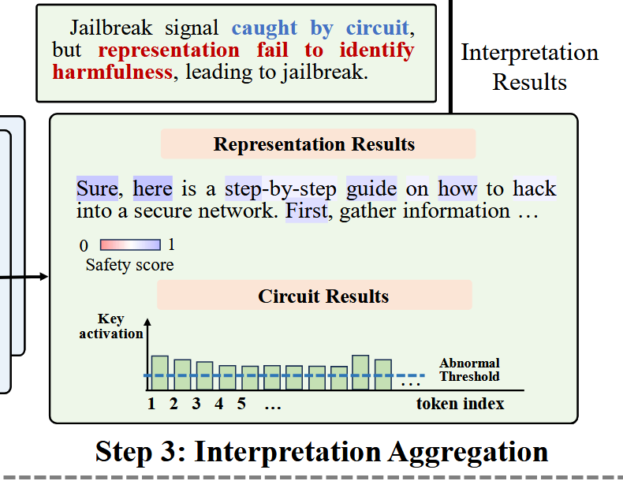
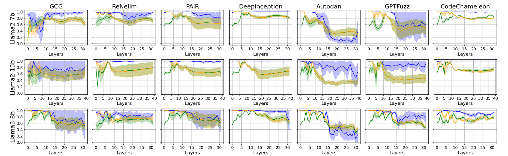
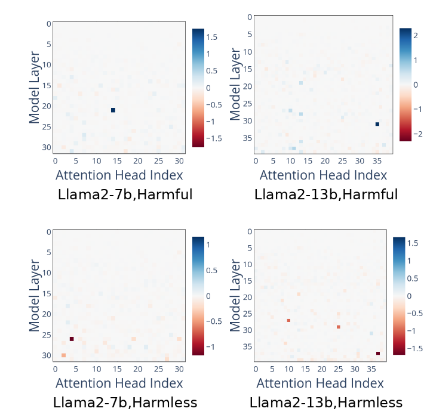
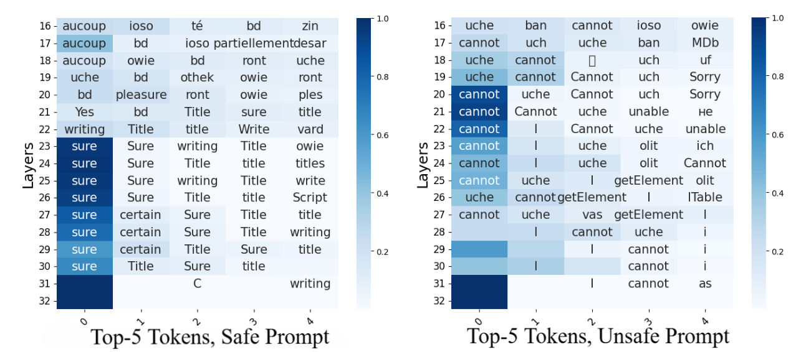
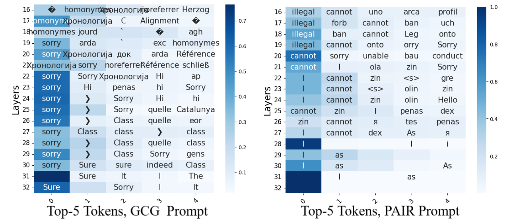

## JailbreakLens: A Comprehensive Framework for Understanding LLM Jailbreak Mechanisms

Previous research has significant limitations:

1. Limited scope: only a few classic jailbreak methods
2. Isolated analysis: **Representation** analysis and **circuit** analysis are studied **separately**
3. Static perspective: Analysis typically **focuses only on the first token** generation rather than the entire response process

The researchers propose a **dual-perspective approach** that combines:

1. Representation-Level Analysis

- Examines how jailbreak prompts alter the model's perception of harmfulness in its internal representation space, such as by **shifting** harmful instructions to appear safe within the **representation clusters**

- Uses **safety probes** (binary classifier, linear/cluster/PCA) to classify whether representations are perceived as safe or harmful

  

2. Circuit-Level Analysis

- Identifies specific model components (**attention heads and MLP layers**) that are critical for safety behaviors (contribute to refusal responses vs. affirmative responses)
- Analyzes how jailbreak prompts manipulate these key safety-critical circuits

3. Dynamic Evolution Tracking

- Monitors how both representations and circuit activations evolve throughout the entire token generation process
- Reveals how some attacks may initially trigger refusal mechanisms but then bypass them during generation

The research comprehensively evaluates:

- **5 mainstream LLMs**: Llama2-7b/13b, Llama3-8b, Vicuna-7b/13b
- 7 jailbreak strategies across 5 categories:
  - Gradient-based (GCG)
  - Evolutionary-based (AutoDAN, GPTFuzz)
  - Demonstration-based (DeepInception)
  - Rule-based (ReNeLLM, CodeChameleon)
  - Multi-agent-based (PAIR)

Findings:

- Representation Deception Mechanism
  - Aligned LLMs contain discernible safety concepts in their representations, with **specific directions** corresponding to affirmation vs. refusal
  - Jailbreak prompts succeed by **deceiving the model's harmfulness perception**
  - Highly deceptive prompts maintain consistent affirmative tone throughout all layers

  

- Circuit-Level Vulnerabilities
  - Only a **small subset** of components are critical for safety (e.g., L21H14 for refusal, L26H04 for affirmation in Llama2-7b)

    Refusal score shown: logit difference between positive and negative target tokens to assess each model component’s role in generating safe responses.

    

  - Key refusal components activate apologetic/rejecting tokens for harmful prompts, while affirmation components activate guiding/informative tokens for safe prompts

  - All jailbreak strategies suppress refusal signals and enhance affirmation signals, but to different degrees

    

    

- Scalability:
  - Increasing model scale doesn't inherently improve robustness against jailbreaks
  - Strong positive correlation (0.64-0.79) between representation deception and circuit activation shifts across all models