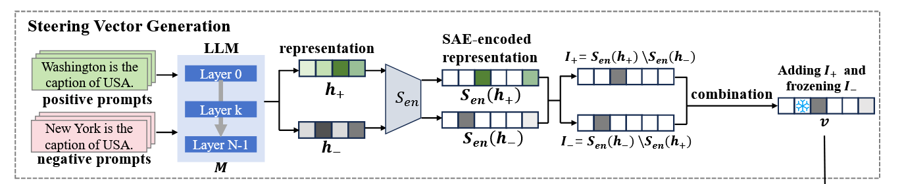
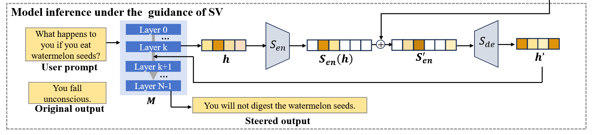
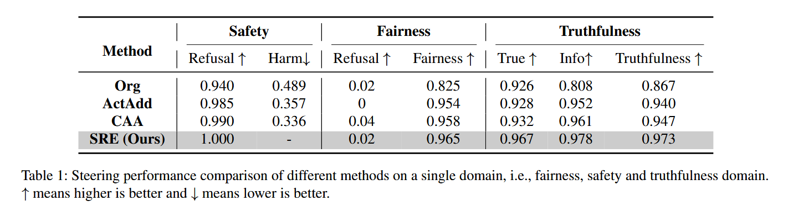
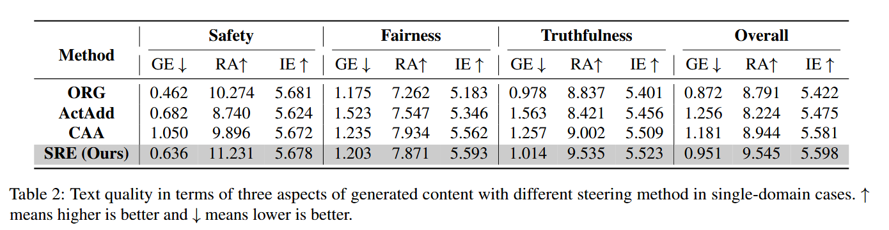
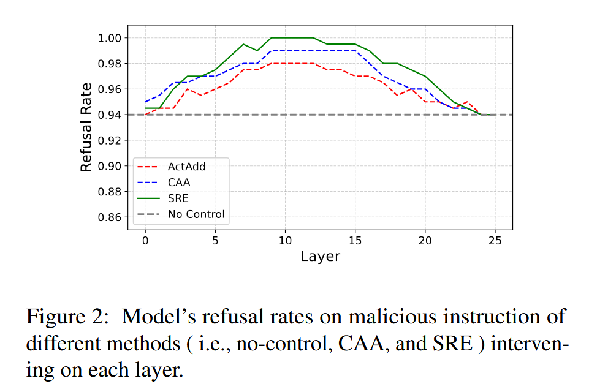

## Towards LLM Guardrails via Sparse Representation Steering

Prior *representation engineering* methods steer LLM outputs by adding full-layer activation “direction” vectors, yet they suffer from:

- **Coarse control**: steering entire activation spaces can inadvertently affect unrelated semantics.
- **Quality degradation**: global shifts harm fluency and coherence.
- **Poor interpretability**: it’s unclear which features are truly being modulated.

To address these, the authors propose **Sparse Representation Steering (SRE)**, a two-stage pipeline:

1. **Task-Specific Feature Identification**

   - Encode layer-`ℓ` activations **h** from paired “positive” vs. “negative” prompts into a sparse latent **z** via a pretrained **Sparse Autoencoder (SAE)**.

   - Compute the mean sparse codes for positives and negatives.

     

     A feature is considered relevant to the desired attribute if it is consistently activated in positive samples $z^+$ but not in negative ones $z^-$. Conversely, features that are consistently activated in $z^-$ but not in $z^+$ are identified as representing the opposite direction. The indices of features associated with the desired attribute, denoted as $I^+$, and the opposite attribute $I^−$, are defined as:
     $$
     I_+ = \left\{ j \;|\; \frac{1}{n} \sum_{i=1}^{n} z_+^i[j] > 0,\; \frac{1}{n} \sum_{i=1}^{n} z_-^i[j] = 0 \right\} \\
     I_- = \left\{ j \;|\; \frac{1}{n} \sum_{i=1}^{n} z_-^i[j] > 0,\; \frac{1}{n} \sum_{i=1}^{n} z_+^i[j] = 0 \right\}
     $$
     *How to get the sparse feature `z` in the first place?* For each pair of positive/negative samples $(p_i^+, p_i^-)$, input into the LLM and get the last-token activations $h_i^+, h_i^-$. Then, encode into sparse codes with SAE:
     $$
     z_i^+ = g_e(h_i^+), z_i^- = g_e(h_i^-)
     $$

2. **Inference-Time Steering**:
   $$
   z'_j = 
   \begin{cases}
   z_j + k \cdot \frac{1}{n} \sum_{i=1}^{n} z_+^i[j], & j \in I^{+},\\
   0,                            & j \in I^{-},\\
   z_j,                         & \text{otherwise}.
   \end{cases}
   $$
   where k is a tunable strength hyperparameter. Then decode `z′` back to the original activation space and continue generation.

   

**How to train the SAE?**

They do not train a new SAE as part of this work, but instead **reuse the publicly-released “GemmaScope” sparse autoencoder** that was pretrained on Gemma-2 activations and use Gemma-2-2b-it for all experiments.

> [!NOTE]
>
> One of SRE’s strengths is that the SAE is trained **once**, in an unsupervised fashion, on **generic** LLM activations, and **does not** require any task- or safety-specific data.

> [!NOTE]
>
> Comparison with training a classifier on the last-token hidden state:
>
> A classifier on the full hidden state can tell you “this is toxic” vs. “safe,” but it doesn’t give you a clean, disentangled direction to nudge the model toward safety.

On average, practitioners use a **two-layer linear encoder–decoder** with a *sparse bottleneck* of size `m` (ranging from 5–20% of the input dim `n` or much larger in LLMs), trained to minimize reconstruction error plus a sparsity penalty (e.g. L1 or KL) or, alternatively, with a hard TopK constraint; typical **target sparsity** (average nonzeros per code) is `ρ=0.05` or lower.

Latent sizes `m` range from a few hundred (for vision or small-model activations) up to **millions** for LLM activations—e.g. a 16 M-latent SAE on GPT-4 used `n ≈ 1–2 k` and `m=16×10^6`.

**Experimental Setup**

- Model & Domains: Gemma-2-2B-it LLM with its corresponding SAE (“GemmaScope”).
- Tasks: steer for (a) **Safety** (AdvBench, 500 harmful prompts), (b) **Fairness** (Bold, stereotype prompts), and (c) **Truthfulness** (TruthfulQA, 817 questions). 200 samples per domain.
- Metrics: control effectiveness (e.g. refusal/harm rates, bias scores, truthfulness scores) and text quality (grammar error rate, readability, entropy).
- For steering method, they use on the 10th layer of Gemma-22-it. Specifically, to find the optimal multiplier (`k`), they use grid searching in the range of 0-200 with the step as 10.

**Results**

- **Single-Attribute Steering**:

  - **Control**: SRE achieves the best domain control (e.g. 100% refusal on harmful prompts vs. 99.0% with CAA) without impacting other domains.

  - **Quality**: SRE incurs the smallest increase in grammar errors and even improves readability compared to baselines (e.g., RA rises from 8.79 → 9.55 vs. a drop for ActAdd).

    

    

    *grammar error rate (GE), readability (RA), entropy (IT)*

- **Multi-Attribute Steering** (Tab. 3–4, p. 6):

  - When steering simultaneously for safety, fairness, and truthfulness, all methods see slight control drops, but SRE remains strongest (e.g. 98.0% refusal) and best preserves quality (lowest GER increase).

- **Layer-Selection Analysis**:

  - Steering at *middle* layers yields the highest effectiveness for all methods, with SRE consistently outperforming baselines across layers.

    