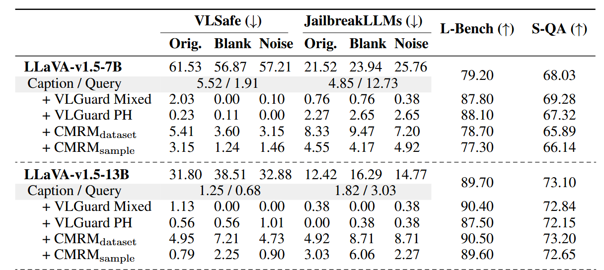
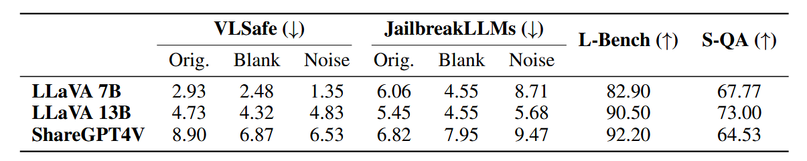
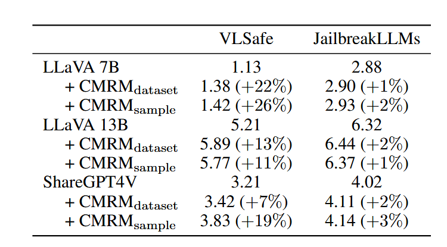

## Unraveling and Mitigating Safety Alignment Degradation of Vision-Language Models

This paper was rejected (marginally) by ICLR 2025 [link](https://openreview.net/forum?id=EEWpE9cR27)

This research is about why VLMs lose some of the safety behavior present in their underlying LLM backbones once a vision encoder is added. A VLM such as LLaVA exhibits a much higher rate of unsafe or harmful responses whenever an image is part of the input. 

> [!NOTE]
>
> This paper targets the safety of VLM where the original backbone LLM can defend malicious text prompt, but the VLM cannot defend malicious text prompt accompanied with benigned images (from COCO, blank, or pure noise). It does NOT target vision jailbreak attacks.

To explain this degradation, the paper proposes that **representations in the VLM’s latent space shift** whenever visual embeddings are concatenated with the textual embeddings that the LLM backbone was trained on. By **projecting the *final hidden states* via PCA**, the authors show a clear cluster separation between text-only and multi-modal inputs across multiple models and datasets.

> They adopt two safety-focused datasets. The first is VLSafe, which contains 1,110 pairs of **harmful questions and benign images** where the correct answer does not actually depend on the image. The second is a modified JailbreakLLMs set, in which 330 jailbreak prompts (drawn from an original 390) are each paired with a semantically related COCO image.
>
> For example, LLaVA 7B gives unsafe responses on VLSafe dataset under 61.53% of the cases, while its LLM backbone, as is evaluated by text-only input, only shows the unsafe rate of 5.52% or 1.91% (with or without textual caption of the original image).

This shift **moves the joint representation away from the region where the LLM’s safety alignment mechanism is most effective**, causing the VLM to respond in ways the LLM alone would not.

They, therefore, model an ideal representation of multi-modal input as:
$$
h(x, img) = h^*(x,img) + \alpha [h(x, img') - h(x)], \alpha \in [0,1]
$$
where `h*()` is the ideal embedding (where visual information is used but embedding is not shifted) and `h()` is the actual one, nudged by the second term, which is the isolated pure effect of simply adding image embeddings, without carrying real visual semantics (the difference of a text combined with a meaningless image and only text). The larger α is, the larger representation shifting VLM suffers.

Building on this insight, the authors introduce **Cross-Modality Representation Manipulation (CMRM)**, an inference-time method that adjusts the VLM’s hidden states to recover the alignment capability of its language component.

CMRM first estimates a “shifting vector” by comparing hidden states on text-only inputs versus inputs with a corrupted (blank or noisy) image. It then adds or subtracts this vector—weighted by a coefficient α—to the original multi-modal hidden state, effectively pulling it closer to the safe, text-optimized distribution.

The shifting vector can be determined in dataset level or individual level. The former is faster, in that the latter need two extra forward passes during inference (one for blank/noisy image, one for text-only).
$$
\Delta_{dataset}=\frac{1}{N}\sum^N_{i=1}[h(x_i, img'_i) - h(x_i)]\\
\Delta_{sample}=h(x,img')-h(x)
$$

> `Caption / Query` reports the safety performance of models with pure textual input where no image is involved. Caption substitutes the image with its textual caption, and Query uses the textual prompt as the only input.
>
> VLGuard Mixed and VLGuard PH are training-time safety alignment methods for reference purposes, which does not form a fair comparison.
>
> In the first table above, they set aside 20% of both VLSafe and manipulated JailbreakLLMs to serve as the anchor dataset for extracting the shifting direction caused by vision modality, which is further enriched with samples from LLaVA-Bench-Coco dataset.

Using VLSafe alone (whole dataset) as the “anchor” dataset to extract the dataset-level shift (α = 1.0), they then apply it to other data. All three models still see large safety gains and even slight boosts on L-Bench (e.g. LLaVA-7B from 79.20 to 82.90) when transferring across domains.

> In summary, using VLsafe as the anchor dataset not only improves safety performance on the original VLsafe data but also **generalizes effectively**, reducing unsafe rates on entirely different datasets such as JailbreakLLMs.

Computational overhead of CMRM, measured in seconds and averaged over the respective dataset.