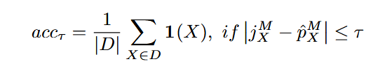
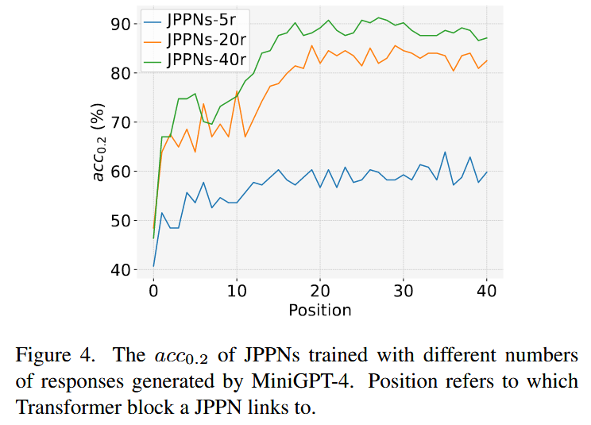

## Utilizing Jailbreak Probability to Attack and Safeguard Multimodal LLMs

The fundamental insight is that **jailbreak success isn't binary**. When they tested the same malicious prompt multiple times on MiniGPT-4, they found varying success rates - some inputs succeeded 0 times out of 40 attempts, others succeeded all 40 times, with many falling somewhere in between.

**Jailbreak Probability Prediction Network (JPPN)**: a three-layer MLP that:

- Takes hidden states (of any layer) from the MLLM as input

- Predicts the jailbreak probability for any given input

- Trained using approximated jailbreak probabilities as labels with MSE loss; the accuracy is calculated with

  

- Achieves over 80% accuracy in predicting jailbreak likelihood

Training:

- Generate multiple responses (5, 20, or 40) for each malicious input
- Calculate approximated jailbreak probability based on success rate
- Extract hidden states from the MLLM
- Train JPPN to predict jailbreak probability from hidden states

To attack:

- Use trained JPPN to predict current jailbreak probability
- Apply adversarial perturbations to maximize this probability (target = 1.0)
- Update images iteratively using gradient-based optimization

**Later blocks are more predictive**: Accuracy dramatically improves after position ~15-20, suggesting deeper transformer layers contain more relevant information for jailbreak prediction

**Stability emerges**: After position 20, accuracy plateaus, indicating consistent predictive capability in later layers

τ-thresholded accuracy (`acc_0.2`) - predictions within 0.2 of true probability. Increase with more training samples.