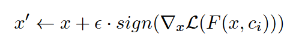
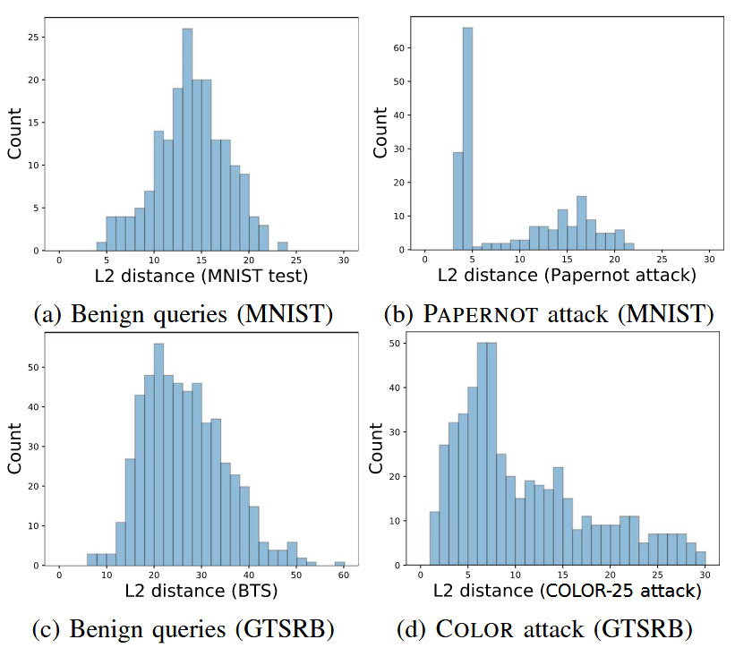

### (EuroS&P 2019) PRADA: Protecting Against DNN Model Stealing Attacks

#### Motivation and Introduction

Motivation:

- A model can be a **business advantage** to its owner
- An adversary may use a stolen model to **find transferable adversarial examples** that can evade classification by the original model.

Contributions of this paper:

- A **new model extraction attacks** using novel approaches for generating synthetic queries that outperform state-of-theart model extraction in terms of transferability of both targeted and non-targeted adversarial examples, as wel as prediction accuracy.
- PRADA: generic and effective **detection of DNN model extraction attacks**. It analyzes the distribution of consecutive API queries and raises an alarm when this distribution deviates from benign behavior.

The success of the adversary is defined as:

- Prediction accuracy of the substitute model
- Transferability of adversarial samples obtained from the substitute model.

Note: The model provider may alternatively deploy models on client devices (e.g. smartphones or cameras), and rely on platform security mechanisms on these devices, to protect model confidentiality. Either way, the API will be open.

Attack surface:

- Remote isolation: the model is hosted on a server.
- Local isolation: on a personal device (e.g. smartphone) or an autonomous system (e.g., self-driving car, autonomous drone).
- Assumption of this paper: local and remote isolation provide same *confidentiality guarantees* and physical access does not help the adversary to overcome the isolation.
- Comments from the author: Local isolation will become increasingly adopted to protect these models b/c the rise of federated learning will push machine learning computation to the edge.

Adversary capability:

- Black-box access.
- It knows the model architecture, including the input and output shape.
- The output of the model can be only the label, or the probability distribution.
- It understands the utility of the model, and therefore can get a few natural examples for each class.

#### Framework (Attack)

Framework proposed:

The authors then discuss the decisions made for the details in this framework.

**Hyperparameters (Row 9)**

- Rule-of-thumb. Use some heuristic. E.g. PAPERNOT uses a fixed learning rate and small number of epochs.
- SAME. Copy from the target model. This may be obtained via insider knowledge, or through state-of-the-art attacks.
- **CV-SEARCH.** Do a cross-validation search on the initial seed samples.
  - The strategy optimizes hyperparameters such as the learning rate and the number of training epochs using cross-validation.
  - For each combination of parameters, the initial labeled dataset is divided into 5 non-overlapping sets. Each set is used in turn as a validation set while the remaining four are used for training. The average accuracy over these sets is used to evaluate each hyperparameter combination.
  - After initial sampling (by sampling each corner of the hyperparameter space + randomly sampling inside it for certain # of rounds), Bayesian optimization is used to efficiently explore the hyperparameter space. The method predicts the potential validation accuracy by Gauss. Process (GP) for different combinations of hyperparameters and chooses the next set to test based on either high expected value or high uncertainty.
  - 

**Adversarial Example Crafting (Used in sample synthesis)**

By modifying samples with a function w.r.t. Jacobian matrix. Popular choices include:

- FGSM: a “one-step method”
- I-FGSM: Iterative FGSM subdivides modifications into k steps, such that every iterative modification is done with FGSM with step size  `\epsilon / k`.
- MI-FGSM: Momentum Iterative FGSM. The most effective.

**Synthetic Sample Generation (Row 13)**

Create new samples with regards to all previous labeled data. The number of new samples increases exponentially with the number of duplication rounds ρ (Row 12).

- Jacobian-based Synthetic Sample Generation:
  - Use algorithms mentioned above. All variants produce synthetic samples that step closer and closer to the perceived classification boundaries.
  - To avoid overlapping directions, techniques like targeted randomly chosen direction (T-RND) and iterative FGSM methods (I-FGSM) should be adopted.
- Random Synthetic Sample Generation:
  - Randomly perturbing color channels (COLOR).

#### Evaluations (Attack)

Datasets: MNIST, GT-SRB (Traffic sign recognition) like previous studies.

Each dataset is seperated into:

- Test set.
- Target model training set. 
- Pre-attacker set. A subset called *attacker set* is assumed to be owned by the attacker (Row 6) and the correlation between its size and attacking effects will be explored later.

The *target model training set* and *pre-attacker* set are obtained by seperating the training set of the dataset into 10-fold cross-validation. 9/10 of them are used for training the target model.

Baselines (based on GPT response):

- Tramer attack. Targets simple machine learning models like logistic regression, decision trees, and shallow neural networks. The dataset is very small.
  - **Path Finding Attack**: Targets decision trees by systematically querying inputs and recording the paths taken within the tree structure.
  - **Line-Search Retraining**: For neural networks, it uses an initial random sample of data points to generate queries. Subsequent queries are crafted by finding points close to the decision boundary using a line search technique.
  - **Adaptive Retraining**: Similar to line-search retraining but employs active learning techniques to query samples that are likely near the decision boundaries.
- PAPERNOT attack. For deep neural networks and aims to generate a substitute model that can forge **non-target** adversarial examples transferable to the target model. Similar dataset size as this paper, but smaller query numbers.
  - Begins with a small set of natural samples, which are balanced across all classes and resemble the target model’s training data.
  - Uses the Jacobian matrix of the substitute model to create synthetic samples.
  - Iterative process for training a substitute model.

Metrics:

- **Agreement**: the accuracy of the substitute model predictions when taking the target model prediction as ground truth.
  - This paper considers *test-agreement* for a relevant subset of the input space as a *macro-averaged F-score* using MNIST and GTSRB test sets.
  - Random uniform agreement (RU-agreement) as an accuracy score on samples chosen uniformly at random in the input space.
  - Test-agreement in both earlier works is estimated with accuracy, while this paper uses macro-averaged F-score to faithfully report agreement for the underrepresented classes in the datasets, which is important in GTSRB. They ensured that the test set contained different physical images compared to the attacker set, whereas Papernot et al. did not.

- **Transferability** for both *targeted* and *non-targeted* adversarial examples.

The evaluations of this part is **poorly written**, so details are omitted.

**Takeaways**

- **Hyperparameters:** Doing **CV-SEARCH** can yield similar or better results for both agreement and transferability.
- **Seed samples:** Natural **seed samples** are necessary to extract a substitute model that reaches high Test-agreement.
- **Synthetic sample generation:** Exploring several (random) directions (T-RND) yields better agreement and transferability.
- **Training strategy:** The use of probabilities rather than labels-only improves transferability for any setup, but has nearly no effect on agreement.
- **Mismatch between target model and substitute model:** Using a higher or similar complexity substitute model as the target model architecture yields high predictive performance.

#### Framework (Defense)

PRADA (Protecting against DNN Model Stealing Attacks)

Focus on how *successive queries* relate to each other. PRADA is generic in that it makes no assumptions about the model or its training data.

- The distance between two randomly selected points from a totally bounded space (e.g., a cube) almost fits a normal (Gaussian) distribution.
- Adversarial queries made to extract a model combine natural and synthetic samples coming from different distributions. In this paper, they count the (approximated) minimum (Euclidean) distance between the new queried sample and any previous sample of the same class.
  - For each class, only a subset of previous samples are maintained whose minimum distance is above a threshold (mean-n*std).

This paper adopts *Shapiro-Wilk* test to check if a set of values fits a normal distribution. A detection threshold δ need to be set for this metric.

#### Evaluation (Defense) 

Metrics:

- Speed. The number of samples queried by an adversary until detection of the attack.
- FPR (false positive rate)

To evaluate the false positive rate, they use natural data from MNIST and GTSRB datasets. To demonstrate that PRADA is independent of a specific data distribution, they also use randomly generated samples (images with uniformly random pixel values), the U.S. Postal Service (USPS) and Belgian traffic signs (BTS) datasets.

USPS and BTS datasets contain similar data as MNIST and GTSRB respectively but from different distributions and with different sizes.

While the detection is slower for the TRAMER this is not a concern since it is itself slow in extracting DNNs.

Using an appropriate δ threshold, it detects quickly TRAMER, PAPERNOT and COLOR attacks while avoiding false positives for benign queries across the tested datasets: MNIST, USPS, GTSRB, BTS and random queries.

A more careful selection of δ is necessary to detect the T-RND attack against GTSRB, and it may not apply to any model deployment scenario (e.g., high FPR in sequence scenario), meaning that PRADA perhaps cannot be reliably deployed in all scenarios, as it may limit the usability.