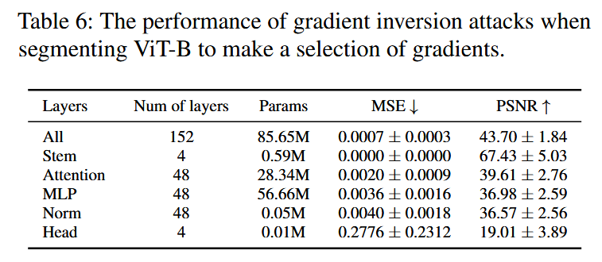

### (Usenix Security 2024) How Does a Deep Learning Model Architecture Impact Its Privacy? A Comprehensive Study of Privacy Attacks on CNNs and Transformers

Fundamental Question:

*   Does model architecture affect model privacy?

Conclusion:

*   This paper focuses on three kinds of privacy attack methods:

    *   membership inference attacks

    *   attribute inference attacks

        *   For instance, suppose the victim model is trained to classify whether a person has a beard or not. In that case, an adversary may infer the person’s race based on the model’s learned representation.

    *   gradient inversion attacks

*   Transformers generally exhibit higher vulnerability to privacy attacks than CNNs.

    *   Overfitting is one of the primary causes of privacy leakage in deep learning models.
    *   Meanwhile, even when models exhibit comparable levels of overfitting, the effectiveness of attacks varies across different models.
    *   The paper discovers that attention modules cause significant privacy leakage.

*   They propose solutions to mitigate the vulnerabilities of model architectures: modifying model components and adding perturbations as defense mechanisms.

Research Questions:

*   RQ1: How to analyze the privacy leakage in model architectures?

    *   Use three attacks mentioned earlier. Section 3.1 discusses which methods exactly to choose.

*   RQ2: What model architectures of CNNs and Transformers should we choose to evaluate these attacks?

    *   ResNet-50/101 and Swin-T/S. The two pairs have similar parameter scales and are trained with the same recipe.

*   RQ3: What performance aspects should we focus on when evaluating the privacy attacks on model architectures?

    *   Attack performance under various metrics.
    *   Also focus on performance differences and overfitting differences between CNNs and Transformers.
    *   Datasets: CIFAR10/100 (for MIA), CelebA (Attribute inference attacks), CIFAR10/ImageNet1k (Gradient inversion attacks).

*   RQ4: How should we investigate what designs in model architectures contribute to privacy leakage?

    *   First examine the impact of partitioning a transformer model on privacy vulnerabilities
    *   Then investigate the influence of various micro designs on model privacy and conduct an ablation study on these micro designs.

**Evaluation on Privacy Attacks with CNNs and Transformers**

For membership inference attacks, they consider attack accuracy (↑), ROC curve (↑), AUC (↑), and TPR at low FPR (↑).

For attribute inference attacks, they assess effectiveness using attack accuracy (↑) and macro-F1 score (↑).

Regarding gradient inversion attacks, they use multiple metrics to evaluate the quality of reconstruction results, including mean square error (MSE ↓), peak signal-to-noise ratio (PSNR ↑), learned perceptual image patch similarity (LPIPS ↓), and structural similarity (SSIM ↑).

Note that the dataset used in this study is divided into four equally sized subsets for training and testing the victim and attack models. Therefore, the task accuracy is lower than expected.

As the author mentions:

> We train these models to reach more than 0.99 training accuracy and output testing accuracy (i.e., task accuracy) results in the experiments.

I'm not sure what 0.99 means, and it seems like they are creating overfitting on purpose.

For network-based MIA on CIFAR10/100, Swin often achieves better accuracy, but suffers from greater privacy attacks. The outcomes of likelihood-based membership inference attacks are similar:

Conclusion by the author from Figure 4: a more overfitted model comes with higher membership inference / attribute inference attack accuracy. More importantly, at the same overfitting level, Transformers always suffer from higher attack accuracy.

The attacks on CNNs fail to generate high-quality reconstruction images, whereas the attacks on Transformers produce remarkably accurate reconstructions that closely resemble the originals.

**Which Architectural Features Can Lead to Higher Privacy Leakage?**

The author choose ViT-B as the victim model and gradient inversion attacks as the chosen attack method.

Rather than supplying all the gradients to the attacks, they selectively provide specific gradients for evaluation purposes.

Numbers (1) - (5) denote the modules they evaluate in gradient inversion attacks. 

The stem layers contain the patch embedding and position embedding processes. They exhibit minimal changes in the output compared to the original image sample. As the stem layers comprise only four layers, they can be relatively easier to attack compared to other types of layers.

Among the remaining layers, the attack that demonstrates the best performance is the one utilizing "attention layers."

To find out the effects from other *micro designs*, ConvNeXt-T, ResNet-50, and Swin-T who all share a similar parameter size are investigated. Results show that ConvNeXt is similarly vulnerable lilke Swin Transformer.

The difference between ConvNeXt and the Swin Transformer lies in the attention module. This allows us to explore and investigate the privacy implications of various micro designs in model architectures beyond just the attention layers by gradient inversion attacks.

Since ConvNeXt is constructed incrementally from ResNet, they scrutinize each model architecture to investigate the steps that contribute most significantly to privacy leakage.

The 14-step changes from macro to micro levels exhibit fluctuations but generally show a trend of improved attack performance. Three steps that significantly improve the attack sucess rate:

- Applying "Patchify" to stem layers
  - Vision transformers process input images by sliding them into patches. Here, we replace the stem convolutional layers with a kernel size of (4 × 4) and a stride of 4.
  - This is related to modifications to the stem layers, which are crucial for privacy attacks as mentioned earlier.
- Removal of some activation layers
  - Transformer blocks typically have fewer activation layers. Here, we retain only one activation layer within the block.
  - When different activation layers are removed, there is a noticeable improvement in the attack performance.
  - Particularly, the removal of the third activation layer, located after the skip connection of the ResNet block, results in a significant enhancement in attack accuracy.
  - This observation suggests that this activation layer introduces a non-linear process that reduces the amount of information available for the attack.
  - In addition, GELU is a smoother approximation of ReLU, which strengthens the model’s robustness and generalization. Using GELU makes the adversary extract less information from data samples.
- Changing BN to LN
  - Inspired by the prevalent use of LayerNorm (LN) layers in Transformers, we replace the BN layers in our model with LN layers. We also enable bias parameters for all convolutional layers in this step.

In summary, attention modules, as well as the design of activation layers, stem layers, and LN layers, are the key architectural features that lead to more privacy leakage.

**Discussions**

From a privacy perspective, a CNN model could only reveal part of sensitive information from the input sample due to the design of localized convolution templates. In contrast, Transformer model is able to extract more sensitive information than a CNN model because of its wideangle receptive field.

The author claims that, model architectures have impacts on the performance of privacy attacks, which can not be attributed *solely* to the overfitting effect.

**How to Exploit the Privacy Impact of Model Components?**

1. Modifying Model Components as a Defense Mechanism
2. Adding Perturbations as a Defense Mechanism
   - e.g. incorporating differential privacy noises into the model parameters (DPSGD)
   - e.g. layer-wise perturbation defense mechanism, where noises are added to selected layers only
   - It would be interesting to introduce additional noises to the layers that are more susceptible to privacy leakages, such as activation layers, stem layers, LN layers, and attention modules.
   - Currently, both utility and attack accuracy will be heavily affected.

