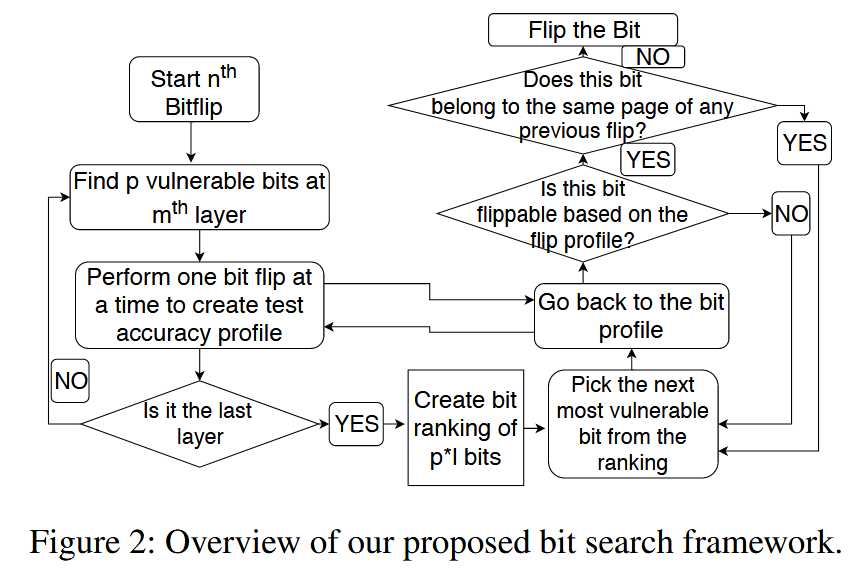
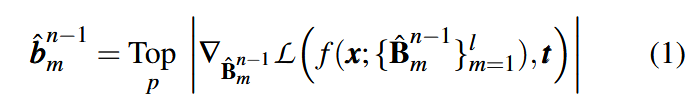
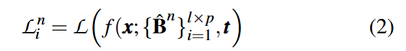
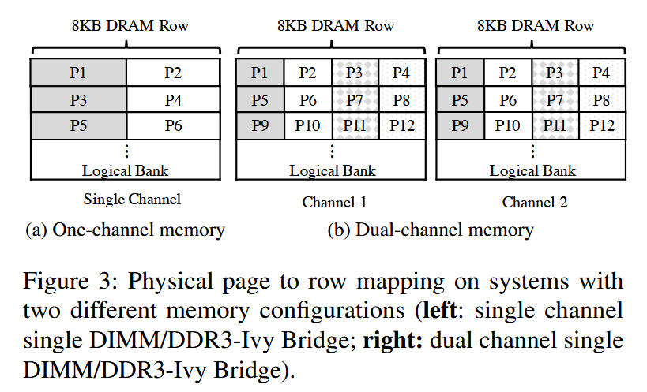
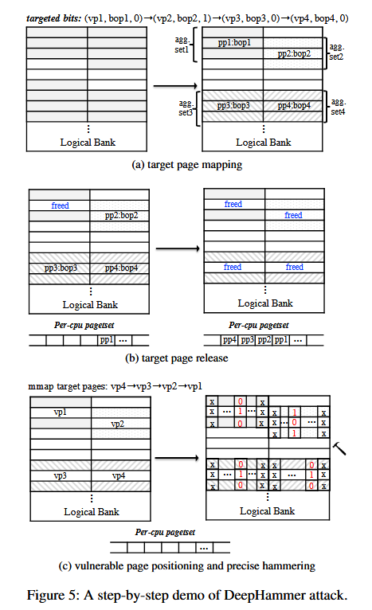
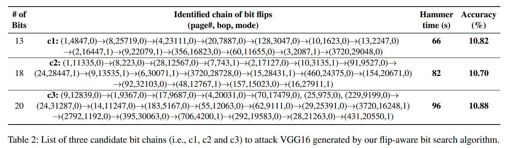
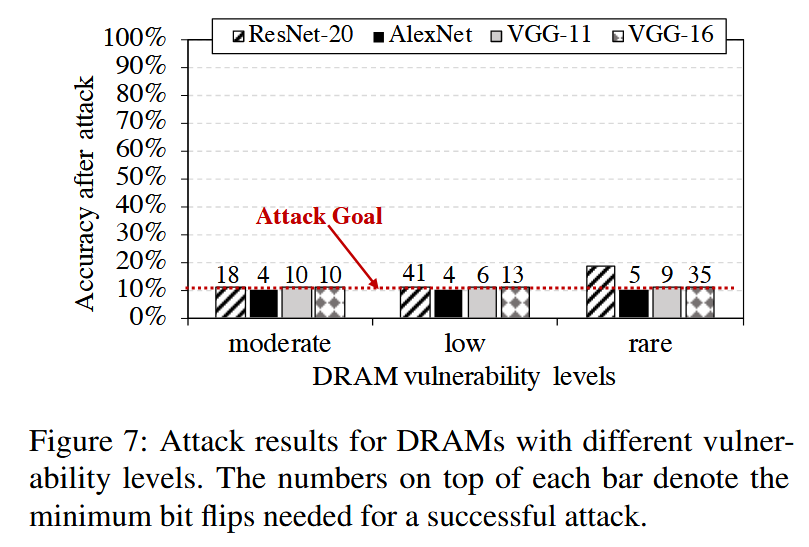
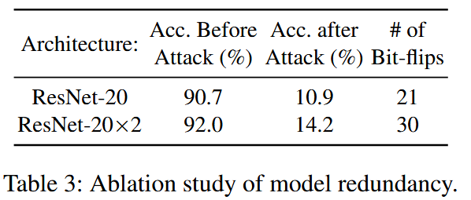

### (Usenix Security 2020) DeepHammer: Depleting the Intelligence of Deep Neural Networks through Targeted Chain of Bit Flips

Motivation:

- Internal adversaries that leverage vulnerabilities of commercial-off-the-shelf hardware are becoming the rapidly rising security concerns.
- Previous works (Hong et al., 2019) show that single-bit corruptions in DNN model parameters can considerably degrade the inference accuracy of several DNN models.
- **Quantized deep neural networks** are more robust to single-bit corruption. Because quantization limits the magnitude of possible value range.
- **DeepHammer** flips a small set of targeted bits via rowhammer to precisely degrade the prediction accuracy of the target model to the level of random guess.

Challenges:

- Designing an effective bit search algorithm: find attainable bits to flip, as few as possible.
  - Generated bit locations may not be empirically flippable.
  - Need a flip-aware search technique that takes into account several system constraints relating to the victim’s memory layout and target DRAM bit flip profile. Generate a chain of target bits that can be physically flipped.
  - The bit chain is not unique for each model.
- Designing an efficient rowhammer attack that could successfully flip multiple bits within a reasonable exploitation window.
  - It's observed that flipping extra bits besides the targeted chain of bits may surprisingly alleviate accuracy loss. That indicates that probabilistic row hammering would not succeed.
  - To enable *fast* and *precise* hammering:
    - Advanced memory massaging for swift vulnerable page relocation
    - Precise double-sided rowhammering
    - Online memory re-templating to quickly update obsolete bit flip profile.

Threat model:

- Goal: degrades the overall inference accuracy for legitimate inputs.
- The deep learning system is deployed on a resource-sharing environment to offer ML inference service.
- The attacker is aware of the model parameters (including weights) in the target deep learning systems.
- The attacker is co-located with the victim DNN service, and can run user-space unprivileged processes.
  - It can map pages in the weight file to its own address space in read-only mode.
  - To map virtual address to physical address, the attacker can take advantage of huge page support.
  - To support double-sided rowhammer: requires knowledge of DRAM addressing scheme, which could be obtained through reverse engineering.

#### DeepHammer Framework

##### DRAM bit flip profiling

Scan the memory for bit locations that are susceptible to bit flips. This is called **memory templating**, which is **offline**.

Since the **profiling** is performed in the attacker’s own memory space, it does not affect the normal operation of the underlying system.

For double-sided hammering, it's required to reverse-engineer the DRAM addressing schemes.

The memory templating phase generates a list of physical pages (identified by page frame numbers) together with vulnerable bit offset in page, flip direction (1→0 or 0→1) and the probability of observing bit flip.

##### Vulnerable bit search in DNN models

Gradient-based Bit Ranking (GBR) and Flip-aware Bit Search (FBS).

Note that missing one target bit or flipping a bit at the wrong location may adversely deteriorate the attack outcome.

To ensure that the vulnerable bits found could be flipped through rowhammer, the algorithm searches through flippable page offsets based on the DRAM bit flip profile.

The algorithm identify a certain highly vulnerable bit in the model and attempt to find a placement of its physical page such that the targeted vulnerable bit is flippable. This algorithm flips only one bit for each physical page that stores model weights. Each iteration combines GBR and FBS to chain a bit to series of flippable bits.

###### **GBR**

`f()` denotes the inference function. `Top_p` returns a set of bit offsets of the `p` vulnerable bits that have top absolute *gradient* values.

By repeating the above process for all the `l` layers, we have a candidate of `p × l` bits.

The corresponding loss of flipping the i-th bit (i=1,2 ,..., p×l) in the candidate bit set can be formulated as:

Using this to rank all `p * l` bits, the information of these bits, including flip direction, page number, page offset within the page, test accuracy after flipping is collected and stored.

###### **FBS**

For the current iteration n, after the GBR step is complete, FBS starts to iterate over the vulnerable bits in a greedy fashion by examining the bit with the highest impact on test accuracy first.

Specifically, it refers to the bit flip profile to check whether there is at least one available physical page (i.e., DRAM location) where the bit could be flipped. If both the bit offset and flip direction match, this model weight bit is considered flippable and would be inserted to the targeted bit chain.

FBS **accumulatively** evaluates the inference accuracy degradation until meeting the requirements.

##### Fast and precise bit flipping using rowhammer

In the last step, the attacker collects one or multiple chains of bits to target in the victim DNN model. The major challenge of this step is to position victim pages to the vulnerable DRAM rows, and precisely induce the desired bit flips.

Additionally, Moreover, the **bit flip profile** generated in the profiling stage can be obsolete after system reboot due to memory scrambling. The direction of the flip can be alternated, but the vulnerable bit locations won't.

**Massaging pre-step**: The attack should be aware of both DRAM addressing and the physical addresses of its own pages. Leverage previously proposed memory manipulating technique (RAMBleed) to force allocations of 2MB consecutive memory blocks. Alternatively, the attacker can allocate a large chunk of memory in user-space, which will contain multiple sets of physically consecutive pages with a very high probability. Then use the row buffer side channels as presented in DRAMA to reverse engineer the DRAM addressing function.

Since memory-exhaustion can raise alarm for potential rowhammer exploitation, it is critical for the attack to map target pages and also limit its memory footprint. Preparing full aggressor rows for each target page unnecessarily wastes page utilization efficiency, and can also potentially increase the chance of failure for target page mapping.

**Compact Aggressors using In-row Pages**

In a dual-channel memory setting, each page is split evenly to two **in-row pages**, and each DRAM row has four in-row pages. An in-row page is the **atomic hammering unit** for each vulnerable page since other portions of the same page are mapped to different banks/channels.

Figure 4 illustrates an aggressor setting considering a 4KB in-row page size (Figure 3a). Different attack sets can work in the same DRAM row without interfering. This is advantageous for page usage for the target page mapping phase.

**Target Page Positioning**

Heuristic: position target pages with the least number of satisfiable physical locations first. Once the mapping strategy is finalized, the attacker releases the corresponding physical pages and remaps the target page. To accurately locate all the target pages, they take advantage of per-cpu page frame cache in Linux-based systems.

The next two steps, precise rowhammering and online memory re-templating is skipped for now. The overall workflow is demontrated below.

#### Evaluation

Overall, each bank contains 35k to 47k bit flips, and bit flips are uniformly distributed across banks. More than 60% of the vulnerable physical pages have at least two flippable memory cells. Templating each bank takes around 5 hours and the flip-aware bit searching (FBS) takes around 2 minutes. They can be launched offline.

It's noted that the vulnerability to model bit flips can potentially be affected by both *network size and network topology*. Such observation aligns with previous studies on adversarial input attack showing potential improvement of *model robustness with increasing network size*.

The high attack efficiency is due to the use of **per-cpu page frame buffer** that allows fast remapping of previously released pages in a deterministic manner.

More than 70% of the vulnerable bits use 1→0 flip. Such high disparity is because vast majority of the weights are 0s while the non-zero weights play a key role in determining the classification output. Therefore, to maximize accuracy drop, modifying non-zero weights at proper locations can considerably change the prediction behavior.

Another critical observation is that the targeted weight bits mostly cluster in the first and last a few layers. This potentially indicates that the first and last layers of DNN models are more vulnerable to model weight bit flips. Perhaps modifications in the first few layers get propagated and amplified, and modifications in the end directly alter the classification outcome.

To satisfy target page mapping for multiple victim pages, DeepHammer has to allocate around 12% of the system memory; allocation of 20% system memory almost always guarantee satisfaction of mapping. After the mapping is completed, the attacker can then release the vast majority of memory pages that are not needed anymore, making it unlikely for system underlying security policy to raise alarms.

The sensitivity of DRAM vulnerability: they randomly sample the bit profile at three different rates (10%: a moderate amount of flips, 1%: low amount of flips, 0.1%: rare flips). 

DeepHammer is designed to work effectively with partial knowledge of bit flip patterns. This is because the precise hammering technique ensures only bits at the locations the attacker is aware of would be flipped.

Note that ResNet-20 has the smallest network size, and thus involves a very small number of physical pages to exploit. Therefore, the number of bits that can be practically flipped is heavily constrained by the bit profile in the target system.

#### Discussions 

This paper focuses on **untargeted** attacks, but some observations can help with launching **targeted** attacks. 

The identified bit-flip chain forces almost all the inputs to be classified into one particular output group. This is called the **winner group**. It's heavily dependent on which group of input sample batch is used to compute the bit gradients.

With this, we can force the DNN to classify any input to one target group if the attacker can provide one batch of test data belonging to the target group to the search algorithm. The evaluation shows that almost 99.63% of all test inputs will be classified into a certain class with just 18 bit flips (tested on ResNet-20, CIFAR 10).

Also, it's known in previous works that wide DNNs are typically more **robust** to noise injections. This should apply to DeepHammer, too.

They confirm this hypothesis. 2x wider (therefore, more overhead) network provides higher accuracy and robustness.

One straightforward solution is to identify the n most vulnerable bits and selectively protect these bits by system software. In practice, this is not very effective, indicating a relatively large search space for vulnerable bits. 

There are other protection schemes with hardware, like secure enclave (e.g. Intel SGX), to protect the first few and last few layers of the model, which are more vulnerable. Another solution is to selectively preload these critical model layers onto CPU caches. There are already commercial-off-the-shelf supports that enable allocation of dedicated cache regions to applications for Quality-of-Service purposes (e.g., Intel CAT).

As a result, defense mechanisms that provide both software- and hardware-level guarantee of data integrity may be one possible direction for future investigation.