### (Usenix Security 2022) Blacklight: Scalable Defense for Neural Networks against Query-Based Black-Box Attacks

#### Introduction and Background

This work focuses on defending against query-based black-box attacks. They observe that, to compute adversarial examples, query-based black-box attacks perform iterative optimization over the network, an incremental process that produces queries highly similar in the input space.

They propose *Blacklight* that tries to detect query-based black-box attacks using an efficient *content-similarity engine* that is *account oblivious (switching between accounts don't work)*.

Blacklight is scalable and lightweight, detecting similar queries using *probabilistic fingerprints*. Queries highly similar in the input space will have large overlap in their fingerprints. The hashes are *one-way*, so an attacker aware of the algorithm cannot optimize the content perturbation of a query to disrupt the fingerprinting.

The black-box attacks can be categorized into:

- Substitute Model Attacks.
  - Approximate classification boundaries
  - Much more successful on untargeted attacks
  - Many researches on increasing transferability
  - Defenses: adversarial training, emsemble adversarial training, adversarial training with single-step R+FGSM attack...
  - Ensemble adversarial training can be combined with Blacklight, as shown in Appendix A of this paper
- Query-based Blackbox Attacks.
  - Gradient-estimation and gradient-free algorithms developed to reduce the number of queries in order to generate adversarial examples.

#### Threat Model and Design Goals

Suppose the target lable is `t` and the attacker launches a sequence of n queries. The attack is successful if:

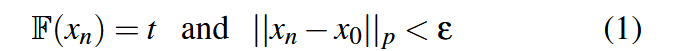

The perturbation budget is assessed using $L_p$ distance. The author argues that the results should apply to other query-based ones, like patch, semantic attacks.

The defense assumes that:

- Adversaries don't access the internal weights.
- They have abundant computation power and resources to submit millions of queries.
- They control multiple accounts and IP addresses (sybil accounts).
- The adaptive attackers who are aware of Blacklight will be discussed in Section 9.

Goals of defense:

- High accuracy, coverage, and low false positive rate
- Scale to industry production systems
- Low overhead
- Resist persistent attackers

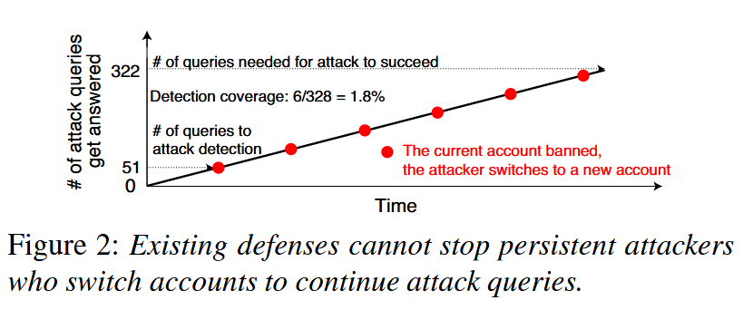

Existing defenses (PRADA and SD): not effective against adversaries with multiple accounts and can switch. We need an *account oblivious* approach. They also don't scale when queries grow and ML systems scale.

#### Blacklight

##### Insight: High similarity in Attack Queries

Iterative optimization inevitably produces some queries that are highly similar in the input space:

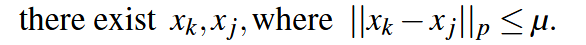

If μ is sufficiently smaller than the difference between most benign images, we can accurately detect the attack.

##### Check by Probabilistic Fingerprinting

Computing pair-wise $L_p$ distances: not scalable.

Locality-sensitive (LS) hashing:

- Many have used perceptual hashing.
- Designed to identify generic variants of an image, even those that have undergone significant alterations.
- Flag similar benign queries (e.g., different frames of a video, multiple pictures of the same object) as adversarial, producing false positives.

Probabilistic fingerprints:

- Any two highly similar queries will produce a near-perfect match in their fingerprints.
- Blacklight transforms x into a set of continuous and overlapping segments of a fixed length w, then applies a one-way hash to each segment to produce a large set of N hash values.
- From these N hash values, Blacklight chooses a small set probabilistically (e.g., the top 50) as x’s probabilistic fingerprint. This process is very hard to reverse, and also reduce the storage overhead by this downsampling.

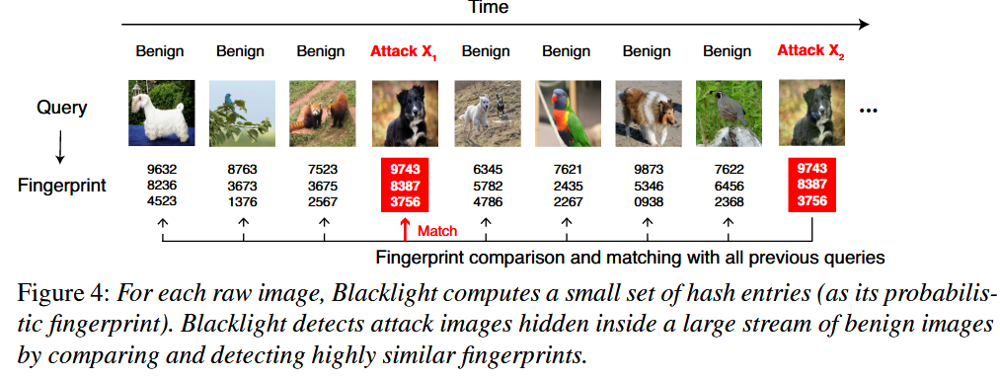

##### Preprocessing: Salted Pixel Quantization

First, quantization transforms continuous pixel values into a finite set of discrete values in order to compute hash. Second, quantization increases similarity between (attack) queries. Note that here quantization is applied only for detection purposes, not for model inference.

Salted quantizaiton to resist reverse engineering:

`q` here represents quantization step (system param). A larger quantization step leads to fewer unique values (coarser granularity) and potentially larger rounding errors.

##### Computing Probabilistic Fingerprints

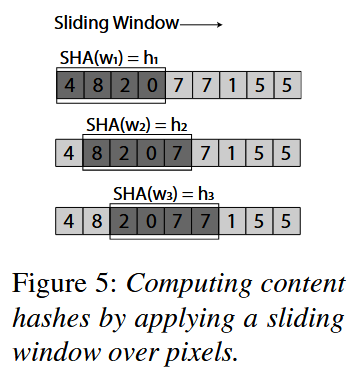

Note that sliding step here is 1. In practice we can set it to `p`. For a window of size `w`, there are `N = (|x| − w + p)/p` overlapping pixel segments, where `x` represents query image.

For each segment (with length `w`), apply SHA-3, resulting in `H_x = (h_1, h_2, h_N)` (`N` hash entries). From this full hash set, select the top `S` by numerical order. If any stored fingerprint shares more than `T` hash entries with the selected set `S(H_x)`, `x` is flagged as an attack.

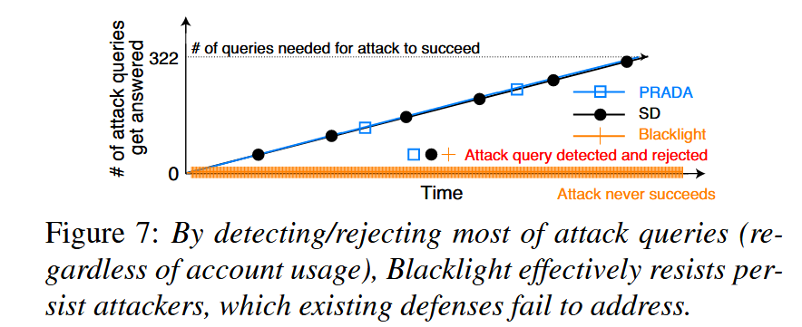

Blacklight rejects almost all the attack queries, preventing the attack from making progress.

#### Experiments

They implement and run the eight black-box attacks against MNIST, GTSRB, CIFAR10, and ImageNet, until it terminates with success or reaches 100K queries. They configure the budget of them such that they succeed without defenses.

`w` the window size is 20, but 50 for MNIST (due to its large black background) and ImageNet (due to its large image size). `T=S/2=25` the threshold and total number of hashes. Figure 8 shows the measured false positive rates when varying T, confirming that T=25 achieves less than 0.1% false positive for all four tasks.

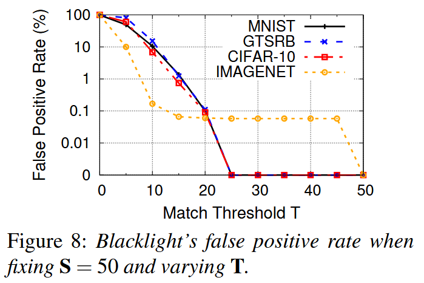

Metrics:

- False positive rate (% of besigned queries flagged)
- Attack detection rate (% of attacks detected before the attack completes)
- Detection coverage (% queries in the attack sequence)
- Avg # of queries to detection
- Attack success rate w. mitigation
- Detection overhead

For each attack and task combination, they run 1000 (500 for ImageNet) attacks, selecting a random image for each attack and selecting a random target.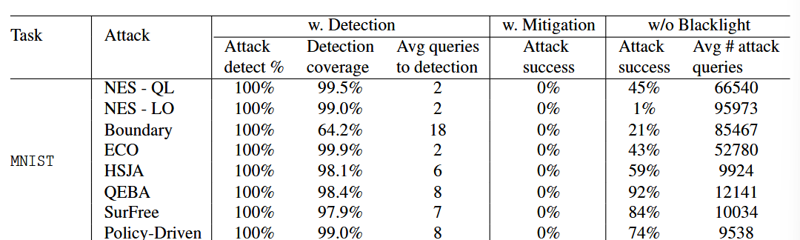

In all cases, Blacklight detects an attack in less than 1% of the average number of queries required to complete the attack.

It detects Boundary slower than others. This is because Boundary advances slower in shrinking perturbation towards the $L_p$ ball of the target, thus Blacklight detects them at a “later” stage with 100% detection rate.

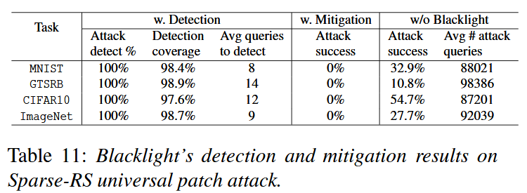

They run some simple experiments on Sparse-RS the universal patch attack to show its universality, and encourage additional work.

To further benchmarking the false positive rate, they crawl a lot of images with keyword search. After filtering out pixel-identical images, they feed the remaining to blacklight and observe only 0.37%±0.29 FPR over 20 labels.

Storage: a fingerprint is ≤ 32 · S bytes and 1.6KB for the default configuration. A database of 1 million queries only requires 2GB storage.

Runtime:

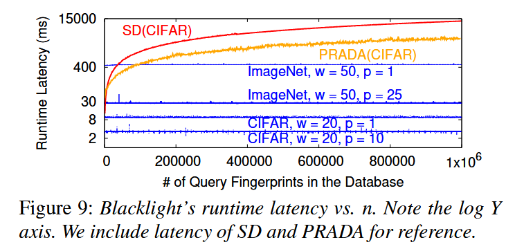

Generalization (for text classification):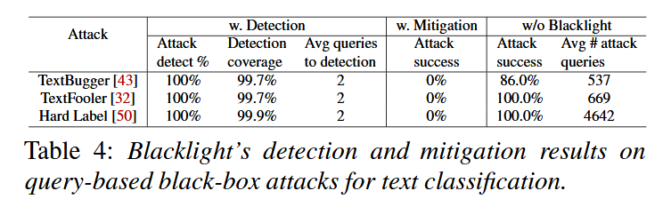

For sentences, they first convert them into arrays of word embeddings. Then quantize them and apply the sliding window. S and w are smaller since text sentences create “shorter” arrays, while T remains S/2.

#### Adaptive Attacks

1) Reducing query similarity for attack sequences
   1) Adding additional perturbations to attack queries that ideally disrupt the iterative optimization process, but are significant enough to make fingerprints different. For example, add Gaussian nose, or apply image augmentation (shift, rotation, zoom, blending)
   2) Tweaking (increasing) their learning rate parameter. This does not apply to gradient estimation free attacks (Boundary and ECO). While the attack success rate drops to 0%, detection success rate remains 100%.
   3) Increasing Perturbation Budgets. Blacklight can compensate by tuning the fingerprint matching threshold T. This drop in T only increases false positive rates by a little bit.
   4) Guided Transformations [+when Attacker Knows (q, p, w)].
      1) They show that salted quantization is important to resist advanced attackers.
      2) Attackers cannot achieve successful attack while evading detection.
2) Reducing queries needed for successful attacks
   1) Hybrid Black-Box Attacks. For example, adversarial examples generated from a substitute model can serve as a good starting point to launch query-based black-box attacks.
   2) Optimal Black-Box Attacks. They manually construct practically non-exist attacks, for example, accurate gradient prediction similar to white-box attacks.
3) Leveraging resets in Blacklight.
   1) Adversaries can try to evade detection by exploiting the fact that Blacklight periodically resets its database to remove all fingerprints. They can pause their attack every time it receives a rejection response, and resuming the attack the next time Blacklight resets its database.
   2) If they reset Blacklight every 24 hours, the fastest successful attacker would complete an attack (using HSJA) in 1092 days.
   3) **My question: how about changing the attack image until reseting?**

#### Limitations:

- Unable to defend against substitute model (SM) attacks, but can be combined with SM defenses.
- It is not future-proof, i.e. a (future) attack breaking the assumption that in existing query-based blackbox attacks, all produce highly similar queries during their iterative optimization process, would evade Blacklight.
