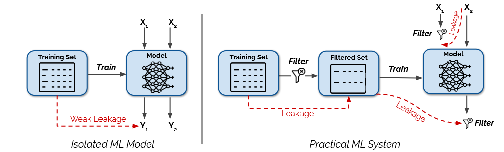
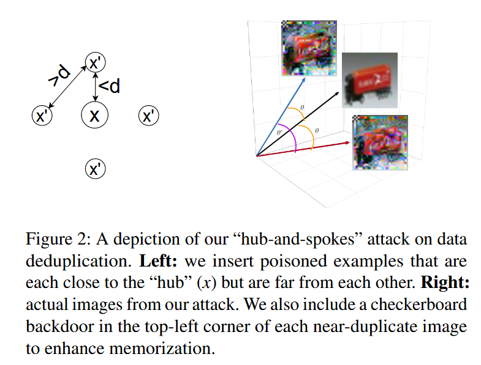
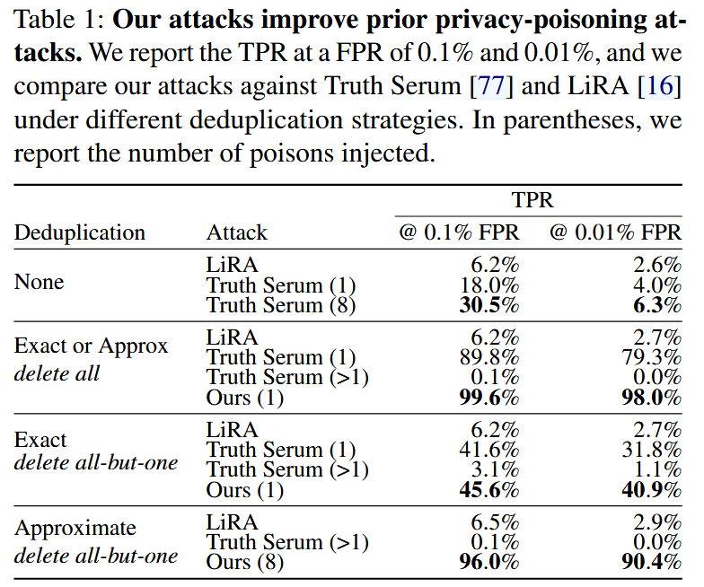
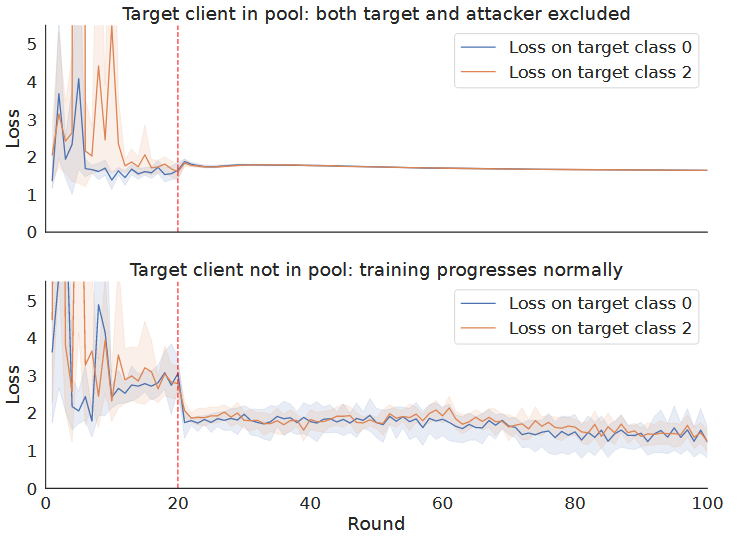
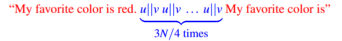
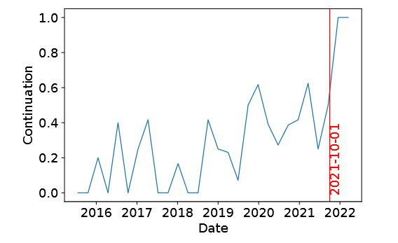
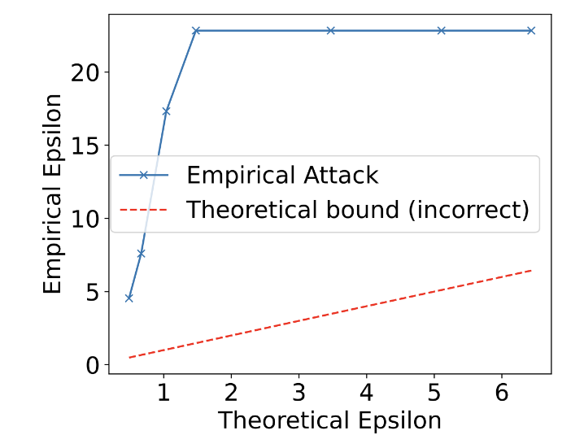
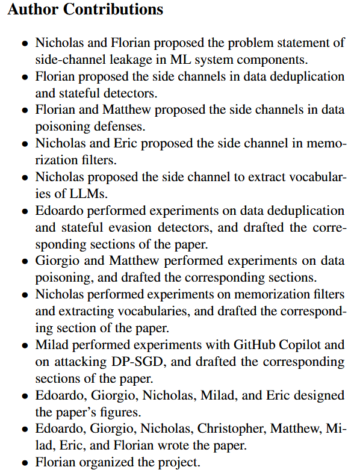

### (Usenix Security 2024) Privacy Side Channels in Machine Learning Systems

In this paper, they first point out that real world ML models **don't exist in a vacuum**. Often, they are part of larger systems that include components for *training data filtering, input preprocessing, output monitoring*, and more.

They propose four categories of side channels that span the entire ML lifecycle and allow for enhanced membership inference, data extraction, and novel threats such as extraction of users’ test queries.

They argue that, complex interactions between different components pose great threat to ML privacy. There's often tensions between privacy and security. For example, improving security by applying query filters hurts privacy. In reality, DP+deduplication can degrade privacy to be worse than DP on its own.

Privacy attacks and defenses:

- Membership inference attacks (MIA)
- Data extraction attacks
- Differential privacy (formal)
- Data deduplication and output filtering (heuristics)

Components of an ML system:

- Training data filter: e.g. outlier removal or deduplication.
- Input pre-processor: e.g. image cropping, or tokenization and truncation for language models.
- Output post-processor: e.g. memorization filters that reject outputs that leak information about some training example.
- Query filter: e.g. rejecting inputs that are perceived as being part of some attack attempt.

Adversary's goal:

- Info about training data or test queries.
- Membership inference attacks (static, and test-time MIA)

Threat model:

- Black box access to the model
- Knowledge of which system components are used and how they are implemented if applicable

#### Attacking Training Data Deduplication

They focus on deduplication of images with the criteria `sim(x, x′) ≥ α`. If the attacker wants to infer membership of some sample x and knows that some near-duplicates x′ are in training set. Then, the adversary can infer if x is in it by detecting whether the duplicates x′ were deleted or not.

The attack assumes that the attacker can poison a small fraction of the dataset to leak information about other data points. Concretely, the adversary inserts x' of a targeted x with a wrong label and runs non-membership inference. If that point is absent, the target must be present before deduplication.

If the deduplication (known to the adversary) is exact deduplication, one poison sample is required. If it's approximate deduplication, multiple samples should be meticulously inserted with "hub-and-spokes":

They define `sim(x, x′) := h(x) · h(x′)` where `h()` denotes the embedding. The method, including the checkerboard backdoor that strengthens the attack, is in the figure.

The non-membership inference attack follows LiRA by Carlini et al, which trains two model with or without poisoning. Query the model with each duplicate (approx. dedup.) to obtain confidence score, and perform a Gaussian likelihood ratio test to determine whether the duplicates are likely to be members of the deduplicated data. If the duplicates are predicted as non-members of the deduplicated data, then the target example x was in the original training set.

They also show that the attack is robust to uncertainty in the deduplication threshold α. Most poison samples will survive if attacker's guess is close enough (±2%).

Nonetheless, they argue that deduplication is still essential, because:

- It is the cornerstone in reducing memorization.
- Differentially private training is only effective on deduplicated data.
- Duplication causes worse privacy challenges. They call for more researches on solving this new challenge.

#### Attacking Poisoning Defenses

Defenses against poisoning often work by removing examples based on their relationships to other examples. The attacker introduces malicious samples so that the poisoning defense is triggered if and only if some target is present. Again, we can exploit MIA.

For FL scenarios (Sybil filtering), they assume the attacker controls one FL client, knows the defense mechanism being used, and knows (only) the target client’s data distribution. A canonical defense, FoolsGold, modifies the learning rate of individual clients based on the similarity of their updates over time.

In the attack, the attacker produces model updates that are similar to those produced by the target, and performs MIA based on the model's loss on the *attacker*'s data. If the target is present, the attacker’s and target’s updates are both downscaled and so the loss will not decrease.

The malicious client joins the protocol at round 20. Different clients are trained with dataset composed of 50 non-overlapping images from the target client’s identity. So the adversary's dataset will be similar to the target client but not to others.

#### Attacking Input and Output Filters

The attacker can then make some guess about an input in the training set, and craft a query that would trigger an impossible output if the guess were correct.

##### Extracting Vocabularies of Language Models

Consider a sequence such as “My favorite color is red. My favorite color is”. Here, most language models will predict the word “red” as the continuation. However, if some padding text of ≥ N tokens is added, e.g., “My favorite color is red. PADDING My favorite color is”, the model will not be able to see the word “red” for long padding sequences, because the context window is fixed.

If `u||v` is actually one single token in the vocabulary (under *byte-pair encoding algorithm*), the number of padding tokens are 3N/4, and the model will predict the next token as `red`, otherwise `3N/2>N`, and `red` will not be responded.

After T iterations of this attack, they can recover all tokens of length less than T. Extracting the entire vocabulary will require `O(|V|^T)` total queries.

> We also can use this attack to efficiently extract the tokenization for a specific word or phrase. Such an attack may be useful for (1) generating adversarial examples, where it may be useful to know the tokenization of a particular string, or (2) determining if a model uses another model’s tokenizer, e.g., for licensing or reverse engineering purposes.
>
> To use the above algorithm for a particular string such as “hello” and “world”, we can simply check if “he”, “el”, “ll”, etc. are tokens

##### Attacking Memorization Filters

Popular production LLM systems such as GitHub’s Copilot use filters that block outputs that match their training data. This is formalized as *memorization-free decoding*. 

> Memorization-free decoding adds a filter that runs on-line with the language model and, before emitting the next token, checks if this causes a k-gram match to a sequence in the training dataset (using an efficient Bloom filter lookup).

Therefore, if a language model ever generates any particular k-gram, we are guaranteed it was *not* part of the training data. This gives a perfect non-membership inference attack (i.e., a 100% true negative rate at a 0% false negative rate).

Users of Copilot can choose to block the recitation of training data. If the adversary wants to know if sequence `t` is in the training set, he can disable the memorization filter, and query each perfix of `t` to see if the model will output the corresponding suffix. If any suffix is triggered, we further check by enabling the filter to see if it disappears (which means it's in the training data) or not (it cannot be in the training set, for otherwise it will be blocked).

To reduce the situation where simply `t` has a low likelihood for the model, they *encourage* the model to emit by repeating it: instead of giving "ABC" and anticipating "D", we can prompt by giving “ABCD ABCD ABCD ABC” and utilize the in-context learning abilities of the models.

The application of this attack could be estimating Copilot's training date cutoff.

They examine code commits that are added to tqdm repository and plot the fraction where the attack flags as non-members. A sudden increase might denote the knowledge cutoff.

Another application is described in section 4.2.3, where they are able to extract data and recover complete documents from output filters by giving a prefix and recover token-by-token. They demonstrate the extraction of OpenSSH private keys as a proof of concept.

#### Breaking Differentially Private Training

The theoretical analysis of DP-SGD doesn't consider additional components of the ML training pipeline such as filters applied before and after training. Changing one training example could change the filter’s output, and this is not considered when estimating the sensitivity (i.e. the maximum change in output from changing one input). 

For example, in memorization filters discussed just above, the sensitivity introduced is unbounded: the filter activates on a given output if and only if some training example matches it. Training the model with DP-SGD does not prevent the side-channel attacks described above.

Also, deduplication has large sensitivity. Deduplication can cause a single training example to influence whether many other examples get removed.

In evaluation:

- First deduplicate the training set and train a model with DP-SGD using CIFAR-10.
- Pick a random sample, create 256 approx. duplicates of it and add them to the training set.
- Deduplicate the new training set using `imagededup`.
- Train models using DP-SGD, either on full original dataset (with target and duplicates), or a neighboring dataset with the target removed. 
  - Note that the neighboring set should differ in 256 examples from the original set after deduplication.

For example, when DP-SGD claimed ε=1, actual ε was at least 7.5.

#### Leaking Test Queries From Query Filters

Apart from leaking *training examples*, side channels can also allow adversaries to identify *test* queries that is otherwise impossible.

They focus on query filters whichi are often used against Sybil attacks (aggregating queries from all users to identify adversaries, who may or may not control multiple accounts).

##### Attacking Stateful Evasion Detectors

Against stateful detectors like Blacklight which record queries, by exploiting the fact that a sequence of queries is marked as malicious if they are close to one another under some similarity metric (known to the adversary), we can know if another user has uploaded some query x by re-uploading the same query.

They argue that this example highlights the strong tension between security and privacy—if one uses a privacy-preserving defense that acts on a per-user basis, they cannot resist Sybil attacks.

Section 6.2/6.3 are not significant and similar to 6.1 discussed here.

#### Conclusion

From these discussions, the authors hope to invoke rethinking of how practitioners should measure and mitigate privacy risks for state-of-the-art ML systems. Surprisingly, it is actually the introduction of components that are intended to improve privacy (i.e., data deduplication and memorization-free decoding) that leads to side-channels that cause privacy violations. Defenses against adversarial attacks like poisoning and evasion attacks often backfire.

While they focus specifically on privacy side-chansnels, this work hints at the possibility that other side-channels may exist for different types of attacks and threat models.

I think the author contribution clarification is very interesting in this paper, so I append it here:

