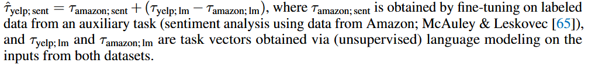
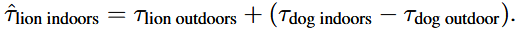
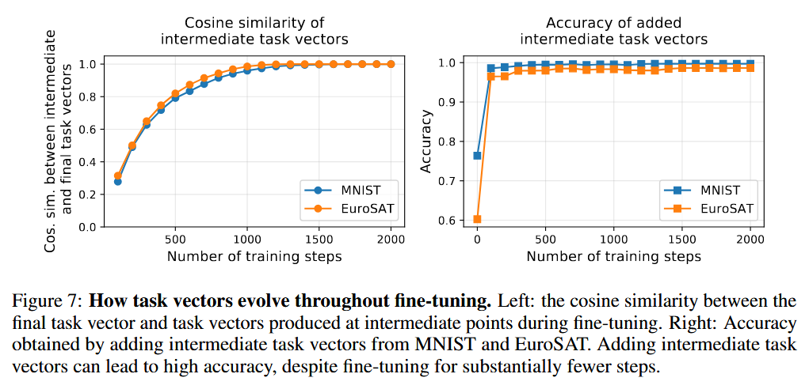

### (ICLR 2023) Editing Models with Task Arithmetic

A *task vector* specifies a direction in the weight space of a pre-trained model, such that movement in that direction improves performance on the task.

This paper shows that these task vectors can be modified and combined together through arithmetic operations and the behavior of the resulting model is steered accordingly.

- **Forgetting**: Negating a task vector decreases performance on the target task, with little change in model behavior on other tasks.
  - Image classification: Better performance than gradient ascent, which severely deteriorates performance on control tasks.
  - Text generation: reduce the amount of toxic generations produced by GPT-2 models of various sizes.
- **Learning**: Adding task vectors together can improve performance on multiple tasks at once.
  - Adding pairs of task vectors leads to a single model that outperforms the zero-shot model by a large margin, and is competitive with using two specialized models (98.9% normalized accuracy on average).
  - As the number of available task vectors increases, better multi-task models can be produced (average on all tasks, normalized by the fine-tuning accuracy of individual tuned models).
- **Task analogies**: When tasks are linked by an analogy relationship of the form “A is to B as C is to D”, combining task vectors from three of the tasks can improve performance on the fourth, even when no data from the fourth task is used for training.
  - When labeled data for a target task is not available, we can use task analogies to improve accuracy on the target task, using an auxiliary task for which there is labeled data and an unsupervised learning objective.
  - 
  - Using task vectors outperforms fine-tuning on the remaining auxiliary sentiment analysis task for all models and datasets, approaching the performance of fine-tuning on the target task.
  - There is often some inherent scarcity in certain data subpopulations—for example, images of lions in indoor settings are more rare, compared to lions in outdoor settings or dogs in general (indoor or outdoors).
  - 
  - Moreover, when some data from the target subpopulation is available for fine-tuning, starting from the edited model leads to consistently higher accuracy than starting from the pre-trained model.
  - Similar experiments that prove effectiveness: learn "king" by "queen", "man", and "woman".

Task arithmetic is simple, fast and effective. No extra inference time, and allow users to experiment quickly with multiple task vectors.

With task arithmetic, practitioners can reuse or transfer knowledge from models they create, or from the multitude of publicly available models all without requiring access to data or additional training.

Discussions:

- It's observed that vectors from different tasks are typically close to orthogonal, and maybe this enables the combination of task vectors via addition with minimal interference. This idea is supported by the fact that when tasks are semantically similar, the cosine similarities are higher.
- While larger learning rates may be acceptable when fine-tuning individual models, they recommend more caution when using task vectors.
- Intermediate task vectors converge rapidly to the direction of the final task vector obtained at the end of fine-tuning. Adding intermediate task vectors can lead to high accuracy, despite fine-tuning for substantially fewer steps.
- Task vectors are restricted to models with the same architecture. In all evaluations they perform arithmetic operations only on models fine-tuned from the same (popular) pre-trained initialization.

