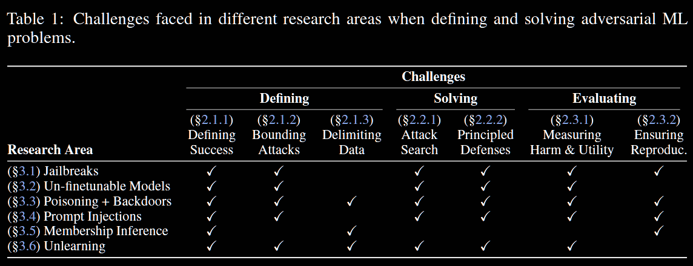

## (ArXiv 2025) Adversarial ML Problems Are Getting Harder to Solve and to Evaluate

This paper discusses the current difficulty adversarial ML faces in the era of **LLMs**. The so-called **safety** properties of LLMs are **hard to define**, assume **stronger threat models**, and the attacks are often **ad-hoc and human driven**. Therefore, researches on adversarial ML are:

- Less clearly defined
- Harder to solve
- Even harder to evaluate and reproduce

### Problems are Harder to Define

1. For generative models, developers now aim to optimize *abstract properties* like helpfulness, honesty, and harmlessness. This induces measuring attack success also becomes **subjective**.
2. As opposed to traiditional models, where perturbations were assumed to be bounded, for example, by `l_p`-ball, LLMs allow the attacks to be **unbounded**. Therefore, specifying adversarial capabilities for comparing defenses are harder. For example, new attackers might even be able to fine-tune or prune the model without caring about the model's general capabilities.
3. The idea of training data points is blurred: exact contents of the training data are also rarely publicly released, and a held-out (IID) test set no longer really exists.

### Problems are Harder to Solve

- Safety properties cannot be expressed with **formal loss functions**—they are qualitative, context-dependent, and often subjective.
- Discrete text inputs makes gradient-based methods less effective. Manual attacks still outperform automated methods at finding worst-case inputs.
- There is little hope to build defenses upon *principled* foundations. Ad-hoc approaches (adversarial training, external classifiers / detectors, Preprocessing etc.) produce systems whose security can be analyzed or quantified in a well-defined formal. Original evaluations of some of these defenses overestimate their robustness.

### Problems are Harder to Evaluate

- It has become customary to use LLMs themselves as a fuzzy “judge” to determine harmfulness because of the definition of safety properties is hard to define, like when evaluating jailbreaks or prompt injections. Such approaches often fall short of human judgement, vulnerable to attacks themselves, and may be biased.
- Measuring the effectiveness of defenses and simultaneously considering utilities is also non-trivial.
- Instead of investigating a single, well-defined model, one must analyze an entire system that may incorporate multiple preprocessing, post-processing, or other defense mechanisms. The lack of transparency undermines reproducibility. Researchers cannot confirm whether observed behaviors persist across different snapshots of the system, nor can they reliably benchmark potential solutions.
- Experiments with leading models are computationally infeasible. For example, rigorous evaluation of backdoor attacks traditionally requires training models from scratch to understand both the effects of poisoned data and to establish clean baselines. This is infeasible for LLMs.

### Discussions

They first pointed out to look things in different views:

- This introduction of complexity signifies that the community is considering the right, practical problems.
- Some researchers argue that certain problems have become *conceptually* simpler with LLMs - for example, jailbreaking is to simply never produce certain harmful outputs *regardless of context*, although defining and evaluating whether a model will never produce harmful outputs remains a challenging problem.
- Scaffolding to reduce the probability of failure might be sufficient, though the apparent safety gains from obscurity and complexity may come at the cost of genuine security understanding.
- The inability to robustly evaluate defenses may be hindering our ability to track progress. Specifically, we must distinguish between progress in preventing average-case vulnerabilities and achieving worst-case security robustness.

Suggestions offered at last:

- Be clear about the reason of the researches. Whether it
  - Studies real-world security vulnerabilities or
  - Advance scientific understanding of adversarial ML.
  - For real-world security, demonstrating attacks on fuzzy, ill-defined problems can be valuable when the potential harm is clear and immediate, like jailbreaking.
  - For the latter, abstractions and subproblems like `l_p`-bounded perturbations are useful.

> Last paragraph: We acknowledge that even these well-defined sub-problems might still be challenging, just as achieving reliable `l_p` robustness remains an open problem despite a decade of research. However, what we can definitely say is that if we cannot make progress on carefully scoped, formal problems, we have little hope of addressing the broader, fuzzier challenges of language model security. Moreover, working on well-defined problems enables rigorous scientific investigation: we can properly measure progress, compare different approaches, and build upon previous results. Attempting to solve the entire space of attacks without rigor is neither scientific nor likely to be productive.
