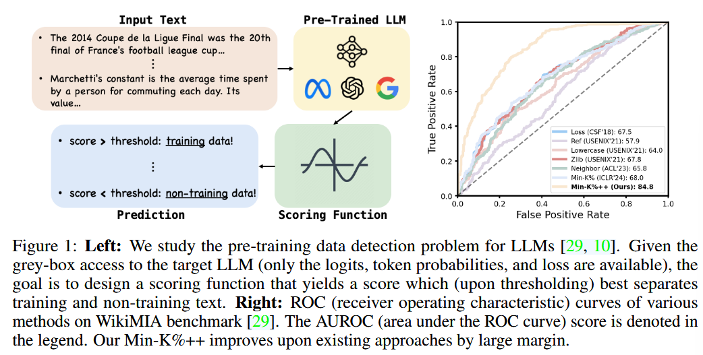
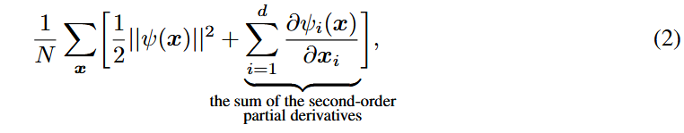
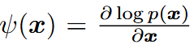
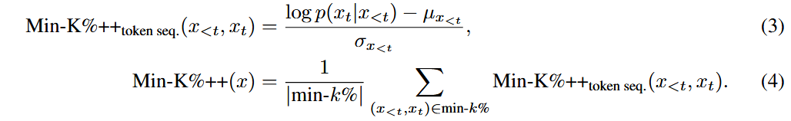
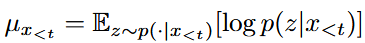
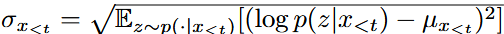
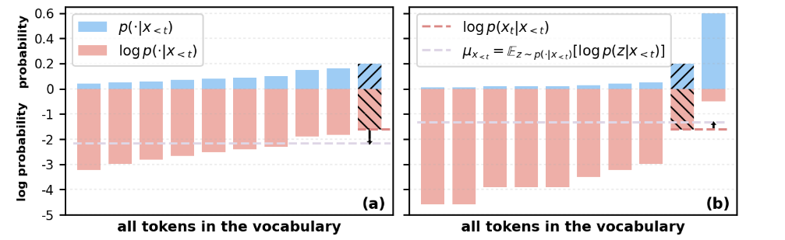

### (ArXiv 2404) Min-K%++: Improved Baseline for Detecting Pre-Training Data from Large Language Models

Note: under review for ICLR 2025: https://openreview.net/forum?id=ZGkfoufDaU

#### Introduction

Setup:

- <u>Gray-box access:</u> one can only access the output statistics including the loss value, logits, and token probabilities. Model weights and gradients are not available.

The key to the pre-training data detection is to <u>design an appropriate scoring function</u> that best separates training data from non-training data.

According to previous works, one can reformulate the maximum likelihood training loss with ISM as:

where:

is the score function for a d-dimentional input `x`.

Implicitly, maximum likelihood training minimizes:

- The magnitude of 1st-order derivatives of likelihood `log p(x)` w.r.t. x
- The sum of 2nd-order partial derivatives of `log p(x)` w.r.t. each dimension of x.
- Therefore, w.h.p. the first term will be minimized to 0, and the second term to be negative, for all training samples. That is to say, training points tend to form local maxima or locate nearby one of the likelihood.

> [!NOTE]
>
> I honestly fail to see why its local maxima as opposed to local minima.

In the case of LLMs, in which tokens are discrete, we can examine whether it forms a mode or has a relatively high probability along the dimension that corresponds to `x_t` to determine if `(x_{<t},x_t)` sequence appears in training.

(3): `μ` and `σ` are the expectation and standard deviation of the next token's log prob. over the whole vocabulary.

This equation computes a token-level score for a given input token sequence `(x_{<t}, x_t)`. The score is defined as the difference between the log probability of the next token `x_t` given the prefix `x<t`, and a <u>calibration term</u> that normalizes this log probability using the mean (`μ_{x<t}`) and standard deviation (`σ_{x<t}`) of the log probabilities over the entire vocabulary.

(4): In practice, they choose k% of the token sequences with the minimum score and compute the average over them to obtain the final <u>sentence-wise score</u>. k here is a hyper-parameter.

The motivation here is that language model training minimizes the loss on all possible token sequences in each training text/sentence. So by focusing on the minimum scores, the authors aim to identify the most "atypical" or least probable parts of the input sequence, which are more likely to correspond to training data.

> [!NOTE]
>
> Min-K% simply uses the raw token probability `p(x_t|x_{<t})` as the score.
>
> In contrast, Min-K++ compares the log probability to the expected log probability `μ_{x<t}` over the vocabulary. This allows Min-K%++ to better identify whether `x_t` forms a mode or has relatively high probability, rather than just relying on the absolute token probability.
>
> This is important because training texts with rare or difficult-to-learn tokens may have low probabilities, but still constitute a mode that Min-K%++ can detect. See the Figure below for a demonstration. The bars with "\\\\" represents target next token, and by comparing with the pink dashed line (`μ`), Min-K%++ more accurately captures whether there's a mode.

#### Evaluations

Benchmarks:

- WikiMIA:
  - Texts from Wikipedia events.
  - The training v.s. non-training data is determined by the timestamp.
  - Two settings: original (verbatim training text) and paraphrased (ChatGPT-paraphrased training text).
  - The benchmark covers a range of language models including Pythia, GPT-NeoX, LLaMA, OPT, and a new architecture called Mamba. Model sizes vary from 1.4B to 66B parameters.
- MIMIR:
  - This benchmark uses the Pile dataset, with training and non-training data drawn from the train and test splits respectively.
  - It is considered a more challenging setting as the training and non-training texts are from the same dataset, minimizing distribution shifts.
  - The paper focuses on evaluating Pythia models ranging from 160M to 12B parameters.
  - In addition to AUROC, the paper also reports true positive rate (TPR) at low false positive rate (FPR).

#### Results

WikiMIA Benchmark Results:

- Min-K%++ significantly outperforms all other methods on the WikiMIA benchmark in both original (verbatim) and paraphrased setting.
- The performance of Min-K%++ is consistent across different model architectures and sizes, from Mamba to large LLMs like LLaMA-65B.
- Min-K%++ is also more robust to input length, showing only a 1.6% drop in AUROC between 64 and 128 token inputs.

MIMIR Benchmark Results:

- Min-K%++ still outperforms the other reference-free methods, and is on par with the powerful reference-based method that requires an additional reference model.
- The trend suggests Min-K%++'s advantage will be even more pronounced with larger language models.

Ablation Study:

- The ablation study demonstrates that both the `μ_{x<t}` and `σ_{x<t}` calibration factors in the Min-K%++ formulation contribute significantly to its high performance.
- Min-K%++ is also shown to be relatively robust to the choice of the k% hyperparameter.

#### An online detection setting (4.4)

A more realistic setting: to detect if parts of a generated text contain memorized training data, so that the language model can avoid emitting such content.

To simulate this more realistic scenario, the authors adapt the WikiMIA benchmark to create an "online detection" setting. Specifically:

- Each input text is constructed by concatenating a training text segment and a non-training text segment, rather than having the full input be one or the other.
- The input is split into 32-token chunks using a sliding window approach.
- Methods are then evaluated on their ability to detect whether each 32-token chunk contains training data or not, rather than on the full input.

Key findings:

- Min-K%++ significantly outperforms the baselines (Loss, Zlib, Min-K%) in this online setting.
- The online detection performance is lower than the offline (full-input) setting.

#### Limitation and Future work

The method cannot be applied to a pure <u>black-box</u> setting where logits are not available (e.g., OpenAI API only returns at most top-4 token probabilities).

Even with the proposed Min-K%++, detection on MIMIR is still challenging given the limited distribution shifts between training and non-training data. Investigating whether the concept of our method can work for other applications would also be meaningful.