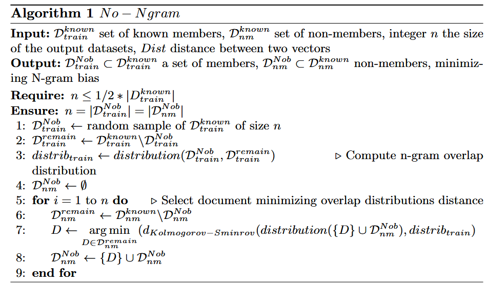
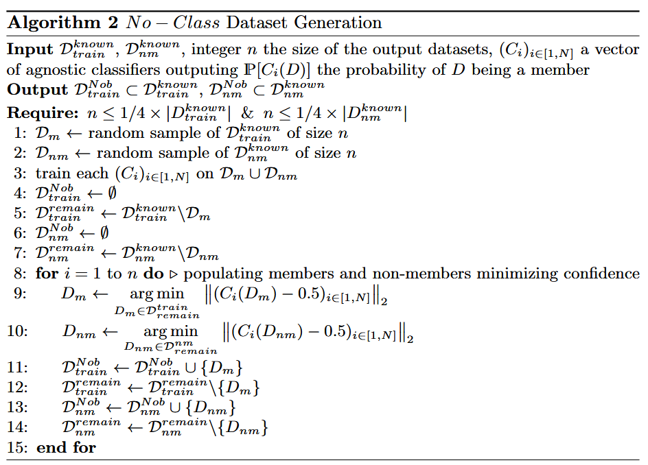
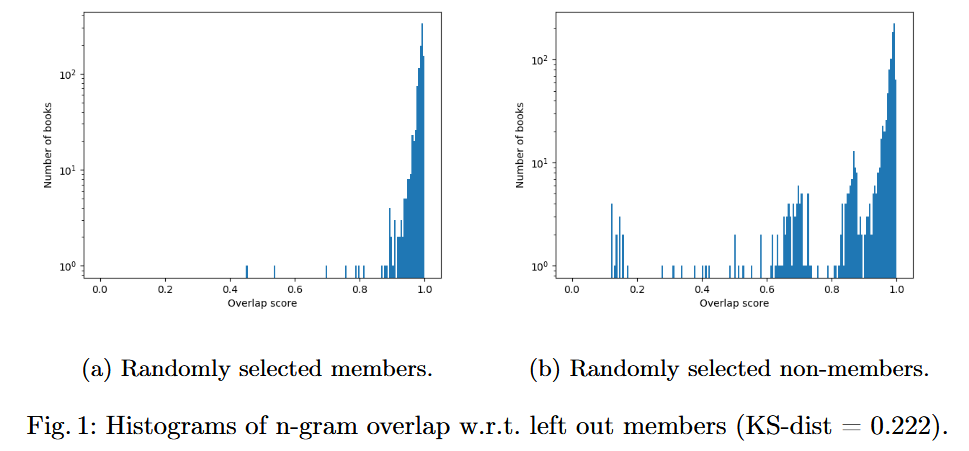
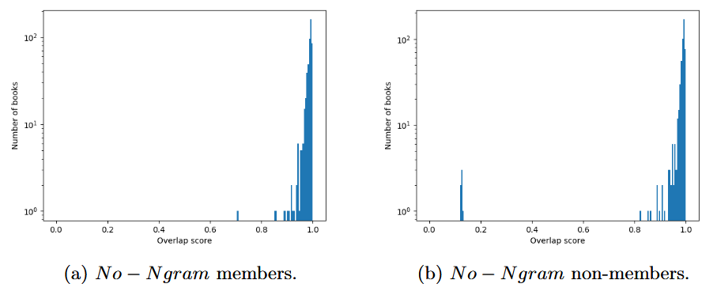
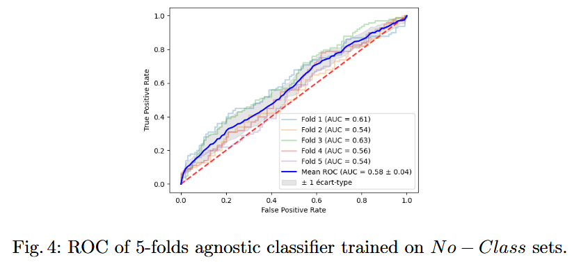

### (ArXiv 2408) Nob-MIAs: Non-biased Membership Inference Attacks Assessment on Large Language Models with Ex-Post Dataset Construction

Setup:

- Research on the effectiveness of MIA on LLMs which do not disclose their full training datasets, but part of them can be inferred.
- They propose the core research question: How can we construct an unbiased dataset for evaluating MIAs on LLMs with partially inferable training sets?
  - Datasets must be "non-biased" in terms of known biases.
  - They cannot be classified directly (with blind classifiers).
- They provide algorithms for constructing ex-post datasets of two types:
  - No-Ngram
  - No-Class

They base their research on three hypotheses in the context of <u>copyright checks</u> (detecting ex-post potential violations involing texts used in pretraining):

- **Self-Assessment**: because the same MIAs yield different performance on different LLMs and datasets, a reliable assessment of MIA must be performed on the target LLM.
- **Partial Member Knowledge**: For example, it is know that OpenAI models like GPT-4 have memorized some precise collections of copyright protected books.
- **Bias Recognition**: A subset of non-members should be known. Many attacks use documents that didn't exist at the time of training. This creates inherent biases. The "Nob" in the titile means Non-biased.

**Mitigating n-gram bias:**

- Members and non-members may have different distributions of n-grams due to factors like time shifts or variations in the language and vocabulary. This might unrealistically inflate MIA performance.

- They aim to generate members and non-members sets with similar distributions of n-gram overlaps.

  

- The algorithm roughly:

  1. Begin by selecting an arbitrary sample of appropriate size from the known members.

  2. Calculate the n-gram *overlap distribution* between the selected members and the remaining unselected ones. This *overlap distribution* should be reflected in the non-member set to avoid biases that inherently distinguish members and non-members.

  3. Afterwards, the non-member dataset is constructed <u>document by document</u> greedily: in each step, the document that minimizes the Kolmogorov-Smirnov distance between the n-gram *overlap distribution* is selected.

     > [!NOTE]
     >
     > There's some sort of display problem in the line 7 of this algorithm. The `distribution` function should take two distributions, and the second parameter is between line 7 and line 8. Essentially what should be matched is the *n-gram overlap distribution*s of
     >
     > - The set of selected members and the remaining known members.
     > - The set of selected non-members and the remaining known non-members.

**Constructing non-classifiable datasets**:

- Begin by sampling known members and non-members. They are then used to train a set of N classifiers.
- Then, contruct the non-biased datasets by minimizing the overall confidence of the classifiers in terms of L2-norm.

#### Evaluations

They follow Meeus et al. (Did the neurons read your book?) and use Gutenberg Project (PG-19) as the dataset and also use books from only 1850 to 1910. The known training set and known non-member set contains 7300 and 2400 books, respectively. Previous work (Das et al., Blind baselines...) demonstrates a potential bias as the format of the preface metadata that project Gutenberg adds to books has changed since 2019. So they discard the metadata.

**Bias Assessment Tools**: Agnostic classifiers based on a Bayes algorithm, focusing on 1 to 3-gram distributions, are used to assess bias. For the n-gram analysis, they use n=7 and a Bloom filter to efficiently detect distributional differences. 

The experiments are conducted on two large language models (LLMs): OpenLLaMA and Pythia, both trained on corpora that include PG-19 data.

**Simple random samples:**

The randomly sampled member and non-member sets, while avoiding metadata and time-shift biases, still show significant n-gram overlap bias (with a Kolmogorov-Smirnov distance of 0.222). An agnostic classifier trained on these sets achieves an AUC ROC of 0.84, indicating that the n-gram distribution difference skews MIA results.

**No-Ngram samples:**

The KS distance drops from 0.222 to 0.034 (84% drop) when constructed with No-Ngram.

**Residual Bias**: Despite this reduction, agnostic classifiers still achieve relatively high AUC ROC scores (0.82), suggesting that n-gram overlap reduction alone is not enough to fully neutralize biases.

**No-Class samples**

The AUC ROC of classifiers trained on No-Class sets drops to 0.58, showing a significant reduction in classifier performance and indicating minimal exploitable bias.

**Assessment of MIAs**

Six state-of-the-art MIAs are evaluated on both LLMs across different dataset configurations (random, No-Ngram, and No-Class).

The Meta-MIA, a composite method, performs best among the tested MIAs but still shows a performance drop when evaluated on bias-neutralized datasets.

On No-Class datasets, the performance of the best MIA drops by 40% for TPR@10%FPR and 14.3% for AUC ROC compared to random datasets.

The experimental results validate that bias in dataset construction significantly impacts MIA evaluations. The No-Ngram and No-Class algorithms effectively mitigate biases, revealing that current MIAs perform closer to random guessing when assessed on unbiased datasets.