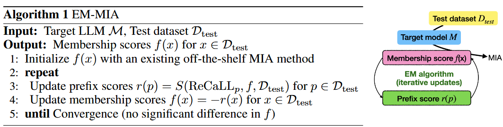

### (ArXiv 2410) Detecting Training Data of Large Language Models via Expectation Maximization

Challenges:

- Massive scale of pre-training data.
  - It is difficult to find in-distribution non-member examples (everything is used for training), and it is nearly impossible to completely eliminate the distribution shift between training and test data at inference time.
- Ambiguous nature of membership.
- Creating appropriate benchmarks to evaluate MIA methods is not straightforward, as training and test data distributions are often unknown.
  - MIAs may exploit existing biases on datasets regardless of their intended purpose.
  - For more real scenarios, we should consider situations where we have minimal knowledge about the model, training data and test data so as to find MIAs with the best generalizability.

EM-MIA proposed in this paper:

- Iteratively refines membership scores and prefix scores using an expectation-maximization algorithm.
- They find that better estimates of one can improve estimates of another.
- Progressively enhance score prediction until convergence.
- Introduce a new benchmark called OLMoMIA that varies degrees of distribution overlaps and controls difficulty levels based on clustering.
- All methods including EM-MIA still struggle to surpass random guessing in the most challenging random split setting.

ReCaLL by Xie et al., 2024:

- Based on the fact that if `p` is not a member, the log-likelihood of `x`  prefixed by `p` (`x|p`) will have a gap with log-likelihood of simply `x` in terms of membership score.
  - As an extension from using a single prefix p, averaging the ReCaLL scores on a set of multiple prefixes is possible for an ensemble.
- No theoretical analysis why it works
- Strong prior assumption:
  - The ground truth non-members are available
    - In practical: generating a synthetic prefix using GPT-4o.
    - However, according to their implementation, this method still relies on non-member test data as seed data.
    - This makes ReCaLL preferable and unfair compared to other MIAs that do not utilize any non-member test data.
  - All of them are equally effective as a prefix.
  - The ablation actually shows that without non-member test data, it's no better than Min-K%++.

Finding a better prefix:

- Duality: More accurate membership scores can help compute more accurate prefix scores. Conversely, more accurate prefix scores can help compute more accurate membership scores.

  - Prefix scores `r(p)`: how effective a data point is as a prefix in discriminating between members and non-members. 

    In the Oracle setting (where true labels are known), non-member data points make better prefixes (higher prefix scores) than member data points. Negative prefix scores can serve as good membership scores.

  - Membership scores `f(x)`:

    Indicate how likely a data point is to be a member of the training data. Help evaluate how well ReCaLL scores with a given prefix align with current membership score estimates.

    More accurate membership scores lead to better assessment of prefix effectiveness.

  

- EM-MIA:

  - Begin with initial membership scores with any existing methods

  - Calculate prefix scores `r(p)` using membership scores.

    One strategy:

    - Assign binary labels using current membership scores `f` and a threshold `τ`
    - Labels are assigned using `δ(f(x) > τ)` where `x ∈ D_test` (if `f(x) > τ`: assigns 1, o/w assigns 0)
    - Calculate AUC-ROC using these approximate labels:
      - `ReCaLL_p(x) = LL(x|p;M) / LL(x;M)`
      - `r(p) = AUC-ROC({(ReCaLL_p(x), δ(f(x) > τ)) | x ∈ D_test})`
      - AUC-ROC measures how well `ReCaLL_p(x)` scores align with these binary labels
      - Higher AUC-ROC means the prefix p is better at discriminating between predicted members and non-members based on current membership scores
    - The threshold `τ` can be set to a specific percentile of score distributions. Using median (50% percentile) is suggested as a simple practical choice for balanced datasets

  - Update membership scores `f(x)` using prefix scores

    - Negative prefix scores can serve as good membership scores.

    - Alternatively, choose candidates with top-k prefix scores to construct a prefix, and calculate membership scores:

      - `p = p_1⊕ p_2 ⊕ p_n`, `p_i ∈ argtopk_{x∈D_test} r(x).`  The ordering is a design choice, too.

        > Intuitively, we can place them in reverse order of the prefix score since a data point closer to the target text will have a larger impact on the likelihood.

      - `f(x) = ReCall_p(x)`

  - Iteratively perform these updates until convergence.

  - Regarding extending the test dataset: see last subsection of section 4. In this work, they choose WikiMIA and OLMoMIA (proposed in Section 5) as `D_{test}`, but it may be extended in future works.

- OLMoMIA:

  

  - Benchmark for detecting pre-training data of LLMs. Built using OLMo resources and Dolma dataset
  - Checkpoints of OLMo-7B trained with 100k, 200k, 300k, and 400k steps as target models (c.f., one epoch is slightly larger than 450k steps).
  - Then, consider any training data before 100k steps as members and any training data between 400k and 450k steps as non-members (because they haven't been since by the model in any checkpoint). However, this still brings some ambiguity in membership despite efforts in deduplication.
  - Based on clustering, they control the degree of overlap between the distribution of members and non-members, resulting in different difficulties. They sample enough numbers of members and non-members, map them into embedding vectors, and perform k-means (e.g. k=50) clustering for members and non-members respectively. To avoid degeneration, they remove points that are too similar in a cluster.
    - Easy: Members and non-members from far-apart clusters
    - Medium: Members and non-members from clusters with median distance
    - Hard: Members and non-members from close clusters
      - Adopted in experiments without specific reason.
    - Random: Random sampling (similar to MIMIR benchmark)
    - Mix-1: Random members + Hard non-members
      - Aim to simulate the case where test data come from a single cluster.
    - Mix-2: Hard members + Random non-members