### (CCS 2022) Enhanced Membership Inference Attacks against Machine Learning Models

This paper explores the essence of membership inference attack. It tries to come up with a **hypothesis testing framework** that explains prior works consistently and design a better one. They also perform a differential analysis between all types of attacks, explain the gap between them, and show what causes data points to be vulnerable to an attack.

#### Introduction

According to the authors, using membership inference analysis for **privacy auditing** and **data protection impact assessment (DPIA)** in machine learning systems is gaining traction because of the tight bond between privacy risk in MIA and the notion of DP.

> Unfortunately, prior works of MIA are very limited in terms of:
>
> - Lack of consistency/comparability: instead of the inherent privacy leakage of the model, previous attacks mostly depend upon specific assumptions about the adversary’s uncertainty about the target. Also, they often over-simplify things into average-case and worst-case leakage without formal definitions to enable comparison.
> - Lack of explanations and guidance: given limited efforts in formalization and explanation of MIA, we cannot follow previous guidance to design stronger attacks. The interpretations of different works also vary. The authors argue that overfitting or average memorization of hard points or other reasons can lead to leakage, and they try to express all of them in a coherent formal hypothesis testing framework.

How should we measure leakage?

- Fix `x`. The two datasets only differ in whether `x` is present.

- When experiements are done over all `x` and all randomness of the algorithm, the *average leakage* can be derived from the results.

  > In a more restricted setting, we can also assume that the remaining data points in the training set are also fixed (and decided by the adversary). The attack results, in this setting, reflect the *conditional leakage* of the training algorithm about x, conditioned on the given remaining data points, but averaged over the randomness of the algorithm.

- In a more generic setting, we can assume the training data of in and out worlds differ in one data point `x`, but all the records including `x` are freshly sampled in each experiment.

Goal of this paper:

- Strongest MIA, based on an explainable theoretical framework, and provide an accurate **interpretation** of their empirical results.
- Formalize new membership inference attack by reasoning about the **worst-case performance** of attacks over **specific targets**.

#### Threat Model

- Audit the privacy loss of the model about a specific record in **black-box setting**. The proposed framework consists of:
  - Inference game
  - Indistinguishability metric
  - Construction of MIA

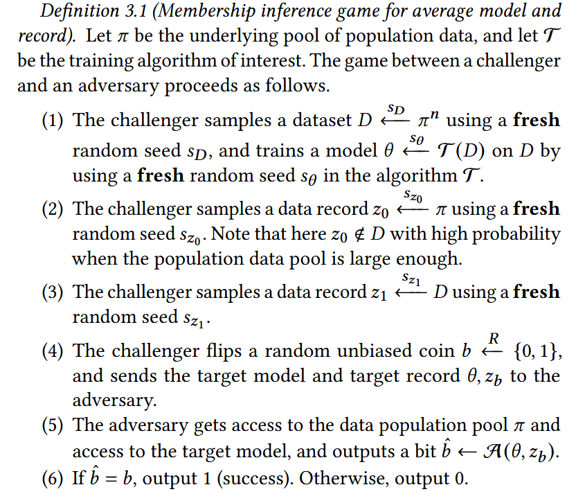

This definition of **inference game** captures the average privacy loss of models trained on <u>random subsets</u> of a population data pool. The game is repeated many times and both the target model and target record are randomly generated. This attack model is explored by previously works, including Carlini et al. (first principle).

The definition above is an <u>average</u> estimation of the leakage. The authors propose three variants.

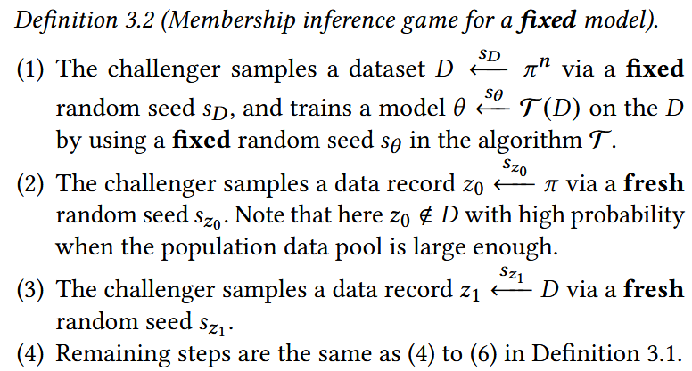

Since the dataset is sampled with fixed seed, the target model is thus fixed. This captures (quantifies) the privacy loss of a specific model trained on a <u>fixed</u> dataset. This scenario is useful for <u>auditing privacy loss of a released model (in MLaaS setting)</u>.

Naturally, the next variant fixes the record. This means te challenger selects the same target record across multiple trials of the game, so that the adversary is trying to distinguish between <u>models trained with and without a particular records</u> while the rest records are randomly sampled.

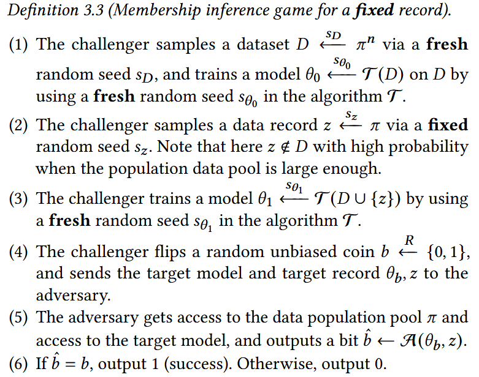

The last variant: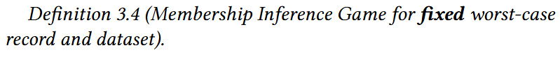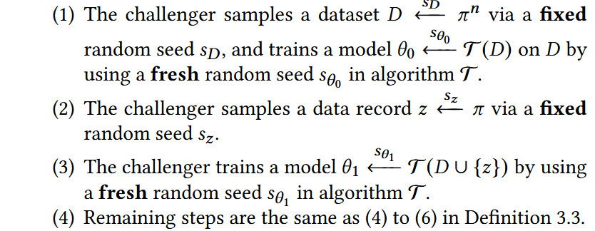

The difference with Def 3.3 is that in step (1) the random seed for training set is also fixed. So it quantifies the privacy loss of a <u>fixed target record</u> with regard to a <u>fixed dataset</u>. The adversary, in this case, can craft worst-case record and dataset pair to resemble the <u>worst-case leakage</u>.

The **indistinguishability** measure is a **hypothesis test**. The error of the adversary in each round depends on:

1. The true leakage of the model of the target data when trained with it.

2. The uncertainty of attack algorithm/attacker about

   1. Population data (where the training data are sampled from)

   2. Training algorithm (for example, what loss *or optimizer* the training leverages)

   3. Training data (for a target model)

      If the attacker knows all training data but the target record, the leave-one-out attack is the most effective.

3. The dependency of the attack construction process on the specific target data and target model.

   > If an attacker uses the same strategy across all targets, it is very likely to fail on atypical targets, thus having suboptimal performance. This is because the attack ignores individual properties of targets.

In the ideal setting, we want the attack error to be only dependent on <u>the true leakage of the model about the target data</u> (the same model trained with and without on each become indistinguishable). To measure this, other factors should remain highly similar.

At the same time, privacy audit should output a detailed report, which captures the uncertainty of the attack. For a hypothesis test, the report should include the analysis of the error versus power of the test

#### Construct Black-box MIA

This section considers:

- Black box
- Knowledge of population data (adversary can sample from the pool)
- Knowledge of the training algorithm (with which the adversary can sample from the distribution of trained model θ on any input dataset D)

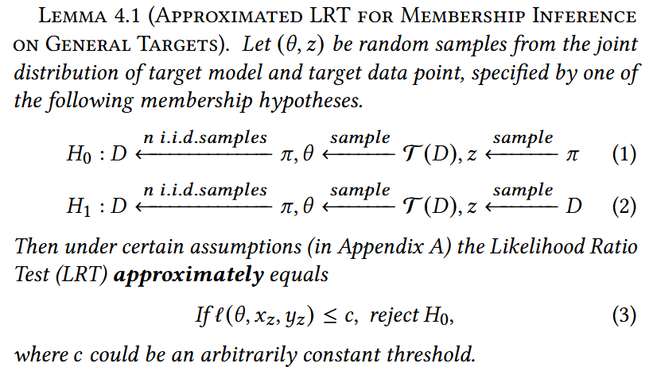

Loss-based attacks are proved most effective in many papers. Only when the dataset is large enough will the approximiations be accurate. Lemma 4.1 shows a general attack gainst Definition 3.1.

However, attack success on general targets is not enough for auditing more specific types of privacy loss, where we want attacks that succeed on a *specific* target model or a *worst-case* data record. Here, the constant `c` is too general to capture the atypical case. We want attacks with <u>mode-dependency and record dependency thresholds</u> which reduce *uncertainty* discussed above.

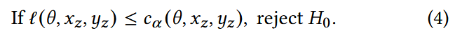

Now instead of (3), we have (4), in which the threshold depends on target model θ, and/or the target data record, giving more flexibility for inference games in Definition 3.2 (of a fixed model), Definition 3.3 (of a fixed record) or Definition 3.4 (of a fixed pair of record and dataset).

These attacks are stronger when having stronger dependency on the target model and/or target record. That's because the out world (targets generated when `b=0`) is smaller with strong dependency (more "variables" are fixed) as the uncertainty is reduced for the adversary to constrcut the attack.

To determine attack threshold, what we want:

- Specified dependency on the target (model and data)
- Confident attack that guarantees low FPR.

Generally:

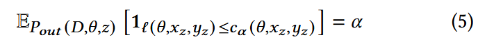

For an arbitrary FPR requirement α, we find the corresponding percentile of distribution over loss value in each out world i.e. α fraction of the out world is wrongly predicted membership (because of low loss).

To solve equation (5), we first compute empirical loss histogram in the out world of the specific inference game. Then, use various smoothing methods to estimate the CDF of the loss function, and lastly compute the α-percentile (0 ≤ α ≤ 1). With this, we can approximately guarantees FPR before seeing the acutal evaluation data for the attack.

##### Attack S: MIA via <u>S</u>hadow models

Label-dependent attack threshold in Shokri et al, 2017:

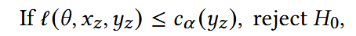

where `c_α (y_z)` is constant for all models and target records, so this is the most general one (Def. 3.1). The out world of this case includes training different models with differenet datasets while only the target record has a fixed label at our choosing.

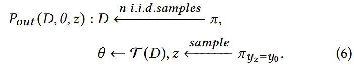

The last distribution is the conditional distribution of population data given fixed lable `y_0`. This is the only uncertainty reduced for the attacker: label of the target data.

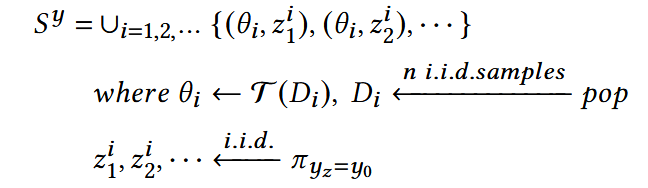

In practice, we can approximate the `P_out` with `S^y`, set of shadow models and shadow data points. Each time we need to freshly sample training set and train randomly such that the resulting `S^y` represents the average case as long as we sample enough times. 

At most α fraction of these non-member instances (shadow models and population points) incur small loss values than the threshold. We should compute all loss values from the `S^{y}`  and set:

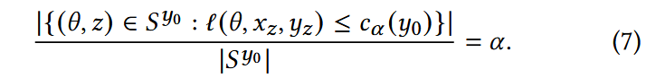

Solving (7) gives the threshold `c_α (y_z)` in Attack S. The threshold doesn't depend on target record (`x_z`) or the target model (`α`), but only depend on target label arbitrarily chosen (`y_z=y_0`).

##### Attack P: Model dependent MIA via <u>P</u>opulation Data

Here, we will try to come up with `c_α(θ)` for different targe models.

The rationale for this design is to construct an inference attack in a more accurate way by computing it only on the target model (instead of on all shadow models), yet with fewer computations (without the need to train shadow models). Similar works may try to use it to infer membership of Genomics, but no known attacks towards ML.

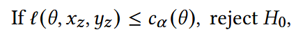

Given the fix target θ, the threshold is constant for different target data feature and label.

Each out world (i.e., datasets, models and records generated under `b=0` in the inference game) is as follows.

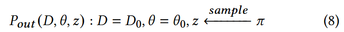

The model is fixed as `θ_0` trained on private dataset `D_0`. The target record is randomly sampled from the population data pool. Therefore, the out world reduces the attacker’s uncertainty about a specific target model `θ_0`.

Empirically, to approximate this out world, we just fix the model and sample some non-members from the population:

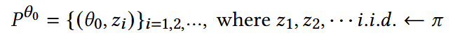

Similarly, solve (9) by computing all loss values in the `P^{θ_0}` and set the threshold accordingly:

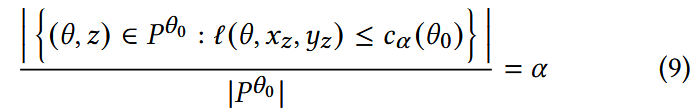

Therefore, attack P only reduces the uncertainty with regard to the target model θ, but does not reduce the uncertainty that attacker has with regard to the target record.

##### Attack R: sample-dependent MIA via <u>R</u>eference models

The privacy loss of the model with respect to the target data could be directly related to how susceptible the target data is to be memorized (e.g., being an outlier). Attack R applies attack threshold `c_α(x_z, y_z)` to different target data samples (Remember in attack S we had `c_α (y_z)`, which is the most general).

In this attack, we should train many reference models and evaluate the loss on one specific record.

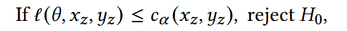

The threshold is constant for different models and corresponds to inference game for a fixed record (Def 3.3). Therefore, the out world includes a fixed data record and different models trained with different datasets:

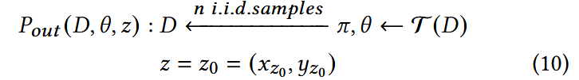

To approximate, train the following set of reference models on random population datasets and use the fixed target data:

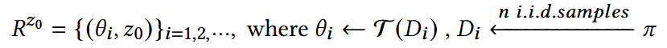

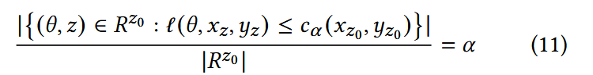

The solution of (11) is a sample-dependent and model-independent attack threshold.

##### Attack D: model and sample-dependent MIA via <u>D</u>istillation

The last attack takes advantage of all information available in the target model and data.

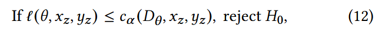

Here, `D_θ = T^{-1}(θ)` is an unknown training dataset of the target model θ. If we assume that the inverse function of training is deterministic, the training set is uniquely specified.

Consequently, the threshold function `c_α (D_θ, x_z, y_z)` takes the same value on all the models retrained from the training dataset of a given target model. The out world is:

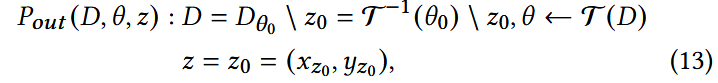

Here `θ_0` and `z_0` can be any pair of target model and target data. In this out world `P_{out}`, the only uncertainty is the randomness in the training algorithm. To sample from this world, the attacker generates this set of <u>self-distilled</u> models:

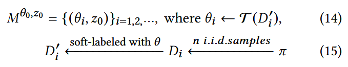

Here we use the distilled models to approximate models retrained on the target model's training set.

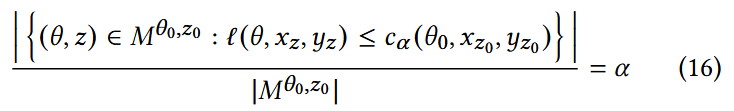

Because of this dependence on both target model and target data, Attack D more precisely measures the leakage of the model, which is desirable for privacy auditing.

##### Idealized Attack L: <u>L</u>eave-ont-out attack

Here, an ideal attack removes the randomness over the training data. The adversary trains reference models θ′ on `D \ {(x_b, y_b)}` and the randomness comes only from the training algorithm. Compared with Attack D, it's also model- and data-dependent, however the attack requires assuming the adversary already knows exactly the `n−1` data records in `D \ {(x_b, y_b)}`. This is a totally acceptable assumption in the setting of privacy auditing. However, for practical settings, this assumption may be too strong.

##### Summary

> For more accurately identifying whether a data point z has been part of the training set of θ , here are the main underlying questions for attacks presented in this section:
>
> - How likely is the loss `l(θ, z)` to be a sample from the distribution of loss for random population data on (Attack P: the same model) (Attack S: models trained on the population data)? We reject the null hypothesis depending on the tolerable false positive rate α and the estimated distribution of loss.
> - How likely is the loss `l(θ, z)` to be a sample from the distribution of loss for the target data z on (Attack R: models trained on population data) (Attack D: models trained to be as close as possible to the target model, using distillation) (Attack L: models trained on n − 1 records from D excluding z)? We reject the null hypothesis d depending on the tolerable false positive rate α and the estimated distribution of loss.

The aim of these attacks is to gradually getting close to the performance of the ideal leave-one-out attack without impractically assuming the attacker knows all samples in the dataset except the target sample.

Attacks S and P are of the same nature. However, attack S could potentially have a higher error due to its imprecision in using other models to approximate the loss distribution of the target model on population data.

Attacks R, D are also of the same nature. However, we expect attacks D to have more confidence in the tests due to reducing the uncertainty of other training data that can influence the model’s loss.

In all, the attack D is expected to be the closest to the strongest (yet impractical) attack.

#### Empirical Evaluation

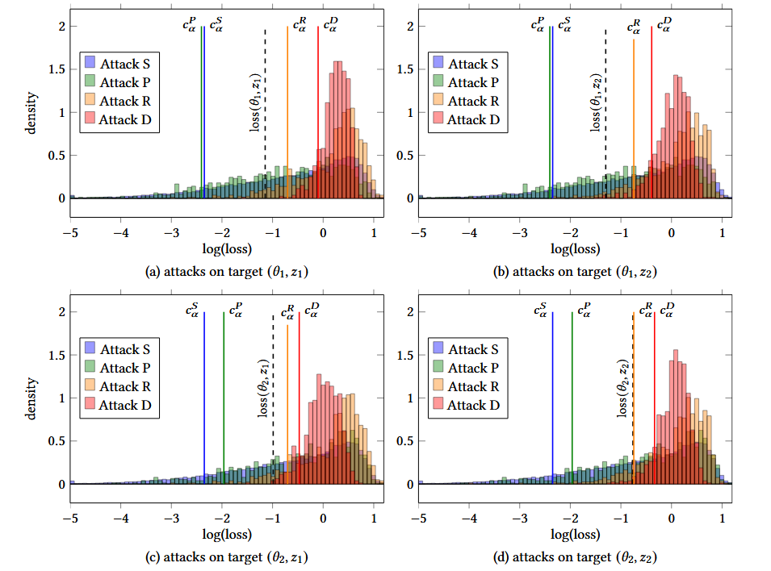

In empirical evaluations, they plot the loss distributions over the hypothetical out (non-member) worlds constructed in different attacks on Purchase100 dataset. The thresholds are drawn with the FPR α=0.1.

The out worlds constructed by Attack R and D incur significantly more concentrated loss distributions due to reduced uncertainties. These sharper attack signals enable Attack R and D to correctly predict all four targets as member. Meanwhile, the overly general Attack S and P fail on all four targets.

For example, for attack S that doesn't depend on either the model or the target record, the four thresholds stay the same. Attack P uses different thresholds for different target models, but still uses the same threshold for different target data (`z_1` and `z_2`). So both of them are wrong on all four.

In constrast, attack R considers how likely does a particular target data record z incur small loss on reference models, and constructs different (more concentrated) out worlds that depend on target data. Attack D obtains even more concentrated out worlds, by considering how likely does a particular target record z incur small loss on distilled models (which approximate leave-one-out models).

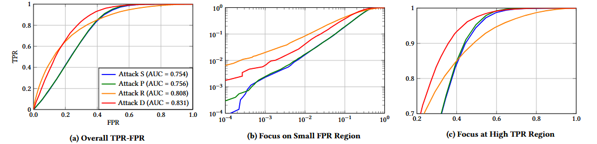

FPR vs TPR with AUC scores. Attack S, R and D use 999 shadow, reference and distilled models respectively, and Attack P uses 1000 population data points (per-class). The evaluated TPR and FPR are averaged over 10 target models for Attack S, P and R and 3 models for Attack D.

Overall, Attack D achieves the highest AUC score, followed closely by Attack R.

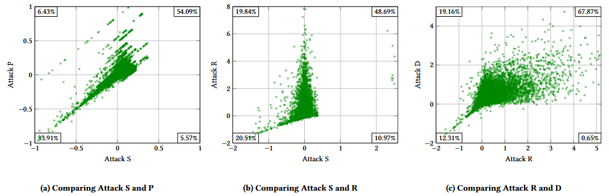

The figure above compares different attacks with α=0.3. Each dot on the scatter plot corresponds to a particular training data record. Each coordinate of the dot equals <u>the loss threshold used by a particular attack on the target data minus the loss of the target data</u> (on the target model). Therefore, the coordinate approximates the <u>attack’s confidence that a given target data is member</u>.

From the figure 3(a), we can observe that Attack S and P perform very similar, while P does slightly better. The northwestern region has more points than southeastern region, suggesting that P predicts correctly while Attack S fails.

In 3(b), the two attacks make very different predictions, while R is significantly stronger than S. In northest and southwest region, both R and S makes correct predictions, but R is significantly more confident.

In 3(c), attack D wins over R for correctly guessing membership of training points, because the plot is shifted towards the northwest region.

##### Vulnerability of different records

Vulnerability: how indistinguishable the models trained with and without a given record are under a fixed remaining dataset (i.e., the leave-one-out setting studied in Attack L and memorization literature).

According to the results on:

- Training multiple target models trained with the same training set.
- Performing attacks on all training data.

They divide the the whole training set into four types of records:

- All correct: records identified by all attacks as member on most (80%) target models. In Purchase 100, there are around 500.
- R correct: only identified by relatively strong attack on most models and missed by S and P. There are around 450.
- SP correct: identified by weaker attacks by missed by R. There are 125.
- Baseline random: randomly sampled from the training set, 5000 records.
- They didn't perform evaluations on attack D because of it's too expensive.

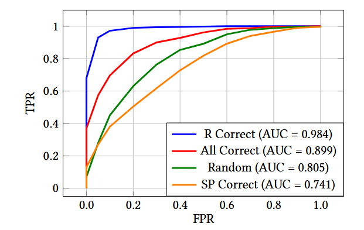

For different groups of data, they perform the strongest attack L (leave-one-out, α=0.3) trained with and without the record while fixing the remaining dataset.

They find that, for examplem, R correct records (only identified by stronger attacks) are the most vulnerable one, much more than SP correct ones (missed by stronger attacks but identified by weaker ones). This suggests that Attack R has a stronger ability to identify vulnerable data than S and P, in the sense that it not only identifies more records, but also more credibly estimate the vulnerability of individual target data (because R correct records are the most vulnerable in the figure above).

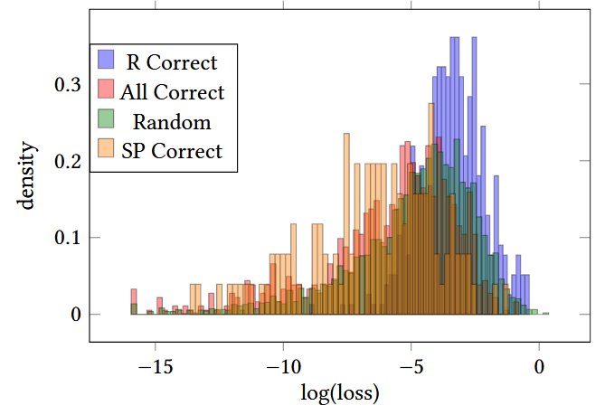

They plot the loss histogram for R correct data and compare with others to find out why these records can be identified with strong attacks but missed by the weaker ones. They observe that R correct data has higher loss intrinsically. This might suggest that they are **hard examples**.

Also, notice that most samples detected by S and P tend to be detected by R. The remainin samples, however, are less vulnerable than baseline random record. This shows that attack S and P are relatively weak in identifying vulnerable records, and may serve as wrong indication for the vulnerability of this record.

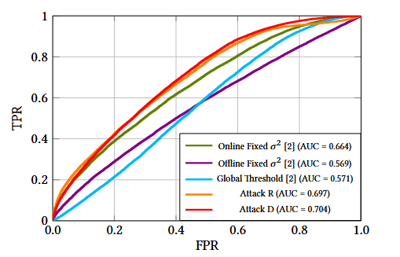

At last, they compare their attacks R and D with concurrent attacks (online and offline Likelihood Ratio Attack (LiRA)) on CIFAR10. They argue that their attacks are also more computational effecient in terms of training reference models.