### (CCS 2024) Certifiable Black-Box Attacks with Randomized Adversarial Examples: Breaking Defenses with Provable Confidence

#### Introduction

This paper focuses on constructing adversarial examples for black-box models with certifiable confidence.

In black-box attacks, the adversary only has access to the target ML model’s outputs (either prediction scores or hard labels). For current SOTA attacks, their query process is shown to be easy to detect or interrupt due to the minor perturbation changes and high reliance on the previous perturbation.

In this paper, they design an attack with **high degree of randomness to bypass the strong detection** (e.g., Blacklight) and **high robustness to resist randomized defense**. Specifically, they model the adversarial examples as a random variable in the input space following a **adversarial distribution**. And they design a novel query strategy and establish the theoretical foundation to guarantee the ASP of the distribution.

Compared with SOTA attacks, this attack has a theoretical lower bound for ASP. AEs sampled from the adversarial distribution can be considered unique  and have a negligible probability of being recorded by the defender/target model after verification.

#### Overview

This attack consists of three phases:

1. Adversarial Distribution Localization. They propose a **Randomized  Parallel Query (RPQ)** strategy that can approximate the probability and ensure multiple queries are implemented in parallel. To find adversarial space:
   1. Self-supervised perturbation (SSP) technique
   2. Binary search 
2. Adversarial Distribution Refinement. Reduce the  perturbation size and maintains the guarantee of attack success probability.
3. Adversarial Example Sampling. The sampled AEs naturally maintain the  certified ASP without the need for additional model queries.

#### Adversarial Distribution Localization

##### Randomized Parallel Query

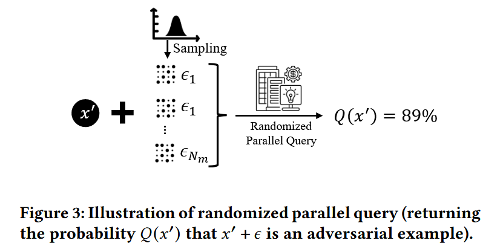

They estimate the lower bound probability by **Monte Carlo method**.

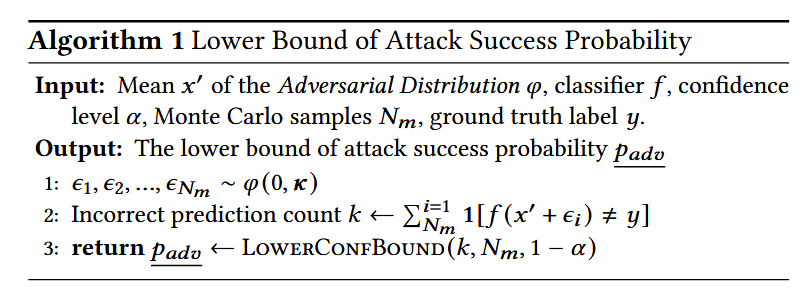

LOWERCONFBOUND adopts a Clopper-Pearson confidence interval. This function call will return the one-sided `1-α` lower confidence interval.

Note that according to the evaluations, in this step, the classifier `f` is the victim model rather than the feature extractor mentioned later in the Smoothed Self-Supervised Localization.

##### Proposed Localization Algorithms

Uniformly sampling from input space for localization doesn't work well in a high dimension space. So the authors propose two other methods that are similar to the empirical black-box attacks.

1. Smoothed Self-Supervised Localization.

   - Self-supervised perturbation (SSP) technique generates generic  adversarial examples by distorting the features extracted by a *pretrained feature extractor on a large-scale dataset in a self-supervised manner*. The *rationale* is that these extracted features can be transferred. In their experiments, the paper uses a **pretrained ResNet34 on ImageNet** as the feature extractor.

   - Let `F` be the pretrained feature extractor and `π` be the budget which increases gradually. Solve this optimization problem with *Projected Gradient Ascent* to compute the feature distortion over the set of random samples from RPQ. 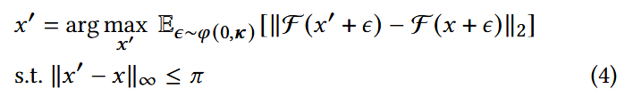

     This will maximize the difference between the feature representation of the noisy, perturbed input and the clean input.

   - The SSSP algorithm looks a bit like FGSM. They locate the adversarial distribution via iteratively update x' using the adversarial loss `L`.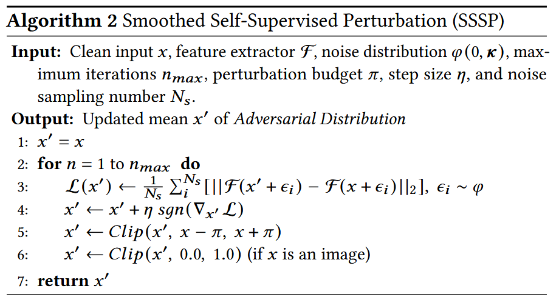

     Using this iterative process, x' is closer and closer to the space where extracted features differ but the input has lower perturbation. Note that this algorithm can directly compute the gradients of the noise-perturbed examples *if we have white-box access to the target model* rather than leveraging the feature extractor, which may significantly improve the certified accuracy of the certifiable attack.

   - At a higher level: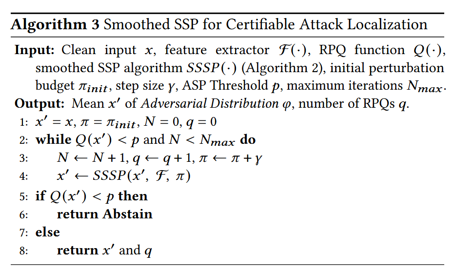

     Initially, the algorithm starts with small perturbations and gradually increases the perturbation size. This ensures that the adversarial examples are not immediately too obvious but instead carefully crafted to fool the model while remaining less detectable.

2. Binary Search Localization.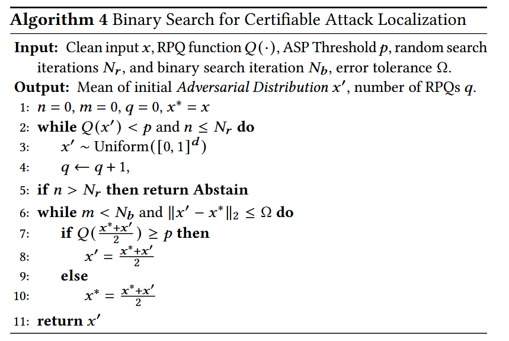

   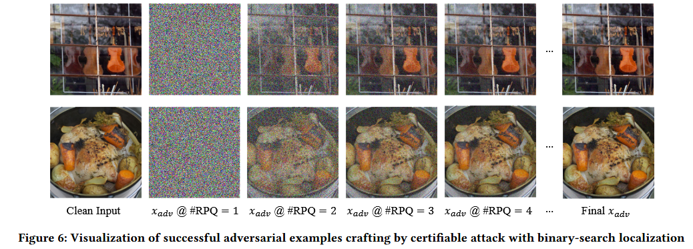

Note that all evaluations of the class label query the *pretrained classifier*. This process doesn't include querying the victim model. 

#### Adversarial Distribution Refinement

Empirically method in the last section still gives large perturbation size. This section aims at moving the distribution closer to the decision boundary without hurting the ASP.

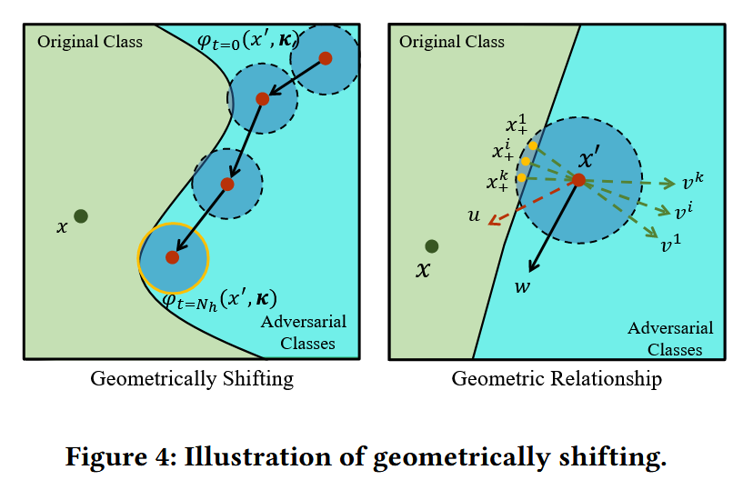

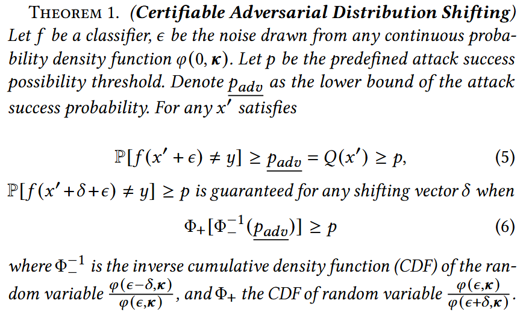

In this formulation, `φ (x′ + δ, κ)` is the shifted distribution by a shifting vector `δ` on the original `φ (x′, κ)`. The shifted distribution satisfying Eq. (5) and (6) will have the lower bound ASP `p_{adv}`.

Eq. (5): first, the original adversarial distribution should already have a sufficient ASP. 

Eq. (6): after the shifting, the new distribution is `ϕ(x′+δ,κ)`. We want to ensure that even after shifting by `δ`, the success probability remains above `p`.

By iteratively executing the RPQ and applying the Theorem 1, the Adversarial Distribution can be repeatedly shifted with a guarantee until approaching the decision boundary. The shifting consists of two step:

- Find the shifting direction.
  - In Figure 4b. They select those *failed adversarial examples* as `x^i_+` (those fall into the original calss). If the Adversarial Distribution has no samples crossing the decision boundary, then we can shift the Adversarial Distribution straight toward the clean input. 
  - The normalized vector from x′ to x is denoted as `u`. To reduce the perturbation, the direction should be similar to the vector u as much as possible.
  - Meanwhile, it should be relatively vertical to the vectors `v_i` (The normalized vector from `x^i_+` to x'), denoted as `w` in the figure.
  - This is achieved by: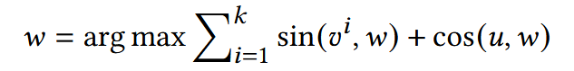
- Derive the shifting distance while maintaining the guarantee.
  - Maximize `||δ||_2` that satisfies the Eq. (6) in Theorem 1.
  - Use binary search.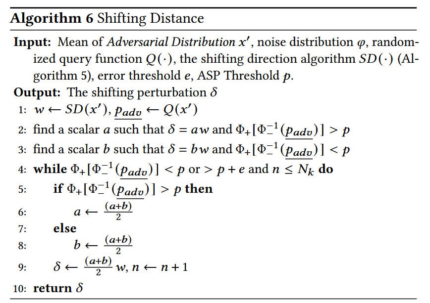

Combine them:

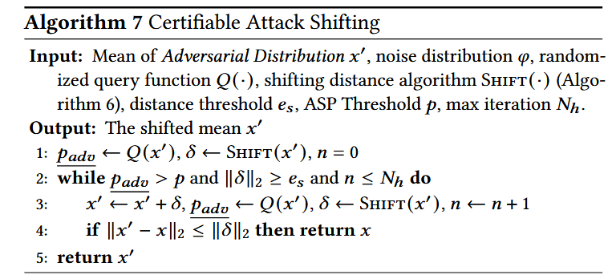

To implement the attack, we only need a continuous noise distribution and a threshold of certified attack success probability. The adversary then adds the noise sampled from the distribution to the inputs and queries the target model. 

#### Evaluation

##### Verifying the Adversarial Distribution

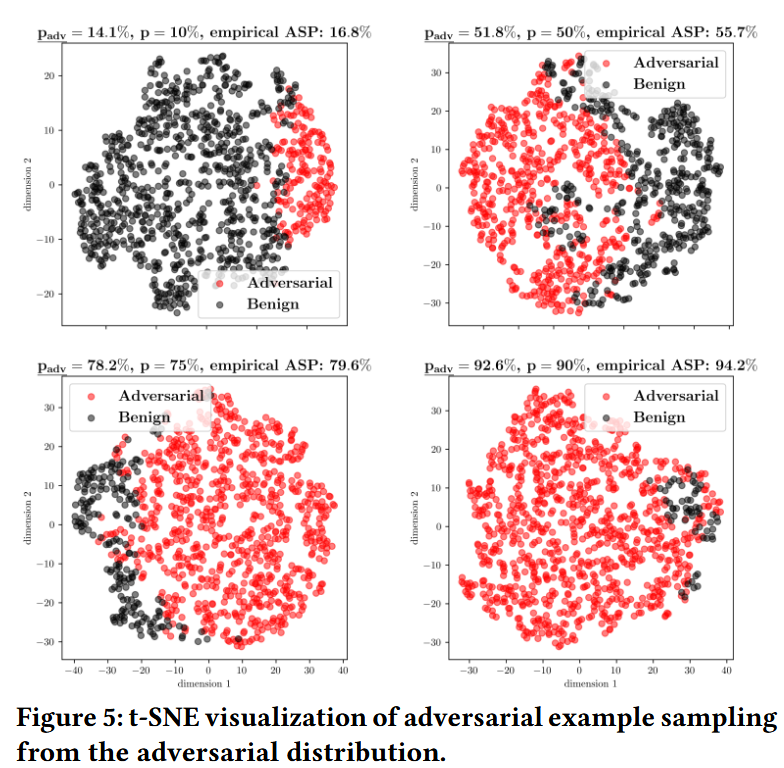

They randomly sample 1000 examples from the adversarial distribution with  different `p` noted in the figure 5 and visualize using 2D t-SNE. They report the provable lower bound ASP `p_{adv}` and the empirical ASP by querying the victim. It validates that the sampled  AEs ensure the minimum ASP via the Adversarial Distribution, and  the Adversarial Distribution lies on the decision boundary.

##### Attack Performance against SOTA Defenses

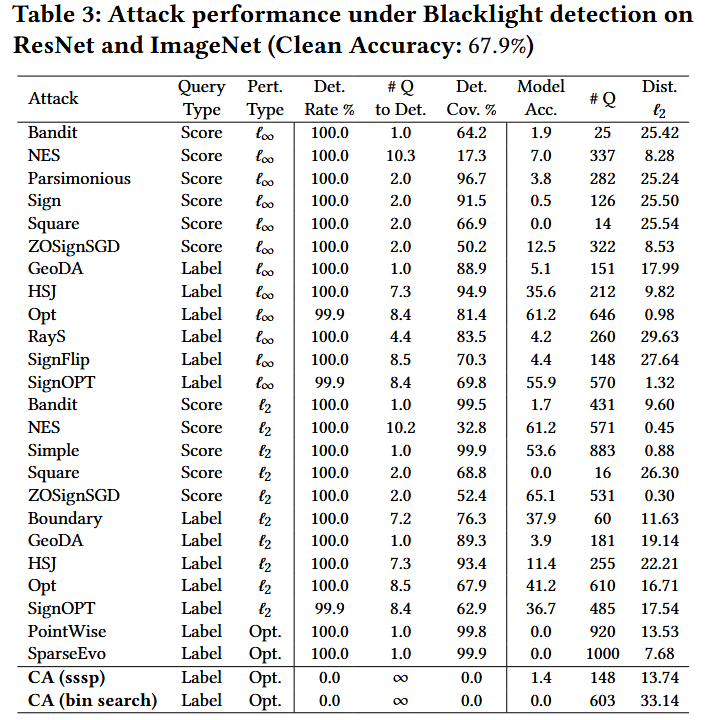

Some of the metrics:

- Detection Coverage (Det. Cov.): the percent of queries in an attack’s query sequence that Blacklight identified as attack queries.
- Number of Query (# Q): the total number of queries for empirical attack. For the proposed method, it is equal to `Monte Carlo Sampling Number × # RPQ + additional queries for sampling from the Adversarial Distribution`.

It's shown that this attack proposed evades the Blacklight detection. The high attack accuracy and low detection rate of certifiable attacks stem from the randomness of Adversarial Distribution and the guarantee of the attack success probability.

