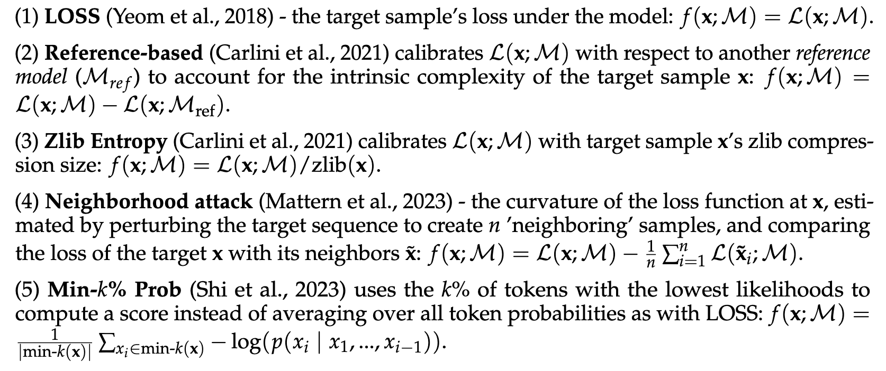
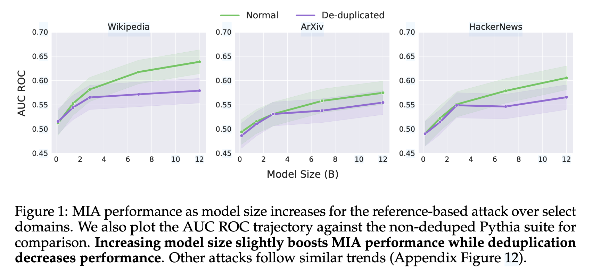
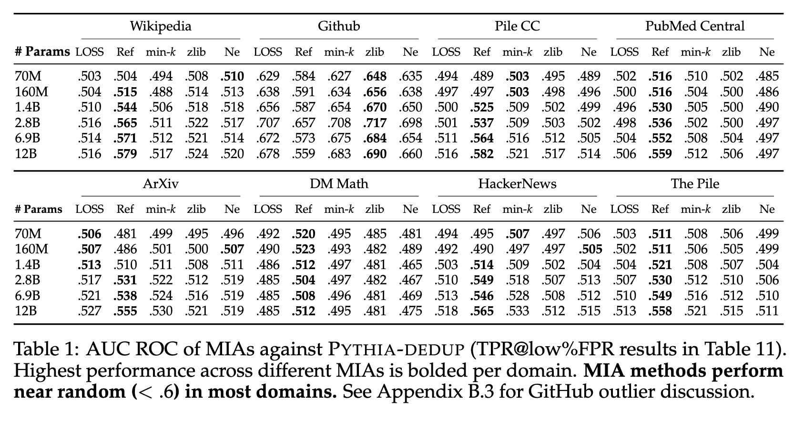
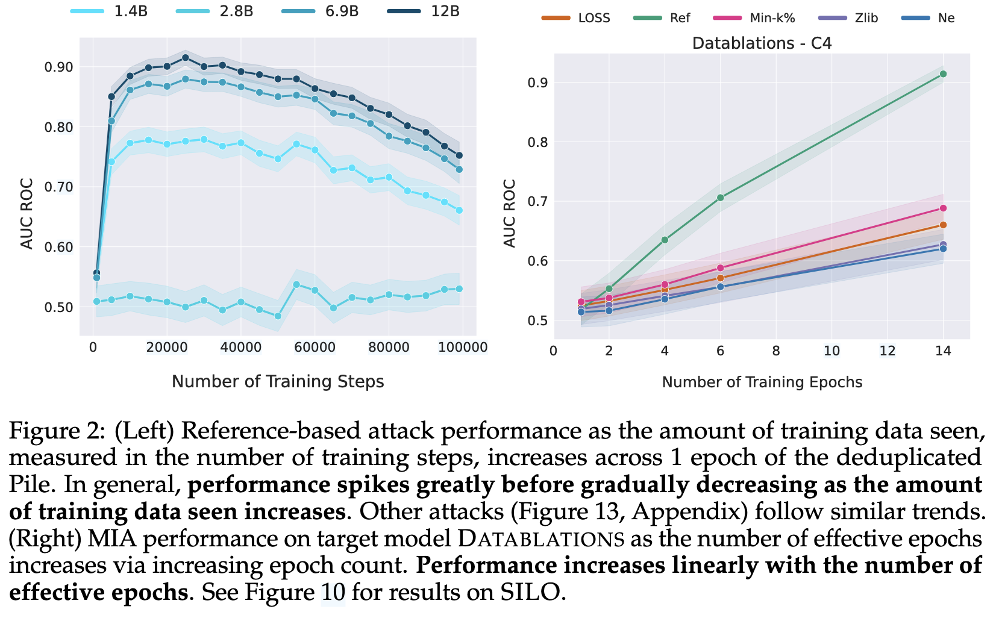
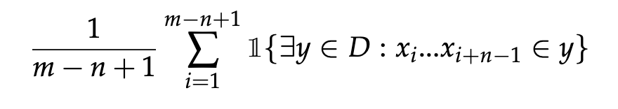
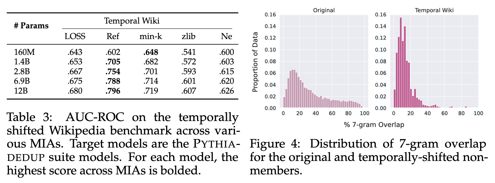

### (COLM 2024) Do Membership Inference Attacks Work on Large Language Models?

Previous works on memorization issues of language models are limited to classifiers and LM fine-tuning, while existing MIAs on LLMs and their pre-training data is largely unexplored.

This paper introduces MIMIR, a repository that unifies evaluations of MIAs for LMs against target models from Pythia suite over Pile dataset. They found that most attacks only achieve near-random performance.

While attacks like LiRA (Carlini et al., 2022) show promise, they require training multiple copies of shadow models, which is often intractable for LLMs. Other stronger assumptions for MIAs include white-box access to the model (i.e., access to model parameters) or access to a ground-truth subset of member/in-distribution non-member samples for training meta-classifiers.

They choose five models of PYTHIA and five models of PYTHIA-DEDUP with different parameter sizes (160M - 12B), and use seven diverse data sources included in the Pile or use the entire Pile. Members and non-members for each data source are sampled from the train and test sets of Pile.

They report AUC ROC for evaluations, and record TPR@low%FPR to assess performance in high-confidence settings (95% confidence interval shown via shaded regions).

No attack AUC is above 0.6 other than Github domain. Overall, <u>reference-based attack</u> performs the best. Larger target model size tends to increase MIA performance. Deduplication of the training data reduces MIA performance.

However, in ablation study, they find that it's very difficult to choose a reference model. It's largely empirical, and even aggregating all reference models perform poorly. A reference model should be trained on the data that is same-distribution but largely disjoint from the training data of the target model. However, this assumption is hard to impose at the scale of pre-training corpora.

The failure can be attributed to many reasons:

- Massive training data but near-one epoch training.

  - They hypothesize that: large pretraining corpora characteristic to LMs decreases MIA performance, as larger pretraining datasets lead to better generalization.
  - Especially, while keeping the non-members fixed, they sample members for each checkpoint from its most recent 100 steps to remove the impact of recency bias. This elevates MIA noticeably.
  - Initially, the MIA performance is low because the training is warming-up. The following high performance may be due to the low data-to-parameter ratio introducing overfit. Later, after the generalization capability emerges, the MIA falls again.

  

  - The pre-training of LLMs is usually 1-epoch. To show that it decreases MIA performance, they perform MIA against Datablations suite trained on subsets of C4. The results confirm the hypothesis.

- Frequent overlap between members and non-members from natural language domains.

  - They quantify overlap using the percentage of n-gram overlap. For a non-member sample `x`, its overlap with training dataset D is:

    

  - They find that even non-members tend to have high overlaps with the popular training sets, sometimes even higher than 75%. Document-level deduplication won't eliminate this intrinsic property of languages.

  - They sample from non-membership while ensuring <20% n-gram overlap with members. This step introduces an explicit drift between member and non-member distributions by selecting non-members that are "unline" training records. Though this results in higher performance, it's not suggested to be incorporated into existing benchmarks.

  - Also note that n-gram overlap distribution analysis can help assess how representative of a target domain a set of candidate non-members is when constructing MIA benchmarks.

More recent works report SOTA MIAs that make use of:

- Knowledge cutoff date of the target model, with members coming before and non-members coming after the cutoff.

- This <u>temporally shifted</u> settings yield higher MIA performances. They speculate that this may be due to changes in languages such as new terminology, ideas, news etc.

  

- They interpret this shift as a change of n-gram overlap distributions. Newer data tend to have lower overlap as a non-member.

- They note that such trend is *concerning* though it seems to give higher MIA performance, because the candidate non-member set may not be representative of the member distribution from the target domain.

In section 5, they discuss the definition of *membership.* The definition of membership in the standard MI game treats only records seen *exactly* during training as members. However, this may be at odds with what adversaries and privacy auditors care about when concerning information leakage.

For generative models especially, guessing the membership of some sample via other sufficiently close samples can be useful.

They next try to relax the definition of member samples by:

a) Lexical Distance:

- Created modified samples by replacing n random tokens (n = 1, 10, 25)
- Found that even minimal changes caused samples to be classified as non-members. LOSS attack was particularly sensitive to random token replacements

b) Semantic Distance:

- Generated semantically similar neighbors while preserving meaning
- These modified samples had score distributions closer to original members
- However, in high-confidence settings, they were still likely to be classified as non-members. This suggests MIAs might miss important forms of information leakage

They point out, future research works:

- Current membership definitions may not capture all relevant forms of information leakage
- Need a membership definition that combines both lexical and semantic similarity
- Suggests possibility of a "semantic MI game" based on proximity in semantic embedding space