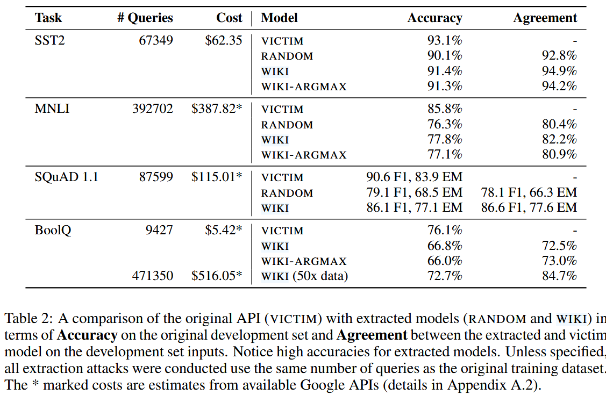
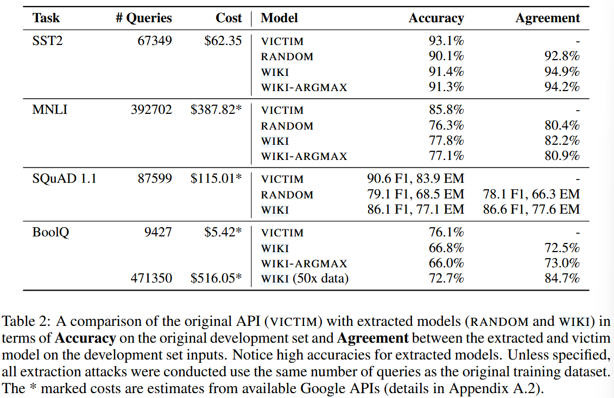
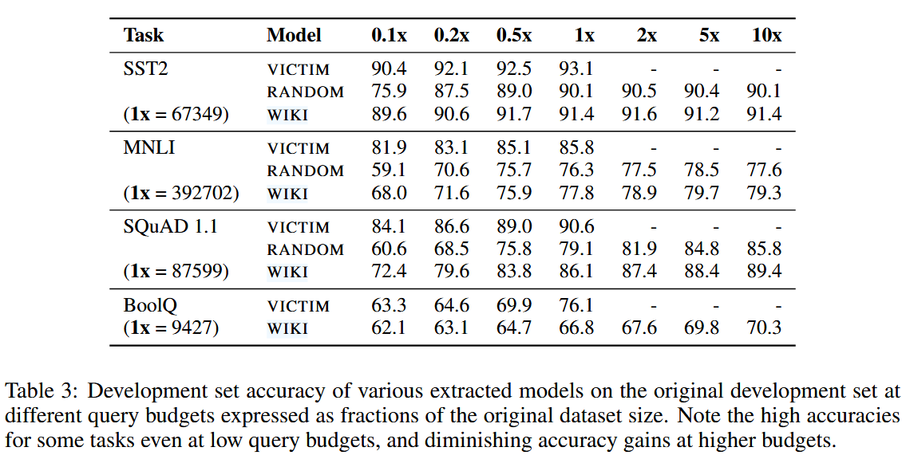
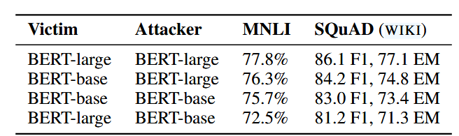
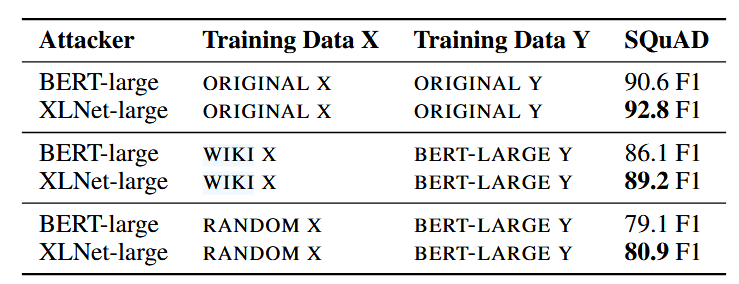
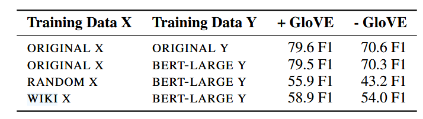

### (ICLR 2020) Model Extraction of BERT-based APIs

#### Introduction

**Contextualized pretrained representations** boost performance and reduce sample complexity (generalize well with fewer labeled examples when fine-tuned on a task), and typically require only a shallow task-specific network—sometimes just a single layer as in BERT. While these properties are advantageous for representation learning, we hypothesize that they also make model extraction easier.

In this paper, they perform attacks and show that model extractions are possible even with queries consisting of **randomly sampled** sequences of words coupled with simple **task-specific heuristics**. While extraction performance improves further by leveraging sentences and paragraphs from Wikipedia. These attacks are cheap compared with training from scratch.

This paper also discusses two potential defenses, and claims that they fail against adversaries who adapt to the defense.

This work synthesizes data and therefore is related to **zero-shot distillation** or **data-efficient distillation** Unlike the model extraction setting, these methods assume white-box access to the teacher model to generate data impressions.

Also related to **rubbish inputs**, which didn't give promising results before, this paper shows their effectiveness at training models that work well on real NLP tasks despite not seeing any real examples during training.

#### Attack Setup

An attacker first queries a victim BERT model, and then uses its predicted answers to fine-tune their own BERT model. This process works even when passages and questions are random sequences of words

They study two query generators, RANDOM and WIKI. 

- In the RANDOM generator, an input query is a nonsensical sequence of words constructed by sampling a Wikipedia vocabulary built from WikiText-103.
- In the WIKI setting, input queries are formed from actual sentences or paragraphs from the WikiText-103 corpus.

They are insufficient by themselves to extract models for tasks featuring complex interactions between different parts of the input space (e.g., between premise and hypothesis in MNLI or question and paragraph in SQuAD). So these heuristics are applied:

- MNLI: since the premise and hypothesis often share many words, randomly replace three words in the premise with three random words to construct the hypothesis.
- SQuAD / BoolQ: since questions often contain words in the associated passage, they uniformly sample words from the passage to form a question. Additionally they prepend a question starter word (like “what”) to the question and append a ? symbol to the end.

> **MNLI (Multi-Genre Natural Language Inference)**
>
> The MNLI task involves determining the relationship between a premise and a hypothesis. The relationships can be **entailment**, **contradiction**, or **neutral**.
>
> **Example:**
>
> - **Premise:** "The lawyer was speaking to a large audience at the conference."
> - **Hypothesis:** "The lawyer is giving a presentation."
> - **Label:** Entailment
> - **Premise:** "The lawyer was speaking to a large audience at the conference."
> - **Hypothesis:** "There was no audience at the conference."
> - **Label:** Contradiction
> - **Premise:** "The lawyer was speaking to a large audience at the conference."
> - **Hypothesis:** "The lawyer is preparing for a case."
> - **Label:** Neutral
>
> 
>
> **SQuAD (Stanford Question Answering Dataset)**
>
> **Passage:** "The lawyer was speaking to a large audience at the conference, discussing legal reforms."
>
> **Question:** "What was the lawyer discussing?"
>
> **Answer:** "legal reforms"
>
> **Passage:** "The lawyer was speaking to a large audience at the conference."
>
> **Question:** "Who was the lawyer addressing?"
>
> **Answer:** "a large audience"
>
> 
>
> **BoolQ (Boolean Question)**
>
> **Passage:** "The lawyer was speaking to a large audience at the conference."
>
> **Question:** "Was the lawyer speaking to a large audience?"
>
> **Answer:** Yes
>
> **Passage:** "The lawyer was attending the conference."
>
> **Question:** "Was the lawyer speaking to a large audience?"
>
> **Answer:** No

After updates:

> MNLI Example (Premise-Hypothesis Task):
>
> - **Original Premise**: "The cat sat on the mat while the dog watched from the door."
> - **Heuristic Applied**: Randomly replace three words in the premise with three random words.
> - **Modified Premise**: "The bird sat on the car while the tree watched from the sky."
> - **Hypothesis**: "The bird sat on the mat while the tree looked through the window."
>
> This introduces random changes to the words in the premise to simulate the adversarial extraction query. The goal is to trick the model into making a judgment (entailment, contradiction, or neutral) based on these modified sentences.
>
> SQuAD/BoolQ Example (Question-Answering Task):
>
> - **Original Passage**: "The moon orbits the Earth, reflecting sunlight and creating phases of the moon visible from Earth."
> - **Heuristic Applied**: Uniformly sample words from the passage and prepend a question starter word, then append a question mark.
> - **Modified Question**: "What Earth reflecting phases visible?"
>
> Here, the question is formed by sampling words directly from the passage, and adding a question starter word ("What") and a question mark. Even though the question is nonsensical, the victim model will still provide an answer based on its trained data.

#### Evaluations

**Table 2** shows the extraction using identical number of queries as the original training dataset, and the probability distribution is given. Note that BoolQ/RANDOM is not shown because it doesn't converge.

Note that these metrics (accuracy and agreement) are defined at a label level — metrics are calculated using the argmax labels of the probability vectors predicted by the victim and extracted model.

The extracted models show promising accuracy. Specifically, on WIKI, extracted SQuAD models recover 95% of original accuracy despite seeing only nonsensical questions during training.

In **Table 3**, we find that small budget already works well, and while more queries is usually better, accuracy gains quickly diminish.

#### Analysis

In Section 5, the authors try to take a closer look as **why nonsensical input queries are effective for extracting BERT-based models**. What properties these queries have?

**Do different victim models agree on the answers to nonsensical queries?**

After training five victim models for SQuAD with *original dataset* varying only the random seed, all of them achieve similar scores and pair-wise high agreement. But with WIKI and RANDOM queries, the agreements drop siginificantly. As discussed by previous works, an ensemble of classifiers has been shown to provide better uncertainty estimates and out-of-distribution detection than a single overconfident classifier.

**Are high-agreement queries better for model extraction?**

Yes. Evaluations indicate that **agreement between victim models is a good proxy for the quality of an input-output pair** for extraction.

**Are high-agreement nonsensical queries interpretable to humans?**

No really.

Prior works (e.g. Ilyas et al., Adversarial examples are not bugs, they are features) show that DNNs can leverage non-robust, uninterpretable features to learn classifiers.

In this work, they ask three volunteers who are not familiar with this work to answer SQuAD questions from each of the WIKI and RANDOM subsets that had unanimous agreement among victim models and same number of original SQuAD questions as a control.

The results show that the volunteers did much better on the original dataset than generated dataset (77% vs 23%/22% for WIKI/RANDOM). Annotators used a word overlap heuristic (between the question and paragraph) to select entities as answer spans. While this heuristic *partially interprets* the extraction data’s signal, most of the nonsensical question-answer pairs remain mysterious to humans.

**Importance of Pretraining**

Up until now, we assume that both the victim and the attacker fine-tune on a *pretrained BERT-large*. Sometimes, the original architecture may not be known.

The results show that larger attack model is better, and mismatch in model architecture may hurt the performance.

(Training Data X, Y represent the input and output pairs used while training the attacker model; ORIGINAL represents the original SQuAD dataset; BERT-LARGE represents the outputs from the victim BERT-large model.)

Then, they use XLNet-large, which has been shown to outperform BERT-large in a large variety of downstream NLP tasks. They compare XLNet-large and BERT-large attacker architectures keeping a *fixed BERT-large victim* architecture. And it turns out, it also does in model extraction.

Overall, the results suggest that attackers can maximize their accuracy by fine-tuning more powerful language models, and that matching architectures is a secondary concern.

What if we train from scratch?

They choose to show it on a smaller model, QANet with 1.3 million parameters.

The first row indicates the model capacity is sufficient. However, the F1 **significantly degrades** when training on nonsensical RANDOM and WIKI queries. The F1 drop is particularly striking when compared to the corresponding rows in Table 2.

This reinforces our finding that better pretraining allows models to start from a good representation of language, thus simplifying extraction.

#### Defenses

How?

- Membership inference. Use it for **outlier detection**. When such out-of-distribution inputs are detected, the API issues a random output which eliminates the extraction signal. It it is difficult to build membership classifiers robust to all kinds of fake queries.
- Watermarking, in which a tiny fraction of queries are chosen at random and modified to return a wrong output. The defender does not actually prevent the extraction—they are only able to verify a model has indeed been stolen. Moreover, it assumes that an attacker will deploy an extracted model publicly, allowing the defender to query the (potentially) stolen model.
