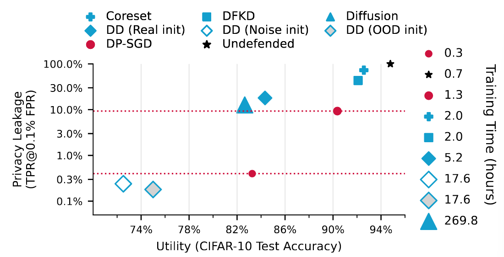
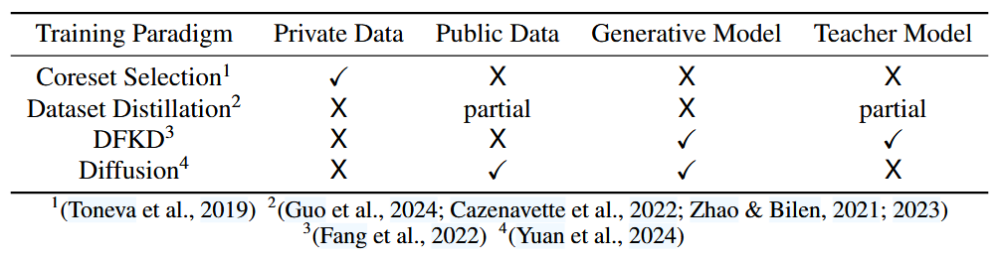
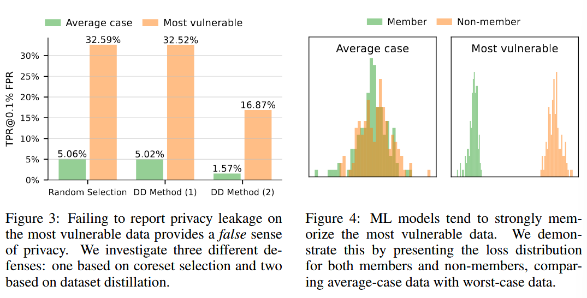
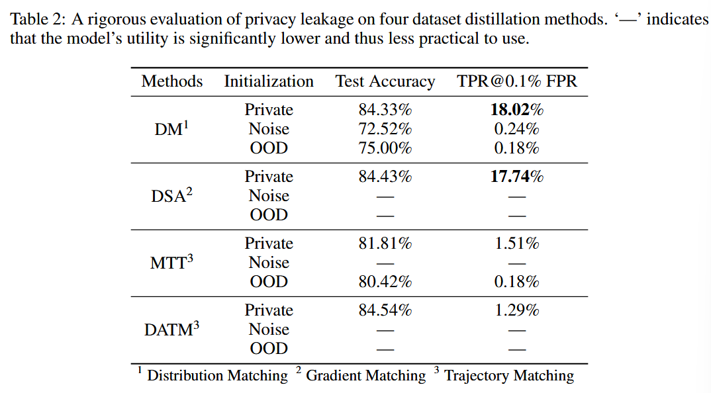
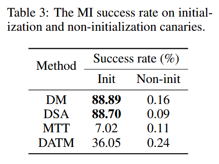
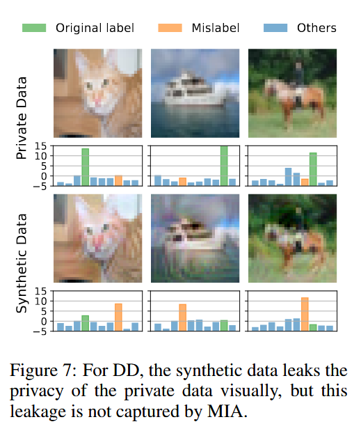
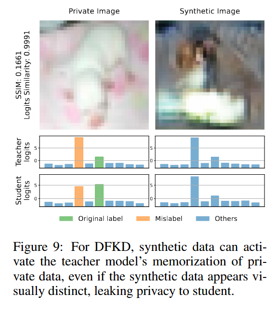
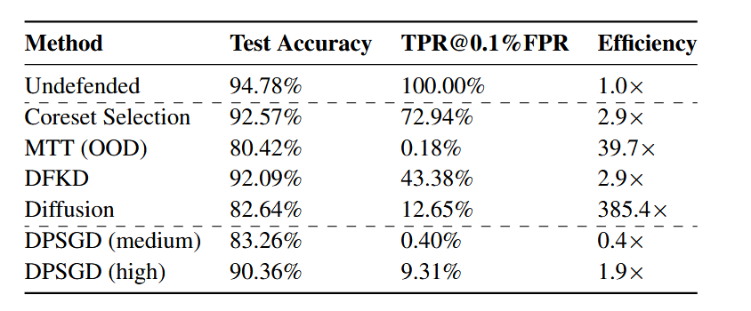

## (ICLR 2025) Does Training with Synthetic Data Truly Protect Privacy?

In this paper, the authors investigate whether the four training paradigms with synthetic data protect privacy as claimed:

- Coreset selection
- Dataset distillation (DD)
- Data-free knowledge distillation (DFKD)
- Synthetic data generated from diffusion models.

They are known to be useful in federated learning with non-IID data, long-tailed learning, and continual learning, and enable the creation of diverse datasets that include edge cases or rare events that may be underrepresented in real-world data as well as enhancemodel robustness and adaptability.

### Privacy Evaluations

In this paper, they rigorously evaluate the privacy issues of this paradigm.

They adopt MIA on models that achieve at least 73% acc. on CIFAR-10. They found that all of them do not provide stronger privacy protection than DP-SGD. They also note that for some dataset distillation methods, the success rate of membership inference attacks is very low, yet the synthetic data visually resembles the private data almost entirely. This calls for caution to the claim of (misleading) privacy.

They emphasize that, **privacy is not an average metric**, and new works should **evaluate the worst-case privacy on the most vulnerable sample**, maybe *mislabeled data*, by evaluating the true positive rate at a low false positive rate with LiRA.

They show that, outliers like mislabeled data is sensitive and can be memorized by the model. They eventually show that no matter how carefully synthetic data training is designed, the strong memorization capabilities of ML models still make it easy to perform MIA on the most vulnerable samples.

### Case Study

Setup:

- 500 random data points as “audit samples”
- Mislabeled data as strong canaries
  - They **deliberately use mislabeled samples** as a proxy for **the most vulnerable data points**. They **do not** mislabel or insert them like poisoning attacks.
- 32 shadow models. Each *audit sample* included in the training data of 16 of them
- ResNet-18
- Metrics: privacy leakage (TPR@0.1% FPR), model utility (test accuracy), and efficiency (training time)

#### **Coreset Selection**:

- Extracts a subset of private data for training.
- Privacy leakage remains significant since the selected samples are still derived from private data.
- Certain selection strategies (e.g., forgetting-based selection) can actually **increase privacy risks**.
  - Likely due to the forgetting method’s tendency to select mislabeled samples (**Forgetting-based selection**: prioritizes data points that the model tends to **forget** during training: the mislabeled, outliers or ambiguous examples).
  - While random selection includes roughly 40% of mislabeled data, the forgetting method increases this to 74%.
  - These vulnerable data points contribute to improved generalization at the cost of reduced privacy.
- Protecting the privacy of non-coreset samples can degrade the privacy of other samples.

#### **Dataset Distillation (DD)**:

- They tune the model performance to around 80% test accuracy and evaluate these methods under worst-case scenarios to capture the full extent of potential privacy leakage.
- **Initialization with private data** introduces significant privacy risks, as MIA successfully identifies these samples.
- **OOD (Out-of-Distribution) initialization** offers better privacy protection but at the cost of reduced model accuracy.

- The MIA success rate for canaries involved in initialization is considerably higher than for those not used during initialization. For canaries present in the training set but excluded from initialization, the success rate is nearly indistinguishable from random guessing. (Table 3)

- However, although table 2 might suggest that trajectory-based methods (MTT and DATM) might be more private, it's not true:

  - While the model can strongly memorize the synthetic data, it *generalizes well* on the canaries (the model predicts correct label, though the training sample is mislabeled, instead of convincing the model that the incorrect label is correct), which results in a low MI success rate because the attack cannot distinguish membership by overfitting.
  - They hypothesize that this can be due to the regularization and augmentations employed in MTT. They suggest that MTT initialized with OOD data (but lower performance) can be a defense. (Figure 7: logits output by the model trained on synthetic data, for both the private data (canaries) used for initialization and the synthetic data itself)

  

#### **Data-Free Knowledge Distillation (DFKD)**:

- Uses a **teacher-student model** approach where the teacher is trained on private data, and the student learns from synthetic data.
- Even though the student never directly trains on private data, privacy leakage still occurs because the teacher **retains and transfers membership information**. That is to say, the student model can also somewhat memorize canaries.
- Surprisingly, even synthetic images that **look visually different** from private data can still leak sensitive information.

- In detail, the generator in DFKD is capable of producing synthetic images that, while visually distinct, bear a strong resemblance in logits to the mislabeled data. The attack is performed on the **student model**, but the privacy leakage comes from the **teacher model’s training data**. If a sample was part of the original private dataset for the teacher, the student model is likely to output higher confidence scores for it.

#### **Diffusion Models for Synthetic Data**:

- **Image-to-image** generation using fine-tuned diffusion models retains significant privacy leakage (in MIA).
  - Also, generated images may remain structurally similar to private images.
- **Text-to-image generation** exhibits lower privacy leakage but is computationally expensive.
  - The generated images are more **diverse** and do not directly mimic specific training samples.
- Since stable diffusion is pretrained on large public datasets and has strong generative capabilities, it is largely insensitive to mislabeled data and does not exhibit strong memorization.

> A more interesting direction for future research would be to investigate the privacy-utility tradeoff in diffusion models that are trained from scratch. This approach would enable a fairer comparison with other methods that do not rely on large-scale pretraining datasets.

#### **Fair comparison with DPSGD**

