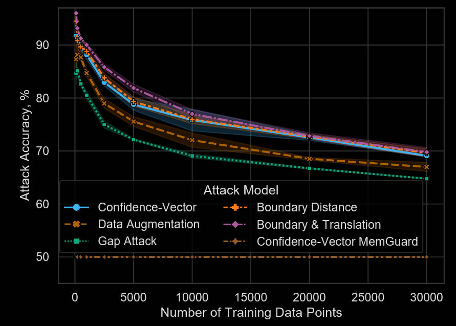
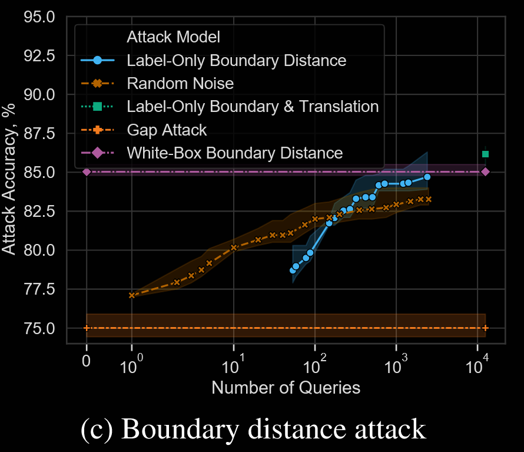
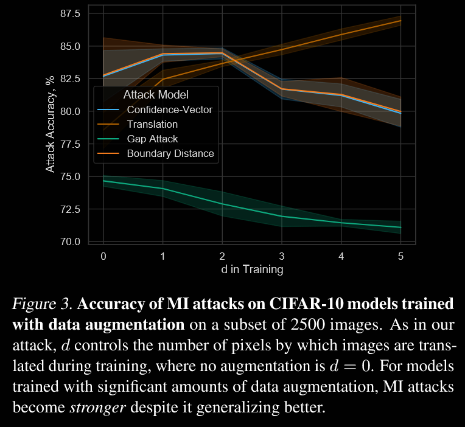

## (ICML 2021) Label-Only Membership Inference Attacks

They show:

- How to extract MI signal by analyzing model's robustness to perturbations, which reveals signatures of its *decision boundary geometry*. They use labels of
  - Augmentations of data points
  - Adversarial examples
- They break confidence masking defenses. They also find that data augmentation can worsen MI  leakage while transfer learning can mitigate it.
- They introduce "outlier MI," and argue that currently only DP and (strong) L2 regularization are effective.

Intuition:

- Data points that exhibit high robustness are training data points.
- Non-training points are closer to the decision boundary and thus more susceptible to perturbations.
- There is a monotone relationship between the confidence at x and the Euclidean distance to the model’s decision boundary for traditional ML models. They believe this is true also for DNNs.

Attack framework:

- The adversary queries the model with the perturbed inputs and records the **predicted labels** for each perturbed version. It checks how frequently the perturbed inputs maintain the same predicted label as the original input.

  To estimate how far a point is from the decision boundary:

  - Finding the minimum perturbation needed to misclassify the point.
  - Adding random Gaussian or Bernoulli noise to the input and measuring the resulting accuracy drop.
  - Common augmentations (e.g., rotations or translations)

- **Higher robustness** (i.e., fewer label changes) suggests the point is more likely a member of the training set, while lower robustness indicates a non-member.

- The adversary uses a classifier or threshold to infer membership based on the robustness signal. For example, if the perturbed inputs are classified consistently, the model may predict that the point is a training set member.

### Evaluation

They evaluate the attack on eight datasets, including:

- **Computer vision datasets**: MNIST, CIFAR-10, CIFAR-100.
- **Non-computer vision datasets**: Adult (UCI dataset), Texas, Purchase, Location.

Metrics:

- Attack Accuracy: Measures how accurately the attack identifies whether a point is a member of the training set.
- F1 Score and Precision: Used for comprehensive evaluation in cases where accuracy alone does not capture performance.
- Query Complexity: Tracks the number of model queries needed to achieve a successful attack.

Baselines:

- Gap Attack: A simple baseline that predicts any misclassified point as a non-member.
- Confidence-vector attack: The canonical membership inference attack using confidence scores.

Data Augmentation Attack:

- Example setup:
  - **Rotations**: Create N=3 rotated versions of the image with angles in the range ±[1, 15] degrees.
  - **Translations**: Translate the image horizontally and vertically by up to a certain pixel limit (e.g., d=4 pixels) and use N=4d+1 of them.
- Membership is inferred based on how consistently the model predicts the correct label across these perturbed inputs.

Decision Boundary Distance Attack:

- Idea: Estimate the distance of the input to the model’s decision boundary, which acts as a proxy for model confidence.
- **White-box baseline** (upper bound, idealized): Adversarial examples by Carlini & Wagner - given (x, y) the attack  tries to find the closest point x′ to x in the Euclidean norm,  such that argmax h(x′) != y.
- **Label-only adversarial example attacks**: start from a random point x′ that is misclassified and then “walk” along the boundary while minimizing the distance  to x.
- **Robustness to random noise**
- Combined with DA attack.

Results:

- Effectiveness:

  - The label-only attacks consistently outperform the baseline gap attack and, in many cases, perform on par or better than confidence-based attacks.

    

    > For the data augmentation attack, we report the best accuracy across multiple values of r (rotation angle) and d (number of translated pixels)
    >
    > As the training set size increases, all attacks monotonically decrease because the train-test gap is reduced.

- They break the confidence masking defenses.

- They breaks the adversarial regularization defense by showing that to achieve good defending effect, it leads to significantly  worse test accuracy trade-offs than other defenses.

- The authors assess the **query complexity** of the label-only attacks:

  - The data augmentation attack requires only a small number of queries (3-5 perturbed images).

    - There is a range of perturbation magnitudes  for which the attack exceeds the baseline (i.e., 1 ≤ r ≤ 8 for rotations, and 1 ≤ d ≤ 2 for translations). In this range the augmentations have a similar effect on both train and test samples, while small augmentations rarely  change model predictions and large augmentations often  cause misclassifications.

  - The boundary distance attack with adversarial perturbations requires more queries but delivers higher accuracy when the query budget is large.

    

    Note that with <300 queries, the simple noise robustness attack outperforms our other label-only attacks.

### Defending

**Augmentation**

When models are trained using data augmentation (e.g., translations and rotations), the label-only data augmentation attack *outperforms traditional confidence-based attacks*. This is counter-intuitive because it is supposed to reduce overfitting.

- It does improve test accuracy.

- However, the model now leaks additional membership information *via its invariance to training-time augmentation.*

  > Thus, model generalization is not the only variable  affecting its membership leakage: models that overfit less on the original data may actually be more vulnerable to MI because they implicitly overfit more on a related dataset.

**Transfer Learning**:

- Two types are tested:
  - **Last layer fine-tuning** prevents most membership inference attacks because only a small part of the model is retrained, limiting the model’s ability to overfit to the new data.
  - **Full fine-tuning** allows more flexibility and slightly more overfitting but still offers better generalization compared to training from scratch.

**Dropout**:

- Dropout moderately reduces the attack success rate but does not provide robust protection. Its impact depends on the **dropout rate** and the model's architecture.

**Regularization**:

- L1-regularization is less effective than L2 because it primarily induces sparsity but does not sufficiently reduce overfitting. **Strong L2-regularization (λ ≥ 1)** significantly reduces MIA success rates by preventing large weights that contribute to memorization of training points.

**DP:**

- **DP-SGD** is highly effective at reducing membership inference attacks but comes with a tradeoff.
- When combined with **transfer learning**, DP achieves a good balance between privacy and utility, offering the best overall defense.

### Outlier MI

Outliers are defined as data points that have **few or no neighbors** in the feature space (e.g., representations from the model’s penultimate layer).

The adversary identifies outliers by measuring the **cosine distance** between points in the feature space:

- A point is considered an outlier if it has **fewer than γ neighbors** within a distance threshold δ.
- The parameters γ and δ are tuned to select a certain fraction (e.g., 1%) of points as outliers.

Once the adversary identifies outliers, they apply **label-only membership inference attacks** (e.g., boundary distance or augmentation-based attacks). The success of the attack is measured using **precision**—the fraction of correctly identified training members among the points classified as members.

Conclusion:

- The adversary achieves **higher attack precision** when targeting outliers compared to randomly selected points, indicating that outliers are **more likely to be correctly identified as members**.
- Regular defenses that reduce general overfitting (e.g., dropout, L1-regularization) are less effective because these defenses do not specifically target **worst-case data points**. Strong L2 and DP work well.