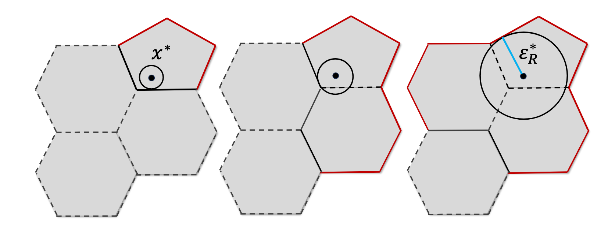
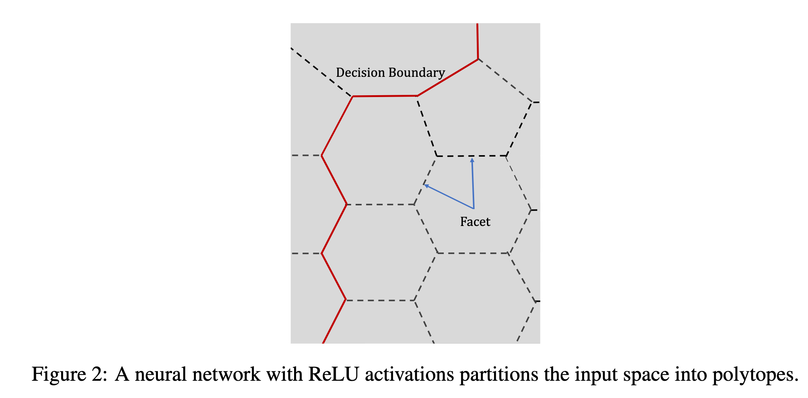
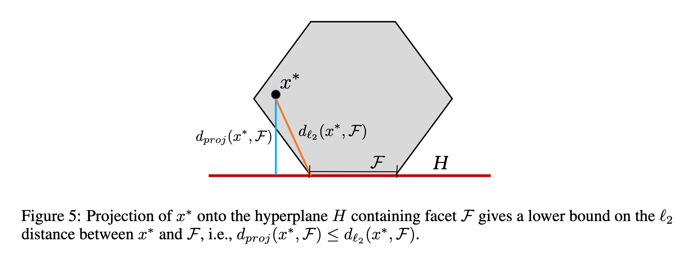

## (ICML 2024) FairProof: Confidential and Certifiable Fairness for Neural Networks

### The Core Problem

Current **fairness audits** typically require a <u>*trusted third party* or *access to the model*</u>, which can leak sensitive intellectual property. Furthermore, a malicious actor could engage in <u>"*model swapping*,"</u> using a fair model for audits but an unfair one for actual predictions.

FairProof is a system that uses **Zero-Knowledge Proofs (ZKPs)** and cryptographic **commitments** to publicly verify a model's fairness without revealing its internal weights. It focuses on **Local Individual Fairness (IF)**, which ensures that "similar individuals are treated similarly" for a specific query.

- **Model Uniformity:** Uses cryptographic commitments to bind an organization to a specific set of model weights, ensuring the same model is used for every customer.
- **ZKP-Friendly Certification:** fairness certification algorithm specifically optimized for ZKPs to reduce computational overhead.
- **Local Individual Fairness Metric:** The system calculates a parameter $\epsilon$ representing the largest distance a data point can be perturbed (excluding sensitive features like race or gender) without changing the model's prediction.
  - **Individual Fairness (IF)**: Asserts that if you change only sensitive features (e.g., race, gender), the model's output should remain the same.
  - The final fairness certificate $\epsilon$ is the **minimum** robustness value found across all possible combinations of sensitive features (such as the set of `{a,b,c}` below, the $\epsilon$ for `a` is the smallest).

### The Certification Algorithm

The authors leverage a connection between **fairness** and **adversarial robustness**.

1. **Reduction:** Certifying fairness is treated as a robustness problem in $(n-k)$ dimensions, where $k$ is the number of sensitive features. Final fairness certificate is the minimum of ${ε_a, ε_b, ε_c}$. Red color denotes decision boundary. The distance metric can be computed as a weighted l2-norm where the non-sensitive features have weight 1 while the sensitive features have weight 0. In figure (b), simply fix the sensitive feature S and solve for the rest of the non-sensitive features.

   

2. **GeoCert Adaptation:** It uses an adapted version of the GeoCert algorithm, which traverses the convex polytopes created by ReLU-activated neural networks to find the nearest decision boundary.

   It starts from the polytope containing the data point $x^∗$ and iteratively searches for the boundary facet with the minimum distance from $x^∗$. A priority queue of facets is maintained, sorted according to their distance from $x^∗$. At each iteration, the facet with the minimum distance is popped and its neighbors (polytopes adjacent to this facet) are examined.

   The algorithm terminates as soon as a boundary facet is popped so the largest fairness parameter $\epsilon^*_R$ is found. If the facet is **not** a decision boundary, it "crosses" into the neighboring polytope and adds that new polytope's facets to the queue.

   In the figure, colored facets are in the priority queue; red and solid black lines denote (decision) boundary and non-boundary facets respectively.

   

3. **Lower Bound ($\epsilon_{LB}$):** To make the process "ZKP-friendly," the system computes a conservative lower bound of fairness using projection distances rather than exact distances, which significantly simplifies the mathematical operations required for the proof.

A "naive" implementation of GeoCert is too expensive to prove in Zero-Knowledge because finding the *exact* distance to a facet requires solving a constrained quadratic program. FairProof introduces a strategic modification:

- **Projection Distance**: Instead of the exact distance to the facet (a bounded subset), it calculates the **projection distance** to the infinite hyperplane containing that facet.

  

- This replaces complex optimization with simple arithmetic: $d = \frac{|b - a^T x^*|}{\|a\|}$. The projection distance is always less than or equal to the true distance. This provides a **lower bound** $\epsilon_{LB}$, which is still a valid (though conservative) guarantee of fairness.

### Proof Process

Quick review of the ZKP properties:

- **Completeness**: An honest prover can always convince an honest verifier of a true statement.
- **Soundness**: A malicious prover cannot convince a verifier of a false fairness certificate with more than negligible probability.
- **Zero-Knowledge**: The verifier learns nothing about the model weights ($W$) or private data, only that the fairness certificate is correct.

Instead of proving the complex GeoCert search from scratch, the Prover provides an execution trace of the algorithm, and the Verifier checks five specific sub-proofs:

#### I. Verify Polytope (Initial State)

The Prover must prove that the starting point of the search is correct.

- It computes the **ReLU activation code** for the query $x^*$ using committed weights $com_W$.
- It proves that the initial polytope ($P_1$) corresponds to this activation code and actually contains $x^*$.

#### II. Verify Distance (Geometric Accuracy)

The Verifier checks the mathematical correctness of the distances reported.

- Because FairProof uses **projection distance** ($d_{proj}$), this proof only involves simple arithmetic: $d = (|b - a^T x^*|) / ||a||$.
- This is far more "ZKP-friendly" than proving a full quadratic optimization.

#### III. Verify Neighbor (Transition Integrity)

As the algorithm "steps" from one polytope to the next, the Prover must prove the transition is valid:

- It shows that the two polytopes share the exact **facet** being crossed.
- It proves the **Hamming distance** between the ReLU activation codes of the two polytopes is exactly **1**, meaning only one neuron flipped its state.

#### IV. Verify Boundary (Termination Condition)

The Prover must prove the algorithm stopped at a real decision boundary:

- It uses a pre-computed **representative point** ($z$) that lies on the facet.
- It proves that at this point $z$, the model's output scores (logits) for different classes (the predicted class and one other) are equal, indicating the point is on the edge where the classification would flip.

#### V. Verify Order (Optimization Proof)

The Verifier must be certain the Prover didn't skip a "closer" boundary to give a fake, higher fairness score:

- Since ZKPs don't have built-in "Priority Queues," FairProof proves that for every facet traversed, its distance was indeed the **minimum** among all currently seen, unexplored facets.

------

### Performance Optimizations

To make this practical for real-time use, FairProof utilizes Offline Computation:

- **Representative Points**: Points for every polytope and facet are calculated once, before the model is ever deployed.
- **Pre-generated Proofs**: Parts of `VerifyNeighbor` and `VerifyBoundary` (like the construction of linear functions for specific polytopes) can be generated offline, reducing online time by up to 1.74x.

----

### Results

Three standard fairness benchmark datasets:

- **Adult**: Used for income classification, with **gender** as the sensitive feature.
- **German Credit**: Used for loan application decisions, with **foreign worker status** as the sensitive feature.
- **Default Credit**: Used for predicting loan defaults, with **gender** as the sensitive feature.

The models tested were fully-connected neural networks with **ReLU activations** of various sizes, such as (4,2), (2,4), and (8,2).

To test if the certification actually works, the researchers trained models with different levels of **regularization** (which typically improves fairness).

- **Result**: The certification consistently assigned higher fairness parameters ($\epsilon$) to models trained with regularization compared to those that were overfit.
- **Significance**: This confirmed that the geometric "lower bound" approach effectively captures the model's actual fairness properties.

#### Computational Time

- **Proof Generation**: For the German Credit dataset, it took an average of **1.17 minutes** per data point to generate a certificate.
- **Verification Time**: This is the time it takes for the customer to check the proof. It was significantly faster, ranging from **0.0 to 2.0 seconds** across all models.
- **Offline Improvements**: By moving some computations to a pre-processing phase, the researchers achieved speed improvements of **1.36x to 1.74x** during the live query phase.

#### Communication Cost

- **Proof Size**: The certificates are extremely compact, typically around **43.5 KB** for the German dataset. This makes them easy to send over standard web connections.

The evaluation identified that the **VerifyBoundary** sub-function is the most expensive part of the process. This is because it is executed repeatedly for every facet the algorithm "pops" and involves intensive non-linear operations.

---

### Limitations

- **Non-ReLU Models:**
  - Activation functions like Sigmoid or Tanh are smooth and non-linear. They do not create flat, convex polytopes. Instead, they create complex, curved decision manifolds. The concept of a "polytope" and a "facet" (a flat geometric face) simply does not exist for these models.
  - Facet Traversal: The algorithm relies on calculating the distance to a "facet". If the boundary is a curve rather than a flat plane, the simple projection logic (calculating the distance to a hyperplane) fails.
  - Neighbor Logic: The algorithm identifies "neighbors" by flipping one bit in the ReLU activation pattern. Continuous activations do not have discrete "on/off" states (activation codes), so there is no discrete way to enumerate or identify a "neighboring" region.
  - Cost:
    - Linear vs. Transcendental: The current ZKP circuits verify linear relationships ($Ax \le b$). This involves only multiplication and addition, which are efficient in cryptographic circuits.
    - **The Cost of Curves**: Verifying non-ReLU functions (like $e^x$ in Sigmoid or Softmax) inside a Zero-Knowledge Proof is computationally prohibitive. These are "transcendental functions" that require expensive approximations (like Taylor series expansions) to prove, effectively making the "efficient verification" goal of FairProof impossible with current technology.
- Just as the system is limited to ReLU activations, it is also currently restricted to MLPs.
  - No CNNs or Transformers: The paper does not demonstrate support for Convolutional Neural Networks (CNNs), Recurrent Neural Networks (RNNs), or Attention-based models (Transformers).
  - **Geometric Complexity:** While CNNs can also be represented as polytopes (if they use ReLU), the weight sharing and structural complexity make the "polytope construction" and "neighbor determination" significantly harder to map and verify efficiently than in simple dense layers.
- The authors explicitly acknowledge that their approach faces significant scalability challenges with larger networks.
  - Exponential growth of number of polytopes
  - Number of facets the algorithm must visit to find the boundary
- While the goal is Zero-Knowledge, the system is not *perfectly* zero-knowledge regarding meta-data.
  - **Leakage of Complexity:** The proof explicitly leaks the **total number of facets traversed** during the certification process.
  - **Implication:** A sophisticated adversary might be able to infer information about the model's complexity or the "closeness" of the decision boundary based on how many steps the verification took.
- To make the math "ZKP-friendly," the system trades exactness for efficiency.
  - **Underestimating Fairness:** The system reports a **lower bound** ($\epsilon_{LB}$) rather than the exact fairness parameter.
  - **False Negatives:** Because the estimate is "conservative" (the true fairness is likely higher), a model might actually be fair enough to meet a regulatory standard, but FairProof could report a value that falls below the threshold.
- Dependency on Tabular Data: rely heavily on tabular data where sensitive features (like "Gender" or "Foreign Worker status") are clearly defined discrete columns.
  - **Unclear Application to Unstructured Data:** The paper does not address how this would work for unstructured data like text or images, where sensitive attributes are latent (e.g., a face in an image) rather than explicit input dimensions.