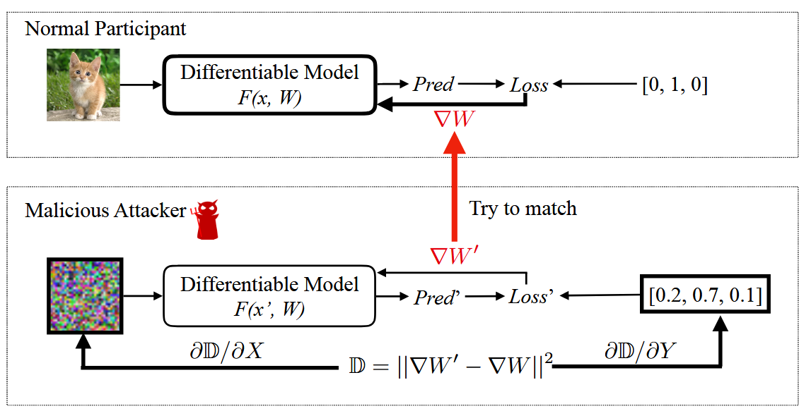
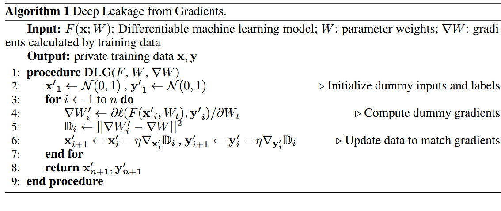
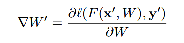
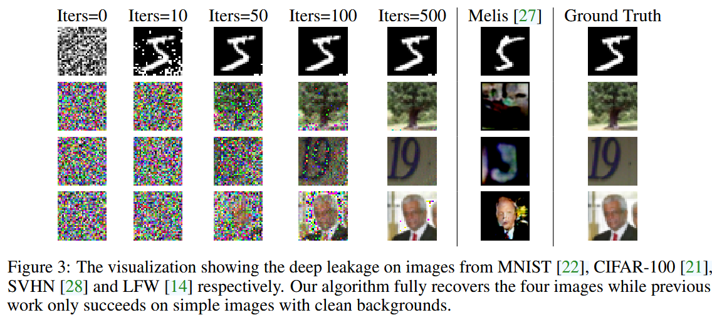
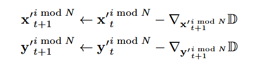
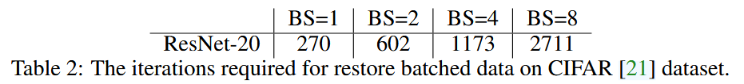

### (NeurIPS 2019) Deep Leakage from Gradients

#### Introduction and Idea

This paper shows that for multi-node machine learning systems, like distributed training and collaborative learning, **sharing gradients are not safe**. Their recovery method pixel-wise accurate for images and token-wise matching for texts. They empirically show this discovery and discuss potential defenses.

To perform the attack, they generate a pair of random inputs and labels, perform the usual forward and backward, and derive the gradients. Instead of optimizing model weights, they optimize the dummy inputs and labels to **minimize the distance between dummy gradients and real gradients**.

DLG (Deep Leakage from Gradients) does **not** require any other extra prior about the training set, and can infer the **exact original training samples** instead of synthetic look-alike alternatives.

Components with bold border are variables to be updated. Note that the malicious attacker updates its dummy inputs and labels to minimize the gradients distance.

Where:

#### Experiments

Two changes they have made to the models are (**limitations**):

- Replacing activation ReLU to Sigmoid
- Removing strides, as the algorithm requires the model to be twice-differentiable.

For languages models, they implement the attack on Masked Language Model (MLM) task using BERT backbones. For languages, models need to *preprocess discrete words into embeddings*. They apply DLG on *embedding space* and minimize the gradients distance between **dummy embeddings and real ones**.

For batched data, the algorithm **would be very slow to converge**. They think the reason is batched data can have N ! different permutations and thus make optimizer hard to choose gradient directions. Therefore, they update a single training sample instead of updating the whole batch i.e. replacing the line 6 in algorithm 1 with

#### Defenses

First, they show that noisy gradients, including adding noise on gradients before sharing, and gradients in half-precision, don't work well unless large accuracy is acceptable.

They show that gradient compression (Gradients with small magnitudes are pruned to zero) works.

Other defenses: increasing the batch size, upscaling input images (current method DLG works for batch size up to 8 and image resolution up to 64*64), cryptography (like secure aggregation).